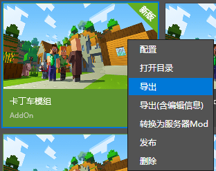
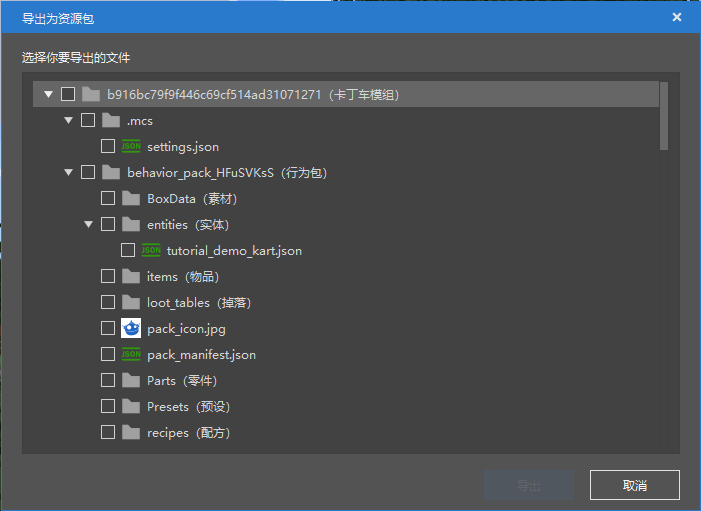

--- 
front: https://nie.res.netease.com/r/pic/20211104/69055361-2e7a-452f-8b1a-f23e1262a03a.jpg 
hard: Getting Started 
time: 5 minutes 
--- 
# Exporting works using the Minecraft Development Workbench 

In this section, we will learn how to export works using the Minecraft Development Workbench. 

## Export works directly 

 

Right-click on our work in the Minecraft Development Workbench or click the "More" button, and you will see the "**Export**" button and the "**Export (with editing information)**" button, which can be used to export pure maps or add-ons, or export maps or add-ons with Minecraft Development Workbench project files. This will export a file in the `.zip` format. 

## Export as a resource package 

 

In the "Resource Management" pane at the bottom of the editor, we can click the "Export" button and select a part of the resource to export it as a resource package. 

 

When we select the resource, the "Export" button will light up, and then we can save the resource package by clicking it. This will allow us to export a `.mep` format file. 
