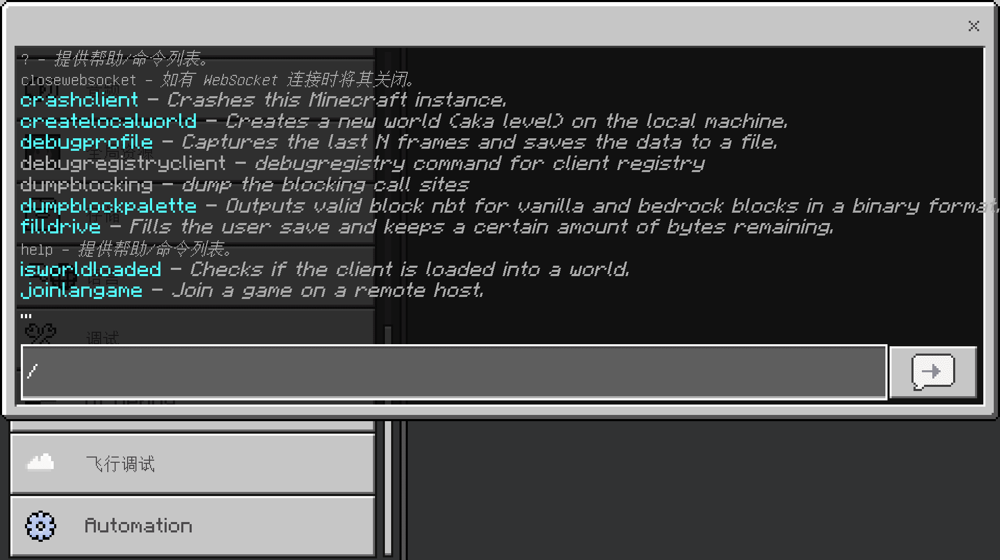
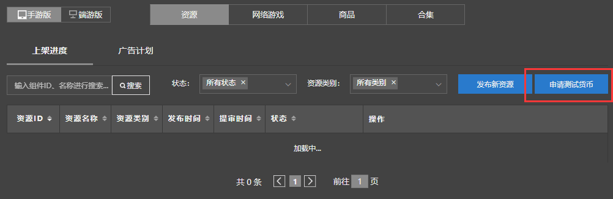

--- 
front: https://nie.res.netease.com/r/pic/20211104/69055361-2e7a-452f-8b1a-f23e1262a03a.jpg 
hard: Advanced 
time: 15 minutes 
--- 

# Debug and publish works on mobile phones and computers 

After we have developed the work, we often need to **debug** (**Debug**), eliminate vulnerabilities, and then **Release** (**Release**). In this section, we will learn how to debug and publish together. 

## Debug works 

We can debug the operation of our works on both platforms through the computer development version and the mobile development version. Among them, the debugging targets of the two development versions are slightly different. 

### Debugging the computer development version 

Our computer development version is a development build, so we can use different functions on the computer development version than in the ordinary release version. Most of the functions are used to facilitate developers to debug.

#### Debug tab in settings 

 

When we open the settings, we can see that there are several new tabs in our development version, which are different from the regular release version. The "Debug" tab is used to turn on and off some functions for general debugging; the "UI Debug" tab is used to turn on and off some debugging functions dedicated to the UI; "Flight Debug" is used to test some grayscale Treatment Packs and Progressions distributed remotely by Microsoft, which is not within our scope of use; "Automation" is an automaton system developed to match the international version of the behavior tree, which is also not within our scope of use. 

We will focus on the "Debug" tab. The three functions at the top of the debug tab are very useful for development. 

 

"**Show debug console button**" will make a console button appear in the upper left area of the game. After pressing this button, a **Dev Console** will appear. We can enter commands in it at any time during the game to control the game. In fact, even if we don't turn on this button, we can still open the dev console screen in the game by ``Ctrl+` ``. 

"**Assertion break in debugger**" and "**Assertion show a modal dialog**" are used to control the performance of **Assertion**. Since we are a development build, our game can trigger a large number of assertions set by developers in the source code. Developers make assumptions at certain locations in the program that a certain judgment at that location should be true. If this assumption is overturned during the actual operation of the program, an **Assertion Failure** will be thrown at that location. If we bind the program to a debugger, then assertion failures can be displayed in the debugger. Otherwise, we need a special pop-up window to display them. Here, the "Assertion shows a modal dialog" option allows a modal dialog box to pop up when an assertion fails. Generally speaking, developers hope that when an assertion fails, they can stop the program from continuing to run, and check why it fails in the debugger. This behavior is called a program break. In fact, as ordinary developers, we generally do not need assertion breaks, so "Assertion breaks in debugger" can be turned off. 

In the process of developing add-ons, we often encounter various assertion failures that are pre-set in the source code if we are not careful. Because the information of assertion failures will not be displayed in ordinary releases, but only in development builds, such errors may become hidden dangers in our development. Effective use of the information prompted by assertion failures will greatly facilitate our testing of add-ons. 

Looking further down in the debug tab, we will see the Feature Flag area. Feature flags are a series of options that can affect some underlying functions with just a switch. We can make good use of these feature flags to facilitate our development. 

 

Leaving the function flag, what is left is the normal debugging option area. Among them, we will focus on the **debug HUD**, which is what we often call the **debug screen** (**Debug Screen**). 

#### Debug Screen and ImGui 

 

**Debug Screen** is a set of screens that developers can use to debug game content. It can usually be opened through the debug tab in the settings. Of course, the debug screen can also be scrolled back or forward through the shortcut keys `F3` and `F4`. 

 

**ImGui** is an in-game test interface made using the third-party ImGui library, which has rich functions. For specific ImGui functions, please refer to the <a href="../../../mcguide/30-Test/00-ModPC Development Package Introduction.html#_3-Top Menu Bar" rel="noopenner">ImGui section in the development guide</a>. Effective use of ImGui will help developers create and debug modules more quickly. 

#### Developer Commands 

 

**Developer Commands** are commands that are unique to the development build and are convenient for developers to debug. Developer Commands have quite a lot of functions, and proper use of Developer Commands is also an important part of efficient development. 

#### Content Log 

 

 

**Content Log** (**Content Log**) can be opened through settings, or quickly opened through `Ctrl+H` in the game. Content Log is the most common type of log for developers. Although the output level of Content Log is not as low-level as Assertion Error, it is still one of the indispensable logs with important reference value. 

### Self-test of mobile development version 

Mobile self-test requires the mobile development version launcher to start. The launcher can be found in the "**Test version launcher download**" column in the "**Developer content management tools**" column at the top of the Minecraft development workbench. Compared to everyone who has already downloaded it in the first chapter. 

Mobile development self-test requires everyone to submit their own works for review. When it is in the "under review" state, you can enter the mobile development version to find your work and download the self-test. The main purpose of the mobile development version self-test is not to find logical errors, but generally to find device compatibility errors. Through the self-test of the mobile development version, we can know the operation of our module on the mobile phone, so as to facilitate our official release of the work later. 

 

If our work is priced when it is released for review, then we need to find this button in the Minecraft development workbench and click to apply for test currency, otherwise it will appear in the mobile development version. The situation cannot be purchased. 

We can also test the mobile development version through the "debugging tool" in the Minecraft development workbench. For specific solutions, please refer to the relevant articles in the development guide 

## Release works 

Finally, we have to publish our works. There are two main ways to publish our works, namely through the **web version of the developer platform** and the **"Management" tab of the Minecraft development workbench**. They are both called "**Developer Content Management Tools**" and the interfaces are similar. Next, we will explain the contents of the Minecraft development workbench. 

 

 

In the Minecraft development workbench, we have two ways to publish, either right-click our work and click "**Publish**" directly, or click "**Publish New Resources**" in the "Management" tab to publish. 

 

After entering the publishing page, we need to fill in some basic resource data. 

 

If our work is not original, please be sure to upload pictures of the authorization instructions and evidence. 

 

We need to select the correct **payment type**. Generally speaking, we can choose the corresponding type according to the actual situation of our work. 

 

After selecting the payment type, the main category of **Resource Category** below is also selected. We need to select the correct secondary category. 

 

Next, we need to fill in the introduction and update log of the work. 

 

The pictures of the work are also particularly important. We need to upload various pictures of specified size and resolution according to the requirements to facilitate the promotion of our work. 

 

Finally, if our work has a supporting video, we can also <a href="../../../mcguide/35-Shelf and Entry/Course06-Work Video Format Export and Specification.html" rel="noopenner"> Upload Video </a> to enhance the promotion effect. 

Click "**Submit for Review Now**" in the upper right corner to enter the review stage. During this period, we can enter the mobile development version for self-testing, find suspicious errors and correct them in time! After the review is passed, we can officially release our work at a later date! 

So far, our additional package has come to an end. If developers want to know more detailed information, they can click on the "**[Development Guide](https://mc.163.com/dev/guide.html)**" and "**[API Documentation](https://mc.163.com/dev/apidocs.html)**" on the official website to learn more about the development of more in-depth knowledge and content!