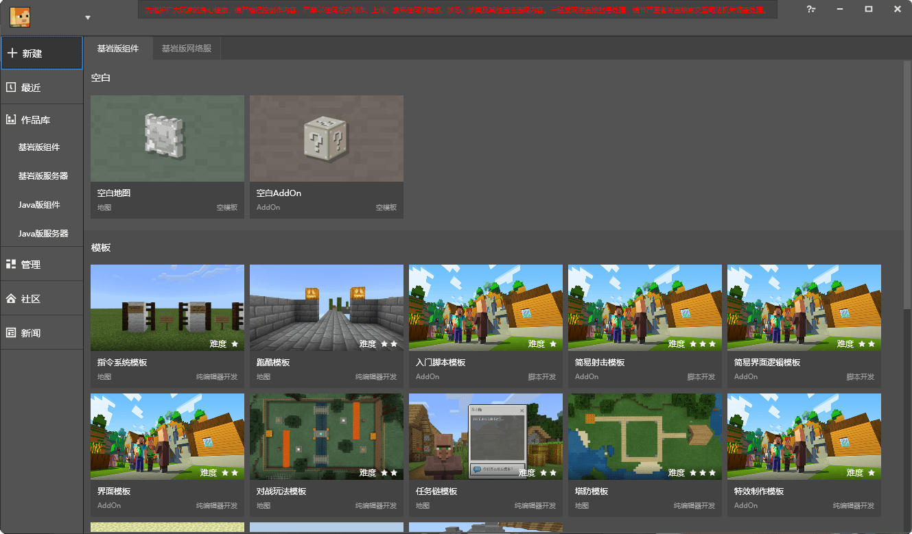
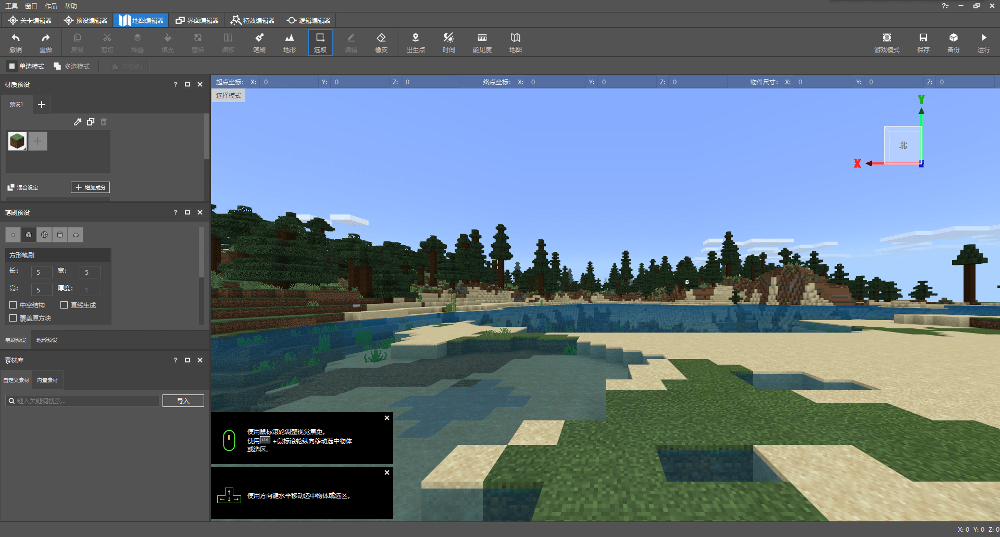

--- 
front: https://nie.res.netease.com/r/pic/20220408/8eef28fe-0abb-4b92-819b-0a3bcc64b1fc.png 
time: 10 minutes 
selection: true 
--- 

# Introduction to official tools 

In this section, we will focus on the official tool **Minecraft Development Workbench** (**MC Studio**). This is currently the only integrated development environment that can be used to make Minecraft Chinese version modules. 

## Main interface 

The download entrance of Minecraft Workbench is located at [Minecraft Developer Official Website Homepage](https://mc.163.com/dev/index.html). After entering the main interface of Minecraft Development Workbench, we can see a vertical navigation bar on the left side of the window, which represents the basic functions of Minecraft Development Workbench. 

 

- **New**: Used to create various new works. 

"**Bedrock Edition Component**" tab: Used to create a blank **map** or **Add-on** component, and can also be used to create a map or add-on component with certain basic functions according to the template. 

"**Bedrock Edition Network Server**" tab: Used to apply for a network server **development machine**, and also used to create a blank or template **network server** module. 

- **Recent**: Displays recently edited components, and can quickly enter the **editor**, **development test** or select other functions, such as publishing modules. 

- **Work Library**: Used to store all your Java and Bedrock Edition maps, add-ons, network servers or other works. 

- **Manage**: Developer content management tool. You can quickly enter the official website and public account here, view the agreement, and receive official emails. You can get first-hand platform resources through **Square**, manage and promote your works through **Works Management**, and manage your works visually through **Data and Revenue**. You can also manage your developer members, view developer levels, participate in various high-quality activities, etc. here. 

- **Community**: Used to enter the Minecraft Developer Community Forum, discuss the difficulties and inspirations encountered in development with other developers, and make progress together with everyone. 

- **News**: Used to view various news pushed by the official. 

## Editor 

**Editor** refers to a software built into the Minecraft Development Workbench that can be used for visual module editing. You can open the editor and load the work into it through the "**Edit**" button on the work in the **Recent** or **Works Library** tab. We will focus on the **New Editor** below. The steps for upgrading to the new version of the editor can be found in the first chapter of this tutorial. 

After opening "Edit" for a work, the editor interface comes into our eyes. Let's first check the functional appearance of the entire editor. 

 

- **Menu Bar**: At the top of the editor, we can see an interface element that many other programs also have - the menu bar. This is the "control center" of the editor, which can control the global functions in the editor. 
- **Switch Tab**: Below the menu bar, there is an editor switch tab. The switch tab is used to switch between different editor types. In the current new version of the editor, we can access "**Level Editor**", "**Preset Editor**", "**Map Editor**", "**Interface Editor**", "**Special Effect Editor**" and "**Logic Editor**". 
- **Ribbon Area**: The ribbon area is a strip area below the switch tab, with various shortcut buttons built in, which facilitates us to perform some quick operations, such as saving and running. Therefore, this bar is also called the **Quick Operation Bar**. 
- **Embedded Game Preview Window**: A highly modified Minecraft build with an interface that is highly compatible with the editor, allowing developers to easily preview their changes. 
- **Status bar**: We hardly use the status bar at the bottom in the editor. Only in the map editor can we view the current coordinates through the status bar. 
- Other windows are all various **function panels**: You can control whether to display them through the "**Window**" menu in the top menu bar. 

Next, we will introduce the basic functions of each editor in turn. 

### Level Editor

 

As the name implies, the **Level Editor** is an editor used to edit various properties of the entire level. Through the level editor, we can easily implement custom configurations and modify various properties of the configuration. More importantly, we can also use the level editor to implement **custom preset instantiation** and manage various information of preset instances, so as to achieve various gameplay. Since the level editor often only saves preset information without modifying the properties in the map database, most of the operations we perform in the game preview window in the level editor will not actually affect the map information. Therefore, the changes made in the level editor will almost only take effect when the map is opened for the first time. At this time, the preview window is just a preview of the scene. We call this preview window in the level editor **Scene** (**Scene**). The scene and the information in the **Stage** window on the left are often one-to-one. However, it is worth noting that if there are entities in the preset, then saving the level editor will also trigger the saving of the map itself. 

### Preset Editor 

 

**Preset Editor** is the most important part of the new version of the editor, which provides great convenience for development. In order to understand what the preset editor is, we need to first understand what a preset is. 

#### Preset 

**Preset** (**Preset**) is a brand new feature provided by the new version of the editor. Presets are similar to templates. Developers can use them to pre-set certain block structures, entity properties, special effects, and world and player properties. They can also implement certain logic by attaching **Part** to the preset. Then, developers can place this "template" in the world through the level editor. Once the preset is placed in the world, it will become an **Instance** (**Instance**), and the logic in the part will also start to work. Therefore, we call the process of "placing the preset in the world through the level editor" "Instantiation of the preset in the scene". Once the preset is instantiated, the block terrain in the preset will be placed in the world, and the entities in the preset will be summoned at the specified location and execute the specified logic. If a preset is bound to a world sub-preset or a player sub-preset, some of the properties and logic of the world and player will also take effect immediately. 

**Preset Editor** is an editor used to edit presets. Through the embedded game preview window in the center, the preset hierarchy panel on the left, and the preset property panel on the right, we can edit and modify the terrain structure in the preset, add entities, and attach special effects. We can also quickly add various materials and parts in the preset editor to modify various properties of the preset. By cooperating with the level editor, various gameplay maps or gameplay components containing presets can be created. 

### Map Editor 

 

**Map Editor** is an editor that is truly used to modify the world in the archive. It has very powerful terrain creation and editing functions, and can easily create complex and advanced terrain or structures. For add-on components, the effect of map editing may be minimal, because the add-on may not be applied to the current map in the end. But for a map component, the importance of map editing is self-evident. All maps created in the current map editor will be applied to the final map release. 

### Interface Editor 

 

**Interface Editor** is an editor used to edit the UI of Bedrock Edition. As mentioned in the previous chapter, the UI of Bedrock Edition is stored, read and displayed in the form of JSON UI. However, since the JSON UI format of Bedrock Edition is complicated and difficult to understand, it will be a major challenge for developers to edit it only at the JSON file level. The interface editor simplifies this process. Through visual and click-based operations, we will be able to dynamically see the UI we add and the changes we make from the central embedded game preview window. With the interface editor, developers can easily draw the UI they want and add a few different colors to their modules. 

### Special Effects Editor 

 

The **Special Effects Editor** was created to edit the Chinese version of special effects. In the special effects editor, you can quickly add and modify special effects, and you can also simply drag and drop special effects to display the effects of special effects. In the special effects editor, we also have a timeline function. Since some special effects have sequence frame animations, we can use the timeline to play and debug special effects, so that the special effects can be made to perfection. 

### Logic Editor 

 

The **Logic Editor** is an editor for editing logic **Blueprint** (**Blueprint**). A blueprint is a logic file that can be written in the logic editor in the form of node connections, which can be attached to the preset blueprint parts to achieve functions similar to module SDK scripts through simple logic. Although the upper limit of functions obtained by making blueprints through the logic editor is not as high as writing Python scripts through the module SDK, for beginners, the logic blueprint is a very friendly logic production gripper, which is much simpler than writing Python code directly. 

## PC Development Edition 

**Minecraft Bedrock Edition PC Development Edition** (**Mod PC Development Kit**) is a development build version of Minecraft integrated in the Minecraft Development Workbench, but this development build contains all the module functions written by NetEase, so it can be used for PC self-testing before NetEase module works are put on the shelves. Regarding how to conduct self-testing, we have already given a brief step-by-step description in the first chapter. In the last chapter, we will once again introduce the steps and key points of the work self-test in detail. Here we only introduce the relevant concepts of the PC development version. 

 

As a development build, the PC development version of Minecraft has many related functions for development and testing. Making good use of these functions can greatly enrich your development process and help you debug the module very well. 

The computer development version has many **Command** (**Command**) exclusive to the developer version, which can do but is not limited to opening the world boundary box, biological AI intentions and various basic information, debugging analyzers, cameras, quickly modifying health values, hunger values, dumping debug information of blocks and items, changing various world states and other rich functions. Making good use of developer commands will help you better grasp the status of your module and fix vulnerabilities during self-testing.

The PC development version also has a debug tab in the settings menu, which can be used to quickly switch on and off some basic debugging settings and turn on or off some built-in function flags. Among them, turning on the "Modal window for assertion errors" will be very helpful for developers to find and correct vulnerabilities and errors in their own modules. Switch the "Debug Screen" drop-down menu in the debug tab to "ImGui" to open the **ImGui Debug Screen**. The rich functions in ImGui will also help developers better monitor abnormal conditions that occur in their modules during self-testing. 

There is also a special item in the PC development version, which is the **Debug Stick** item. The debug stick will be compiled into the development version of the game by default during pre-compilation, so that developers can debug their own custom blocks and improve their own gameplay and functions. 

Being good at using the built-in tools in various development versions will be of great benefit to developers in developing modules.