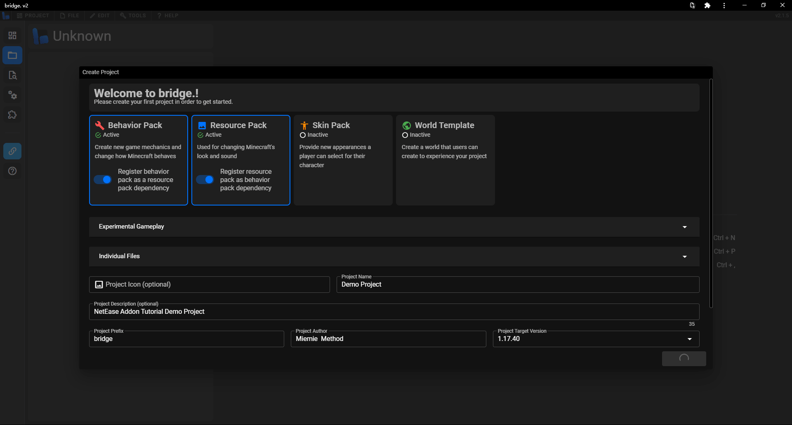

--- 
front: https://nie.res.netease.com/r/pic/20211104/69055361-2e7a-452f-8b1a-f23e1262a03a.jpg 
hard: Getting Started 
time: 10 minutes 
--- 
# Community Tools Introduction 

After learning the official tool Minecraft Development Workbench, let's get to know some excellent tools developed by the community. Mastering these tools will help us complete the various tasks that were originally complicated and tedious faster and better when developing modules. 

## Blockbench 

 

**Blockbench** is a free and rare model making tool. In Bedrock Edition, it is mainly used to make solid models. While making solid models, it can also make texture maps and animations corresponding to the models, and can also export the models as OBJ format files. Blockbench supports loading plugins. Through the **Minecraft Entity Wizard** plugin, developers can quickly create a Bedrock Edition entity with a complete model, animation and AI. Blockbench has two versions: a web application (WebAPP) and a terminal program. The existence of the web application greatly facilitates the needs of developers to make models through multiple devices. The suffix of the BLockbench project file is `.bbmodel`, which can be used to import the original model geometry in the Minecraft development workbench. 

- Download address: [https://www.blockbench.net/](https://www.blockbench.net/) 

- Web application: [https://web.blockbench.net/](https://web.blockbench.net/) 

## Blockception's Minecraft Bedrock Development 

 

**Blockception's Minecraft Bedrock Development** is a Visual Studio Code extension developed by Blockception Studio. It can provide code highlighting and auto-completion support for JSON files (including Molang code), MCFunction files, localization files, etc. It supports a series of functions such as auto-completion, pattern validation, quick formatting and code diagnosis for these files. It can also generate files for resource packs, behavior packs and world templates with one click through console commands, which can be easily used for batch programming. 

- Download address: [https://marketplace.visualstudio.com/items?itemName=BlockceptionLtd.blockceptionvscodeminecraftbedrockdevelopmentextension](https://marketplace.visualstudio.com/items?itemName=BlockceptionLtd.blockceptionvscodeminecraftbedrockdevelopmentextension) 

## bridge. 

 

**bridge.** is a powerful add-on package integrated development environment. It supports code highlighting and auto-completion for almost all add-on package files, and supports a series of add-on package formats such as resource packs, behavior packs, skin packs and world templates. bridge. has a tree-like JSON view, which allows developers to quickly locate and add and delete JSON file nodes, so as to quickly develop correct and content-rich add-on package files. bridge. also supports a series of third-party extensions, which can better and more powerfully drive the creation of add-ons. In the latest version, bridge. is only available as a web application (WebAPP). It is recommended to use a browser with the Chromium kernel to install the web application. 

- Web application: [https://bridge-core.app/](https://bridge-core.app/) 

## Snowstorm 

 

**Snowstorm** is a powerful international version of the particle maker, made by the developers of Blockbench. It has a visual interface and an operation panel. Through the operation panel, you can add and modify various properties of particles, which will be displayed in real time in the preview interface on the right. This makes particle creation very efficient. Snowstorm has both a web application (WebAPP) and a Visual Studio Code extension with the same function. 

- Web application: [https://snowstorm.app/](https://snowstorm.app/) 
- Extension download: [https://marketplace.visualstudio.com/items?itemName=JannisX11.snowstorm](https://marketplace.visualstudio.com/items?itemName=JannisX11.snowstorm) 

## Chunker 

 

**Chunker** is a web tool for converting Java Edition and Bedrock Edition archives, and it can also easily configure world settings. Chunker supports the conversion of archive settings, dimensions and chunk data, including blocks, biomes, loot tables, map information and other data. You can also trim chunks and dimensions with one click during the conversion process, or execute LevelDB compression methods after the conversion to reduce the archive size. Chunker is a web application (WebAPP) and needs to be opened online.

- Web App: [https://chunker.app/](https://chunker.app/) 

## Mcblend 

 

**Mcblend** is a Blender plugin that can be used to create models and animations of Bedrock Edition entities. With the powerful animation capabilities of Blender, Mcblend can be used to quickly animate Bedrock Edition entities. Mcblend can import and export Minecraft Bedrock Edition polygonal mesh models and cube-based models, generate UV maps and textures for models, and export animations and poses. More powerfully, Mcblend can detect parts of the skeleton that move through constraints and automatically add them to the exported animations of Minecraft entities. It can also add physical simulations to entity models with one click. Mcblend is currently only available for download from its Github repository's release page. 

- Download link: [https://github.com/Nusiq/mcblend/releases](https://github.com/Nusiq/mcblend/releases)