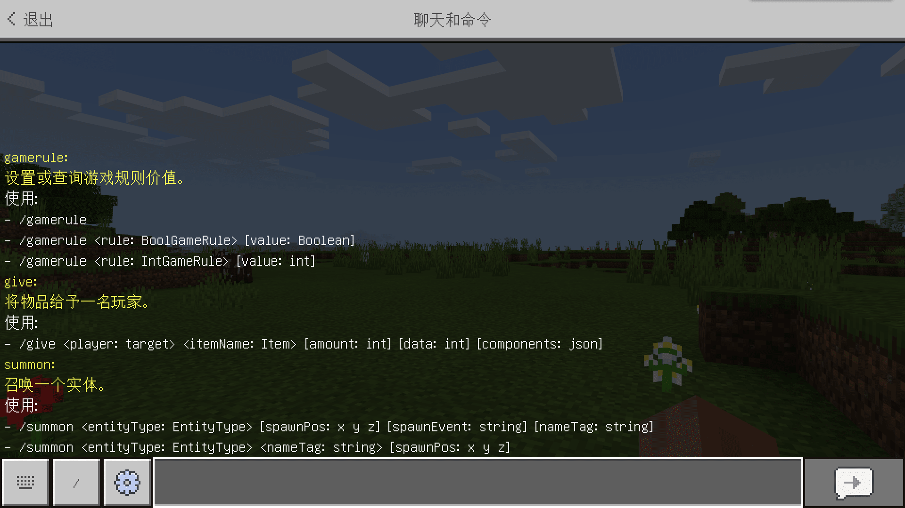

--- 
front: https://nie.res.netease.com/r/pic/20211104/69055361-2e7a-452f-8b1a-f23e1262a03a.jpg 
hard: Advanced 
time: 10 minutes 
--- 
# Purpose of commands 
**Command** is a very important system in Minecraft. By operating commands, you can quickly perform a variety of operations in the world, from simple changes in game modes or weather changes to complex scoreboards and function logic. 

The original intention of creating commands was to make the game world run dynamically through this system. For example, developers can use commands to monitor the environment around the player in real time, and then respond to specific environments in a specific way. Through such operations, the game is no longer a purely static one. Although there are no commands, we still have many ways to add various logics to the game, but commands, as the best and simplest form of representation that fits the game, can not only simplify the development of modules, but also make the game run more smoothly.

 

At the same time, commands are integrated into all aspects of module development. We can use **Function** to execute commands in batches, we can also execute commands in the logic of entities, blocks and items, and even, we can execute commands through the module API to simplify the logic of the script or be compatible with other parts of the module, such as recording world information and allocating game resource content through a unified scoreboard. 

Next, we will learn how to execute commands together in a concise and easy-to-understand language.