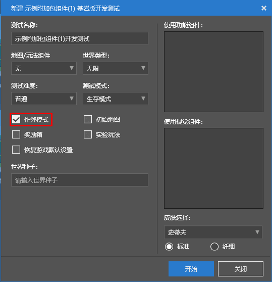
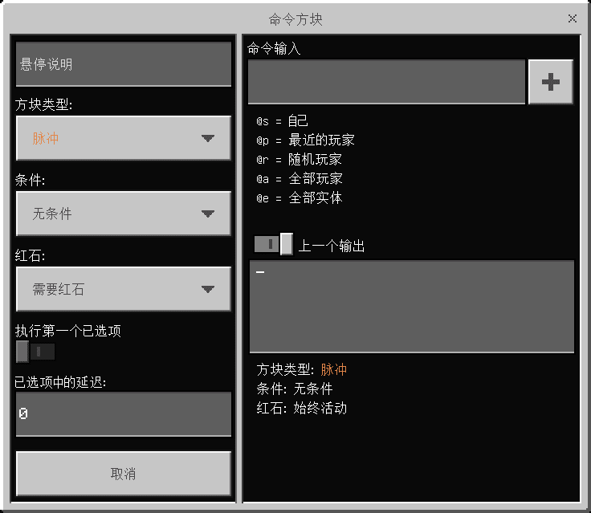

--- 
front: https://nie.res.netease.com/r/pic/20211104/69055361-2e7a-452f-8b1a-f23e1262a03a.jpg 
hard: Advanced 
time: 15 minutes 
--- 
# How to use commands 
Each command must be used before it can take effect. We call the process of using a command the **Execute** command. 
In order to make most commands execute smoothly, we need to turn on the "**Cheat Mode**" in the world options. In this way, all "cheat commands" and "non-cheat commands" can be used, and we don't need to worry about the availability of commands. During development testing in the Minecraft Development Workbench, we made sure that "Cheat Mode" was enabled: 

 

At the same time, we strongly recommend changing the game mode to **Creative Mode** when exploring the command system. Because players can freely use the highest-level commands in Creative Mode, and players can also manipulate command blocks in Creative Mode to achieve more advanced functions. 

Next, let's take a look at the various ways to execute commands. 

## Execute commands through the chat bar 

After entering the world, we press the `T` key (mobile users press the chat button at the top), and we will see a **Chat Bar** overlay on our interface. This is where we chat with other players. However, it is worth noting that the function of this chat bar is more than just chatting. We can also use it as a console to execute commands. Type a slash `/` as the first character of the chat bar, and we will enter the "world of commands". At this point, we will see a lot of command prompts on the screen. These are the information that can be used to prompt us to enter the correct command. At the same time, we can also use this information to automatically complete the command. 

 

After we enter the first few letters of the command, the prompts on the screen will also be filtered and reduced to fit the part we have entered. As we enter, we can see that the commands that meet the filter will become fewer and fewer, and finally locate a certain final command. However, before that, if you are using a PC device and press the `Tab` key when there are still some candidate commands on the screen, you will experience the command auto-completion function. Repeatedly pressing the `Tab` key will allow the completed command to cycle through all the commands prompted on the current screen. This is a very practical function for quickly entering a command. 

## Execute a command through a command block 

We enter the following command in the chat bar with cheats turned on in creative mode: `/give @s command_block`. We will get a **Command Block**. A command block is a block that can execute pre-configured commands as an executor. Its configuration interface can only be opened in creative mode by pressing the "use key" (right-click on the PC). After opening it, we will see a series of options as follows. 

 

- **Command input**: The command input is where we enter commands. The format here is almost the same as entering commands in the chat bar. The only difference is that the commands in the command block do not need to be prefixed with a slash `/`. 
- **Block type**: When we place a command block, the default is **pulse** mode. The command block in pulse mode is orange and executes the command once each time it is activated. We can also change it to green **chain** mode and purple **repeat** mode. The command block in chain mode will only execute the command when the command block pointing to it executes the command, while the command block in repeat mode will execute the command once every game tick when it is activated. 
- **Condition**: The default is **Unconditional**, which means it is not subject to conditions and ignores whether the surrounding command blocks are executed successfully or not. **Condition** is subject to conditions, which means it will only execute the command if the previous command block pointing to itself executes the instruction successfully. 
- **Redstone**: Pulse mode and chain mode require redstone by default, which means they must be activated by redstone to make them work and execute commands. However, if it is adjusted to **Keep On**, the default of repeat mode, the command block in repeat mode can continue to execute the commands in it without redstone; chain mode is executed once immediately after induction, and pulse mode will be executed once immediately after setting, and it will not be executed again afterwards. 
- **Execute on First Tick**: Execute immediately on the first tick after activation, instead of entering a suspended state and waiting for a delay before executing. 
- **Delay in Ticks**: For pulse mode command blocks and chain mode command blocks, specify the number of game ticks to delay before executing the command after being activated or triggered. For repeat mode command blocks, specify the number of game ticks to delay re-execution of commands. 

## Execute commands through function files 

Functions are a feature that allows developers to use `.mcfunction` files as a collection of commands to batch execute commands, often used with command blocks to implement some advanced features. 

In a function file, a command occupies a single line without a slash `/` prefix. You can use `#` to open a comment in the file, and the text after `#` will be included in the comment content and will not be executed. 

Through the `/function` command, we can execute a function. The syntax of `/function` is `/function <name: filepath>`. For example, we can use `/function test` to execute the `test.mcfunction` file in the `functions` folder in the root directory of the behavior pack. 

Through the `/reload` command, we can reload the function file in the behavior pack. With this command, we can debug functions faster without restarting the game.