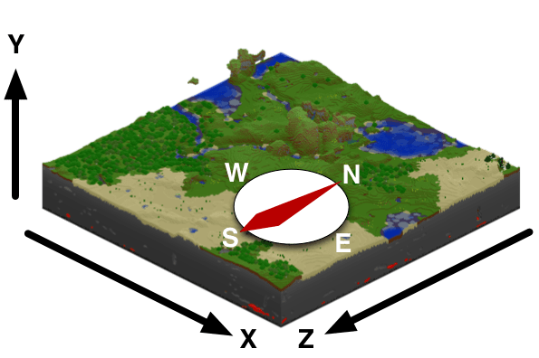

--- 
front: https://nie.res.netease.com/r/pic/20211104/69055361-2e7a-452f-8b1a-f23e1262a03a.jpg 
hard: Advanced 
time: 15 minutes 
--- 
# Understanding command parameters 

Through the previous exploration, we can roughly understand that a command is composed of the following parts: 

1. If it is a command entered in the chat bar, it must start with a `/`; 
2. Following the `/` is the command's **name** (**Name**); 
3. After the command name is a space ` `; 
4. Next are the various command parameters, separated by spaces. 

So it can be seen that we must understand what the command's **argument** (**Argument**) is in order to use a command correctly. 

## Parameters 

Parameters are a series of data following the command name that is used to precisely define the scope or object of the command. Most commands have one or more parameters. Parameters are divided into several types, namely **required parameters**, **optional parameters**, and **literal parameters**. 

### Required parameters 

**Required Argument** is a parameter enclosed in angle brackets, in the format of `<descriptor: type>`. Angle brackets indicate that the command must have this parameter to work properly, otherwise an execution error will occur. For example, the command given to a player administrator: 

```shell 
/op <player: target> 
``` 

The part before the colon is called the **descriptor** of the parameter, usually also called the parameter name, here is `player`, which means that a player should be entered here. The part after the colon is called the **type** of the parameter, here is `target`. The `target` type means that a player name or a target selector can be entered. We will focus on the target selector later. 

If you only enter `/op` in this command, an error will be reported, indicating that the required parameters are missing. 

### Optional parameters 

**Optional Argument** is a parameter wrapped by a block number, which is not required to be entered. This parameter often has some default values, and its default value will be automatically called if it is not entered. The format of the optional parameter is `[descriptor: type]`. For example, the command to kick a player out of the world: 

```shell 
/kick <name: target> [reason: message] 
``` 

This command has two parameters, the first parameter is a required parameter, and the second is an optional parameter. If you only pass in the first player name and leave the second one empty, there will be no reason when kicking the player, and if you pass in the second optional parameter, the kick reason will be displayed when kicking the player. 

### Literal Parameters 

**Literal Argument** is a parameter that is different from the above two parameter expressions. It has no descriptor and type, and is just a literal text. In other words, this parameter does not allow players to customize the value passed in, and it should be written as it is. Often, a literal parameter can allow multiple literal values. When there are multiple literal values, each value is separated by `|`. At this time, if a literal parameter is required, it will be wrapped in angle brackets on the outside; if it is optional, it will be wrapped in square brackets. For literal parameters with only one literal value, there are no brackets outside, and such literal parameters are often required parameters. Its format is generally `arg`, `<arg1|arg2|...>` or `[arg1|arg2|...]`. For example, the weather command: 

```shell 
/weather <clear|rain|thunder> [duration: int] 
/weather query

``` 

`/weather <clear|rain|thunder>` is used to change the weather, and `/weather query` is used to query the weather. In this case, `<clear|rain|thunder>` is a required literal parameter, and `query` is a required literal parameter with only one option. 

### Parameter type list 

Here is a list of common parameter types and their descriptions. 

| Type | Description | 
| :--------- | :----------------------------------------------------------- | 
| Boolean | Boolean value, `true` or `false`. | 
| int | Integer, such as `1`, `2`, `3`, etc. | 
| float | Floating point number, such as `1.3`, `3.14`, etc. | 
| string | String, which can be a word/character directly or multiple words/characters with spaces wrapped in quotation marks, such as `single` or `"multiple words"`. | 
| message | Message text, unquoted string. | 
| x y z | Three floating point numbers representing coordinates, separated by spaces, e.g. `16.5 128 32` represents the position x=16.5, y=128, z=32. You can use `~` to represent relative coordinates, or `^` to represent local coordinates, see [coordinates](#coordinates) for details. | 
| Block | Block ID. | 
| Item | Item ID. | 
| EntityType | Entity ID. | 
| json | JSON formatted text. | 
| target | A player name or a target selector. | 
| …… | …… | 

## Coordinates 

The **Coordinate** in Minecraft is a three-dimensional Euler right-hand rectangular coordinate system, but unlike the typical Euler coordinate system, the coordinate system of Minecraft has been rotated to a certain extent, and the positive direction of the y axis represents upward, so our height in the world becomes the y coordinate. 

 

Specifically, the three axes of xyz represent the following directions: 

- The positive direction of the x axis is east, and its coordinates reflect the distance of the player from the origin in the east (+) and west (-) directions. 
- The positive direction of the z axis is south, and its coordinates reflect the distance of the player from the origin in the south (+) and north (-) directions. 
- The positive direction of the y axis is up, and its coordinates reflect the height of the player's position (where sea level is 62). 

Generally speaking, if we need to give a unit to a coordinate, we consider the coordinate unit in the world to be meters (m). 

### Relative Coordinates 

In commands, we can use `~` to represent **Relative Coordinate**. A single `~` represents a position with a distance of 0 from the execution origin, and a number after `~` (such as `~1`) represents a position offset from the execution origin by this number. The number following it can be positive or negative, a positive number represents an offset along the positive direction of the axis, and a negative number represents an offset along the negative direction of the axis. 

For example, `/tp ~1 ~5 ~-3` can teleport the player to a position 1m east, 5m up, and 3m north. 

### Local Coordinates 

Similar to relative coordinates, local coordinates are also a type of coordinate calculated from the execution origin, but the directions of their axes are very different from relative coordinates. Local coordinates are based on the direction the player's perspective is facing. To be precise: 

- The positive direction of the x-axis is left, and its coordinates reflect the distance in the left (+) and right (-) directions with reference to the player's perspective. 
- The positive direction of the z-axis is forward, and its coordinates reflect the distance in the front (+) and back (-) directions with reference to the player's perspective. 
- The positive direction of the y-axis is upward, and its coordinates reflect the distance in the upper (+) and lower (-) directions with reference to the player's perspective (note that the player's upward direction is not necessarily the vertical direction, for example, when the player "looks at the sky at 90°", the player's upward direction is parallel to the horizontal plane).


Local coordinates use `^` instead of `~`, and the rest of the usage is exactly the same as relative coordinates. 

## Target Selector 

For commands with `target` type parameters, we know that we can use the player's name to execute. However, sometimes using the player's name is very inconvenient. For example, we usually don't know the name of the player who uses our gameplay component, so we can't use the player's name in advance during the development process. At this time, we need the **Target Selector** to appear. 

We have 5 base selectors to select different target entities, which are: 

| Base Selector | Function | 
| :------- | :----------------------------------------------------------- | 
| `@p` | Select the player closest to the execution origin, which is usually a player or command block. When the `x`, `y` and `z` parameters are specified, the player closest to the specified coordinates will be selected. | 
| `@r` | Select a random player. When the `type` parameter is specified, other types of entities will be selected. | 
| `@a` | Select all players, alive or dead. | 
| `@e` | Select all entities. | 
| `@s` | Select the entity that executes the command. | 

The "parameters" mentioned above refer to **Selector Parameter**, not command parameters. Selector parameters are variables enclosed in square brackets following the base selector, which can be used to filter and narrow the range of selector selections. The general syntax of selector parameters is: 

```shell 
@<selector>[param1=value1,param2=value2,...] 
``` 

We can see that there can be one or more selector parameters in the square brackets, and each selector parameter is separated by an English half-width comma. Each parameter will first appear in a parameter name, followed by an equal sign (`=`), and the value selected by the parameter after the equal sign. 

For example, if we want to change all players in adventure mode to survival mode without affecting players in creative mode or spectator mode, then I should use the following command and selector parameter: `/gamemode survival @a[m=adventure]`. 

Some selector parameters allow a kind of inversion, which can be achieved by adding an English half-width exclamation mark `!` before the parameter value, which is called **negate** the parameter value. For example, `/gamemode survival @a[m=!adventure]` will change all game modes of all players who are not in adventure mode to survival mode. 

### Selector parameter list 

The following lists all selector parameters and their functions: 

| Parameter | Function | 
| :----------- | :----------------------------------------------------------- | 
| `x, y, z` | Specifies the execution origin of the selector. It is not necessary to specify all three axes at the same time. If not specified, the default is consistent with the execution origin of the command. | 
| `r, rm` | Specifies entities within a certain range from the execution origin. The value of this parameter represents the radius of the range. `r` is the abbreviation of radius, which means the maximum radius of the range; `rm` is the abbreviation of radius minimum, which means the minimum radius of the range. Both can be specified separately. When `r` is not specified, it defaults to infinity, and when `rm` is not specified, it defaults to 0. | 
| `dx, dy, dz` | Specifies entities within a rectangular cuboid. The execution origin will be a vertex of the cuboid. `d` is the abbreviation of distance. The three parameters represent the distance from the vertex (execution origin). If one of the three is specified, the other unspecified parameters default to 0. | 
| `c` | Specifies the maximum number of entities that can be selected. The final selected entities depend on the order of the entities that should have been selected by the base target selector. For example, for `@p` and `@r`, this parameter defaults to 1. `c` can increase the number of selected nearest or random targets. `@a` or `@e` only limit the number of targets to be selected, the order of restrictions depends on the internal code sorting. Negative values can reverse the selection order, for example, `@p[c=-5]` can select the 5 targets farthest from the execution origin. `c` is the abbreviation of count. | 
| `type` | Specifies the entity ID. It cannot be used with `@p` and `@a`, because they can only be used to select entities with the ID `player`, that is, players. The value of this parameter can be negated to select entities other than certain IDs. | 
| `m` | Specifies the game mode of the player. `m` is the abbreviation of mode. | 
| `tag` | Specifies entities with a certain tag, where the entity's tag can be given by `/tag`. The value of this parameter can be negated to select entities without a certain tag. Multiple `tag` parameters can be specified at the same time to filter out the desired targets more strictly. | 
| `name` | Specifies the name of the target. The player name or the custom name of the entity can be specified with this parameter. The value of this parameter can be negated to select entities that do not have a certain name. Multiple `name` parameters can be specified at the same time to more strictly filter out the desired targets. | 
| `l, lm` | Specifies entities with a certain experience level. The value of this parameter represents the level. `l` is the abbreviation of level, which represents the maximum experience level; `lm` is the abbreviation of level minimum, which represents the minimum experience level. Both can be specified separately. | 
| `rx, rxm` | Specifies entities with a certain rotation angle around the x-axis, that is, specifies entities with a certain **pitch**. The value of this parameter is in degrees. `rx` is the abbreviation of rotation x, which represents the maximum pitch angle; `rxm` is the abbreviation of rotation x minimum, which represents the minimum pitch angle. The pitch angle of an entity ranges from -90° (looking straight up at the sky) to 90° (looking straight down at the ground). Both can be specified separately. | 
| `ry, rym` | Specifies entities with a certain rotation angle around the y-axis, that is, specifies entities with a certain **yaw** angle, in degrees. `ry` is short for rotation y, which means the maximum yaw angle; `rym` is short for rotation y minimum, which means the minimum yaw angle. The yaw angle of an entity ranges from -180° to 180°. Both can be specified separately. | 
| `scores` | Specifies targets with specific scores. The value of this parameter allows the use of curly braces to further specify the scores, and each score is separated by English half-width commas. The score value can be used to represent a range. For example, `1..5` means that values from 1 to 5 are accepted. Score values can also be negated to filter targets that do not meet the specified score value. Example syntax inside curly braces: `[scores={objectiveA=valueA1..valueA2,objectiveB=!valueB,...}]`. | 
| `family` | Specifies the **family** (**family**, ***department***) type of the target. Families can be defined in the `minecraft:type_family` component of the entity JSON file. The value of this parameter can be negated to select entities that do not belong to a certain family. Multiple `family` parameters can be specified at the same time to more strictly filter out the desired targets. | 

## Original text


Raw text is a JSON-formatted text that can add some rich text features and dynamic translation features to the text in Minecraft. Raw text can be used in many places, such as commands, books, and many objects that support raw text in custom game content. Raw text is written in JSON format, but output as rich text. Before reading the format of raw text, it is recommended to first understand the basic format of JSON. 

The raw text of Minecraft Bedrock Edition has a strict format. First, it must be an object wrapped in curly braces with only one field, the `rawtext` array. The `rawtext` array contains many objects, each of which is called a raw text **content object**. The general format is as follows: 

```json 
{ 
"rawtext": [ 
{ /* object 1 */ }, 
{ /* object 2 */ }, 
// other objects 
] 
} 
``` 

For each content object to be effective, each content object must contain one of the following **content tag** fields: `translate`, `text`, `selector`, and `score`. If a content object contains multiple content tags, only one content tag will be effective. The effectiveness is calculated according to the weight of the content tag, and the order of the content tags listed above is exactly their weight order. When two appear at the same time, the first content tag will be effective. 

The format of each content tag is slightly different, as follows. 

### `translate` 

`translate` is a content tag used to translate localized text. The format is as follows: 

```json 
{ 
"rawtext": [ 
{ 
"translate": "some.localization.key", // String type, localization key name. If the localization key name is not found in the language file, or the localization key name is not found but ordinary text, the text is displayed directly. 
"with": [ /* some arguments for localization */ ] // Optional, Array type, used to fill in the parameters in the localization text. When the localization text contains one or more variables similar to "%s", it is used to replace the position of the variable. Each element in the array can be a separate string text or another complete raw text object. 
} 
] 
} 
``` 

### `text` 

`text` is the simplest content tag, which simply outputs a piece of plain text. The format is as follows: 

```json 
{ 
"rawtext": [ 
{ 
"text": "Some Text." // String type, plain text. 
}
    ]
}
```

### `selector`

`selector` is a single target selector, mainly used to output the name of a player or entity. The format is as follows: 

```json 
{ 
"rawtext": [ 
{ 
"selector": "@someSelector[someParams=someValues]" //String type, its content can be written in the format of the target selector, and the name of one or more entities will be returned. When multiple entity names are returned, they will be in the format of "AA, BB and CC". 
} 
] 
} 
``` 

### `score` 

`score` is a label used to display the score of a score item. The format is as follows: 

```json 
{ 
"rawtext": [ 
{ 
"score": { 
"name": "Entity Name or @selector or *", //String type, the entity name or a target selector that needs to display the score. You can also use "*" as a value, in which case the score of the "reader" of the raw text will be displayed. If the potential readers of the raw text are multiple people, it cannot be displayed.
"objective": "someObjective", //String type, internal name of the scoring item. 
"value": "someValue" //Optional, String type. If this field is set, the value given by this field will be displayed regardless of the actual score. 
} 
} 
] 
} 
``` 

### Append 

At the very beginning of the introduction of raw text, we mentioned that a raw text array can have multiple content objects. The act of adding multiple content objects to a raw text array is called **Append** of raw text. 

```json 
{ 
"rawtext": [ 
{ /* object */ }, 
{ /* appended object */ }, 
// other appended objects 
] 
} 
``` 

The text finally parsed by the appended raw text content object will be directly connected to the end of the original text. From the output result, there is no difference from writing two raw texts separately. However, in some cases we are only allowed to write a raw text, then we need to use the append function to arrange the content tags we need in sequence, and flexibly use the four tags to combine a complete expected text. 

### Line breaks and parameter order 

You can use `\n` in the raw text to represent a **line break**. Line breaks help to better format text. 


You can also use `%%1`, `%%2`, etc. to replace parameter placeholders such as `%s` and `%d` without order. In this way, even if `%%2` appears before `%%1` in the text, you can still successfully replace the second element in the `with` field with the position of the preceding `%%2`. 

At the end of this section, a simple reminder. If you have systematically studied JSON, you should know that whether the JSON file is written in a multi-line format with indentation or all written in one line, its function is not affected in any way. The original text in this section uses indented format for easy understanding, but in fact, most places where the original text is used need to be written in one line. Please be flexible and enter the original text correctly when using it. 
