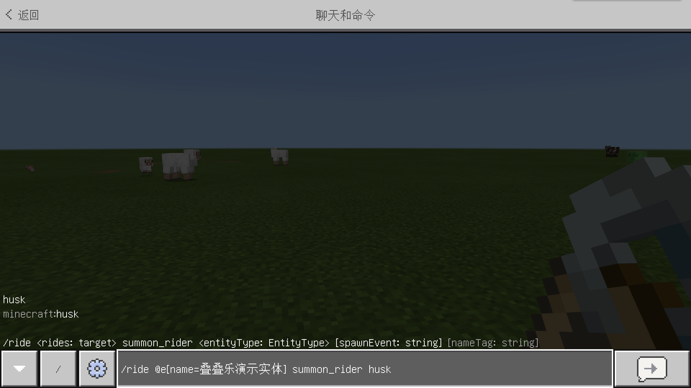

--- 
front: https://nie.res.netease.com/r/pic/20211104/69055361-2e7a-452f-8b1a-f23e1262a03a.jpg 
hard: Advanced 
time: 10 minutes 
--- 
# Challenge: Entity Stacking 

In this section, let's do a challenge - Entity Stacking. We will use the target selector and command to make a group of high-stacked entities. 

## Summoning Entities 

In order to make high-stacked entities, we first summon a basic entity, such as a **Husk**. Husks do not burn during the day, so we can summon them with confidence. We use the Husk spawn egg to summon a Husk. 

 

## Name a Husk 

We want to use the `/ride` command to make a Husk ride another Husk. However, Husks are not players, so we cannot use the player name as the parameter value of the `target` type. We must use a target selector. In order to select the target Husk accurately, we can use the `name` selector parameter, so we need to name this Husk. Use an anvil and a name tag to give the Husk a name. 

 

 

## Add a Rider to the Husk 

First, we add a **Rider** to the Husk, that is, let another Husk ride on the head of the Husk. We use the `summon_rider` parameter of the `/ride` command, which can summon a new entity to act as a rider. 

```shell 
/rider @e[name=Jenga demo entity] summon_rider husk 
``` 

 

As you can see, we use the `@e` selector with the `name` parameter to accurately specify the entity. After successful execution, we can see that a new husk has appeared on the head of this husk. 

 

## Add a mount to the husk 

We can also let this husk sit on another husk, so we can continue to use the `/ride` command to add a **mount** (**Ride**) to it. We just need to change the `summon_rider` parameter to `summon_ride` to successfully add a mount.

```shell 
/rider @e[name=Jenga Demo Entity] summon_ride husk 
``` 

 

After success, we saw three husks sitting together, which looked like they were stacked high. 


