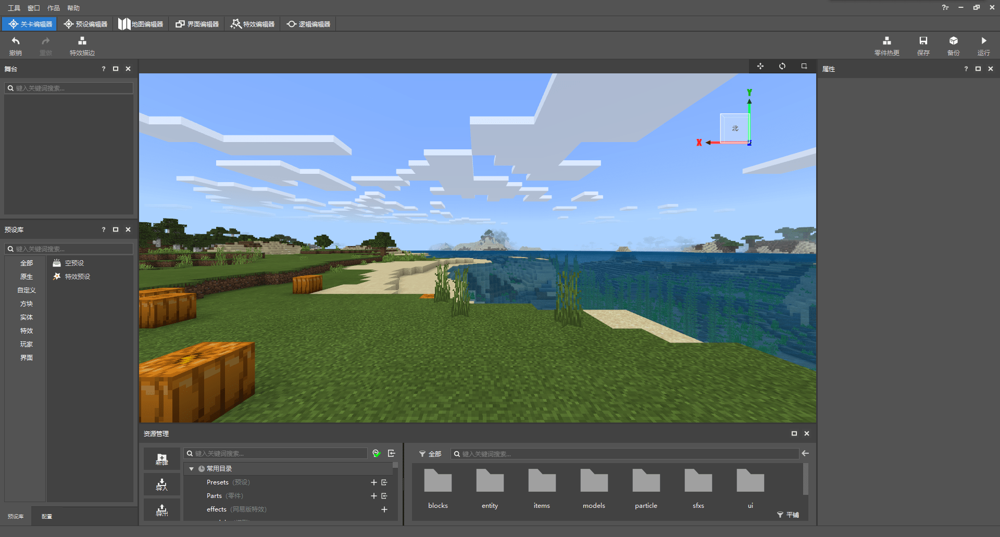
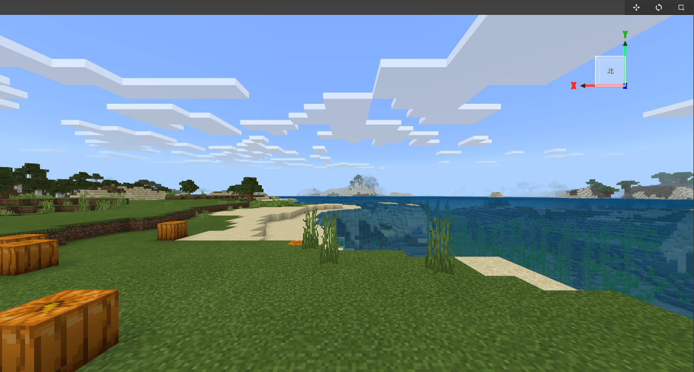
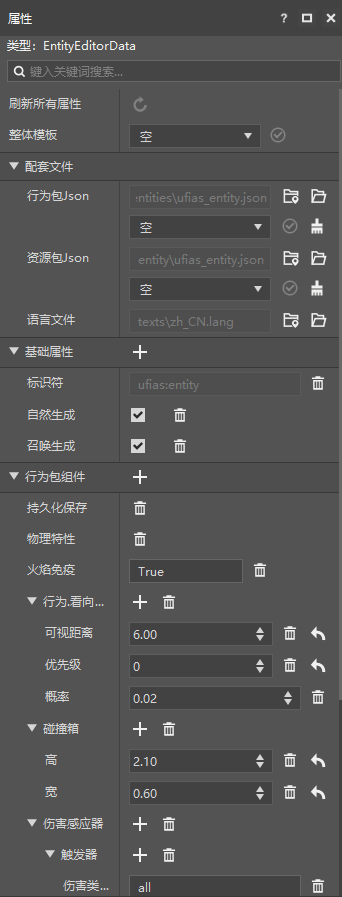
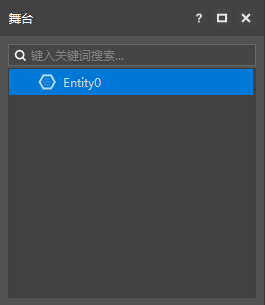
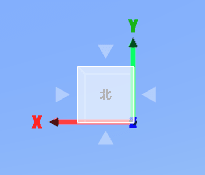

--- 
front: https://nie.res.netease.com/r/pic/20211104/69055361-2e7a-452f-8b1a-f23e1262a03a.jpg 
hard: Getting Started 
time: 5 minutes 
--- 
# Adapt to the new version of the level editor 
In order to better explore the new version of the level editor, we create a new version of the map component. In this way, each modification we make can be kept with the map, which is convenient for us to explore. Now, let's open this new version of the map. 

 

## What is the preview window 

 

As we introduced in Chapter 3, we can see that there is a **Game preview window** in the center of the interface, which is where we preview the changes. All our changes can be visualized through this preview window. Through this preview window, we can intuitively feel the content we added, and at the same time, we can easily change various gameplays. 

## What is a property 

 

On the right side of the screen, we can see a "**Property**" pane, which is where we can display and modify the properties of our customized configuration or preset. **Property** (**Property**) is the various properties of a configuration or preset. Once some properties of the same configuration or preset are changed, its performance will become slightly different or even very different. 

## What is the stage 

 

In the upper left corner of the screen, we can see the "**Stage**" pane. **Stage** (**Stage**) is a window used to display the presets placed in the current archive. We can see the name of the preset and various attachment states in the stage. By dragging in the stage, we can change the order and attachment state of the presets for better editing. We have already introduced presets in Chapter 3. In the following Section 3, we will also use presets for various specific creations. 

## Move and rotate the view 

In the preview window, the left mouse button is mainly used to click and select presets. So if we want to move and rotate the view, how should we do it? 

### Move 

Movement is divided into fast movement and slow movement. When the mouse focus is inside the preview window, we can use **W**, **S**, **A**, **D** to move quickly forward, backward, left, and right, and use **Space bar** and **Shift key** to rise and fall. When the mouse focus is outside the preview window, we can use **W**, **S**, **A**, **D** to move slowly forward, backward, left, and right. At this time, the space bar will not work. At the same time, the Shift key only changes the view to sneak state, but does not affect the movement speed. 

### Rotate 

Move the mouse focus to the preview window, press **right mouse button**, you will enter the rotation mode, and move the mouse at this time, and the view will move with the mouse. 

 

In the upper right corner of the preview window, we can also see a small coordinate system, which is the coordinate system corresponding to our current perspective. We can quickly change our current direction by clicking the **triangle button** on the coordinate system.