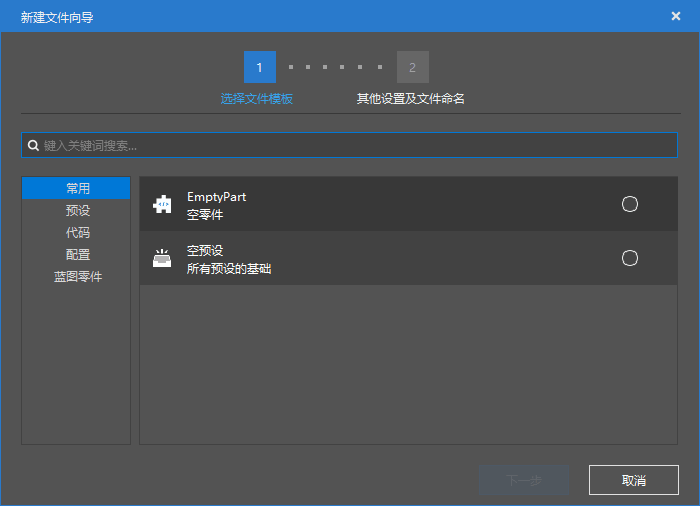
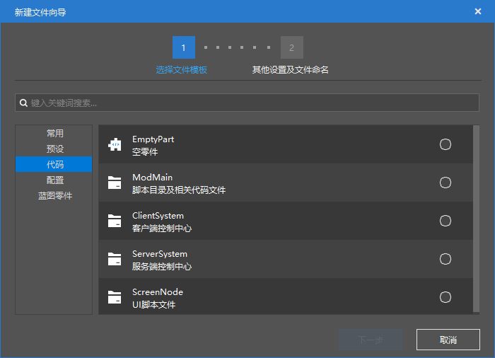
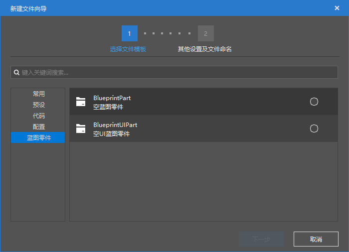

--- 
front: https://nie.res.netease.com/r/pic/20211104/69055361-2e7a-452f-8b1a-f23e1262a03a.jpg 
hard: Getting Started 
time: 10 minutes 
--- 
# Create resources and import and export 
In this section, we will learn how to create new resource files, as well as how to import and export resources. 

## Quickly create new resource files 

At the bottom of the level editor screen, we can see a "**Resource Management**" pane. 

 

On the far left of the "Resource Management" pane, there are three shortcut buttons. The first one is the "**New**" button. We can use the "New" button to quickly create the resource file we want. 

 

After clicking the "New" button, we come to the "New File Wizard" dialog box, which lists all the resource types that can be quickly created. 

 

Let's introduce them one by one: 

 

The **Preset** tab is used to quickly create a preset. 

- **Empty preset**: quickly create an empty preset. 
- **Entity preset**: quickly create an entity preset. Entity presets will also create an entity configuration, which means that when you create an entity preset here, a new entity will be created at the same time. If you want to create a preset based on an existing entity. You can find the entity in the "Configuration" pane on the left, right-click and select "**Create Preset**". 
- **Special Effect Preset**: quickly create a special effect preset. Effect presets do not create new effects. You need to manually create effects and attach them to effect presets. 
- **Player presets**: Quickly create a player preset. Player presets are automatically instantiated on each player and apply some player-specific logic. 
- **Block presets**: Quickly create a block preset. Block presets do not create new blocks at the same time. If you want to apply your own custom blocks to this preset, you need to manually enter or select your custom blocks in the "Properties" pane after creation. 
- **Interface presets**: Quickly create an interface preset. You need to manually bind the interface after creation. 

 

The **Code** tab is used to quickly create a code logic. 

- **EmptyPart**: Quickly create an empty part. 
- **ModMain**: Quickly create a module main script directory and related files. 
- **ClientSystem**: Quickly create a client control center. 
- **ServerSystem**: Quickly create a server control center. 
- **ScreenNode**: Quickly create a UI node logic script. 

 

The **Configuration** tab can be used to quickly create a configuration, that is, to quickly create an *entity* of a gameplay (this entity is a broad content entity, not an entity concept in the game. This broad entity includes all the contents listed below).

- **Entity**: Quickly create an entity in Minecraft. 
- **Item**: Quickly create an item in Minecraft. 
- **Block**: Quickly create a block in Minecraft. 
- **Recipe**: Quickly create a recipe in Minecraft. A recipe is a rule used to synthesize items. 
- **Trade Table**: Quickly create a **Trade** table in Minecraft. The trade table can be used to configure a set of exchange rules similar to villager trading. The trade table can be implemented in the custom entity through the relevant interface. 
- **Drop Table**: Quickly create a **Loot Table** (**Loot Table**, ***Drop Table***) in Minecraft. The loot table can be used for a series of item production processes that require a randomness, such as the capture of drops looted by creatures, the generation of treasure and box contents. 
- **Generation Rule**: Quickly create a **Generation Rule** (**Spawn Rule**) in Minecraft. The generation rule can be used to customize the **Naturally Spawn** of creatures.
- **Dimension**: Quickly create a **Dimension** in Minecraft. Similar to the Overworld, Nether, and The End, we can also create a new dimension here to add a "new world" to our module. 
- **Biome**: Quickly create a **Biome** in Minecraft. Biome is a function that can be seen but can be experienced to distinguish the generation of various terrains, vegetation, and building structures in a dimension. Being good at customizing biomes can greatly improve the playability of the module. Among them, **Terrain Generation** is the most important part of a biome. 
- **Feature**: Quickly create a **Feature** in Minecraft. A feature is a function that can be used to quickly generate a specific type of structure or block group. The trees, flowers, ore veins, crystal caves, mines, and various ruins we see in the world are all masterpieces of features. 
- **Feature Generation**: Quickly create a **Feature Rule** in Minecraft. Feature Rules control how features are **Naturally Generate**. 

 

The **Blueprint Parts** tab is used to create **Blueprint Part** for the Logic Editor Blueprint. 

- **BlueprintPart**: Create an empty Blueprint Part. 
- **BlueprintUIPart**: Create an empty UI Blueprint Part. 

## Export Resource Pack 

After we have made a resource pack, we want to export it for future use. The **Resource Pack** here does not refer to the resource pack (Resource Pack) that we usually use to store client resources such as textures and models, but refers to "a pack with resources", which usually refers to the collection of resources such as presets, configurations, special effects and models we have created, and is a `.mep` format file. Through the export function on the left side of the "**Resource Management**" pane, we can export some or all of the resources we have currently made as a resource package. 

 

Click the "**Export**" button on the left side of the pane, and we can see a pop-up "Export as Resource Package" dialog box. Select the file we want to export, click "**Export**", and after selecting the location, the resource can be successfully exported for backup, so that you can choose to import or pass it to others in the future. 

## Import built-in or external resources 

Just as we can export resource packages, we can also import resources. Click the "**Import**" button on the left side of the "**Resource Management**" pane, and we can see "**Import Preset**", "**Import Part**", "**Import Built-in Resource Package**" and "**Import Custom Resource Package**". 

 

The Minecraft development workbench has a series of built-in resource packages for us to import. We can learn various development functions and enrich our development skills through these built-in resources. Click "**Import built-in resource package**" to select a built-in resource package to import. 

"**Import custom resource package**" is used to match the above-mentioned export resource package function, making it convenient for us to import previously exported resource packages.