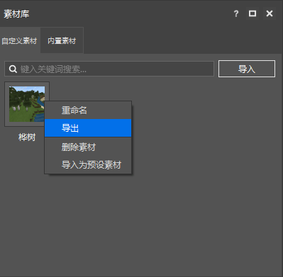
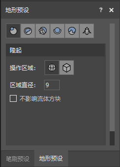

--- 
front: https://nie.res.netease.com/r/pic/20211104/69055361-2e7a-452f-8b1a-f23e1262a03a.jpg 
hard: Getting Started 
time: 15 minutes 
--- 
# Build and polish the map 
In this section, we will use the **map editor** to learn how to build and polish the map. We use the same test map as above, and switch the editor type to "map editor" at the top to open our map editing function. 

Like other editors, the map editor also has the function of undo and redo, so developers don't have to worry about destroying the terrain when exploring the map editor, just feel free to explore. If there is an operation error, you can also use the "undo" button in the quick operation bar in time to withdraw the wrong operation. 

 

## Select, drag and scale regions 

If you are entering the map editor for the first time, we can see that the "Select" button in the shortcut bar at the top has been pressed, and we are in selection mode. In selection mode, we can press and drag the mouse in the preview window to select a region. As shown in the figure, we have selected a region: 

 

We can move the region by the coordinate axis of a vertex of the region (the lower right vertex in the example). Pressing an axis and dragging can move the region along that axis. Pressing the square at the origin of the coordinate axis and moving it can make it move freely. 

After selecting a region, we can still change the selection range of the region. Just move the mouse to the corresponding face, press and drag the face, and you can enlarge or reduce the region in the direction perpendicular to the face. 

We call the bounding box of a region selected in this way a bounding box. We click to select the bounding box, and click the "**Edit**" button in the top quick operation bar to enter **Edit mode**. 

If the bounding box in edit mode is dragged again, all the blocks inside it will move together. If you drag a face to scale, the blocks inside it will be "**scaled**" together, and scaling at this time may cause distortion of the blocks inside. At the same time, after entering edit mode, a secondary menu will be called out, through which we can perform the same scaling and rotation operations. 

 

## Undo, Redo and Clear Area 

On the far left of the quick operation bar, we have the "**Undo**" and "**Redo**" buttons. Through these two buttons, we can undo our last operation at any time. If we accidentally undo the operation, we can also restore it at any time through the Redo button. 

 

If we want to clear a certain area, a quicker way is to use the "**Eraser**". We select "Eraser" in the shortcut bar. 

 

Then smear the part you want to clear in the preview window to quickly clear the blocks. 

Of course, the erasing efficiency of the eraser is still limited. In order to improve the efficiency of clearing, a better way is to first select the area through "Selection", and then directly press the **Delete key** to clear the blocks in the area into air. 

## Use blocks as materials 

In order to make terrain production more convenient, we can use **materials** to quickly place some structures in the world. In the lower left corner we can see the **Material Library** pane. We can import a material through the material files (`.mld` files), map files (`.osm`) files and various model files (`.obj`, `.fbx`, etc.) generated by the Minecraft development workbench. The imported material can be set in the world with one click as a shortcut. 

Below we demonstrate the use of blocks as materials. 

### Save Materials 

In order to use blocks as materials, we first need to save some blocks as materials in the map. Here we select a birch tree and click the "**Save as Material**" button above to save the material. 

 

At this time, we can see the material we just saved appears in the "Material Library" pane in the lower left corner: 

 

We can also export it as a `.mld` file for other use by right-clicking the material and selecting "Export". 

 

### Place Material 

At this time, we only need to click the material with the left mouse button, and we can choose a location in the world to place it. 

 

## Use brush presets to change space 

We can use **brushes** to quickly "paint" specific blocks in a specific shape in the world. Brush presets are divided into "Single Point Brush", "Square Brush", "Spherical Brush", "Cylinder Brush" and "Hemisphere Brush". 

 

We add the brush material we want in the "**Material Preset**" pane, and then select the "**Brush**" button in the shortcut toolbar at the top. 

 

You can start placing blocks in the world in the shape of the brush preset. 

 

## Design terrain using terrain presets 

In addition to brushes, we can also change terrain through **terrain presets**. Terrain presets are a series of pre-set terrain operation modes, divided into "uplift", "erosion", "smooth", "fill", "top cover" and "plant". Except for "plant", the others are simply operations on the terrain. For example, "uplift" makes the blocks in the specified area uplift by 1 grid. 

 

Select the desired terrain preset, configure the relevant parameters, and then select the "**terrain**" button in the top shortcut toolbar to start changing the terrain. 

 

## Change time, visibility and spawn point 

We can quickly change the current visibility, time and spawn point through the "Time", "Visibility" and "Birth Point" buttons in the top shortcut bar. It is worth noting that the visibility changes only the visibility in the current editor, but the change of time and spawn point will affect the time and spawn point after the map is released. 

 

Change spawn point: 

 

Change time to midnight: 

 

Increase visibility: 

 

## Enter game mode 

In the map editor, we can enter **game mode** to truly experience the terrain we edit, and it can also facilitate us to make some materials. Click the "**game mode**" button in the upper right corner to enter the game mode. 

 

After entering the game mode, the player's control in the real game will be simulated. You will be able to use normal keyboard and mouse controls to play the world you just edited: 

 

Pressing the **Esc key** in the game will return to normal selection mode. 

## Save area structure and share across archives 

After selecting a certain area, in addition to saving it as a material, we can also save it as a structure and load it in other archives through structure blocks. Select "Save as Structure" and enter the structure name to save it as a structure: 

 

The saved structure will appear in the `<namespace>` folder under the `structures` folder of your behavior pack. For example, my current namespace is `demo_world`, then it will appear in the `demo_world` folder under the `structures` folder. 

 

The structure I saved is named `some_grass_block`, so the name of the structure file will be `some_grass_block.mcstructure`. In the structure block, we only need to call `demo_world:some_grass_block` to successfully call our structure! 

## Limitations of the current editor 

It should be noted that the current level editor and map editor still have some limitations, such as being unable to enter other dimensions for debugging, etc., so developers need to pay attention. 
