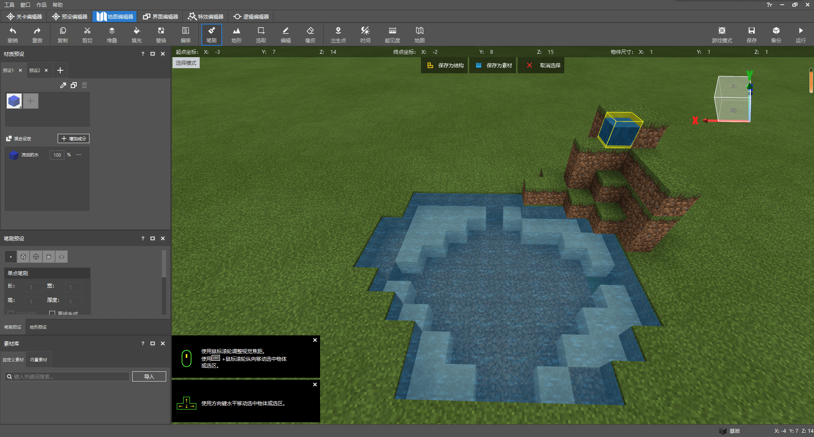
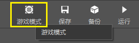
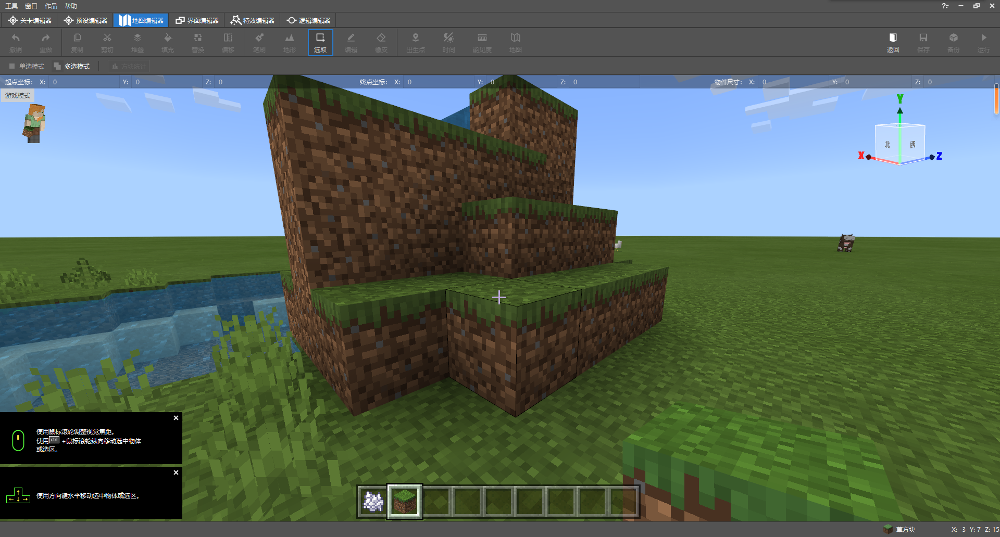

--- 
front: https://nie.res.netease.com/r/pic/20211104/69055361-2e7a-452f-8b1a-f23e1262a03a.jpg 
hard: Advanced 
time: 15 minutes 
--- 
# Challenge: Design terrain and share with friends 

In this section, we will design a lake wetland and share it with friends by exporting it. You can click [corresponding wetland link](https://g79.gdl.netease.com/addonguide-6.zip) to download the resource. 

## Design a lake wetland 

In order to quickly design a lake wetland, we need to use the brushes and terrain presets of the terrain editor. In order to get started quickly, we will demonstrate the design of a relatively small lake wetland in this demonstration. You can operate it according to your own preferences and give full play to your imagination without being bound by the appearance of the original tutorial diagram. 

First, to make a lake, we can "dig" a hole in the ground. A simple way is to select and delete a part of the blocks quickly by using the **`Delete` key**. For example, we can select and delete as follows. We use the "**Multi-selection mode**": 

 

 

Next, we will fill the bottom of the lake with sand to simulate a real lake. We plan to use a **Single Point Brush** with sand material and change the base point to **Center**. Fill each area carefully. 

 

Of course, if the plot is large, we recommend another convenient way - **Top Replacement**. We switch to the **Top Cover** **Terrain Preset** and click the "**Top Replace**" button. 

 

This way we can use the top replacement function to batch replace the topmost blocks of our terrain. 

 

In order to make the lake more realistic, we need to make the lake slightly concave. We plan to use the "**Erosion**" **Terrain preset**. In order to make erosion effective, we first delete a block in the center of the lake. 

 

 

Then start to "smear" erosion from this middle block to the surrounding areas. 

 

This forms a lake structure with mud in the middle and sand near the shore. Next, we fill the water. We use the "Replace" function in the top function area. We first select our entire lake, and we want to replace the air blocks in the selected area with water. We click the "**Replace**" button in the quick function area. 

 

 

We find the air column, and we want to replace the blocks behind it with water. At this time, we choose still water to replace, so we do not select "flowing water", but directly select "water". 

 

As you can see, we have successfully placed the water body in the lake! 

 

Now, we have completely made a lake, but this lake is obviously not very realistic, so we continue to make its "exterior". For example, we want to make a rockery. We can use the "**Bump**" **Terrain preset** and slightly reduce the radius. 

 

We can also place a water source on the rockery to simulate a spring. We use a single point brush to place a water source. Note that we should select flowing water at this time, otherwise the block will not be updated and the water will not flow down the rockery. 

 

 

> **Supplementary knowledge**: The updating principle of liquid blocks 
> 
> Liquid blocks generally exist in two forms at the same time, namely **static form** and **flowing form**. Static liquids will not be updated all the time in the world. Only when the neighboring static liquid is updated will it be updated and then transformed into a flowing liquid. The flowing liquid will be updated all the time since its existence until its block state is relatively fixed, and then it will be changed back to a static form. So when a flowing liquid block is placed, it will start to flow immediately, while a static liquid block will remain stationary in the air because it cannot be updated. 
> 
> In fact, there is no essential difference between water source blocks and water flow blocks. Regardless of whether it is a flowing block or a stationary block, as long as its added value is 0, it is a water source and can interact with the bucket; the rest of the added values are water flows and cannot be picked up by the bucket. 

After "generating" a rockery, we can also decorate the lake with flowers, plants and trees. At present, there is no relatively good way to place flowers and plants in the new version of the editor. We directly click the button in the upper right corner **Enter Game Mode** to place flowers and plants with bone meal. 

 

 

At the same time, some "holes" on the terrain can also be repaired. 

 

Back to normal mode, we can see that our lake is surrounded by flowers and plants. 

 

Next, we place a tree as a finishing touch. We can place an oak tree through the "Plant" preset in the "Terrain Preset". Place, undo, and place again until you have an ideal "tree shape", such as the following effect: 

 

So far, we have completed it! We have successfully created a lake wetland terrain. Now it seems that this terrain is "more realistic". We can use it as a material for future creations. 

## Export as material and structure 

In order to further use the terrain and to facilitate sharing with others, we can export it as a material or structure. First, we will completely select the terrain we created. 

 

### Export as material 

We click on the top "**Save as material**" to save the terrain as a material. Be sure to uncheck the "Remove fluid" option, otherwise the water will not be saved. 

 

After saving, we can see our terrain in the resource library. We can right-click it and continue to select export to export to the outside. 

 

 

### Export as structure 

We click on the top "**Save as structure**" to save the terrain as a structure. At this time, the structure is located in the `structures` folder of the behavior pack, and you can directly copy it out. 

 

Of course, if your structure is quite large, it is no longer suitable to save it using a separate structure file. The editor also provides the function of splitting structures. Select "Split Structure" and we can split the large structure into many small structures. 

 

At this time, the editor will also generate a corresponding `.json` extension file to save the location information of each split structure. You can later restore and place this split structure in your world through the `PlaceStructure` interface in the module API through a script! 

At this point, you have successfully exported the materials and structures. Share your achievements with other developers!