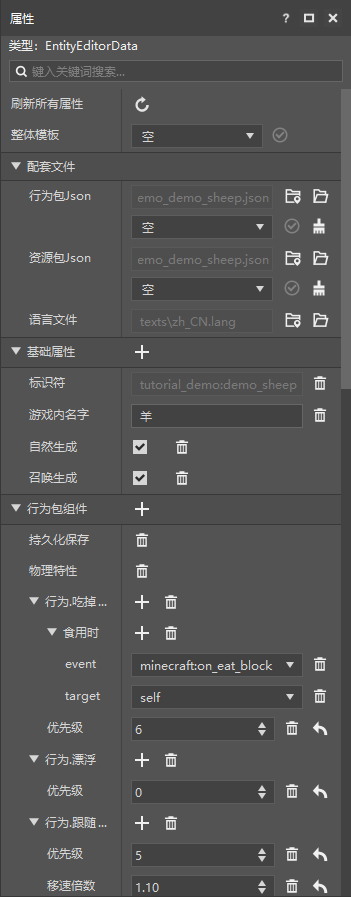
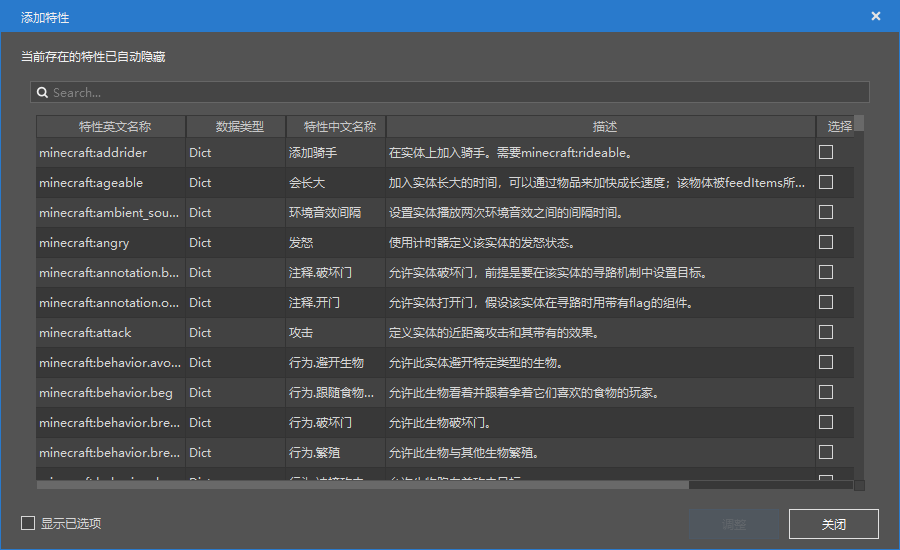
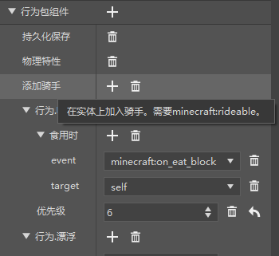
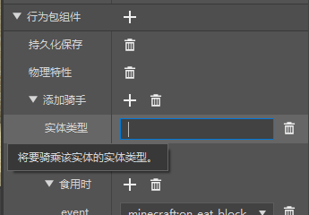
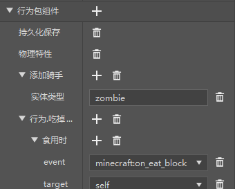
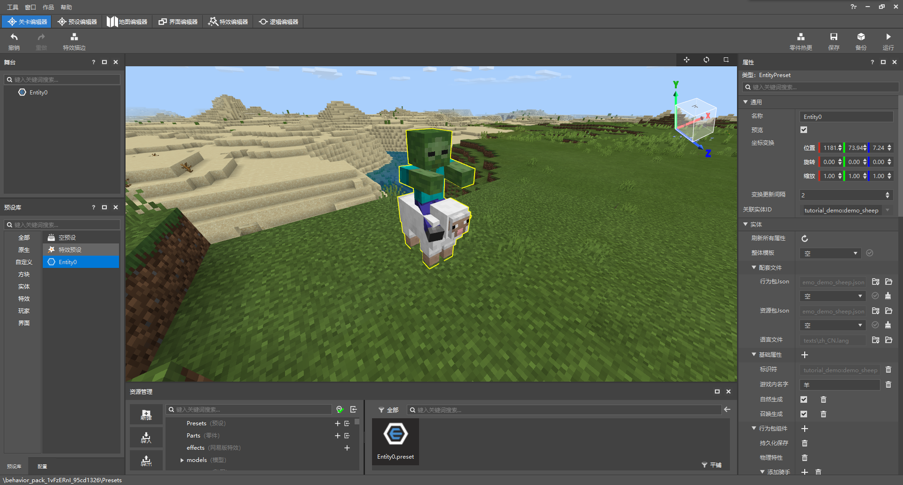

--- 
front: https://nie.res.netease.com/r/pic/20211104/69055361-2e7a-452f-8b1a-f23e1262a03a.jpg 
hard: Advanced 
time: 15 minutes 
--- 
# Get started with entity configuration 

In this section, we will get started with entity configuration. Let's make an entity through entity configuration. 

## Create a new entity 

We have learned in the previous chapter that to create an entity through the editor in the Minecraft development workbench, we need to use entity configuration. Entity configuration can be quickly created through the "New" button in the "Resource Management" pane of the Level Editor. We use this function to open the wizard window for entity configuration. 

 

We can see that we have many data templates to choose from. If we select a data template, we will inherit all the pre-set configurations of the data template and can make further modifications based on this configuration. If we select the "empty" template, we can start the configuration of an entity from scratch. Here, for the convenience of demonstration, we choose the "Sheep" template. After creation, we select the entity in the "**Configuration**" pane on the left, and the properties of this entity will appear in the "**Properties**" pane on the right side of the window. 

 

## Set entity AI and components 

In the properties pane, we can see three major categories, namely **Supporting Files**, **Basic Properties**, and **Behavior Pack Components**. 

- **Supporting files**: Each configuration is actually composed of multiple files. For example, a configuration of an entity is composed of a behavior pack JSON file, a resource pack JSON file, and the part of the language file that involves the entity. The supporting files of the configuration are listed here. 
- **Basic properties**: Basic properties are the **description** part of the entity, usually composed of basic properties such as identifiers and names, describing the basic properties of an entity. You can add a property by clicking the "+" on the right side of the category title. 
- **Behavior pack component**: The behavior pack component is the main part of an entity. Most of the content, features, and behaviors of the entity are defined here. The editor supports tree-like modification of various **components**. You can add a component by clicking the "+" on the right side of the category title. 

In order to set the AI and components of the entity, we need to take a deeper look at what "**Component**" is. In fact, component is Microsoft's name for an object field in the entity definition JSON file. Different components can be used to define different properties and functions of the entity. In the editor, we don't need to touch the complex JSON modification. The editor parses JSON into a tree-like visual editor for us to modify, and translates the component name. So we can easily add, delete and modify components through the editor. Among them, the components that can control biological AI are prefixed with "**behavior.**". 

In order not to conflict with the component concept in "Work Components", component fields and their subfields are also called **features** in some places in the editor. We click "**+**" to add components, and you can see the "Add Feature" window. 

 

> **Selected Reading: Entity Components** 
> 
> Looking deeper, components also have different types. Most common components are used to define a "function" possessed by an entity, such as the entity's riding function, attack function, breathing function, etc. Some components can define the "AI behavior" of an entity, such as when to wander around, when to look at the player, when to swim, etc. This component is called an AI Goal and is usually prefixed with a behavior. Some components define the inherent properties of some entities, such as the level of health, which are called attributes; while others define the properties of "what an entity can do", which are called properties. There are also some components that are used to define what kind of events will be triggered when the entity is in a specific state. These components are called triggers. 
> 
> Looking at it from a higher level, the components of Minecraft actually belong to an architecture called ECS (Entity-Component-System), which means that every basic unit in the game is an entity (here is a broad definition of entity, such as blocks, items, and entities are all a kind of entity), and each entity is composed of one or more components. There are no methods in the component, only **data** representing the characteristics of the entity. **The system** is only responsible for processing this data, and only cares about the characteristics of the entity that has a certain component. It substitutes the data provided by the component into the relevant methods built into the system to update the entity's information. This method of modifying the game through the components (data) of the ECS system is called **Data-Driven** style 

We add a new component to our "Sheep Entity", such as the `addrider` component, which can add a rider to the sheep. We select this component in the "Add Features" window and click the "Adjust" button. You can see that the "Add Rider" component has appeared in the "Properties" pane. 

 

We click the "**+**" button on the right side of "Add Rider" and you can see that another **"Add Features"** window pops up. We add the `entity_type` field of this component here. This field is used to specify what kind of creature the sheep's rider is. Select and click the "**Adjust**" button, and we can see that there is an additional "Entity Type" under "Add Rider". 

 

We can enter an entity type at will, such as zombie (`zombie`). 

 

At this point, our entity will spawn with a zombie on its head. Let's create an entity preset with this entity configuration and place it in the level editor to see the effect. 

 

Success! We have successfully added a component to the entity, which will allow the entity to have a zombie rider attached to it every time it spawns. 

If we want to add an AI to the entity, we have to follow the same process. However, we have to select those components with the prefix `behavior.` to add. These components can make the behavior (i.e. AI) of the creature more rich! 

## Custom Entity Spawning Rules 

Our custom entity is currently just an independent entity. If the corresponding spawning rules are not configured, it will not be able to **Naturally Spawn**. Therefore, we need to use the spawning rule configuration to create and modify the spawning rules. We will add a generation rule for our "sheep" in Section 7.