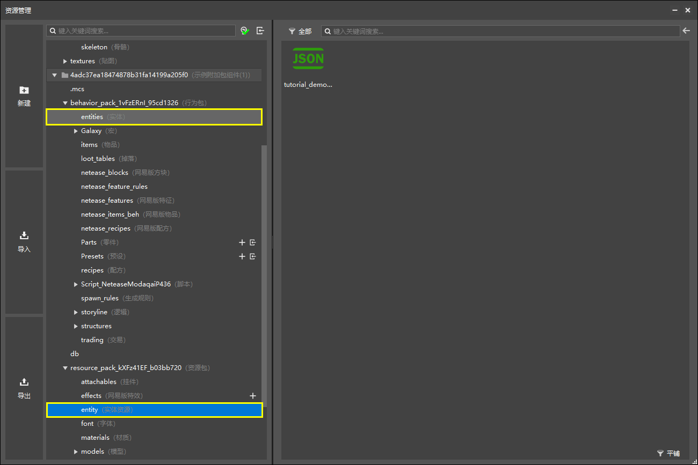
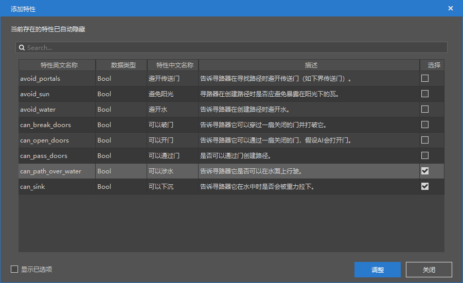

--- 
front: https://nie.res.netease.com/r/pic/20211104/69055361-2e7a-452f-8b1a-f23e1262a03a.jpg 
hard: Advanced 
time: 20 minutes 
--- 

# Challenge: DIY Slime Entity 

In this section, we customize a slime entity. We all know that slimes cannot swim freely in the water. So once they fall into the water, slimes can only float on the water. We hope to make only one kind of slime that can swim in the water. 

## Make a slime that can swim 

### Learn to import original resources from the original template package 

In order to customize a new slime, we need to use the original slime resources. Unfortunately, we did not find the slime data template in the new configuration. 

 

So we need to manually find the slime's resources and behaviors in the original resource pack and behavior pack, and manually import them into the editor. We use the link below to download the latest original resource pack and behavior pack. 

| Package Type | Template Pack Link | 
| ------ | ------------------------------------------------------------ | 
| Resource Pack | [https://aka.ms/resourcepacktemplate](https://aka.ms/resourcepacktemplate) | 
| Behavior Pack | [https://aka.ms/behaviorpacktemplate](https://aka.ms/behaviorpacktemplate) | 

Just as a configuration in an editor will create some supporting files, we need to manually create this series of "configuration" files in order to make the entity effective. Generally speaking, an entity needs three files to support its rendering and behavior, namely **resource pack definition file**, **behavior pack definition file** and **model file**. However, since we want to customize an entity that looks the same as the vanilla slime, we can use the vanilla slime model directly without modification. If no modification is needed, we don't need to import the vanilla slime geometry model in our resource pack. We just need to find and import: 

| File | Location | 
| ---------- | ------------------------------------------------ | 
| Resource Pack Definition | `Vanilla_Resource_Pack/entity/slime.entity.json` | 
| Behavior Pack Definition | `Vanilla_Behavior_Pack/entities/slime.json` | 

 

Before importing, we open it with an editor. We need to modify their entity IDs, otherwise the entities we import will "collide" with the vanilla entities. 

We can change the namespace (the part before the colon) `minecraft` in `identifier` under the `minecraft:client_entity/description` section in the resource pack definition file to our own namespace. For example, I changed it to `tutorial_demo` mentioned in the first chapter. 

 

Similarly, we also change the namespace `minecraft` in `identifier` under the `minecraft:entity/description` section in the behavior pack definition file to the same name. 

 

After saving the two files, you can close them. However, in order to avoid conflicts with modules made by other developers, we also recommend changing the file names of the two files, such as adding a namespace in front of `slime`. 

 

Next, we import them into the editor. We find the corresponding folder in the "Resource Management" pane. 

 

We right-click on the two folders and click "**Import File**". 

 

Locate the original file we just found and import it. After the import is successful, we can see our custom entity in the "Configuration" pane. 

 

We click on the entity, and the "Properties" pane on the right will show the slime's related properties and components. 

 

### Add related components 

#### Modify runtime ID 

In order to make our slime fully inherit the hard-coded behavior of the original, we can further modify the slime's **Runtime ID** (**Runtime Identifier**) to the original slime.

We click the "**+**" button to the right of "**Base Properties**". Select the "**Inherit Creature**" feature. 

 

 

Select "Slime" as the creature with runtime ID inheritance. 

 

In this way, we have successfully set the behavior of the creature that is not data-driven to be exactly the same as the original slime. 

#### Add swimming AI intention and swimming navigation components 

Click the "**+**" button to the right of "**Behavior Pack Components"**. Search for "swim" to see the behavior pack components we want. 

 

We select the AI intention of **`minecraft:behavior.random_swim`**, which can make the slime generate random "swimming intentions"; then select the **`minecraft:navigation.swim`** component, which can make the slime include the inside of the water in the pathfinding algorithm. Click "Adjust" to add the component to the behavior pack. 

### Configure "Behavior.Random Swimming" 

We first configure the AI intention of swimming. 

 

 

We only need to set its priority, and keep the rest in the default state. Since we can regard "random swimming" as a "leisure" state, we set its priority to the lowest "1". In this way, when the slime triggers other states, such as attacking the player, it can prioritize attacking and other actions. 

 

At the same time, we can delete the floating behavior to prevent it from continuing to float without diving into the water. 

 

### Configure "Navigation.Swimming" 

Similarly, we configure the navigation component. 

 

 

We select "Can wade" and "Can sink". At the same time, since **there can only be one "navigation" related component**, we need to delete the original "navigation.walking" component. 

 

In this way, our slime will "only know how to swim". 

### Configure Breathability 

We need to make the slime able to breathe in water. So we add the ability to breathe in water to the breathable component. 

 

 

 

### Enter the game for self-test 

We can now save and enter the game for self-test. We place some of our custom slimes in the water to see if the slimes can swim. As expected, the slimes swam in the water smoothly! 

 
