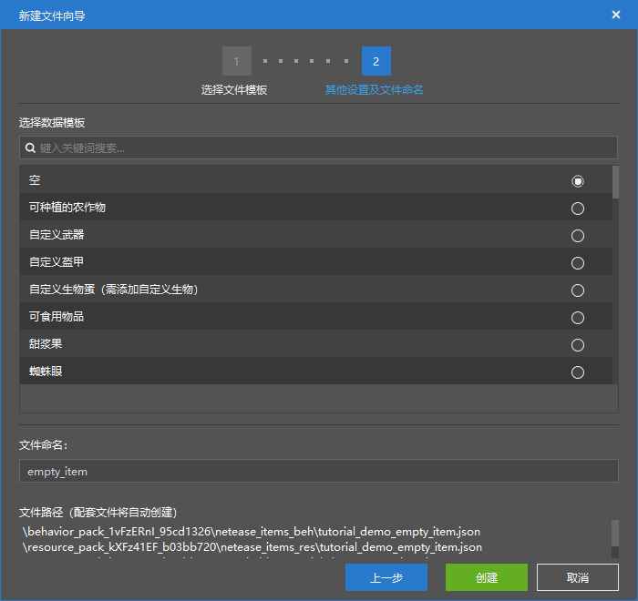
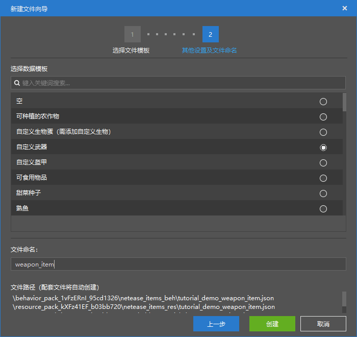

--- 
front: https://nie.res.netease.com/r/pic/20211104/69055361-2e7a-452f-8b1a-f23e1262a03a.jpg 
hard: Advanced 
time: 10 minutes 
--- 
# Get started with item function configuration 

In this section, we will get started with custom items. Let's create a variety of **items** (**Item**) through item configuration. 

## Create an empty item 

Like entities, we can create a custom item by creating a new configuration in the editor. After creating a new item, we can still add item components by adding features. Next, we create an empty item to observe its attribute structure. 

 

 

After adding a new item, we can see the various categories of properties of the item. In addition to **supporting files**, **basic properties** and **behavior pack components**, we can see **armor wearing properties** and **resource pack components**. 

- **armor wearing properties**: Armor wearing properties can define the rendering properties related to armor. Since the customization of armor is essentially to attach an **attachment** (**Attachable**, ***pendant***) to the item, the client properties of the attachment are actually defined here. 

- **Resource pack components**: There are also some resource pack-exclusive components in the resource pack definition file of the item. The resource pack components are defined here. 

## Make weapons 

When we create an item, we select the "Customize Weapon" data template, and we can quickly create a weapon. 

 

 

We can see that the "Properties" pane has been enriched, and the more important one is the "**Weapon Properties**" component. This component is the core of the weapon item, which defines the basic properties of the weapon, such as damage, enchantment ability, type, etc. We can modify these properties here until we modify them to our satisfaction. 

## Make armor 

When we create an item, we select the "Custom Armor" data template, and we can quickly create an armor. 

 

 

Since custom armor is achieved through attachments, the armor wearing properties appear here. The armor wearing properties determine the appearance of the armor after we wear it. **Model** is the **Model** used by the armor. **Material** is the **Material** that determines the rendering texture and mode of the armor. **Script** is the **Molang** script executed when the armor is initialized. **Texture** is the **Texture** of the armor. **Renderer** is the **Render Controller** of the armor. 

The "**Armor Properties**" component in the behavior pack component determines the armor value and enchantment ability of the armor. 

## Make consumables 

Finally, let's try to make a food consumable. 

 

We can see that the "**Food Property**" component determines the hunger value that the food can replenish. We can also use this component to customize the status effect produced after consumption and the usage time of consumption.