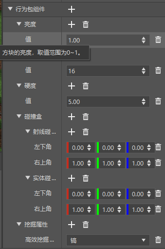
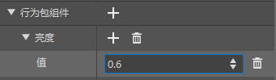

--- 
front: https://nie.res.netease.com/r/pic/20211104/69055361-2e7a-452f-8b1a-f23e1262a03a.jpg 
hard: Advanced 
time: 15 minutes 
--- 
# Get started with block function configuration 

In this section, we will get started with custom blocks. Let's make a variety of **blocks** (**Block**) through block configuration. 

## Custom monster spawner 

In this section, we want to customize a monster spawner. We can start with the "**Cow spawner block**" data template. 

 

 

We can see that blocks are also divided into **supporting files**, **basic properties**, and **behavior pack components**. The core properties and components that determine this block is a cow spawning block are the "**Inherited Block**" in "Basic Properties" and the "**Spawner Properties**" in "Behavior Pack Components". The "Monster Type" in the Monster Spawner Properties is the type of monster that the spawner will spawn. We might as well change it to the "sheep" with a zombie on its head that we customized in the first section. 

 

In this way, we get a block that can spawn zombie sheep riders. We can change its texture and put it in the terrain to achieve other functions. Of course, in addition to the international version of custom creatures, the original creatures are also supported here, so you can use this function flexibly. 

 

## Custom light source block 

We can also create a light source through the "**Ordinary light block**" data template. 

 

 

We can see that the property that determines whether to emit light is the "brightness" component. The emission intensity of 1.0 is a bit too bright, and we want to lower it, for example, we can adjust it to 0.6. 

 

With a slight change of texture, we have completed the production of a light source block!