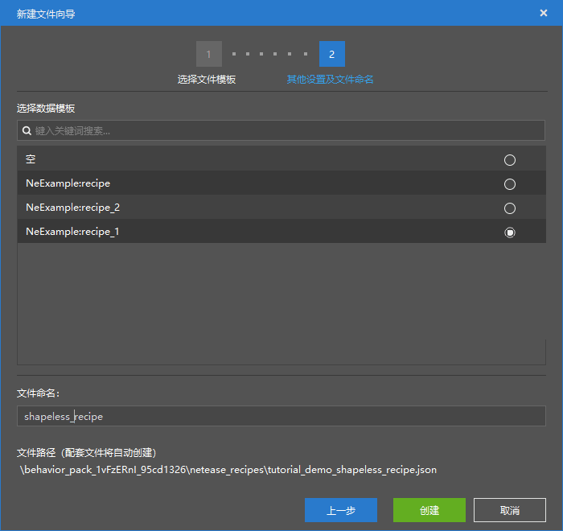
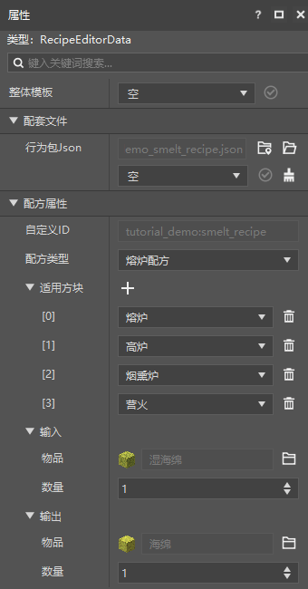

--- 
front: https://nie.res.netease.com/r/pic/20211104/69055361-2e7a-452f-8b1a-f23e1262a03a.jpg 
hard: Getting Started 
time: 10 minutes 
--- 
# Get started with recipe configuration 

In this section, we will get started with custom recipes. We remember that in the first chapter, we made an ordered **recipe** by ourselves. Next, we will introduce different recipe configuration data templates in detail. 

## Custom unordered recipe 

We use the `NeExample:recipe_1` data template to quickly create an unordered recipe. 

 

 

We can see that there are many differences between this and the property interface of the ordered recipe, the most obvious of which are **applicable blocks** and **recipe ingredients**. Ordered recipes can only be applied to workbenches, but unordered recipes can be applied to many other blocks, such as **cartography tables** and **stonecutters**. 

The recipe ingredients are no longer in the shape of a grid, but a linear list that lists each item and the required quantity. 

## Custom furnace recipes 

We can also use the `NeExample:recipe_2` data template to quickly create a furnace recipe. 

 

 

We can see that the input and output have become single, because this is a recipe for smelting, so the input and output have become a one-to-one relationship. 

By changing the input and output, adding and deleting applicable blocks, we can easily make a new recipe.