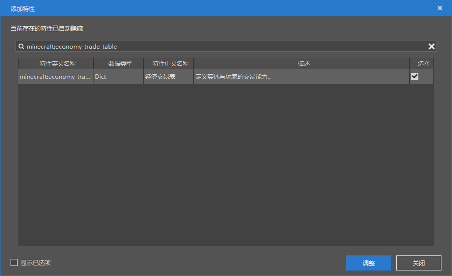

--- 
front: https://nie.res.netease.com/r/pic/20211104/69055361-2e7a-452f-8b1a-f23e1262a03a.jpg 
hard: Advanced 
time: 10 minutes 
--- 
# Get started with the trading table configuration 

In this section, we will get started with custom trading. Let's create a custom **Trade** similar to villager trading through the trading table configuration. 

## Create a trading table 

We hope to better observe the structure of the trading table through the data template, so we create a "multi-way trading table". 

 

 

In fact, we still can't see the structure of the trading table clearly at this time, so we first collapse the top-level object of the trading table. 

 

Now we can see the top-level structure of the trade table. In fact, a trade table is composed of one or more **quality** (**Tier**) trades, and different qualities are distinguished by different experience costs of trades. When a creature is generated, it can choose to draw one or more from the trade pool of different qualities as its own trade. 

 

There is a "**Trade List**" in each quality trade, and there are multiple trades in the list, which are the trade items of that quality. Each trade is an element of the "Trade List". When an entity is generated, a random one will be selected from the list as the trade of that quality. 

 

Some trades are one-for-one, and some are one-for-many. In any case, there must be only one item delivered in the exchange, and there can be many items returned in the exchange. This is the structure of a whole trade table. 

## Attaching the trade table 

The trade table can be attached to the entity. We might as well continue to use the entity "sheep" we defined in the first section and attach the trade table we just defined to the sheep entity. 

We select our custom "sheep" in the "Configuration" pane on the left. 

 

At this time, the "Properties" pane on the right will be replaced with the properties of the sheep. We add a behavior pack component. Find the `minecraft:economy_trade_table` component. This component is used to add a trade table to an entity. 

 

Find "**Economy Trade Table**" in the properties and click the "**+**" button. 

 

Simply select `display_name`, `new_screen` and `table`. And click "**Adjust**". 

 

Select our trading table and configure it as follows, where the "display name" can be configured according to personal preference. 

 

 

Click "Run" in the upper right corner to enter the game self-test, use our monster spawner to spawn our sheep, right-click our sheep to interact, and we will see that our trading customization is successful! 

