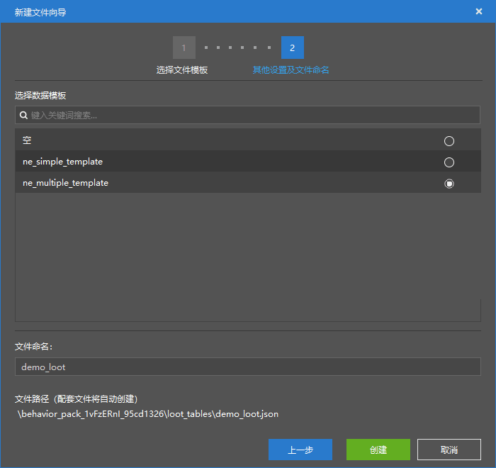
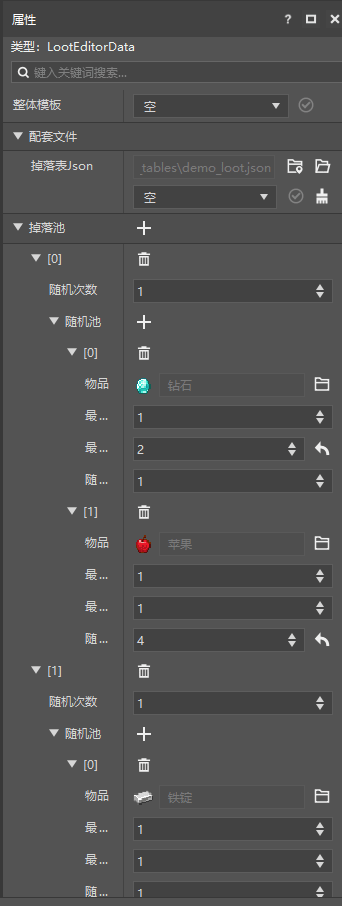
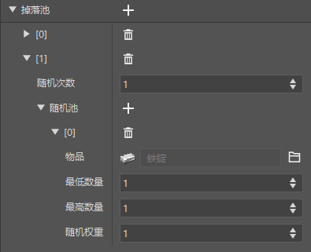
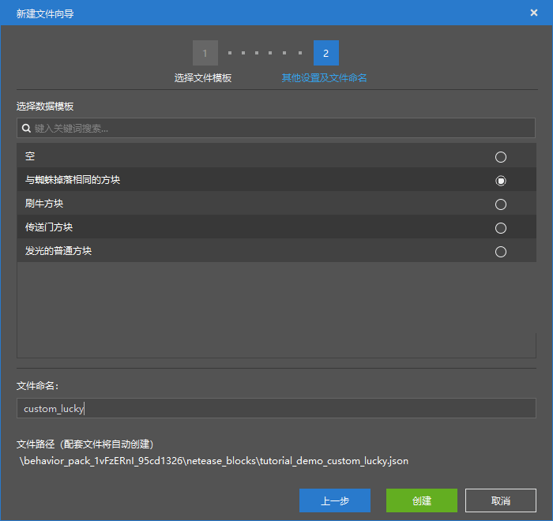
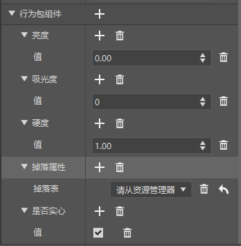
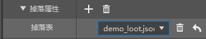
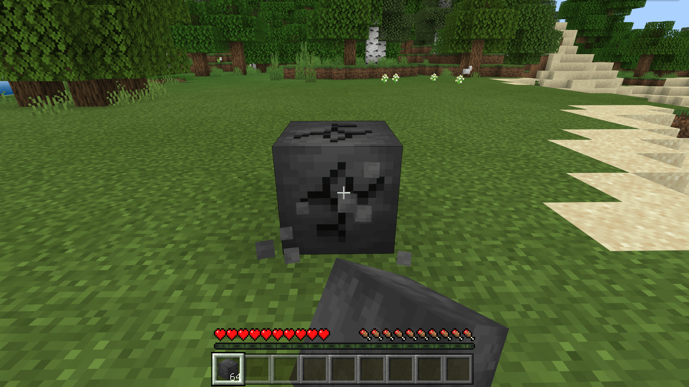
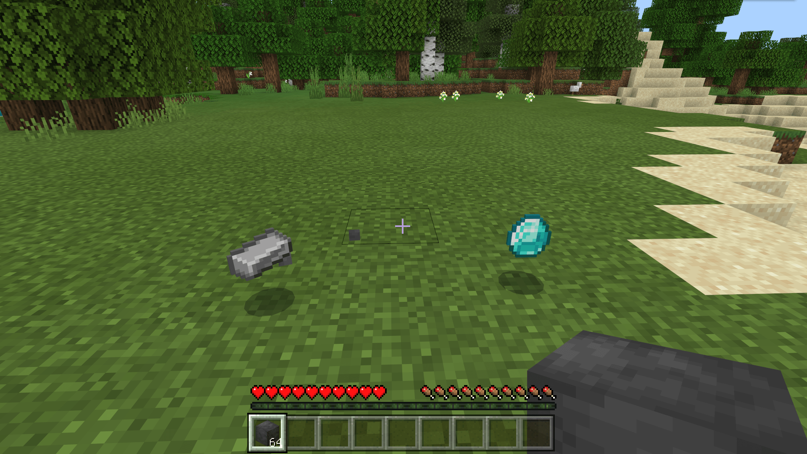

--- 
front: https://nie.res.netease.com/r/pic/20211104/69055361-2e7a-452f-8b1a-f23e1262a03a.jpg 
hard: Getting Started 
time: 10 minutes 
--- 

# Get started with drop table configuration 

In this section, we will take a look at custom loot tables. **Loot tables** (**Loot Table**, ***Drop Table***) are commonly used for loot grabbing of creatures or block destruction, chests and treasures. 

## Create a loot table 

Like the trading table, we choose a "multi-way loot table". 

 

 

Similar to the trading table, the loot table also **rolls** one or more items from the pool. Each element of the root node of the loot table is called a **pool**. As shown below, the loot table we created has 2 pools. 

 

Each time the loot table is rolled, each pool will be rolled once or more times, and the roll is determined by the "**random number**". The rolling process is to randomly draw an item from the "**random pool**" according to the "**random weight**". When rolling multiple times, it will be drawn multiple times, and finally all the items drawn from each pool are added up to all the items rolled by the loot table this time. 

## Mounting a loot table 

The loot table can be mounted in multiple places. This time we take making a lucky block as an example to demonstrate how to mount a loot table on a block. 

### Making a lucky block 

First, we configure a "block that is the same as the spider's drop". This block comes with a "drop property" component that can be used to mount the loot table. 

 

 

We select our loot table, and the mounting is successful. 

 

At this point, we can enter the game to observe the effect. 

 

 

As you can see, our loot table is successfully attached! We can add more interesting items to the loot table to complete our "'huge content' lucky block"!