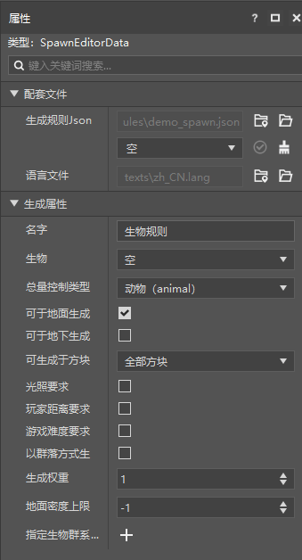
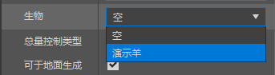
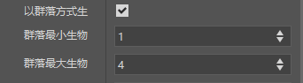
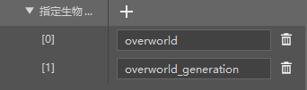
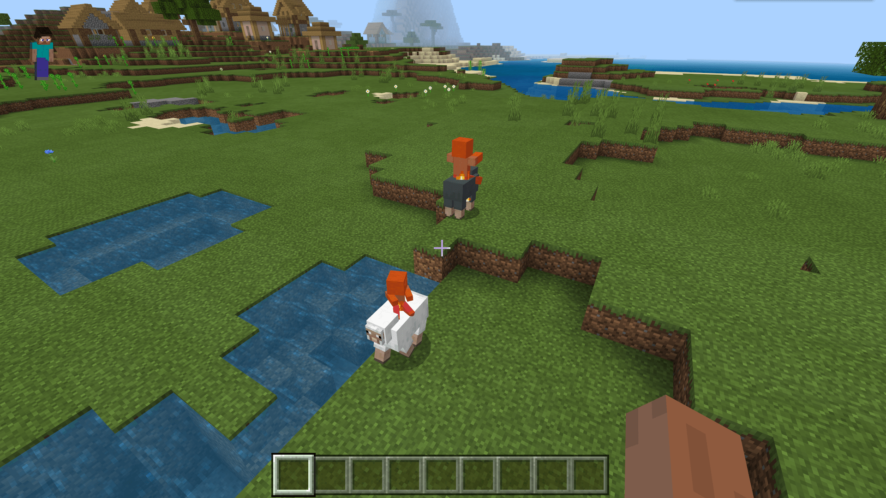

--- 
front: https://nie.res.netease.com/r/pic/20211104/69055361-2e7a-452f-8b1a-f23e1262a03a.jpg 
hard: Advanced 
time: 15 minutes 
--- 

# Getting started with spawn rule configuration 

In this section, we'll get started with custom spawn rules. A Spawn Rule is a rule used to make creatures naturally spawn in the world. 

## Create a Spawn Rule 

We create an empty spawn rule through the spawn rule configuration. 

 

 

As we can see, the spawn rule configuration is pretty simple and easy to understand, and most of it is literal. Let's start by trying to configure the generation rules for our custom entity "sheep". 

### Attach the entity to the generation rule 

We find "**Creature**" and select our sheep. 

 

We want sheep to only spawn on grass blocks, so add a grass block to "**Can spawn on blocks**". 

 

We want sheep to have a chance to spawn in groups each time, so we select "**Generate in groups**" and modify its value appropriately. 

 

We want more of this kind of sheep to spawn, so increase "**Generation weight**" to 20 (the original sheep is 12). 

 

We want it to be generated only in the main world, so we specify two "**biome tags**" representing the main world. 

 

In fact, the editor of the Minecraft development workbench can only form the filter logic of `all_of` by default, that is, only biomes with both the tags `overworld` and `overworld_generation` can be generated, but in fact any biome can only have one of the above, so we need to manually change it to `any_of`. We find our generation rules in the `spawn_rules` folder under the behavior pack in the "Resource Management" pane and double-click to open it. After opening, the file content is as follows: 

```json 
{ 
"format_version": "1.8.0", 
"minecraft:spawn_rules": { 
"conditions": [ 
{

"minecraft:biome_filter": { 
"all_of": [ // Change this! 
{
                            "operator": "==",
                            "test": "has_biome_tag",
                            "value": "overworld"
                        },
                        {
                            "operator": "==",
                            "test": "has_biome_tag",
                            "value": "overworld_generation"
                        }
                    ]
                },
                "minecraft:herd": {
                    "max_size": 4,
                    "min_size": 1
                },
                "minecraft:spawns_on_block_filter": [
                    "minecraft:grass"
                ],
                "minecraft:spawns_on_surface": {

                },
                "minecraft:weight": {
                    "default": 20
                }
            }
        ],
        "description": {
            "identifier": "tutorial_demo:demo_sheep",
            "population_control": "animal" } 
} 
} 
``` 

We change `all_of` under the `minecraft:biome_filter` component to `any_of` and save it. The excerpt of the `minecraft:biome_filter` component after the change is completed is as follows: 

```json 
"minecraft:biome_filter": { 
"any_of": [ // Changes completed 
{ 
"operator": "==", 
"test": "has_biome_tag", 
"value": "overworld" 
}, 
{ 
"operator": "==", 
"test": "has_biome_tag",

} 
] 
} 
``` 

 

Now open the game for self-test, and you can easily find the spawn result we want!