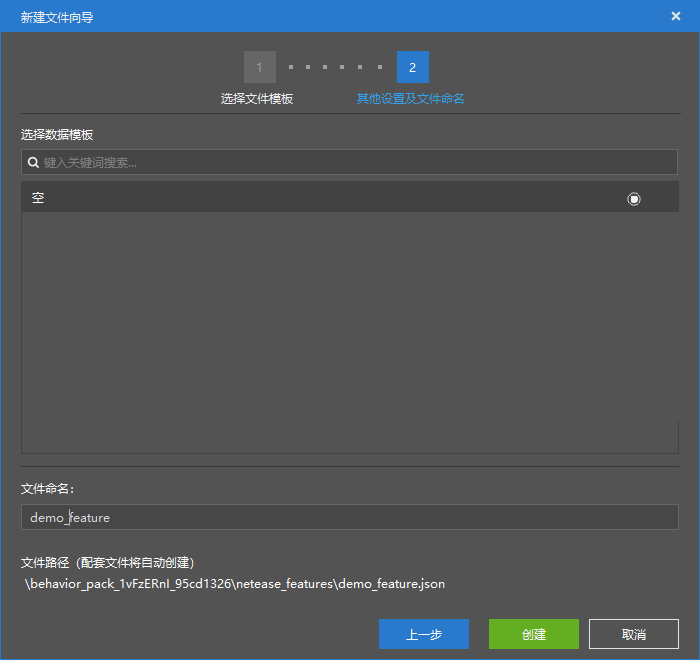
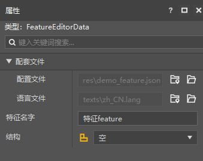
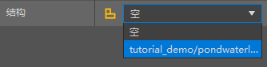

--- 
front: https://nie.res.netease.com/r/pic/20211104/69055361-2e7a-452f-8b1a-f23e1262a03a.jpg 
hard: Advanced 
time: 10 minutes 
--- 
# Get started with feature configuration 

In this section, we will get started with custom features. Let's use feature configuration to create **feature** (**Feature**, also translated as **ground objects**) to "embellish" the world. 

## Create a feature 

We create a feature through feature configuration. 

 

 

As we can see, feature properties are very simple. This is because if we choose to create features in the editor, we can only create one type of feature, called a structure feature. A structure feature supports a structure to be attached to it, and then the structure will be automatically placed when the feature is generated, thus forming a terrain or building similar to a "natural monument". 

We can attach the lake wetland structure we made in the previous chapter here. 

 

Then, a structure template feature is created. If we need it to be generated naturally, we need the feature rules discussed in the next section.