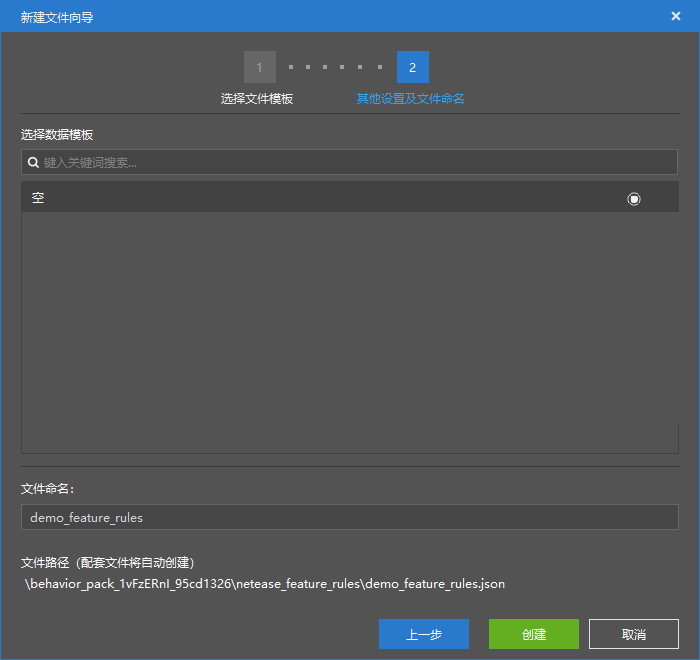
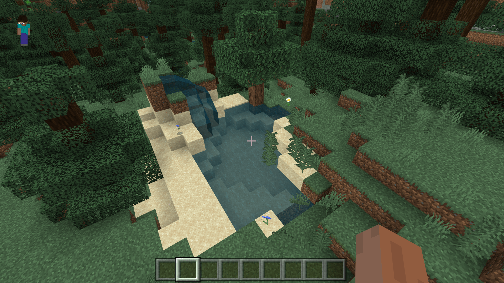

--- 
front: https://nie.res.netease.com/r/pic/20211104/69055361-2e7a-452f-8b1a-f23e1262a03a.jpg 
hard: Advanced 
time: 10 minutes 
--- 
# Get started with feature generation configuration 

In this section, we will get started with custom feature rules. Together, we will use feature generation configuration to create a feature rule that can naturally generate features. 

## Create a feature rule 

We create a feature rule through feature generation configuration. 

 

 

We can attach the feature to the "**Feature**" property column. 

 

Then we can slightly modify other properties according to our wishes. For example, we can modify the **Placement Pass** of the feature through the "**Generation Time**" property, but we don't need to modify it here because our pond is placed in the "Surface" stage. 

 

Since our pond structure is 3 blocks above the ground, we change the Y coordinate offset to -3. 

 

To avoid generating too many features, reduce the number of features in each block. 

 

In this way, we have completed the creation of a feature rule. 

 

 

We enter the game self-test and can easily find our features. However, we also found that our features are slightly different from the original structure after they are placed. That is because after our features are placed, other features are placed. Their placement stage is after the "surface" stage, such as the ice in the picture, the top layer of snow, and the gravel and sand naturally generated by the water. 

In this way, we have successfully created a feature rule! We will learn more about features in Chapter 16.