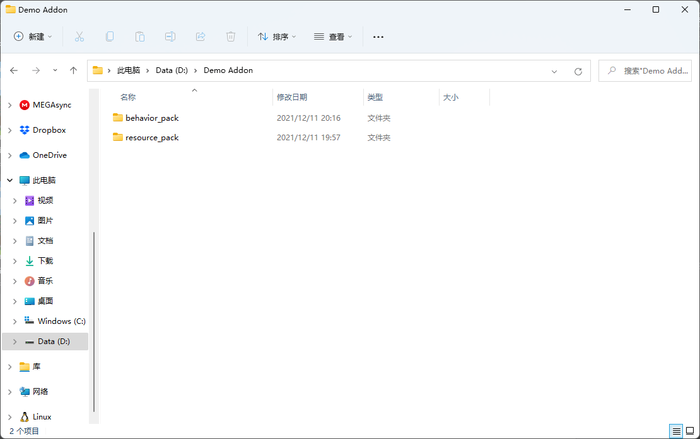
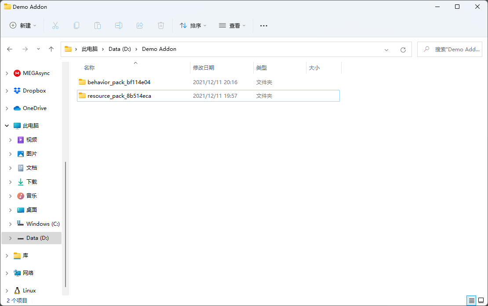
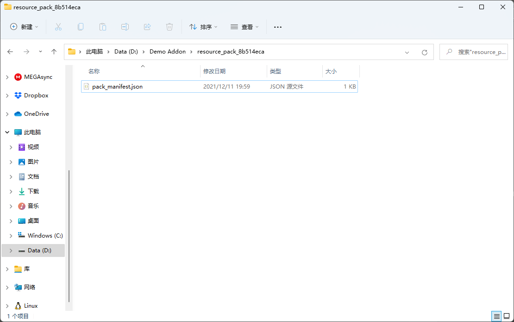
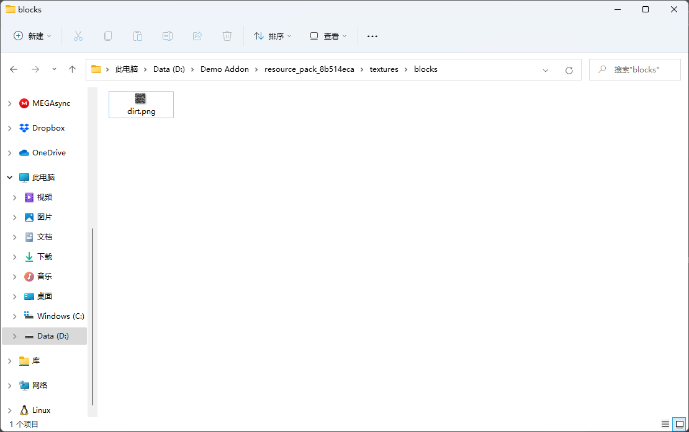
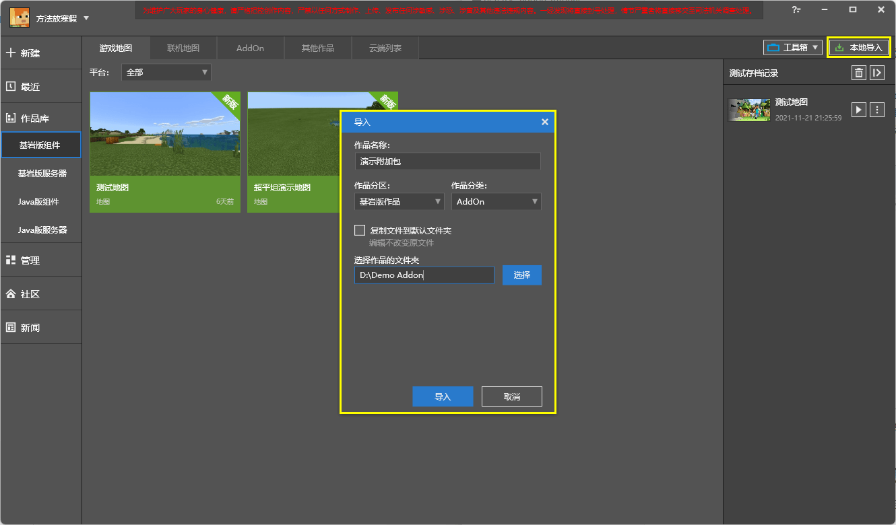
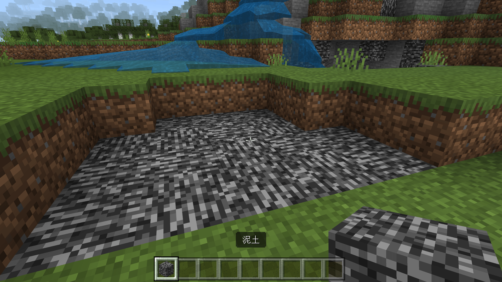

--- 
front: https://nie.res.netease.com/r/pic/20211104/69055361-2e7a-452f-8b1a-f23e1262a03a.jpg 
hard: Advanced 
time: 10 minutes 
--- 
# Challenge: Create a new add-on package by yourself 

In this section, let's complete a challenge and create an add-on package by yourself through file-level operations! 

## Create a complete add-on package 

In fact, it is very easy to create an add-on package without any functions. Because the only required file in an add-on package is the manifest file (`pack_manifest.json` or `manifest.json`), when a folder contains only a manifest file, we think that the add-on package has normal basic functions. In fact, an add-on package containing only a manifest file can be loaded by the normal game world, but it does not have any additional functions. 

However, for this reason, we first need to create the correct manifest file for the add-on. 

### Create a new workspace and manifest file 

In order to make our add-on compatible with the editor of Minecraft development work in the future, we should also pay attention to creating the folder structure of the add-on. 

 

Since we want our add-on to have both resource packs and behavior packs, we create a large folder to hold a resource pack and a behavior pack. At the same time, if we import the add-on into the Minecraft development workbench later, this folder will be used as our "workspace" folder. Therefore, we should not put anything else in this folder except resource packs and behavior packs. Here, we use `Demo Addon` as the name of our large main folder. It should be noted that in order to be able to be imported into the Minecraft development workbench later, all our folder names need to be written in **full English**. 

Next, we should create resource pack folders and behavior pack folders. In the picture above, we can see that I have created these two folders. However, we also need to pay attention to one point, that is, **the names of resource packs and behavior pack folders should not be too simple**, for example, they should not be named directly with the English names of "resource pack" and "behavior pack" as mentioned above. Because after the resource packs and behavior packs are imported into the game, the resource packs and behavior packs of different modules developed by different developers will be put together. So if a player loads a large number of modules, it is very likely that the folder names of two of them will "collide", which will lead to various potential errors. Therefore, we recommend that the names of these two folders be modified as much as possible to "only you can write it", or to use randomly generated numbers or letters to name them. This can avoid game loading failures caused by duplicate names to the greatest extent. 

 

As shown in the figure, we use two randomly generated strings of letters and numbers to rename the folders. Some people may ask, if we rename these folders to different names, how can the editor or game know which is the resource pack and which is the behavior pack? Because, whether it is the editor or the game itself, they will distinguish various add-on packs by reading the manifest file. So, next we create manifest files for resource packs and behavior packs. 

Resource packs and behavior packs need to create a manifest file respectively. We first create it in the resource pack. We open our resource pack folder. Create a new file called `pack_manifest.json`. 

 

Open the file with any text editor and enter the content of our manifest file. At this time, let's understand the format of the manifest file. 

#### Manifest file format 

The following is the format of a manifest file: 

```json 
{ 
"format_version": 1, // Number type, format version (Format Version) of the manifest file, please fill in 1 in the current Chinese version of the add-on pack. 
"header": { // Object type, the following part is the header (Header) of your add-on pack, here is the most important information of the add-on pack, all types of add-on packs must contain such a header. 
"name": "Name", // String type, the name of the add-on package. 
"description": "Main Description", // String type, the introduction of the add-on package. 
"uuid": "f61b3faf-e3f3-448d-b19a-0445f504263b", // String type, the UUID of the add-on package, the format is Version 4 UUID: xxxxxxxx-xxxx-xxxx-xxxx-xxxxxxxxxxxx, where x can be any number or any letter from a to f, and cannot be the same as other UUIDs. UUID can be obtained using the UUID generator: https://www.uuidgenerator.net/. 
"version": [0, 0, 1], // Array type, the version of the add-on, the format is "Semver", that is, [Major, Minor, Patch], which are the major version number, minor version number and revision number of the add-on, respectively, here represents version 0.0.1. 
"min_engine_version": [1, 2, 0], // Optional when the format version is "1", Array type, the minimum version of the Bedrock Engine that the add-on is compatible with, the format is "Semver". If Minecraft is lower than this version, the add-on will not work. If this value is filled in, it will affect the versioned change interface in the game, such as affecting which version of the command and Molang syntax the engine uses. 
},

"modules": [ // Array type, the following are the modules (Module) of this add-on package. One module corresponds to the function of an add-on package. There can be one module or multiple modules. However, no matter how many there are, it must be in the form of an array, and each module in it exists in the form of an object, and an add-on package requires at least one module. 
{ 
"description": "Module Description", // String type, the introduction of this module, not displayed in the game. 
"uuid": "9b75733a-cf3b-48fe-9df0-91fb4fc81dfe", // String type, the UUID of this module, which cannot be the same as other UUIDs. 
"version": [ 0, 0, 1 ], // Array type, the version of this module, in the format of "Semver". 
"type": "resources" // String type, the type of this module, represents what functions this package has. In the Chinese version of the add-on package, it can be "resources" or "data", representing resource packages and data packages respectively. 
} // Object type, the first module. 
// ... 
], 
"dependencies": [ // Optional, Array, the dependency packages of this add-on package. This package will only load normally when all the add-ons in the array are loaded. The UUID and version need to be completely corresponding. When you add the add-on package to the currently running package list in the game, if the add-on package has dependencies, its dependencies will also be automatically added to the corresponding list. It is recommended that the resource package and behavior package in the add-on package depend on each other, so as to avoid the situation where "the player only loads one of the packages" as much as possible. 
{ 
"uuid": "a0490260-2b0f-40a2-b31e-bd992ed0a14d", 
"version": [ 0, 0, 1 ] 
} // Object type, the first dependency. 
// ... 
], 
"capabilities": [ // Optional, Array type, the capabilities (also known as inherent functions) of this add-on. Currently, only the following two are available in the Chinese version of the add-on. 
"chemistry", // Allows the use of chemistry. 
"raytraced" // Allows the use of ray tracing. 
] 
} 
``` 

We can see that a manifest file is a JSON object, which has the following fields: 

- **Format Version** (**Format Version**, `format_version`): In the Minecraft add-on, almost most JSON files have a format version, which represents the version of the **Schema** used by the JSON file. In other words, the format version determines "what format" the game should use to read this JSON file. 
- **Header** (**Header**, `header`): The header is the most important information of an add-on, including the name, description and UUID. 
- **Module** (**Module**, `modules`): The module is where the type of an add-on is determined. Currently, we can use `resources` to represent resource packs and `data` to represent behavior packs in its type field. 
- **Dependency** (**Dependency**, `dependencies`): The dependency of an add-on is often also an add-on. In this case, the UUID in the dependency is the UUID of that add-on. The mutual dependency of resource packs and behavior packs is the most convenient and reliable form of filling in when making add-ons. 
- **Capability** (**Capability**, also known as **inherent ability**, `capabilities`): The inherent ability that the add-on can use. 

For example, we write the following in our resource pack manifest file: 

```json 
{ 
"format_version": 1, 
"header": { 
"name": "Resource Pack", 
"description": "A demo resource pack", 
"uuid": "f61b3faf-e3f3-448d-b19a-0445f504263b", 
"version": [0, 0, 1] 
}, 
"modules": [ 
{ 
"description": "A demo resource module", 
"uuid": "9b75733a-cf3b-48fe-9df0-91fb4fc81dfe", 
"version": [ 0, 0, 1 ], 
"type": "resources" 
} 
],

"dependencies": [ 
{ 
"uuid": "a0490260-2b0f-40a2-b31e-bd992ed0a14d", 
"version": [ 0, 0, 1 ] 
} // Dependency behavior pack 
] 
} 
``` 

We write the following in the manifest file of our behavior pack: 

```json 
{ 
"format_version": 1, 
"header": { 
"name": "Behavior Pack", 
"description": "A demo behavior pack", 
"uuid": "a0490260-2b0f-40a2-b31e-bd992ed0a14d", 
"version": [0, 0, 1] 
}, 
"modules": [ 
{ 
"description": "A demo behavior module", 
"uuid": "426f64e6-f008-4965-8a80-ce1bf4184321", 
"version": [ 0, 0, 1 ], 
"type": "data" 
} 
], 
"dependencies": [ 
{ 
"uuid": "f61b3faf-e3f3-448d-b19a-0445f504263b", 
"version": [ 0, 0, 1 ] 
} // Dependency resource package 
] 
} 
``` 

In this way, our two manifest files are completed! 

### Add other folders 

In fact, once the manifest file is available, an additional package can work normally. However, we can still add some folders we need. For example, if we need to create entities next, we can create an `entity` folder in the resource pack and an `entities` folder in the behavior pack. 

Here, for demonstration purposes, we tried to create all the files and folders. Developers can choose the folders they need to create according to their needs. After we create the folders, it is as follows: 

```shell 
DEMO ADDON 
├─behavior_pack_bf114e04 
│ │ pack_icon.jpg 
│ │ pack_manifest.json

│ │
│ ├─animations
│ ├─animation_controllers
│ ├─biomes
│ ├─blocks
│ ├─config
│ ├─customBook
│ ├─entities
│ ├─features
│ ├─feature_rules
│ ├─functions
│ ├─Galaxy
│ │ ├─Macro
│ │ └─Template
│ ├─items
│ ├─loot_tables
│ ├─netease_biomes
│ ├─netease_blocks
│ ├─netease_dimension
│ ├─netease_effects
│  ├─netease_enchants
│ ├─netease_features
│ ├─netease_feature_rules
│ ├─netease_group
│ ├─netease_items_beh
│ ├─netease_micro_blocks
│ ├─netease_recipes
│ ├─netease_tab
│ ├─Parts
│ ├─Presets
│ ├─recipes
│ ├─Script_xxx
│ ├─spawn_rules
│ ├─storyline
│ │ └─level
│ ├─structures
│ ├─texts
│ └─trading
└─resource_pack_8b514eca
    │  biomes_client.json
    │ blocks.json
    │pack_icon.jpg
    │ pack_manifest.json
    │ sounds.json
    │
    ├─animations
    ├─animation_controllers
    ├─attachables
    ├─effects
    ├─entity

    ├─font
    ├─items
    ├─materials
    ├─models
    │ ├─animation
    │ ├─editor_materials
    │ ├─effect
    │ ├─geometry
    │ ├─mesh
    │ ├─netease_block
    │ └─skeleton
    │
    ├─netease_items_res
    ├─particles
    ├─render_controllers
    ├─shaders
    │ ├─glsl
    │ └─hlsl
    ├─sounds
    ├─texts
    ├─textures
    │ │ terrain_texture.json
    │ │ │ ├─blocks 
│ ├─entity 
│ ├─items 
│ ├─models 
│ ├─particle 
│ ├─sfxs 
│ └─ui 
└─ui 
``` 

## Try to modify the block texture 

We try to modify the texture of a block to another map, and then import it into the game to verify whether our package can work successfully. 

We learned that the texture of the original dirt block is located in the `dirt.png` file in the `textures\blocks` folder of the resource package. We might as well replace it with the texture of the bedrock. We find the texture of the bedrock from the original template package, rename it to `dirt.png` and copy it to the `textures\blocks` folder of our resource package. As shown in the figure: 

 

In this way, we have replaced a texture of the original version. Next, we need to enter the game to verify. 

## Import into the Minecraft Development Workbench and verify the effect 

In order to verify the effect, we need to import our add-on package into the Minecraft Development Workbench first. 

We open the Minecraft Development Workbench, switch to the "**Library**" tab, click the "**Local Import**" button in the upper right corner, and an "Import" dialog box will pop up. We enter the "Work Name" and select the Bedrock Edition "Add-on Package" in the "Work Category". Then enter or "select" the add-on package workspace folder we started with into the address bar at the bottom. Click the "**Import**" button to successfully import the work. 




Then, we can open the editor or directly enter the development test for self-testing as usual. 

 

We can see that the texture of our dirt has all been changed to the texture of bedrock! This means that our add-on pack production has been successful! Next, developers can further create other add-on pack content at the file level according to their wishes.