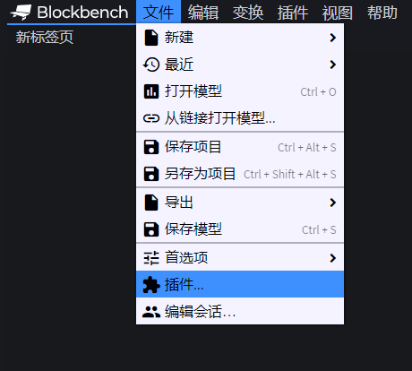
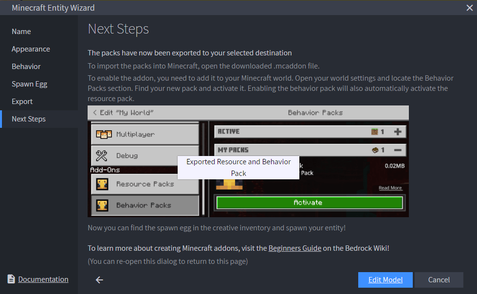
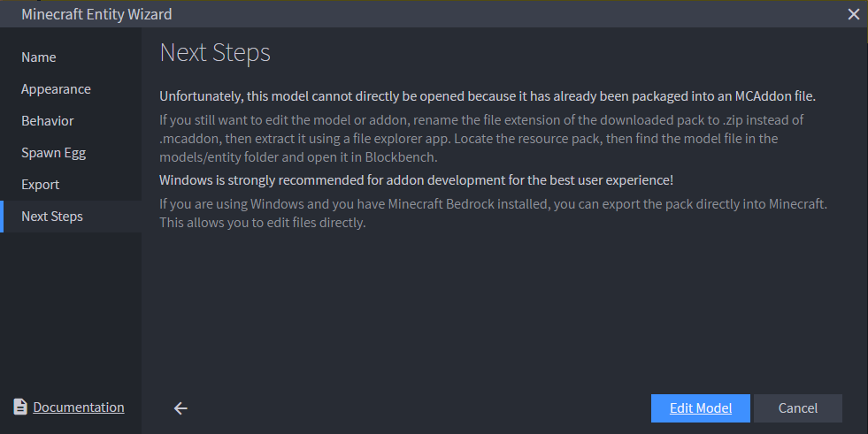
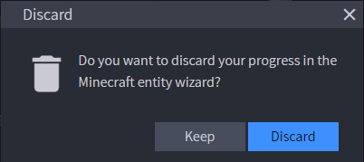
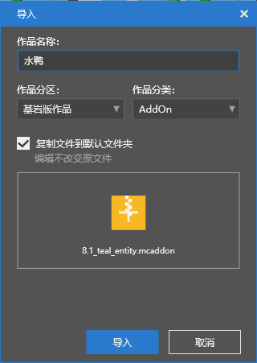
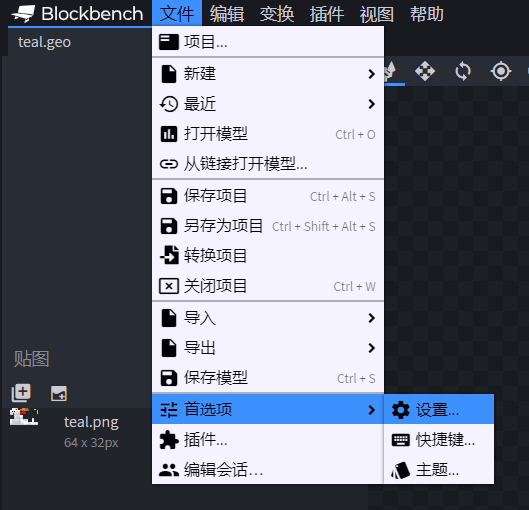
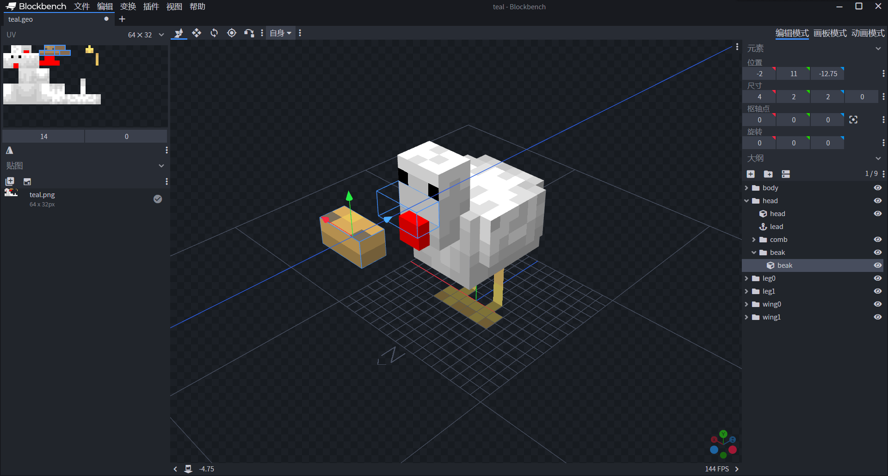
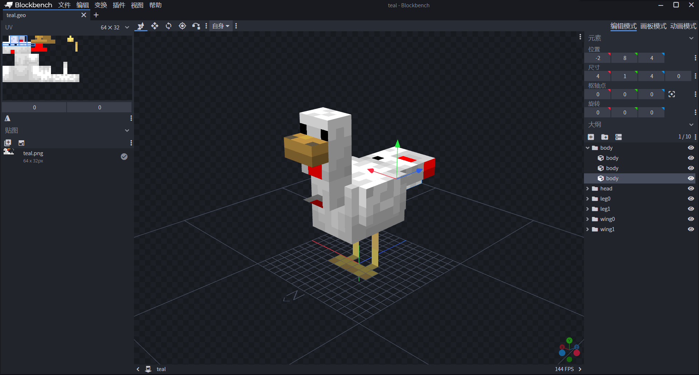

--- 
front: https://nie.res.netease.com/r/pic/20211104/69055361-2e7a-452f-8b1a-f23e1262a03a.jpg 
hard: Advanced 
time: 20 minutes 
--- 
# Use Blockbench to modify the geometry of the chicken 
Blockbench is a community-developed entity model and animation software with very powerful functions and very high popularity. If we want to customize the entity of a simple pixel-style model, Blockbench is our best choice. What's more helpful is that there is an official Microsoft plug-in in Blockbench - **Minecraft Entity Wizard for Blockbench** (literally **My World Entity Wizard for Blockbench**). This plug-in can greatly simplify the entity development process for novice developers. Through this wizard, we can quickly create a new entity with the original entity as a template, and directly use Blockbench's excellent model and animation functions to change the model, animation, and even draw textures for the entity. After that, the entity can be directly exported for loading in the game. 

Therefore, in this section, we will use the Minecraft Entity Wizard plug-in to create a new entity. Let's use the chicken as a template to create a teal (Teal, Mallard) entity. 

## Install the Minecraft Entity Wizard plug-in 

Everyone who has read the "Introduction to Community Tools" in Chapter 3 must have known the installation address or web application website of Blockbench. Next, we assume that everyone has installed Blockbench, and we will install the official Microsoft Minecraft Entity Wizard plug-in in Blockbench. 

 

We find "**File**" -> "**Plugins...**" in the menu bar and click the button to open the plug-in installation window. 

 

In the new window, click the "**Available**" tab above, and you can see the Minecraft Entity Wizard plugin. Click "**+Install**" in the upper right corner of the plugin panel. 

 

Wait a few seconds, and you will see a prompt message that the installation is successful. Next, you can use the plugin in the menu bar "**Plugins**" -> "**Minecraft Entity Wizard**"! 

 

## Create a new entity named Teal 

 

Open the Minecraft Entity Wizard plugin, and click **"Let's Go!"** to start creating a new entity. In the wizard, you can use the "Next" and "Back" buttons at the bottom to go back and forth respectively. 

 

First, the "Name" tab, where you should fill in the name and identifier of the entity. 

- **Display Name**: The display name of the entity, which will appear on the spawn egg name, in the chat bar and other related interfaces. This name is automatically localized, so please use the English name, and developers can later create a `zh_CN.lang` file to fill in the corresponding Chinese name. 
- **Identifier**: The **Identifier** (**ID**) uses the **Namespaced Identifier** (**NSID**) format, that is, the format of `<namespace>:<identifier>`. Here we use the namespace of `tutorial_demo` and use `tutorial_demo:teal` as the identifier. 

 

After clicking "Next", we enter the "Appearance" tab, where we select the geometry and texture of an entity as the initial appearance of your entity. Since we are making a teal, we choose the geometry and texture of "Chicken". 

 

Next, we enter the "Behavior" tab. This is where we say whether our new entity uses the same behavior as the original one or the behavior of another entity. Please note that some behaviors are often bound to geometric models. If irrelevant behaviors are used, it may lead to a series of problems such as no animation. Therefore, we recommend that beginners choose "**Same Behavior**" instead of "**Different Behavior**".

 

In the fourth step, we entered the "**Spawn Egg**" tab. There are three options here. 

- **Colors**: This is the first option. With this option, you can use the **Mask** entity's spawn egg as a mask to customize the spawn egg of your desired color. Our demo also uses this option. 
- **Custom Texture**: The second option allows developers to use a prepared texture map as the spawn egg map. 
- **None**: There is no spawn egg, and the entity can only be summoned by commands, etc. 

 

Finally, we entered the "**Export**" tab. Here we export our entity. 

- **Export to Folder**: **International version feature, not applicable to the Chinese version. ** Only available when the client has Blockbench installed and the international version exists on the computer at the same time, directly export the package to the international version's development folders `development_resource_packs` and `development_behavior_packs`. 
- **Integrate into Pack**: **International version feature, not applicable to the Chinese version. ** Only available when the client has Blockbench installed and the international version exists on the computer at the same time, directly integrate the entity into the currently existing package in the international version's working folder. 
- **Export as MCAddon**: A general option. Since Minecraft Entity Wizard does not support direct export to the Chinese version working environment, this option is also **the option we want to use here**, please make sure the option is switched to this. After we fill in the "Pack Name", "Pack Author(s)" and "Pack Icon", click the "Export" button to export it as an MCAddon file. That is, a file with the extension `.mcaddon`. 

 

After the export is successful, we come to the final "Next Steps" tab. Since we used Export as MCAddon, we actually do not need any subsequent steps. Even if we click "Edit Model", we cannot continue to edit the model in Blockbench because we have exported it as an MCAddon file. 

 

In order to continue editing the model in Blockbench, we need to unzip the MCAddon file, which is essentially a ZIP file. We might as well import it directly into the Minecraft Development Workbench, so that the file will be automatically unzipped and enter our working environment. 

 

Temporarily close the Minecraft Entity Wizard. At this time, we will encounter a pop-up window asking us whether to keep the entity in the Minecraft Entity Wizard. Since we have successfully exported it, we click "**Discard**". If you want to continue using this entity the next time you open the Minecraft Entity Wizard, you can select "**Keep**". 

### Import to Minecraft Development Workbench and reopen the model in Blockbench 

We open the Minecraft Development Workbench and click "Local Import" in the upper right corner of the "Library" tab. 

 

We select "**Copy files to default folder**" and find the package we just exported. After editing the name of the work, click the "**Import**" button. 

 

At this point, we can see our additional package in the editor. Find it and **right-click** or click the "**More**" button, and then click the "**Open Directory**" button. Now we can open the directory of the package. 

 

Copy or remember its address path, then go to Blockbench, click "File" -> "Open Model" in the menu bar, and find the path. 

 

Locate the `models/entity` folder under the resource pack and find a file with the suffix `geo.json`, which is our model geometry file. Double-click to open the file. At this point, we can see that our current "tear entity but chicken" appears in the central **Viewport**. 

## Using the "Move", "Size" and "Rotate" tools 

Before moving, scaling and rotating, we should first understand how to operate the view in the viewport. Before operating the view, we recommend turning on a special grid, which will help us intuitively feel the size of the model. 

Find "**File**" -> "**Preferences**" -> "**Settings...**" to open the settings window. Find the "**Grid**" tab and click the "**Large Grid**" option to turn it on. 

 

 

Then we can see that we have expanded a larger **Grid**. This grid is the square grid. Each square area in the grid is "one square size"; and each small square in the central grid is "1/16 square size". In the original pixel-style Minecraft, this is the size of a pixel. 

 

At this point, we can start operating the observation window. We have three basic methods of operation. 

- **Left mouse button**: Drag the view to rotate your **Camera** around the center. The position of the camera in the model space is the position of your observation window. You can think of it as you are observing the chicken through this camera. 
- **Right mouse button**: Drag the view to move the **Floor** of the model up, down, left, and right. The floor is the surface represented by the grid line under the chicken's feet, which is the model base plane. 
- **Mouse wheel**: Zoom the view, that is, **Zoom in** or **Zoom out** your camera relative to the model. Equivalent to the **Zoom** of the camera. 

Now, let's focus on the **Toolbar** in the upper left corner of the observation window. On the far left of the toolbar, we have three basic tools, namely "Move", "Size" and "Rotate". These three tools may seem unfamiliar to everyone, but in fact, we have already come into contact with them in disguise in the editor of the Minecraft Development Workbench. 

First of all, we first understand that in a model, whether it is a cube, a mesh or a group, etc., we call it an element. 

 

 

- **Move**: **Move** an element. This is similar to the movement after selecting an area in the level editor. We can move along the axis by pressing the corresponding axis in the small coordinate system. 

 

 

- **Size**: **Resize** an element. This is similar to moving the selection in the level editor, which can change the size of the selection, except that here you drag the corresponding axis to change the size. 

 

 

- **Rotate** an element. The rotation coordinate system is spherical, and its center is located at the **pivot point** (also translated as **pivot point**) of the element. The pivot point is the relative position point of an element's rotation. Drag the corresponding axis at the pivot point to rotate in the corresponding direction. As we can see in the figure, the pivot point of the chicken's mouth cube is actually in the middle of the chicken's feet.

## Redesign the teal model based on the chicken model 

Since one of the main features of the mallard is its long neck, we raise the chicken's neck and increase the Y of the "position" of the neck `head` cube from 6 to 9. At the same time, the duck does not have the red flesh of the chicken, so we remove the red cube. Then move the `beak` cube (i.e. the beak) to a position close to the raised eye. 

The duck has a longer tail than the chicken, so we put two new cubes in the `body` group to simulate the tail. Move the first cube as the big tail to (-3, 9, 4) and scale it to (6, 2, 5). The pivot point is now at (0, 0, 0). Move the second cube as the small tail to (-2, 8, 4) and scale it to (4, 1, 4). The pivot point is now at (0, 0, 0). 

At this point we have completed the geometry of the duck! Press `Ctrl+C` in time to save the geometry file. However, you can see that our texture has changed strangely due to our movement and scaling. Don't worry, this is because moving and scaling does not automatically change the texture, so in the next section, we will redraw a new texture together.