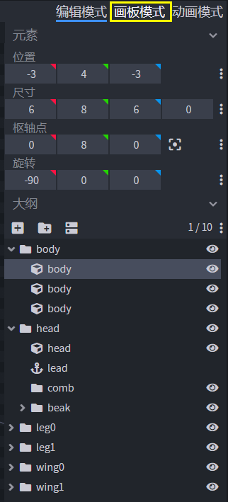
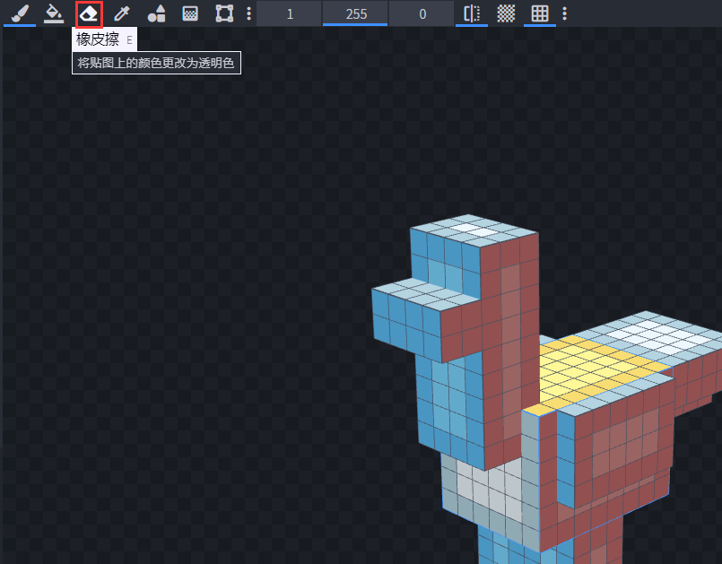
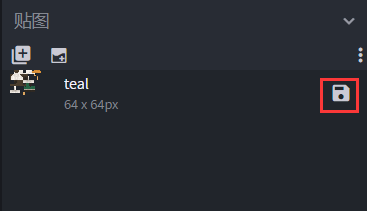
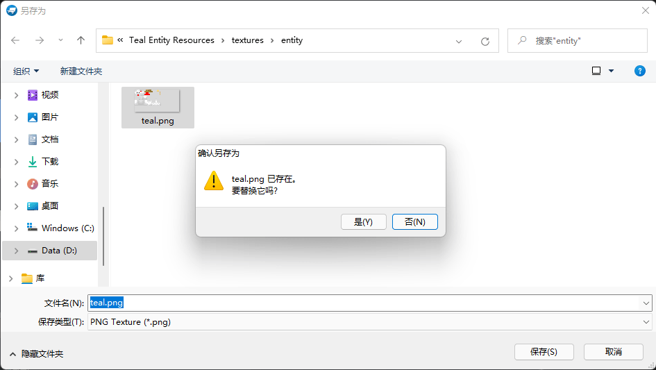

--- 
front: https://nie.res.netease.com/r/pic/20211104/69055361-2e7a-452f-8b1a-f23e1262a03a.jpg 
hard: Advanced 
time: 15 minutes 
--- 
# Draw a duck map for the model on Blockbench 

In this section, we will make a texture map for the teal. In the previous section, we have made a teal model, but unfortunately, because we changed the size of some cube faces, the old texture is no longer applicable. Let's redraw a texture. 

## Create a new texture map 

We locate the texture bar on the left and right-click to delete the original texture map. We can see that the teal has now become the default dyed state without a texture map. 

 

Next, we click the "**Create Texture**" button to create a new texture map. 

 

 

We change the "Type" to "Texture Template", so that we create a template texture file with each face of each cube automatically colored. 

 

## Coloring, absorbing and desaturating the teal 

Now, we can color the teal. We select "Artboard Mode" in the mode selection menu in the upper right corner. 

 

At this point, pixel grid lines will appear in our viewing window, and a panel with "**Color Picker**" and "**Palette**" sub-panels will appear in the mode panel on the right. At the same time, our mouse pointer will become a "brush" in the preview window, and we can **color** each pixel by clicking it. At this time, we are using the "**Brush**" tool. 

Under the "Color Picker" sub-panel on the right side of the screen, we click a button similar to an eyedropper, which is our "**Color Picker**". 

 

After that, our mouse pointer will become a color picker window for us to **pick colors**. When we click the mouse, the color at the mouse position will appear in the color picker panel on the right for our subsequent use. 

 

In the toolbar above the preview window, we can also find a tool called "**Color Picker**". The function of this color picker is the same as the color picker on the right side of the screen, but it allows us to pick colors multiple times. 

 

In the toolbar above the preview window, we can select the "**Eraser**" tool. At this time, our mouse cursor will have the ability to erase pixels, so we can **decolorize** 

## Use mirror mode to speed up drawing 

 

We find "Mirror Painting" in the toolbar above the preview window. Click the tool to open it permanently. At this time, when we color or decolorize in the preview window, all the textures on both sides of the mirror will change differently. In this way, our workload can be reduced by half instantly, which can help us complete the painting more quickly. 

## Save the map 

 

Finally, we have completed the painting of the map. At this time, we must save our texture map in time, otherwise, once Blockbench is closed, our work will be lost. 

 

 

Find the save button on the right side of the texture map. Simply replace our previous chicken map! Open Blockbench again, select the recently opened file Teal, and we can see the complete Teal appears in front of us! 

