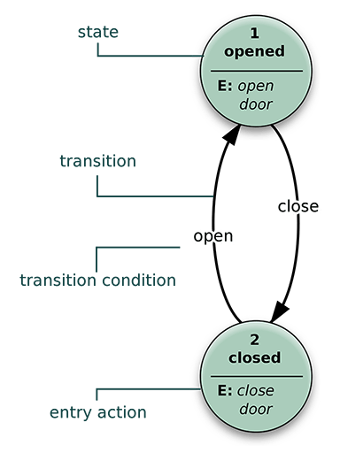

--- 
front: https://nie.res.netease.com/r/pic/20211104/69055361-2e7a-452f-8b1a-f23e1262a03a.jpg 
hard: Advanced 
time: 30 minutes 
--- 
# Explore entity resource control 

In this section, we will learn about various client-related files, concepts, and how to write them. 

## What is an entity definition file 

Each entity needs to be "defined" before it can be registered in the game for us to play. The entity definition file is a JSON file for developers to "define" in the process of customizing entities. If you have read the previous chapters, you will realize that entity definition files appear in pairs. There is a client definition file in the resource pack and a server definition file in the server. There are no entity components in the client definition file, so all components (representing various behaviors of the entity) are located in the server definition of the entity. The client definition file of the entity is mainly used to register various **Resource Control** functions of the entity. Here we focus on the **Client Definition File** of the entity. 

Let's take a look at the client definition file of the duck entity we made in the last two sections. In order to better illustrate the functions in the file, we added some empty fields. 

```json 
{ 
"format_version": "1.10.0", // format version 
"minecraft:client_entity": { 
"description": { 
"identifier": "tutorial_demo:teal", // identifier 
"min_engine_version": "1.12.0", // minimum engine version 
"materials": { 
"default": "chicken", 
"legs": "chicken_legs" 
}, // materials 
"textures": { 
"default": "textures/entity/teal" 
}, // textures 
"geometry": { 
"default": "geometry.teal" 
}, // geometry 
"animations": { 
"move": "animation.teal.move", 
"general": "animation.teal.general", 
"look_at_target": "animation.common.look_at_target", 
"baby_transform": "animation.teal.baby_transform" 
}, // Animation and animation controller 
"scripts": { 
"animate": [ 
"general", 
{ 
"move": "query.modified_move_speed" 
}, 
"look_at_target", 
{ 
"baby_transform": "query.is_baby" 
} 
]

}, // Script 
"render_controllers": ["controller.render.chicken"], // Rendering controller 
"particle_effects": { 
}, // Particle effects 
"sound_effects": { 
}, // Sound effects 
"spawn_egg": { 
"base_color": "#62c287", 
"overlay_color": "#87692b" 
} // Spawn egg 
} 
} 
} 
``` 

Let's study each part of the client entity definition one by one. First of all, we must make it clear that the client entity definition file is a file used to control the **resource** (**Resource**) of the entity. The resources here refer to the broad sense of resources, that is, all resource package contents including textures, models, particles, sound effects, and animations. The entity definition file is the "commander" who "coordinates" these contents. 

- `format_version`: This is the **Format Version** of the entity file. The format version of a JSON file is often a field used to determine the JSON structure of the file. For the entity client definition file, its format has two versions, `1.8.0` and `1.10.0`. We recommend using the `1.10.0` version here because it contains more features, such as simpler conditional control animation execution. 
- `minecraft:client_entity`: The schema identifier of the client entity, which must be used as the key name in the client entity definition file. There is only one `description` object under it. 

We can see that the `description` object is the main body of the file. All client entity functions are defined under the `description` object, which is called the **Description** of the entity client definition. Next, we want to learn the functions of each field of the `description` object together. But before that, we need to introduce a pair of concepts: **Short Name** and **Full Name**. 

**Short Name** (also known as **Friendly Name**, **Friendly Name**, or **Entity Internal Name**) is a "short name" or "alias" used in entity client definitions. Since we need to frequently reference some resources, such as animations, particles or textures, and geometric models in resource control files such as animation controllers and rendering controllers, in order to avoid the tedious writing of long full names (such as assigning namespace identifiers), we use short names to call various resources. We call the process of writing the identifier of each resource in the entity definition file **Attach** to the entity, so each full name will be assigned a short name when it is attached to the entity. For example, in the above texture attachment `"default": "textures/entity/teal"`, `textures/entity/teal` is the full name of the texture, which is the full resource path for the texture, and `default` is the short name, which is the "shortcut" name that will be used in other resource files. 

Below we introduce the fields in the description object `minecraft:client_entity/description` one by one. 

- `identifier`: string, the namespaced identifier of the entity, in the format of `<namespace>:<identifier>`, which needs to be the same as the identifier in the server-side entity in the behavior pack. 
- `min_engine_version`: optional, string, the minimum engine version of the definition file. The minimum engine version determines how the engine parses the definition file. This "how to parse" has nothing to do with the format, and refers to the method by which the engine recognizes the fields in the file, such as which Molang expression grammar to use to parse the Molang expressions in the file. At the same time, if this field is defined, the engine will automatically compare it with the minimum engine version in the manifest file during parsing, and only entities with a minimum engine version lower than the minimum engine version in the manifest file will be successfully defined. When there are multiple entity definition files with the same `identifier`, only the entity with a lower engine version than the minimum engine version in the manifest file and closest to it will be successfully parsed and defined (that is, the highest one among those lower than the minimum engine version in the manifest file will be parsed). 
- `materials`: optional, object, where each field is in the format `"short_name": "full_name"`, all **Material** attached to this entity. The full name is the material name defined in the `materials/entity.material` file. 
- `textures`: optional, object, where each field is in the format `"short_name": "full/name"`, all **Texture** attached to this entity. The full name is the texture's path relative to the resource pack root (without the texture's extension). 
- `geometry`: optional, object, where each field is in the format `"short_name": "full.name"`, all **Geometry** of models attached to this entity. The full name is an identifier defined in a file in the `models` folder. 
- `animations`: optional, object, where each field is in the format of `"short_name": "full.name"`, all **Animation** and **Animation Controller** attached to the entity. The full name is the identifier defined in the file in the `animations` or `animation_controllers` folder. 
- `scripts`: optional, object, the pseudo-script part of the Molang expression in the entity definition, which can be used to define the entity variables, initialization expressions, pre-animation expressions and the most important animation playback condition expressions of the entity. The `animate` array in the example is an array of animation playback condition expressions, which sets the playback conditions for each animation or animation controller defined in `animations`. 
- `render_controllers`: optional, array, where each element is in the format of `"full.name`, all **Render Controller** attached to the entity, whose full name is the identifier defined in the file in the `render_controllers` folder. Note that the render controller only has full name hooks, no short name definitions. 
- `particle_effects`: optional, object, where each field is in the format of `"short_name": "my_namespace:full_name"`, all **Particle** effects hooked on this entity. The full name is the identifier defined in the file in the `particles` folder. 
- `sound_effects`: optional, object, where each field is in the format of `"short_name": "full.name"`, all **Sound Effect** hooked on this entity. The full name is the sound event name defined in the `sounds/sound_definitions.json` file. 
- `spawn_egg`: optional, spawn egg icon or custom color, no more details. 

## Preliminary understanding of animation format 

Let's first learn about **Animation** files together. Animation is actually a function used to make an entity "move". Multiple animations can be defined in an animation file. The basic format of animation is as follows: 

```json 
{ 
"format_version": "1.8.0", // The format version of the animation 
"animations": { 
"animation.some_entity.anim1": { 
// ... 
}, // The first animation 
"animation.some_entity.anim2": {

// ... 
}, // The second animation 
"animation.some_entity.anim3": { 
// ... 
} // The third animation 
} 
} 
``` 

We can see that the `animations` field used to define animations is an object. The key of each field in the object (for example, `animation.some_entity.anim1`) is an animation identifier, and its value is the animation defined by the identifier. The format version used by the animation is `1.8.0`, and there is only one format version for animations at present. 

Let's continue to take the animation in the teal entity generated in the first section as an example. 

```json
{
  "format_version": "1.8.0",
  "animations": {
    "animation.teal.baby_transform": {
      "loop": true,
      "bones": {
        "head": {
          "scale": 2
        }
      }
    },
    "animation.teal.general": {
      "loop": true,
      "bones": {
        "wing0": {
          "rotation": [0, 0, "variable.wing_flap-this"]
        },
        "wing1": {
          "rotation": [0, 0, "-variable.wing_flap-this"]
        }
      }
    },
    "animation.teal.move": {
      "loop": true,
      "anim_time_update": "query.modified_distance_moved",
      "bones": {
        "leg0": {
          "rotation": ["math.cos(query.anim_time*38.17)*80.0", 0, 0]
        },
        "leg1": {
          "rotation": ["math.cos(query.anim_time*38.17)*-80.0", 0, 0]
        }
      }
    }
  }
}

``` 

We can see that three animations are defined here, namely `animation.teal.baby_transform`, `animation.teal.general` and `animation.teal.move`, which are the scaling animation of the teal's larvae when they grow up, the general wing swinging animation and the swinging animation of the feet when moving. 

First, we can see that the `loop` field in the three animations is `true`, which means that they are played in a loop. If we change it to `false`, the animation will only be played once. Of course, this looping means that the animation will be played repeatedly with its duration as a cycle, but in fact, the duration of the above three animations is "instant", because they do not set **keyframes**, so their duration is a single frame. The loop at this time means that the animation is played once for each frame, and the Molang expression in the animation will therefore be recalculated once for each frame to determine the new value. 

There is a `bones` field in all three animations, which is the animation definition for each **bone** (**Bone**). The bone name here corresponds to the bone name in the model geometry of the entity. However, it is worth noting that not every bone must be assigned an animation here, and if an animation is defined for a non-existent bone, it is harmless because the animation of the non-existent bone will be ignored by default. 

For each bone, such as the head bone in animation.teal.baby_transform, their **Position**, **Rotation**, and **Scale** animations can be defined separately. We use `position`, `rotation`, and `scale` to define these three attributes respectively. Position is the position of the bone relative to the pivot point, rotation is the rotation angle of the bone relative to the pivot point, and scale is the multiple of the bone's scale. This corresponds to the meaning of these three attributes in the model geometry, except that through the definition here, these three attributes can be "animated". We call position, rotation, and scale the three **Channel** of the entity, and the process of defining the values of these three channels separately here is called **Channel-wise** definition. At the same time, it should be noted that, like the bones mentioned above, not every channel must be defined. For example, in the teal example, the animation only defines the change of the scale channel of its `head` bone to 2. At the same time, since there are no keyframes defined here, and there is an animation loop, the result is that as long as the animation is still playing, the scale of the three axes of the teal's head will continue to double (every frame). 

Above, we repeatedly mentioned a word - **Key Frame**. So, what is a keyframe? In the teal example, we don't see any information about keyframes, because none of the three animations of the teal exported in Blockbench have keyframes defined. Let's now change the first animation of the teal to a form with defined keyframes and then use it as an example. 

```json 
"animation.teal.baby_transform": { 
"loop": true, 
"bones": { 
"head": { 
"scale": { 
"0.0": 2, 
"0.5": 1, 
"1.0": 2 
} 
} 
} 
} 
``` 

Now we can see that the scale channel is no longer a value, but an object. The key name of the object is a decimal, and the value is a scale value. At this point, we have a scale channel with keyframes. A keyframe is a key node in seconds on the animation playback timeline. We can define several keyframes to specify the state of a channel of a certain bone of the animation at certain time points, and the value between two keyframes is linearly interpolated by default. For example, the values at 0.25 and 0.75 in the above example should be the midpoint value of 2 and 1, 1.5. Of course, if the `lerp_mode` field is defined, other interpolation methods can also be used, such as Catmull-Rom smooth interpolation, such as smooth interpolation at 0.5: `"0.5": {"post": 1, "lerp_mode": "catmullrom"}`. After the keyframes of the animation are defined, the duration of the animation is no longer the instant of one frame, but becomes the time represented by the maximum keyframe, such as the duration of the above example animation is 1.0s. 

At this point, let's look back at the animations that do not define keyframes. These animations actually have keyframes. The engine will define a keyframe with a length of one frame for these animations at 0.0, so the length of these animations themselves is also one frame. But as long as it is combined with the `loop` loop, it can always keep the state of this frame of the animation. 

In addition, whether it is the value set directly by a single channel or the value in a keyframe, whether it is to set the state of three axes at the same time through a value, or to set each axis separately by writing a three-element array, we can use **Molang Expression** to specify this value. For example, the above `variable.wing_flap - this`, `query.modified_distance_moved` and `math.cos(query.anim_time * 38.17) * 80.0` are all Molang expressions. They obtain a final output value by querying the member or flag of the entity, referencing the global parameter, reading the value of the entity variable, and then combining various mathematical operations and mathematical functions. Such a value can break away from the limitations of linear interpolation of keyframes, making the animation smoother and "curved". We will explain more about Molang in Chapter 12. 

The animation of an entity is defined by bone, while the bone is defined by channel, and the channel is defined by keyframe. This way of defining the animation of an entity is called **Hierarchical**.

```shell 
EntityAnimation: animation name 
__BoneAnimation[]: the name of the bone used by the animation 
____AnimationChannel[]: the rotation, scale and translation of the animation 
______KeyFrame[]: the value of the channel at a specific point in time 
``` 

### Playing animations 

The conditions for playing each animation are defined under `scripts/animate` in the entity definition file description. If the short name of the animation is written directly, it means that the animation will start playing as soon as the entity appears in the world. If a statement controlled by a Molang expression such as `{ "baby_transform": "query.is_baby" }` is used, it means that the animation will only be triggered when the Molang expression returns true. For example, this sentence means "if the entity is a baby (`query.is_baby` returns 1.0), then play the `baby_transform` animation. This function of controlling animation playback through Molang expressions is called **Conditional Control** of animation. 

## Preliminary understanding of animation controller 

We learned about conditional control of animation above and learned that we can actually trigger an animation under certain conditions. So in this case, what is the significance of animation controller? Are there any other control methods to make animation playback more advanced? The answer is yes, and that is the state machine. 


Before explaining the state machine in detail, let's imagine a situation. Let's imagine a door. If a variable `flag` is `opened` and the door is closed, we want to open the door. If `flag` is `closed` and the door is open, we want to close the door. We can abstract this process as follows. 

> The door has two states. State 1 represents the door is closed, and state 2 represents the door is open. When the door is in state 1, if the flag `flag` is updated to `opened`, we want to transfer the door to state 2 and play an animation of opening the door. When the door is in state 2, if the flag `flag` is updated to `closed`, we want to transfer the door to state 1 and play an animation of closing the door. 

This process can be represented by a picture: 

 

This is the simplest **State Machine**. The **Animation Controller** is a state machine that can be attached to a Minecraft entity. Each situation in the state machine can be called a **State**, and the operation of the state machine is the process of transferring from one state to another, and then from another state to a third state. We call this process **State Transition**. In the animation controller, each state can play one or more animations, as well as particles, special effects, and sound effects. In the animation controller on the server, we can even execute commands when entering and leaving a state. The entity's animation controller provides us with unlimited possibilities through the operation mode of the state machine. 

Our teal entity isn't complex enough to use an animation controller, so we'll use the vanilla iron golem's animation controller as an example: 

```json 
{ 
"format_version" : "1.10.0", 
"animation_controllers" : { 
"controller.animation.iron_golem.arm_movement" : { 
"initial_state" : "default", 
"states" : { 
"attack" : { 
"animations" : [ "attack" ], 
"transitions" : [ 
{ 
"default" : "variable.attack_animation_tick <= 0.0" 
} 
] 
}, 
"default" : { 
"animations" : [ "move" ], 
"transitions" : [ 
{ 
"attack" : "variable.attack_animation_tick > 0.0"
            },
            {
              "flower" : "variable.offer_flower_tick"
            }
          ]
        },
        "flower" : {
          "animations" : [ "flower" ],
          "transitions" : [
            {
              "attack" : "variable.attack_animation_tick > 0.0"
            },
            {
              "default" : "variable.offer_flower_tick <= 0.0"
            }
          ]
        }
      }

}, 
"controller.animation.iron_golem.move" : { 
"initial_state" : "default", 
"states" : { 
"default" : { 
"animations" : [ 
{ 
"walk" : "query.modified_move_speed" 
}, 
"look_at_target" 
] 
} 
} 
} 
} 
} 
``` 

Similar to animation, an animation controller file can also define multiple animation controllers. For example, two animation controllers are defined here: `controller.animation.iron_golem.arm_movement` controls the movement of the arm, while `controller.animation.iron_golem.move` controls the overall movement. The format versions of the animation controller are `1.8.0` and `1.10.0`. It is recommended to use the animation controller in `1.10.0` format. 

`initial_state` represents the initial **default state** of the controller from the beginning of playback. In the first controller `controller.animation.iron_golem.arm_movement`, we see the `default` state. The `default` state will play the animation `move`. From the definition file of the iron golem animation, we can see that this animation is the movement of the bones corresponding to the two arms of the iron golem. There are two state transition conditions here, namely `variable.attack_animation_tick > 0.0` and `variable.offer_flower_tick <= 0.0`. The animation controller **checks each condition **from top to bottom** in order for each frame. Once a condition is found to be met, it will start to transfer. At this time, the conditions that have not been checked will be skipped. 

Assuming that our first condition is met, we will transfer to the `attack` state at this time. The `move` animation of the `default` state will stop playing and play the `attack` animation defined here instead. When `variable.attack_animation_tick <= 0.0` is true at a certain moment, we will transfer back to the `default` state. 

Next, let's focus on the second controller `controller.animation.iron_golem.move`. We can see that the `default` state of this controller will play two animations, `walk` and `look_at_target`. In fact, these two animations can be superimposed, and the order of superposition is that the top animation is the bottom layer, and the bottom state is the top layer, that is, **the first animation read will be placed at the bottom layer, and subsequent animations will be superimposed upwards in sequence**, similar to a stack in a computer. If the upper animation covers the animation of the same bone in the lower layer, then the upper animation will be played. If some bones have no animation in the upper layer, then the animation of these bones in the lower layer will be played. At this time, the Molang expression after `walk` will no longer be the playback condition controlled by the condition, but the modifier value passed in during playback, which is used to control the speed and direction of the animation playback. We can use this value to play an animation in reverse. 

In the animation controller, we can play another animation controller as an animation, which thus expands the definition level of the animation. 

### Playing the animation controller 

Similar to animation, the animation controller also needs to be placed in the `scripts/animate` in the entity definition file description to play. Once an animation controller is played, it will automatically enter its default state and the state machine will start working. Like animation, the animation controller can also use conditional control. 

## Preliminary understanding of the rendering controller 

After learning about animation and animation controllers, we turn to another type of controller, which controls models, materials and textures instead of animations. It is the **Render Controller** (**Render Controller**). In fact, in addition to broad resources, we also have narrow resources. Narrow resources refer specifically to the three resources controlled by the rendering controller - model **Geometry** (**Geometry**), **Material** (**Material**) and **Texture** (**Texture**). 

Since the rendering controller used by our teal is the original controller and is extremely simple, for the sake of convenience, we use the controller of the original crossbow's **Attachable** (**Attachable**, ***Pendant***) as an example. Since the attachment is also a client entity, its rendering controller is no different from the entity's controller. 

```json 
{ 
"format_version": "1.10.0", 
"render_controllers": { 
"controller.render.crossbow": { 
"arrays": { 
"textures": { 
"array.crossbow_texture_frames": [ 
"texture.default", 
"texture.crossbow_pulling_0", 
"texture.crossbow_pulling_1", 
"texture.crossbow_pulling_2",

            "texture.crossbow_arrow",
            "texture.crossbow_rocket"
          ]
        },
        "geometries": {
          "array.crossbow_geo_frames": [
            "geometry.default",
            "geometry.crossbow_pulling_0",
            "geometry.crossbow_pulling_1",
            "geometry.crossbow_pulling_2",
            "geometry.crossbow_arrow",
            "geometry.crossbow_rocket"
          ]
        }
      },
      "geometry": "array.crossbow_geo_frames[query.get_animation_frame]",
      "materials": [
        { "*": "variable.is_enchanted ? material.enchanted : material.default" }
      ],
      "textures": [ "array.crossbow_texture_frames[query.get_animation_frame]", 
"texture.enchanted" 
] 
} 
} 
} 
``` 

We can see that the rendering controller also has format versions. Like the animation controller, the rendering controller has two format versions, `1.8.0` and `1.10.0`, and we recommend using `1.10.0`. A rendering controller file can also define multiple rendering controllers, but the file only defines one. We focus on this rendering controller `controller.render.crossbow`. We can see that there are four fields: `arrays`, `geometry`, `materials`, and `textures`. 

`arrays` is an optional field that can be used to define the resource arrays of the other three resources. The advantage of the resource array is that we can use an index value to obtain the resource when calling the following three resources, which facilitates us to further use Molang expressions for resource control. In `arrays`, we can create three more fields: `geometry`, `materials`, and `textures`. Multiple arrays can be defined under each field. The format of the defined arrays is all in the format of `"array.<array_name>": [ /* some resource elements */ ]`. For example, in the `geometry` array, we see in the example that it defines the `array.crossbow_geo_frames` array, and the format of the elements in the array is all in the format of `geometry.<short_name>`, where `<short_name>` is the short name we defined in the client definition file of the entity. The other arrays are similar. In the example, we see that it defines the `textures` and `geometry` arrays, but does not define the `materials` array. This is because the materials used by the attachment are very simple, with only two types, and there is no need to use arrays to go through the trouble. 

The following are geometry, materials, and textures. For **geometry**, only one can be defined per rendering controller, or in other words, only one geometry can exist per rendering controller per frame. Because geometry represents the model of an entity, and an entity cannot have multiple models at the same time. We do not have "Schrödinger's entity". However, we can use Molang expressions to dynamically switch models. For example, in the above example, `array.crossbow_geo_frames[query.get_animation_frame]` can switch the corresponding model according to the frame of the texture animation. 

**Material** has no limit on the number, because a model has different parts, and different parts may require multiple rendering methods, so naturally there needs to be multiple materials. Each element in the material array is an object, and there is only one key-value pair in the object, which is the key-value pair in the format of `"<bone>": <material>`. Among them, `<bone>` can fill in the name of a bone, or a part of the name of a bone, and the rest can be supplemented with the wildcard `*`. For example, `bone*` can refer to bones such as `bone1` and `bone2` at the same time, so as to assign a certain material to them at the same time. A single `*` can represent all bones. 

**Texture**, like materials, can have multiple textures. After all, texture files may be superimposed and layered. Some textures have a transparent upper layer, which can reveal the texture of the lower layer; while some textures will not be displayed at certain times, which can also reveal the texture of the lower layer. In the example, we can see that there are two layers of textures, and one of the textures will change with the different values of `query.get_animation_frame`. In fact, just like the animation superposition playback in the animation controller, the textures here are also superimposed in the way that the top one is on the bottom layer and the bottom one is on the top layer. This superposition method is called **Layer System**. This layer system is used in many places in the development of my world. For example, when the blocks of custom models are rendered in the inventory, the rendering order of each bone follows the layer system. For example, the material mentioned above, in fact, when there are multiple materials, it is also applied in the way of graphics system. For example, the material section of the original horse: 

```json 
"materials": [ 
{ "*": "Material.default" }, 
{ "TailA": "Material.horse_hair" }, 
{ "Mane": "Material.horse_hair" }, 
{ "*Saddle*": "Material.horse_saddle" } 
], 
``` 

First, all bones are applied as the `default` material, and then the `TailA` bone applies the material `horse_hair`. At this time, the `TailA` bone no longer uses `default`, because the lower the order, the higher the priority. Finally, all bones with `Saddle` in their names are applied as `horse_saddle`, which will overwrite all previously applied materials because it is at the top. 

After understanding animation, animation controller and rendering controller, our exploration of entity resource files will come to an end. If you want to learn more about the definition of entity clients and the format of resource controllers, you can refer to the [Active Object Resource Definition Pattern](https://docs.microsoft.com/zh-cn/minecraft/creator/reference/content/schemasreference/schemas/minecraftschema_actor_resource_1.10.0), [Active Object Animation Controller Pattern](https://docs.microsoft.com/zh-cn/minecraft/creator/reference/content/schemasreference/schemas/minecraftschema_actor_animation_controller_1.10.0) and [Rendering Controller Pattern](https://docs.microsoft.com/zh-cn/minecraft/creator/reference/content/schemasreference/schemas/minecraftschema_render_controller_1.8.0) in Microsoft's official add-on documentation. In the next section, let's explore the entity behavior files and understand the working mechanism of entity behavior.