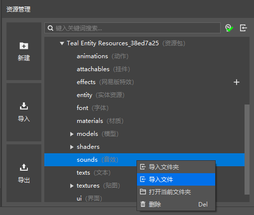
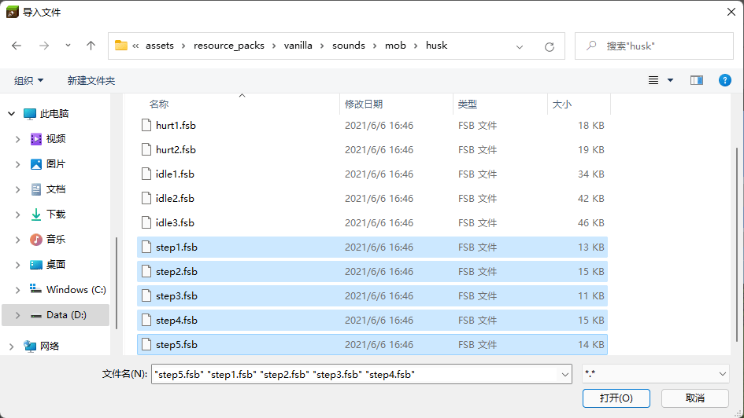
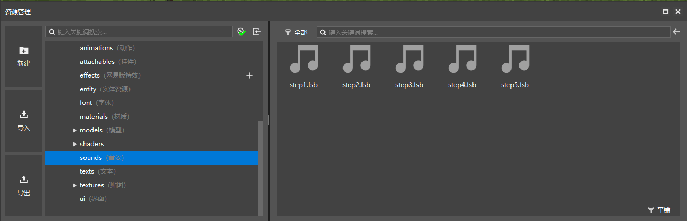
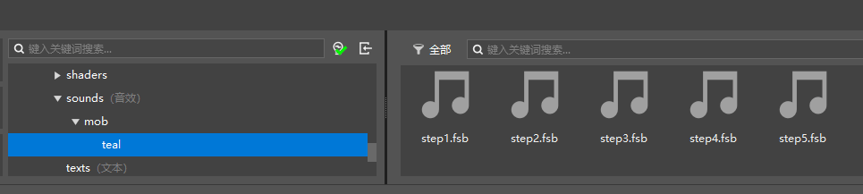

--- 
front: https://nie.res.netease.com/r/pic/20211104/69055361-2e7a-452f-8b1a-f23e1262a03a.jpg 
hard: Advanced 
time: 25 minutes 
--- 

# Add sound effects to entities 

In this section, we add a sound effect to the entity. In fact, since our entity is automatically generated using Blockbench, it is already equipped with the sound effect of a chicken by default. Next, we will replace the walking sound effect in the chicken sound effect with another original entity, such as the walking sound effect of the corpse. 

## Import sound effect resources 

Everyone must remember that we have imported our teal behavior pack into the Minecraft development workbench in the first section. We open the editor of the add-on pack and prepare to import the sound effect of the corpse into the editor. 

 

We find the `sounds` folder of the resource pack, right-click on it, and click the "**Import File**" button. The import window will open. 

 

We find the `sounds/mob/husk` folder under the original template resource pack, and select all the `step*.fsb` files. These files are the walking sound effect files of the corpse. 

 

At this point, we can see the imported files in the "Resource Management" pane. However, in fact, these sound effect files are still stored in the root directory of the `sounds` folder. We do not recommend storing them this way. Sound effect files are similar to texture files, and the number is often very large, so we need a better file classification system. Storing them directly in the root directory will not only make it difficult to find the sound effect files, but also make the game unable to process files with the same name, which is a "bad civilization". We can see that the template resource package provides a classification method. We follow the same method to create a `sounds/mob/teal` folder and copy these files into the folder. 

 

In this way, our sound effect files are imported. 

## Define sound events 

After importing the sound effects, we define the sound events of these sound effects. Only with sound events can these sound effects be referenced by entities or played by commands. We create a `sound_definitions.json` file in the root directory of the `sounds` folder and fill in the following content. 

```json
{
  "format_version": "1.14.0",
  "sound_definitions": {
    "mob.teal.step": {
      "category": "neutral",
      "sounds": [
        "sounds/mob/teal/step1",
        "sounds/mob/teal/step2",
        "sounds/mob/teal/step3",
        "sounds/mob/teal/step4",
        "sounds/mob/teal/step5"
      ]
    }
  }
}

``` 

The format of the sound definition file is only `1.14.0`, so please use that format. Multiple sound events can be defined under the `sound_definitions` field, here we only define an event with the identifier `mob.teal.step`. The `category` classification of the event is `neutral`, which means it is a "good mob" event. This is closely related to the volume slider in the in-game sound settings screen. `sounds` can be a relative path to a sound effect, or an array containing the relative paths of multiple sound effects. If there are multiple sound effects, one will be played randomly when playing. 

In this way, we have defined the sound event. The sound event can already be called by the `/playsound` command. 

## Make an entity play a sound effect 

In order to make an entity play a sound effect, we need to bind the sound effect to the entity. We have two ways to bind it. 

### Bind sound events to system sounds 

System sounds, also known as level sounds, are a series of sound triggers that are hooked to specific hard-coded events. We can bind sound events to system sounds through the `sounds.json` file in the root directory of the resource pack. In this way, these sound events will be played "independently" according to the situation in the game. In fact, this is because the game itself will add the sound events bound to the system sounds to the corresponding system sound events, so that the developer does not need to do any playback operations. The system sound type can be found in [enumeration value list](https://mc.163.com/mcstudio/mc-dev/MCDocs/2-ModSDK%E6%A8%A1%E7%BB%84%E5%BC%80%E5%8F%91/99-%E5%8F%82%E8%80%83%E8%B5%84%E6%96%99/0-Minecraft%E6%9E%9A%E4%B8%BE%E5%80%BC%E6%96%87%E6%A1%A3.html#syssoundtype). Just change the camel case name to snake case name, for example, `ItemUseOn` corresponds to the `item_use_on` system sound type. 

By default, the teal entity created by Blockbench has bound the chicken sound effect to the teal system sound. We modify the binding of the `step` system sound type to the identifier of the sound event we just defined. 

We modify the `sounds.json` file as follows: 

```json 
{ 
"entity_sounds": { 
"entities": { 
"tutorial_demo:teal": { 
"events": { 
"ambient": "mob.chicken.say", 
"death": "mob.chicken.hurt", 
"hurt": "mob.chicken.hurt", 
"plop": "mob.chicken.plop", 
"step": { 
"pitch": 1, 
"sound": "mob.teal.step", // Change chicken here to teal 
"volume": 0.25 
} 
}, 
"pitch": [0.8, 1.2], 
"volume": 1 
} 
} 
} 
} 
``` 

At this point, when we see the teal walking in the game, the sound we hear will automatically play the sound effect we defined. 

### Play sound effects with animations or animation controllers 

In addition to binding to system sound effects, we can also use animations or animation controllers to play sound effects. In each animation, we can use `sound_effects` at the same level as `bones` to define the sound effects that need to be played. Each sound effect must correspond to a keyframe, which represents the time point when the sound effect is played. In each animation controller, we can use `sound_effects` at the same level as `animations` and `transitions` to define the sound effects that need to be played. 

```json 
"animation.teal.baby_transform": {

"loop": true, 
"bones": { 
"head": { 
"scale": { 
"0.0": 2, 
"0.5": 1, 
"1.0": 2 
} 
} 
}, 
"sound_effects": { 
"0.0": { "effect": "sound1" }, // 0.0 plays the sound effect with the short name of sound1 in the entity definition file 
"0.5": [ 
{ "effect": "sound2" }, 
{ "effect": "sound3" } 
] // 0.5 plays the sound effects with the short names of sound2 and sound3 in the entity definition file 
} 
} 
``` 

```json 
{ 
"format_version" : "1.10.0", 
"animation_controllers" : { 
"controller.animation.teal.move" : { 
"initial_state" : "default", 
"states" : { 
"attack" : { 
"animations" : [ "attack" ], 
"transitions" : [ 
{ 
"default" : "variable.attack_animation_tick <= 0.0" 
} 
], 
"sound_effects": [ 
{ "effect": "sound1" } 
] // Play the sound effect with the short name sound1 in the entity definition file as soon as the state is entered 
}, 
// ... 
} 
} 
} 
} 
``` 

We can see that the `sound_effects` of the entity's animation controller can only play sound effects at the beginning of the state. So how can we play sound effects at the end of the state? We have two ways. The first is to define the sound effect at the beginning of the next state. But this method has too many limitations. Another way is to use the `on_exit` trigger command on the same level as `animations`, `transitions` and `sound_effects`. The `on_exit` array can ensure that the commands in it are executed at the end of the state. Each of its elements can be a string slash command. At this time, we can use the `/playsound` command to play the sound. 
