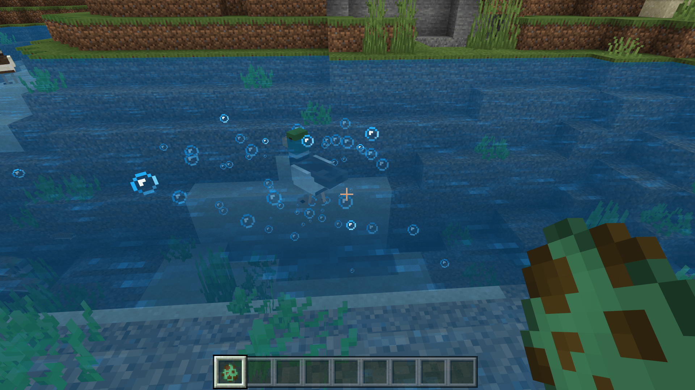

--- 
front: https://nie.res.netease.com/r/pic/20211104/69055361-2e7a-452f-8b1a-f23e1262a03a.jpg 
hard: Advanced 
time: 20 minutes 
--- 

# Add particles to entities 

In this section, we use a bubble particle example to demonstrate how to add particles to entities. We add a bubble particle in the water for our teal. In fact, our teal will generate a few particles when moving in the water, which is a hard-coded behavior. However, we can still add more bubble particles to the teal. 

## Define particle short name 

We want to use the original international version particle emitter `minecraft:basic_bubble_particle_manual` as our bubble particle, so we define the short name of this particle in the entity definition file for our subsequent use. 

```json
{
  "format_version": "1.10.0",
  "minecraft:client_entity": {
    "description": {
      "identifier": "tutorial_demo:teal",
      "materials": {
        "default": "chicken",
        "legs": "chicken_legs"
      },
      "textures": {
        "default": "textures/entity/teal"
      },
      "geometry": {
        "default": "geometry.teal"
      },
      "animations": {
        "move": "animation.teal.move",
        "look_at_target": "animation.common.look_at_target",
        "baby_transform": "animation.teal.baby_transform"
      },
      "scripts": {
        "animate": [
          {            "move": "query.modified_move_speed"
          },
          "look_at_target",
          {
            "baby_transform": "query.is_baby"
          }
        ]
      },
      "particle_effects": {
        "bubble": "minecraft:basic_bubble_particle_manual"
      }, //Define particle short name
      "render_controllers": ["controller.render.chicken"],

"spawn_egg": { 
"base_color": "#62c287", 
"overlay_color": "#87692b" 
} 
} 
} 
} 
``` 

This particle emitter, by definition, will only continue to emit bubble particles when it is in water, so we don't have to worry about "bubbles" in the air. 

## Attach particles to animation controllers 

We can use animations or animation controllers to attach particles, here we choose animation controllers. We create a new file in the `animation_controllers` folder of the resource pack and name it `teal.animation_controllers.json`. Then, we enter the following content in it. 

```json 
{ 
"format_version": "1.10.0", 
"animation_controllers": { 
"controller.animation.teal.particle": { 
"initial_state": "default", 
"states": { 
"default": { 
"particle_effects": [ 
{ 
"effect": "bubble", 
"locator": "lead" 
} 
] 
} 
} 
} 
} 
} 
``` 

Since we want the particle to play continuously, we only define one state and define a `particle_effects` field. Among them, `effect` is the short name of the particle effect, and `locator` is an optional field, which is the **locator** (**Locator**) attached to the particle. 

 

Because we know that there is a locator for attaching a tether in our teal entity, for the convenience of demonstration, we also use it as the locator of the custom bubble particles. In other words, once this tether point is in the water, the teal will generate a lot of bubbles in the water. 

 

We enter the game self-test and can see that, as expected, the tether point at the duck's neck will emit a lot of bubble particles when it is underwater!