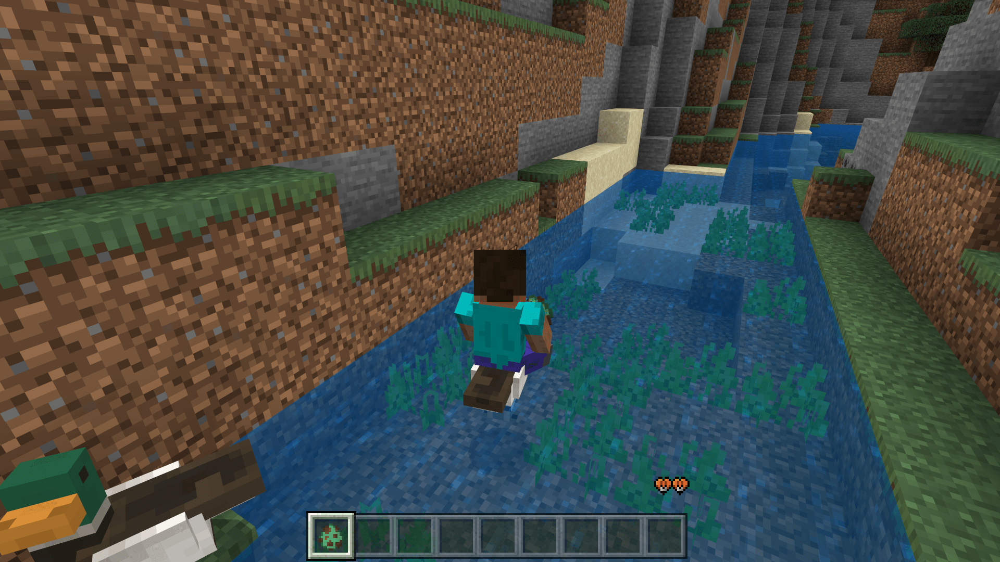

--- 
front: https://nie.res.netease.com/r/pic/20211104/69055361-2e7a-452f-8b1a-f23e1262a03a.jpg 
hard: Advanced 
time: 30 minutes 
--- 
# Challenge: Custom Water Mount 

In this section, let's take on a challenge and customize a water mount. Earlier, we have made a very complete teal entity. At present, we only need to add some related components that allow riding to this teal entity to complete the challenge. 

## Examine the entity behavior definition 

Let's first examine the existing definition file of the entity. We can find that there is actually a rideable component `minecraft:rideable` in the entity. It is located in the `minecraft:teal_adult` component group and has the following content: 

```json 
"minecraft:rideable": { 
"family_types": [ 
"zombie" 
], 
"seat_count": 1, 
"seats": { 
"position": [ 
0, 
0.4, 
0 
] 
} 
} 
``` 

We can easily see that this component is used to spawn zombie riders. We just need to change it to be a component for the player as a rider as well. 

## Modify the component 

We can easily modify it by consulting the documentation, referring to the usage of other entities, or looking at the description of the component in the editor: 

```json 
"minecraft:rideable": { 
"family_types": [ 
"zombie", 
"player" 
], 
"interact_text": "action.interact.mount", 
"seat_count": 1, 
"seats": { 
"position": [ 
0, 
0.4, 
0 
]

} 
} 
``` 

We can add the family type in the `family_types` field, and then add an interactive button text with UI through `interact_text`. In this way, our water duck can set the player as its rider when the player interacts with it, thus realizing the function of the player riding on the water duck. 

## Add components 

However, this does not mean that the challenge is over. Because our players cannot control the water duck at present. Riding on the current water duck is like riding on a pig without a carrot fishing rod. We cannot control the direction and let it run around. We need to add a control component. Fortunately, we have a component `minecraft:input_ground_controlled` that can control the movement of entities through the direction keys or direction buttons. We add it in the same place. 

```json 
"minecraft:rideable": { 
"family_types": [ 
"zombie", 
"player" 
], 
"interact_text": "action.interact.mount", 
"seat_count": 1, 
"seats": { 
"position": [ 
0, 
0.4, 
0 
] 
} 
}, 
"minecraft:input_ground_controlled": {} 
``` 

In this way, our water duck has become a rideable and controllable entity with the ability to swim. 

 

The complete behavior pack definition code is as follows: 

```json 
{ 
"format_version": "1.16.0", 
"minecraft:entity": { 
"description": { 
"identifier": "tutorial_demo:teal", 
"runtime_identifier": "minecraft:chicken", 
"is_spawnable": true, 
"is_summonable": true, 
"is_experimental": false 
}, 
"component_groups": { 
"minecraft:teal_baby": { 
"minecraft:is_baby": {}, 
"minecraft:scale": {

          "value": 0.5
        },
        "minecraft:ageable": {
          "duration": 1200,
          "feed_items": ["wheat_seeds", "beetroot_seeds", "melon_seeds", "pumpkin_seeds"],
          "grow_up": {
            "event": "minecraft:ageable_grow_up",
            "target": "self"
          }
        },
        "minecraft:behavior.follow_parent": {
          "priority": 5,
          "speed_multiplier": 1.1
        }
      },
      "minecraft:teal_adult": {
        "minecraft:experience_reward": {
          "on_bred": "Math.Random(1,7)",
          "on_death": "query.last_hit_by_player?Math.Random(1,3):0"
        },
        "minecraft:loot": {
          "table": "loot_tables/entities/chicken.json"
        },
        "minecraft:breedable": {
          "require_tame": false,
          "breeds_with": {
            "mate_type": "tutorial_demo:teal",
            "baby_type": "tutorial_demo:teal",
            "breed_event": {
              "event": "minecraft:entity_born",
              "target": "baby"
            }
          },
          "breed_items": ["wheat_seeds", "beetroot_seeds", "melon_seeds", "pumpkin_seeds"]
        },
        "minecraft:behavior.breed": {          "priority": 3,
          "speed_multiplier": 1
        },
        "minecraft:rideable": {
          "family_types": [
            "zombie",
            "player"
          ],
          "interact_text": "action.interact.mount",
          "seat_count": 1,
          "seats": {
            "position": [
              0,
              0.4,

              0
            ]
          }
        },
        "minecraft:input_ground_controlled": {},
        "minecraft:spawn_entity": {
          "entities": {
            "min_wait_time": 300,
            "max_wait_time": 600,
            "spawn_sound": "plop",
            "spawn_item": "egg",
            "filters": {
              "test": "rider_count",
              "subject": "self",
              "operator": "==",
              "value": 0
            }
          }
        }
      }
    },
    "components": {
      "minecraft:type_family": {
        "family": ["chicken", "mob"]
      },
      "minecraft:breathable": {
        "total_supply": 15,
        "suffocate_time": 0
      },
      "minecraft:collision_box": {
        "width": 0.6,
        "height": 0.8
      },
      "minecraft:nameable": {},
      "minecraft:health": {
        "value": 4,
        "max": 4
      },
      "minecraft:hurt_on_condition": {
        "damage_conditions": [
          {
            "filters": {
              "test": "in_lava",
              "subject": "self",
              "operator": "==",
              "value": true
            },
            "cause": "lava",
            "damage_per_tick": 4
          }

        ]
      },
      "minecraft:movement": {
        "value": 0.25
      },
      "minecraft:damage_sensor": {
        "triggers": {
          "cause": "fall",
          "deals_damage": false
        }
      },
      "minecraft:leashable": {
        "soft_distance": 4,
        "hard_distance": 6,
        "max_distance": 10
      },
      "minecraft:balloonable": {
        "mass": 0.5
      },
      "minecraft:navigation.walk": {
        "can_path_over_water": true,
        "can_sink": false,
        "avoid_damage_blocks": true
      },
      "minecraft:movement.basic": {},
      "minecraft:jump.static": {},      "minecraft:can_climb": {},
      "minecraft:despawn": {
        "despawn_from_distance": {}
      },
      "minecraft:behavior.rise_to_liquid_level": {
        "priority": 0,
        "liquid_y_offset": -0.5,
        "rise_delta": 0.01,
        "sink_delta": 0.01
      },
      "minecraft:behavior.panic": {
        "priority": 1,
        "speed_multiplier": 1.5
      },
      "minecraft:behavior.mount_pathing": {
        "priority": 2,
        "speed_multiplier": 1.5,
        "target_dist": 0,
        "track_target": true
      },
      "minecraft:behavior.tempt": {        "priority": 4,
        "speed_multiplier": 1,
        "items": ["wheat_seeds", "beetroot_seeds", "melon_seeds", "pumpkin_seeds"]

      },
      "minecraft:behavior.random_stroll": {
        "priority": 6,
        "speed_multiplier": 1
      },
      "minecraft:behavior.look_at_player": {
        "priority": 7,
        "look_distance": 6,
        "probability": 0.02
      },
      "minecraft:behavior.random_look_around": {
        "priority": 8
      },
      "minecraft:physics": {},
      "minecraft:pushable": {
        "is_pushable": true,
        "is_pushable_by_piston": true
      },
      "minecraft:conditional_bandwidth_optimization": {}
    },
    "events": {
      "from_egg": {
        "add": {
          "component_groups": ["minecraft:teal_baby"]
        }
      },
      "minecraft:entity_spawned": {
        "randomize": [
          {
            "weight": 95,
            "trigger": "minecraft:spawn_adult"
          },
          {
            "weight": 5,
            "add": {
              "component_groups": ["minecraft:teal_baby"]
            }
          }
        ]
      },
      "minecraft:entity_born": {
        "remove": {},
        "add": {
          "component_groups": ["minecraft:teal_baby"]
        }
      },
      "minecraft:ageable_grow_up": {
        "remove": {
          "component_groups": ["minecraft:teal_baby"]
        },

        "add": {
          "component_groups": ["minecraft:teal_adult"]
        }
      },
      "minecraft:spawn_adult": {
        "add": {
          "component_groups": ["minecraft:teal_adult"]
        }
      }
    }
  }
}
```