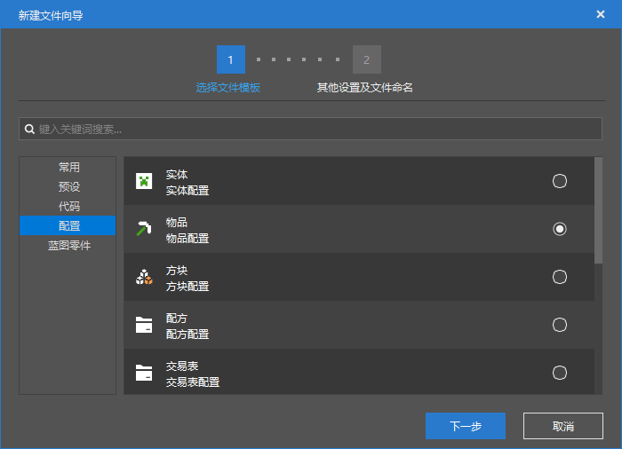

--- 
front: https://nie.res.netease.com/r/pic/20211104/69055361-2e7a-452f-8b1a-f23e1262a03a.jpg 
hard: Advanced 
time: 20 minutes 
--- 
# Get to know custom items 
In this section, let's get in touch with custom items. 

Items, like entities, can also be defined by JSON file data-driven. For demonstration, we use the add-on pack with a complete folder that we created together in Chapter 7. As we remember, we have already imported this add-on pack into the game. We open it in the Minecraft development workbench. 

 

We want to create a new item using the configuration function, and then find the item definition files in the "**Resource Management**" pane and study these files. 

We can see that the wizard will prompt us to create the following supporting files: 

```shell 
./behavior_pack/netease_items_beh/tutorial_demo_item_demo.json 
./resource_pack/netease_items_res/tutorial_demo_item_demo.json 
./resource_pack/attachables/tutorial_demo_item_demo.json 
``` 

These are the behavior pack definition file, resource pack definition file, and attachment file of the item. **Attachment** (**Attachable**, ***Pendant***) is an optional entity-like object. In the item definition, it often plays the role of matching armor as the model of armor or matching general items as its custom model. General items do not need this file, so if we select ordinary items or "empty" items, this file will not be created. 

## Behavior Pack Definition 

Let's first look at the behavior pack definition file for items. Here we take the newly created `./behavior_pack/netease_items_beh/tutorial_demo_item_demo.json` as an example. 

```json 
{ 
"format_version": "1.10", 
"minecraft:item": { 
"description": { 
"identifier": "tutorial_demo:item_demo", 
"category": "Construction", 
"register_to_create_menu": true, 
"custom_item_type": "none", 
"is_experimental": false 
}, 
"components": { 

}/*, 
"events": { 
// no use at 1.10 format 
}*/ 
} 
} 
```


- `format_version`: This is the **Format Version** of the object file. The stable format versions of items are `1.10`, `1.14` and `1.16`. These three format versions are stable format versions that do not require experimental gameplay. They are also the format versions we recommend here. We especially recommend format version `1.10`. Format versions `1.16.100` and above mean new versions of items, which require experimental gameplay. We do not recommend using them. However, it should be noted that if you use new versions of items `1.16.100` and above, you only need to create a behavior pack definition file, and the data required by the client will be received from the server in the form of data packets. 
- `minecraft:item`: The mode identifier of the item. From the identifier, it does not distinguish between the client and the server. The engine will determine whether it is a server or a client based on whether its file is placed in a behavior pack or a resource pack. Under it are `description`, `components` and `events` objects. 

`description` represents the **Description** of the item. 

- `identifier`: string, the namespace identifier of the item, in the format of `<namespace>:<identifier>`, the identifiers on the client and server should be consistent. 
- `category`: string, the inventory category of the item, `Construction` is the first category. You can use custom categories, for details on custom categories, see <a href="../../../mcguide/20-Gameplay Development/15-Custom Game Content/13-Custom Item Paging.html" rel="noopenner">Custom Item Paging</a>. 
- `register_to_create_menu`: optional, Boolean value, whether to register the item to the creation inventory. Defaults to `false`. 
- `custom_item_type`: optional, string, description attribute unique to the Chinese version, which can inherit some types of items from the original version, thereby defining items with hard-coded characteristics of the original version. Currently, you can fill in `weapon`, `armor`, `egg`, `ranged_weapon`, `bucket`, `projectile_item`, etc. 
- `is_experimental`: optional, Boolean value, whether the item is an experimental item, that is, whether you need to turn on experimental gameplay to get it. 

`components` represents the server-side **component** (**Component**) of the item. Most of the components of the item are server-side. However, there are also some available item components in the resource pack (that is, in the client). And some of these components have important functions, such as adding item icons. 

`events` represents the server-side **Event** (**Event**) of the item, **and it is only valid when the format version is `1.16.100` and above**. Similar to entities, item server-side definition files also allow the definition of some events, but currently, the events that can be defined can only be triggered by a few components. That is to say, the function of defining events is currently limited. We can look at an excerpt from the event paragraph of an original item enchanted golden apple.

```json 
"events" : { 
"consumed" : { 
"sequence" : [ 
{ 
"add_mob_effect" : { 
"effect" : "regeneration", 
"duration" : 5, 
"amplifier" : 1, 
"target" : "holder" 
} 
}, 
{ 
"add_mob_effect" : { 
"effect" : "absorption", 
"duration" : 120, 
"amplifier" : 0, 
"target" : "holder" 
} 
} 
] 
} 
} 
``` 

The `consumed` event is triggered by the `minecraft:food` component, and can give the eater the health regeneration and health absorption status effects. 

## Resource pack definition 

Let's take a look at the resource pack definition file of the item. We still take the newly created `./resource_pack/netease_items_res/tutorial_demo_item_demo.json` as an example. 

```json 
{ 
"format_version": "1.10",

"minecraft:item": { 
"description": { 
"identifier": "tutorial_demo:item_demo" 
}, 
"components": { 
"minecraft:icon": "tutorial_demo:item_demo" 
} 
} 
} 
``` 

Because it has the same pattern identifier as the behavior pack definition file, it should have the same file pattern. However, the support for each section in the resource pack definition is different from that in the behavior pack. The resource pack definition only supports `description` and `components`, and `description` is only used to define identifiers, and the number of components supported in `components` is not as many as in the behavior pack. 

However, we see an extremely important component: `minecraft:icon`. This component can be used to define our item icon. We can see that the value of this component has been automatically filled in for us `"tutorial_demo:item_demo"`. In fact, the value here does not need to be namespaced, but in order to avoid conflicts with other modules, we can still add a namespace to it. 

The value of `minecraft:icon` is a **short name** of a texture. The definition of this short name is not defined in the client definition file like the entity. The short name is defined in a file called **Atlas Definition File**. 

### Atlas 

**Atlas** is the name of a texture file in Minecraft that only exists in memory. Every time Minecraft starts the game, it will create an atlas in the game based on the textures in the resource pack. For example, items will create an item atlas based on the small item textures in the resource pack, with the atlas definition file as the index. The following shows an **item atlas** created by the original Minecraft. 

 

If the items in our module want to have icons, they must reference icons in an item atlas. However, if we don't define new textures in the item atlas, then we can't reference custom icons, we can only reference the original icons. Fortunately, we have the ability to customize the atlas, that is, to modify the atlas definition file. 

We can take the atlas file automatically generated for us by our editor as an example. For the convenience of explanation, I have manually added the icon texture of our new item. The item atlas definition file is located in the root directory of the resource pack's `textures` folder, and its name is `item_texture.json`. 

```json 
{ 
"resource_pack_name": "tutorial_demo", 
"texture_name": "atlas.items", 
"texture_data": { 
"tutorial_demo:item_demo": { 
"textures": "textures/items/tutorial_demo/item_demo" 
} 
} 
} 
``` 

- `resource_pack_name`: string, the name of our resource pack, which may affect the order of the sprites in the atlas. However, ordinary developers do not need to worry about this, only some special shader developers need to pay attention to the UV situation of the atlas. 
- `texture_name`: string, in the item atlas must be `atlas.items`, it is the identifier representing the item atlas. 
- `texture_data`: object, all short names are defined here. All fields are in the form of `"<short_name>": { /* texture definition */ }`. Generally speaking, there will only be one `textures` field in the texture definition object, which represents the path of the texture relative to the root directory, without an extension. The extension will be checked in the order of `tga`, `png`, and `jpg`, and the first texture checked will be read. If none of them exist, an error will be reported. 

In this way, we have defined the icon of the item, thus completing the definition of a basic blank item.