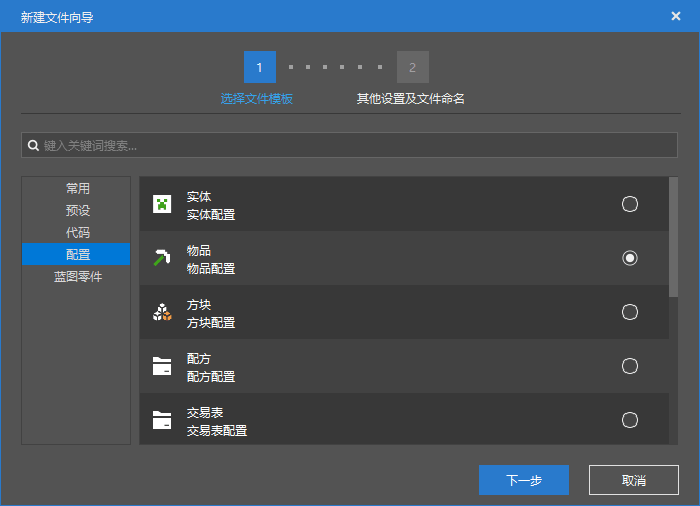
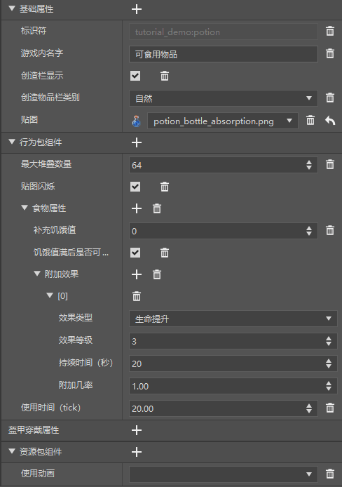
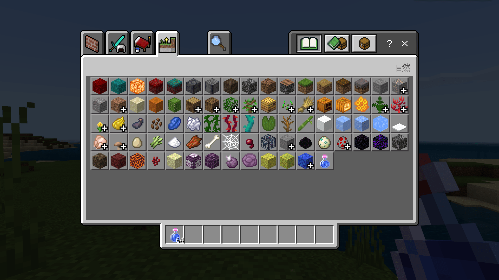
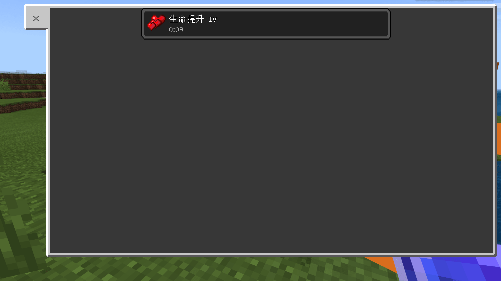

--- 
front: https://nie.res.netease.com/r/pic/20211104/69055361-2e7a-452f-8b1a-f23e1262a03a.jpg 
hard: Advanced 
time: 15 minutes 
--- 
# Make a new potion 

In this section, let's make a new potion item. 

## Create a configuration 

We open the editor of the Minecraft development workbench and quickly create a new item by creating a **configuration**. 

 

 

We hope that the created item can be eaten or drunk like food, so here we choose "**Edible Item**" as the data template. 

 

After creation, we can see the properties of our new item in the "Properties" pane. 

## Change properties 

Compared with ordinary empty items, edible items have more components. The most important one is the "Food Property" component. 

This component is actually the `minecraft:food` component in the JSON file. `minecraft:food` is mainly used to define the **Hunger Value** and **Saturation** of an item after eating it, and can also define the events triggered when eating it, the status effects generated, etc. We need to use the function of generating status effects. 

We keep the "**Can I eat after the hunger value is full**" column selected, and change "**Replenish hunger value**" to 0. Since an "**Additional effect**" has been automatically generated below, we only need to change the "**Effect type**" and other properties to the values we need. 

In this way, we have made an item with basically the same function as a potion. But there is one thing we need to pay attention to. The eating animation and sound effects of ordinary food and liquid food are different. However, we can also change this. 

 

We add the "**Use Animation**" component to the "**Resource Pack Component**". Change the `eat` that uses animation to `drink`. However, due to the limitations of the editor, we need to manually change the value of this component in the resource pack. We change it in the resource pack as follows: 

```json 
{ 
"format_version": "1.10", 
"minecraft:item": { 
"description": { 
"identifier": "tutorial_demo:potion" 
}, 
"components": { 
"minecraft:icon": "tutorial_demo:potion", 
"minecraft:use_animation": "drink" // Change here 
} 
}

} 
``` 

At the same time, we can also open the behavior pack to view our behavior pack definition file. Modifying it through the editor and then opening the file to learn how to write JSON is a very good way to learn add-on packs. The files in the behavior package are as follows:

```json
{
  "format_version": "1.10",
  "minecraft:item": {
    "description": {
      "identifier": "tutorial_demo:potion",
      "category": "Nature",
      "register_to_create_menu": true
    },
    "components": {
      "minecraft:foil": true,
      "minecraft:food": {
        "can_always_eat": true,
        "effects": [
          {
            "amplifier": 3,
            "chance": 1.0,
            "duration": 20,
            "name": "health_boost"
          }
        ],
        "nutrition": 0
      },
      "minecraft:max_stack_size": 64,
      "minecraft:use_duration": 20.0 } 
} 
} 
``` 

So, our potion is created! Let's open the game to verify the effect. 

 

You can see that the potion is correctly added to the "Nature" category. 

 

The sound of drinking the potion is also the sound of liquid consumption. 

 

And after consumption, it gives us the correct effect. This means that we have successfully added a new potion item!