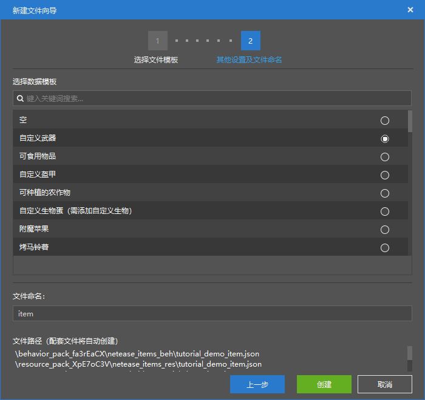
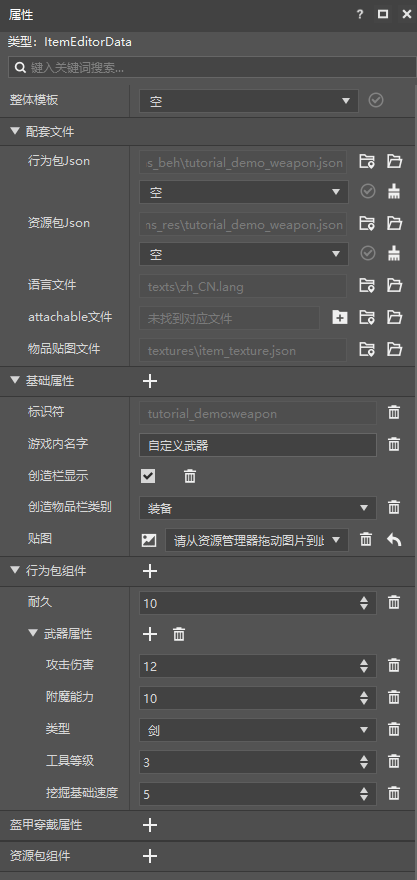
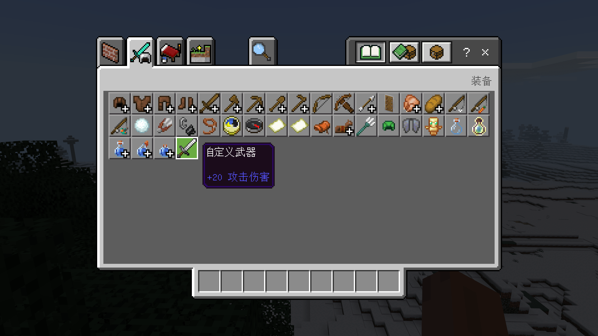

--- 
front: https://nie.res.netease.com/r/pic/20211104/69055361-2e7a-452f-8b1a-f23e1262a03a.jpg 
hard: Advanced 
time: 10 minutes 
--- 
# Make a new weapon 

In this section, we will create a new weapon with attack characteristics. 

## Create a configuration 

We open the editor of the Minecraft development workbench and quickly create a new item by creating a **configuration**. 

 

We use "**Custom Weapon**" as the basis, so that we can create a weapon. 

 

## Change properties 

Let's examine the components of this item together. We can see that the component that determines this item as a weapon is the "**Weapon Attribute**" component. This component is the Chinese version of the self-made component `minecraft:weapon`. This component determines the damage, enchantment ability, mining level, basic mining speed and other attributes of a weapon. We can customize this component according to our own wishes. For example, we change the damage of the weapon to 20. 

 

Here we provide a pair of slightly modified definition files corresponding to weapon items. The behavior package definition file is as follows:

```json
{
  "format_version": "1.10",
  "minecraft:item": {
    "description": {
      "identifier": "tutorial_demo:weapon",
      "category": "Equipment",
      "custom_item_type": "weapon",
      "register_to_create_menu": true
    },
    "components": {
      "minecraft:max_damage": 10,
      "netease:weapon": {
        "attack_damage": 20,
        "enchantment": 10,
        "level": 3,
        "speed": 5,
        "type": "sword"
      }
    }
  }
}

``` 

The resource pack definition file is as follows: 

```json 
{ 
"format_version": "1.10", 
"minecraft:item": { 
"description": { 
"identifier": "tutorial_demo:weapon" 
}, 
"components": { 
"minecraft:icon": "tutorial_demo:weapon" 
} 
} 
} 
``` 

It is worth noting that the "Durability" component here corresponds to minecraft:max_damage, which is the maximum Damage Value (DV), not the Damage that can be caused by the attack. The attack damage that the weapon can cause is defined by netease:weapon/attack_damage. The damage value here is the special value, data value or additional value that we often mention in other contexts. The reason why it is called damage value is that the item will be damaged to a certain extent every time it is used, and the damage value will gradually increase. When the damage value reaches the maximum damage value, the item will break due to complete damage. Therefore, the maximum damage value is also the **Durability** of the item. 

Let's enter the game to test our weapons. 

 

 

You can see that our weapon does have an additional +20 attack damage as we modified it. This means that our weapon customization is successful!