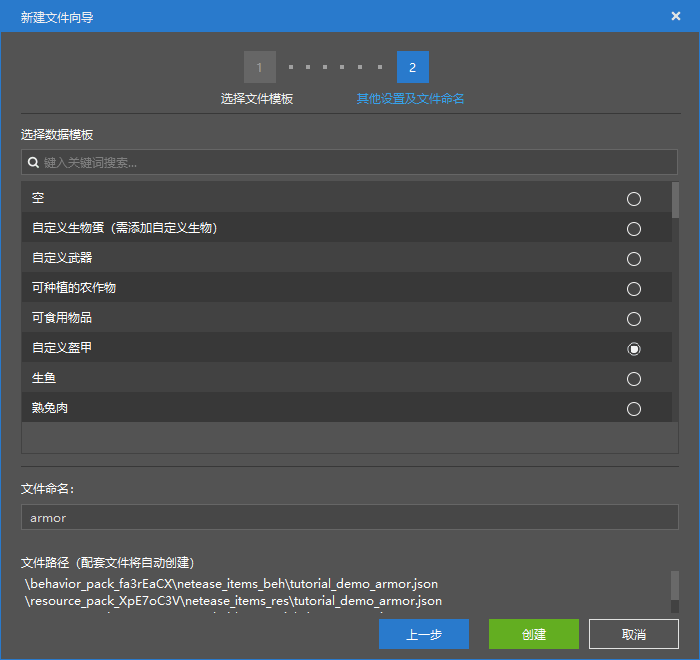
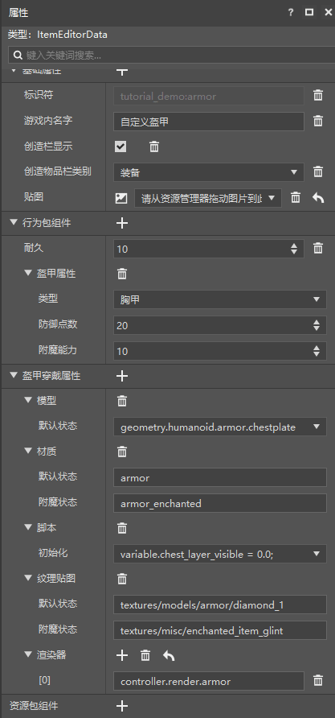

--- 
front: https://nie.res.netease.com/r/pic/20211104/69055361-2e7a-452f-8b1a-f23e1262a03a.jpg 
hard: Advanced 
time: 15 minutes 
--- 
# Make a new armor 

In this section, we will create a new armor together to give it a certain defensive ability. 

## Create a configuration 

We open the editor of the Minecraft development workbench and quickly create a new item by creating a **configuration**. 

 

We use "**Custom Armor**" as the basis, so that we can create an armor. 

 

We can see that compared with other items, armor has an additional armor wearing attribute column. This is where the **Attachable** (***Pendant***) of the armor is defined. 

## Change Properties 

Let's focus on the behavior pack component first. We can see that the armor has an "**Armor Property**" component, which is essentially the `netease:armor` component in JSON. This component can modify the **Armor Value** and enchantment ability of the armor, etc. 

For the armor attachment, its JSON file is stored in the `attachables` folder of the resource pack. Its definition file is almost the same as the entity's resource pack definition file, except that it only has one resource pack definition. The purpose of the attachment is to simply display a model without behavioral logic, such as the armor model worn by the player. Therefore, it only needs a resource pack definition file. 

We put an example of the JSON file corresponding to the item for your reference. First is the behavior pack definition file. 

```json
{
  "format_version": "1.10",
  "minecraft:item": {
    "description": {
      "category": "Equipment",
      "identifier": "tutorial_demo:armor",
      "custom_item_type": "armor",
      "register_to_create_menu": true
    },
    "components": {
      "minecraft:max_damage": 10,
      "netease:armor": {
        "armor_slot": 1,
        "defense": 20,
        "enchantment": 10
      }
    }
  }
}

``` 

Then there are the resource packs. 

```json 
{ 
"format_version": "1.10", 
"minecraft:item": { 
"description": { 
"identifier": "tutorial_demo:armor" 
}, 
"components": { 
"minecraft:icon": "tutorial_demo:armor" 
} 
} 
} 
``` 

The attachment definition file is also very simple, because we have already fully studied this format in Chapter 8. 

```json
{
  "format_version": "1.8.0",
  "minecraft:attachable": {
    "description": {
      "identifier": "tutorial_demo:armor",
      "geometry": {
        "default": "geometry.humanoid.armor.chestplate"
      },
      "materials": {
        "default": "armor",
        "enchanted": "armor_enchanted"
      },
      "textures": {
        "default": "textures/models/armor/diamond_1",
        "enchanted": "textures/misc/enchanted_item_glint"
      },
      "render_controllers": [
        "controller.render.armor"
      ],
      "scripts": {
        "parent_setup": "variable.chest_layer_visible = 0.0;" } 
} 
} 
} 
``` 

In the next section of the challenge, we will add a 3D model to this object, which will use our attachment function.