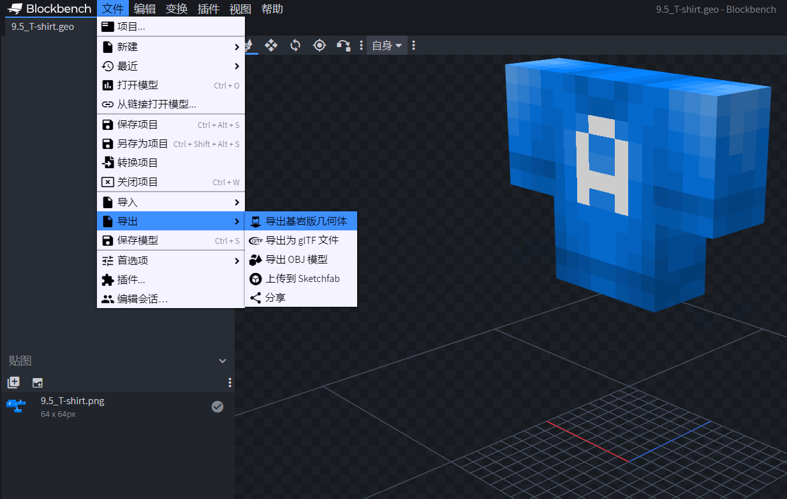
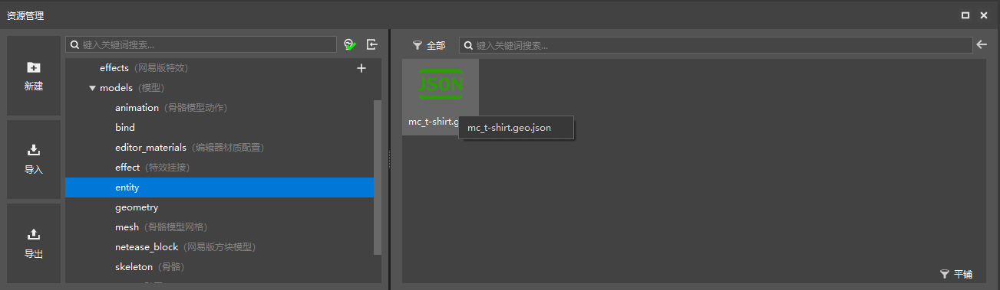
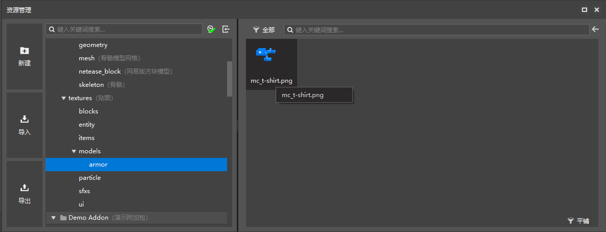
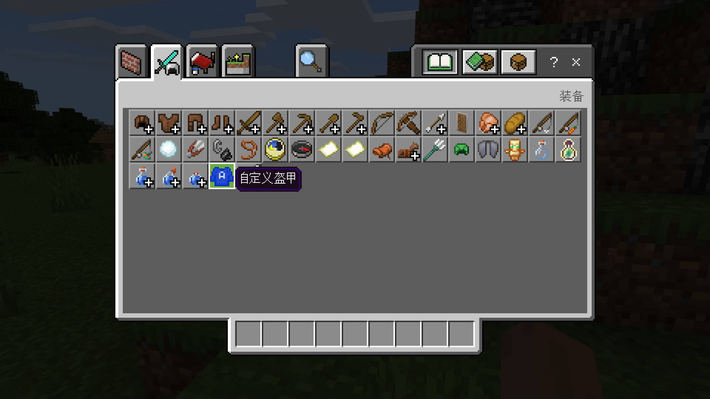
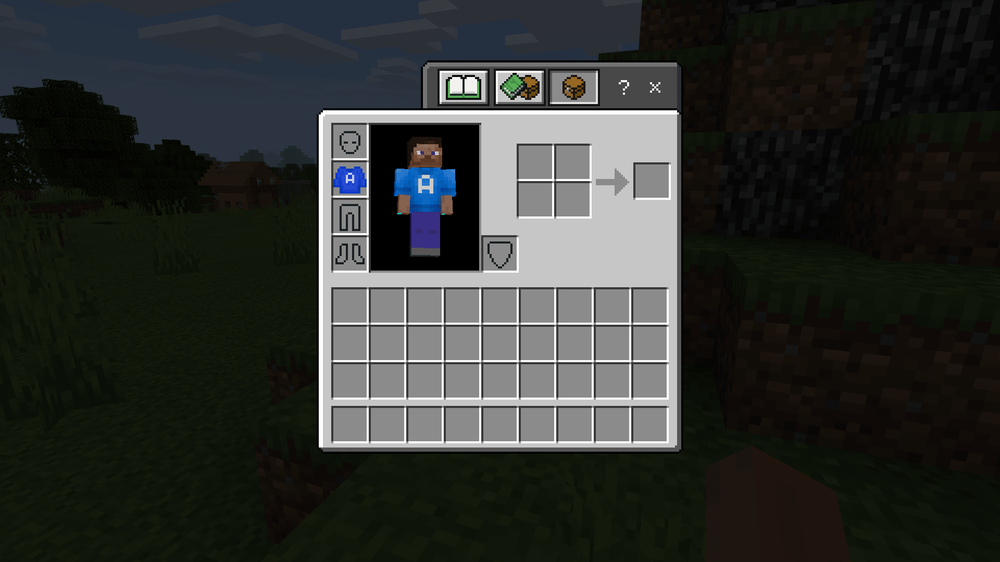

--- 
front: https://nie.res.netease.com/r/pic/20211104/69055361-2e7a-452f-8b1a-f23e1262a03a.jpg 
hard: Advanced 
time: 20 minutes 
--- 
# Challenge: Make a 3D armor 

Next, we attach a model to the armor we added in the previous section. The model used can be downloaded in the [3D Armor Resource Pack](https://g79.gdl.netease.com/addonguide-9.zip). 

## Prepare the 3D armor model 

The 3D armor model is essentially a solid model, so we can use Blockbench to make such a model. In the gameplay map tutorial, we made a lot of models together, which can be downloaded and found in the sample package of the gameplay map tutorial. We take a T-shirt model and open the `.bbmodel` file in Blockbench. 

 

We use Blockbench's export function to export the model's **Geometry** as a JSON file. Then prepare this file together with the texture file and import it into the editor. 

 

Place the geometry file under `models/entity` in the resource pack. 

 

Place the texture file under `textures/models/armor`. In fact, texture files are not as strict as geometry files, so it is also possible to place them in other folders. However, in order to be consistent with the original package and avoid conflicts with other add-on packages, we still make this arrangement. 

## Edit attachments 

We open our attachment JSON definition file. We need to modify the geometry and texture of the attachment to our own resources. 

```json 
{ 
"format_version": "1.8.0", 
"minecraft:attachable": { 
"description": { 
"identifier": "tutorial_demo:armor", 
"geometry": { 
"default": "geometry.mc_t-shirt" // Modify here 
}, 
"materials": { 
"default": "armor", 
"enchanted": "armor_enchanted" 
}, 
"textures": { 
"default": "textures/models/armor/mc_t-shirt", // Modify here 
"enchanted": "textures/misc/enchanted_item_glint" 
}, 
"render_controllers": [ 
"controller.render.armor" 
],

"scripts": { 
"parent_setup": "variable.chest_layer_visible = 0.0;" 
} 
} 
} 
} 
``` 

We modify it according to the above method, so that our geometry and default texture are modified successfully. 

 

 

Open the game self-test to observe the effect, we can see that the armor does show the proper model and texture after being worn!