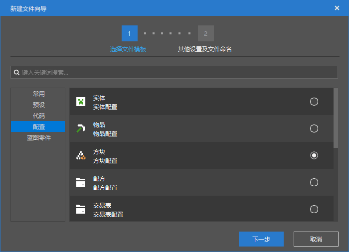

--- 
front: https://nie.res.netease.com/r/pic/20211104/69055361-2e7a-452f-8b1a-f23e1262a03a.jpg 
hard: Advanced 
time: 15 minutes 
--- 
# Understanding custom blocks 
In this section, we will examine the format of custom blocks. As usual, we first use the editor to quickly create a custom block so that we can see its basic structure. 

 

We select "Block Configuration" and then create an empty custom block. 

 

We can see that the editor prompts us to create the following supporting files: 

```shell 
./behavior_pack/netease_blocks/tutorial_demo_block_demo.json 
``` 

 

From the file structure, we can see that our custom block has only one behavior pack definition file. But in fact, blocks also need to be defined by the client, but this client definition is special, unlike items and entities, which are separate files. The client definition file of a block is a separate file that contains all the client resources of the blocks that need to be defined, which is `blocks.json` in the root directory of the resource pack. 

However, before that, let's take a look at the behavior pack definition file. 

## Behavior Pack Definitions 

```json 
{ 
"format_version": "1.10.0", 
"minecraft:block": { 
"description": { 
"identifier": "tutorial_demo:block_demo", 
"register_to_creative_menu": true, 
"base_block": "none", 
"is_experimental": false 
}, 
"components": { 

} 
} 
} 
``` 

- `format_version`: This is the **Format Version** of this block. The stable format versions of the block are `1.10.0` and `1.16.0`, neither of which require experimental gameplay, and we still recommend format version `1.10.0`. Format versions `1.16.100` and above mean new versions of the block, which require experimental gameplay, and we do not recommend using them. Similarly, if you use new blocks in `1.16.100` and above, you only need to create a behavior pack definition file, and the data required by the client will be received from the server in the form of data packets. 
- `minecraft:block`: The mode identifier of the block. Under it are `description` and `components` objects. 


Let's look at the properties under the `description` object one by one. 

- `identifier`: string, the namespace identifier of the block, in the format of `<namespace>:<identifier>`. It should be noted that due to the internal code limitations of the block, even if we set the namespace, we still cannot avoid the phenomenon of duplicate name conflicts. This is because when a block exists as a block item, it can use the identifier with a namespace as a unique identifier, but when a block exists as itself or as an instance in the world, it can only use the `<identifier>` in the above format as an identifier. So we still have to ensure the uniqueness of the `<identifier>` in the above format, for example, we can use a format like `<namespace>:<namespace>_<name>` to ensure its uniqueness. 
- `register_to_create_menu`: optional, Boolean value, whether to register the item to the creation inventory. The default is `false`. 
- `base_block`: optional, string, description attribute unique to the Chinese version, which can inherit some types of blocks from the original version, thereby defining blocks with hard-coded characteristics of the original version. Currently, you can fill in `mob_spawner`, `portal`, `custom_crop_block`, `liquid`, `custom_heavy_block`, etc. 
- `is_experimental`: optional, Boolean value, whether the item is an experimental item, that is, whether you need to turn on experimental gameplay to get it. 

## Resource pack definition 

The resource pack definition file is in `blocks.json` in the root directory of the resource pack. All the resource pack definitions of blocks are concentrated in this block. 

```json 
{ 
"format_version": [ 1, 1, 0 ], 
"tutorial_demo:block_demo": { 
"textures": "tutorial_demo:dirt" 
} 
} 
``` 

The format version of the block resource pack definition file is the very old `1.1.0`, and it needs to be written in the form of a semantic version array. The key of each field below is the namespaced identifier of the block, and the value is an object where the `textures` field is the short name of the texture file for the block. The short name of the block texture is the same as that of the item, and is still defined in an atlas file. We will look at the atlas file of the block later. 

Below we show a more detailed resource pack definition of a vanilla block. 

```json
{
  "format_version": [ 1, 1, 0 ],
  "air": {},
  "stone": {
    "textures": "stone",
    "sound": "stone"
  },
  "grass": {
    "isotropic": {
      "up": true,
      "down": true
    },
    "textures": {
      "up": "grass_top",
      "down": "grass_bottom",
      "side": "grass_side"
    },
    "carried_textures": {
      "up": "grass_carried_top",
      "down": "grass_carried_bottom",
      "side": "grass_carried"
    },
    "sound": "grass"
  },
  "dirt": {

    "isotropic": true,
    "textures": "dirt",
    "sound": "gravel"
  },
  // ...
  "sand": {
    "isotropic": true,
    "textures": "sand",
    "brightness_gamma": 0.55,
    "sound": "sand"
  },
  // ...
  "leaves": {
    "isotropic": {
      "up": true,
      "down": true
    },
    "textures": "leaves",
    "carried_textures": "leaves_carried",
    "brightness_gamma": 0.80,
    "sound": "grass"
  },
  // ...
  "dispenser": {
    "textures": {
      "up": "dispenser_top",
      "down": "dispenser_top",
      "north": "dispenser_side",
      "south": "dispenser_front_horizontal",
      "west": "dispenser_side",
      "east": "dispenser_front_vertical"
    },
    "carried_textures": {
      "up": "dispenser_top",
      "down": "dispenser_top",
      "north": "dispenser_side",
      "south": "dispenser_front_horizontal",
      "west": "dispenser_side",
      "east": "dispenser_side"
    },
    "sound": "stone"
  },
  // ... 
} 
``` 

We can see that in addition to `textures`, we can also set sounds (`sounds`), handheld textures (`carried_textures`), anisotropy (`isotropic`) and brightness gamma (`brightness_gamma`), etc., and each face can set these values separately. In fact, we can also set the block shape through `blockshape`. 

Sounds are used to link a collection of system sound events (also known as archived sound events). In the `block_sounds` object of the `sounds.json` file in the root directory of the resource pack, we set a system sound event set for each major block category for "automatic" playback of block-related sound effects, such as `normal`, `gravel`, `wood`, etc. Here you need to fill in the corresponding system sound event set name. In fact, the same is true for the sound effect playback of entities, except that the system sound event set name of the entity is consistent with the entity identifier, so they can be automatically linked together. 


Anisotropy is used to enable random rotation of textures. Faces with anisotropy enabled will use a pseudo-random form to randomly rotate the texture through the world seed. 

Block shape is a property similar to a block model. Developers can use block shape to inherit a vanilla block model, while inheriting all the rendering methods and rendering properties of the model, such as whether to perform backface culling, ambient occlusion, etc. 

### Atlas 

Unlike the item atlas, which is called the item atlas, the block atlas is called the **terrain atlas**. 

 

We can find the block atlas definition at `textures/terrain_texture.json`. 

```json 
{ 
"resource_pack_name": "tutorial_demo", 
"texture_name": "atlas.terrain", 
"padding": 8, 
"num_mip_levels": 4, 
"texture_data": { 
"tutorial_demo:dirt": { 
"textures": "textures/blocks/dirt" 
} 
} 
} 
``` 

`atlas.terrain` is the atlas identifier of the terrain atlas and cannot be changed to other fields. `padding` is the inner margin when each texture file is integrated into a large atlas file. We can see that there is an extended margin around each texture in the example large atlas file above, which is defined by this field to avoid the problem of pixel fusion between textures of different blocks during the MIPMAP process. `num_mip_levels` is the number of MIPMAPs performed on the atlas file. The more MIPMAPs, the less noise there is in distant blocks. In `texture_data`, the short name is defined. This is consistent with items. 

After defining our block texture, our block is basically complete! 
