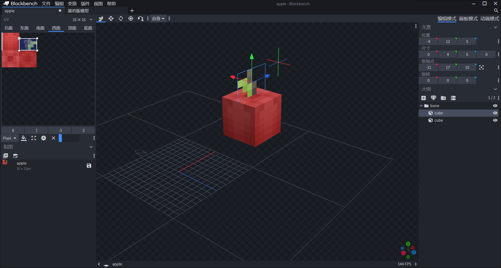
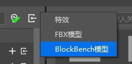
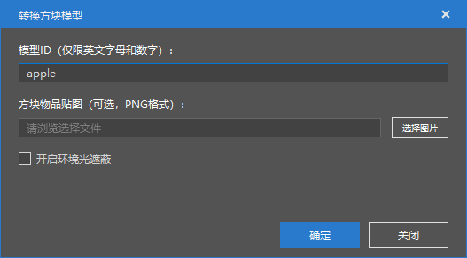
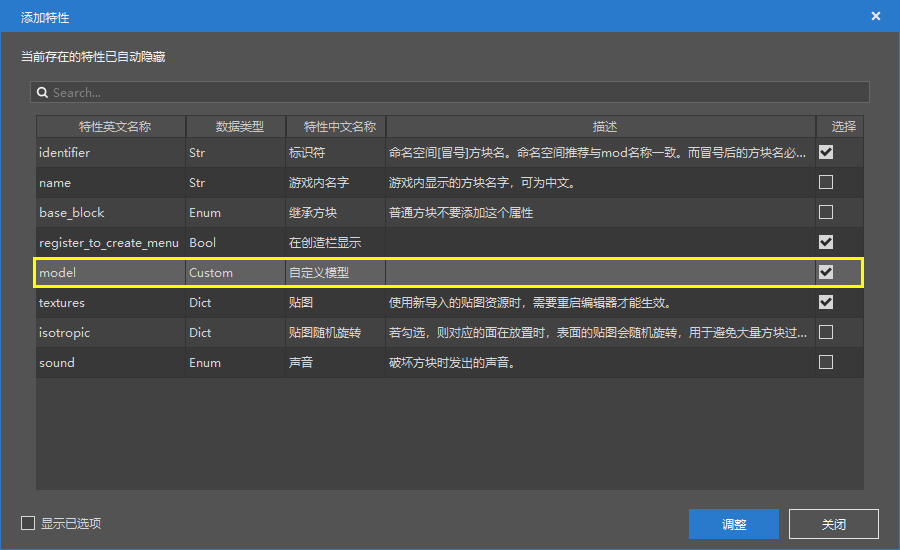
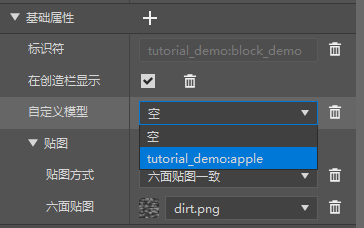
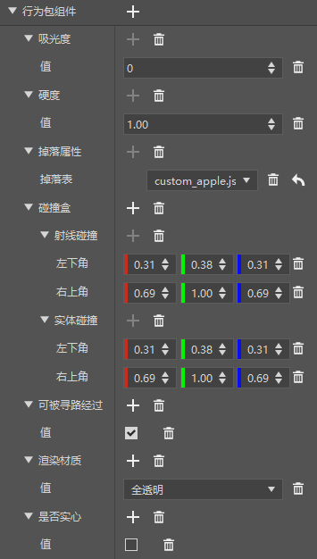
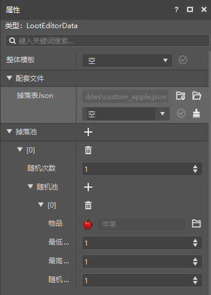
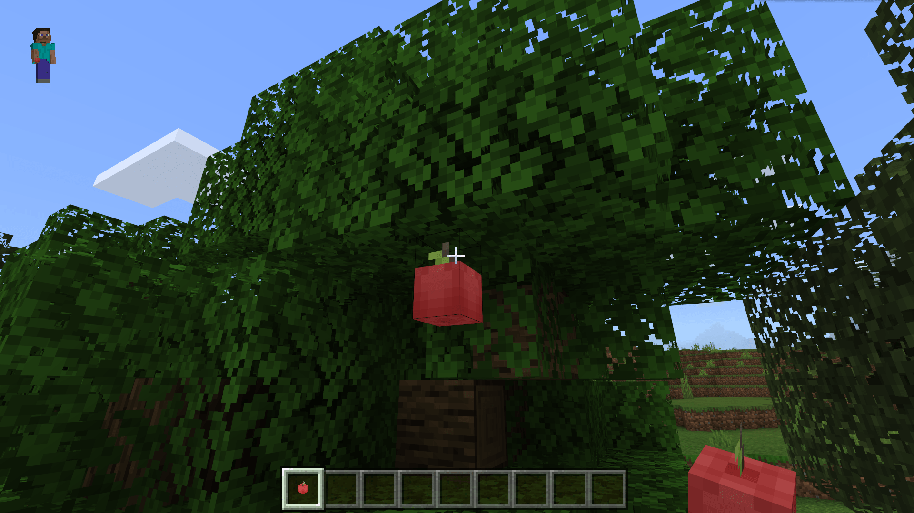

--- 
front: https://nie.res.netease.com/r/pic/20211104/69055361-2e7a-452f-8b1a-f23e1262a03a.jpg 
hard: Advanced 
time: 15 minutes 
--- 
# Make an apple block 

We have learned how to customize a basic block. Next, we will learn how to customize the block model. You can download the model resources to your local computer through [block model resources](https://g79.gdl.netease.com/addonguide-10.zip). 

## Prepare the apple model 

Although the latest international version of the interface already supports the custom model of blocks, the interface requires experimental gameplay above `1.16.100`. We use the Chinese version of the block model that is supported by the Chinese version. 

The Chinese version of the block model also uses the model supported by Blockbench, but the (0, 0, 0) of the block is at (8, 0, 8) of the model, which means that the entire block needs to be made with the center of the base surface as the northwest lower corner, and the "**Free Model**" mode needs to be used. 

 

We have prepared an apple model to imitate the apples hanging on the tree. We save it as a `.bbmodel` file. 

## Import the model in the editor 

The Chinese version of the block model uses a special file mode. In order to quickly convert it to the Chinese version of the block model format, we need to use the editor to import the model. We find the import button in the "File Management" pane. 

 

We select the Blockbench model and import it as a block model. 

 

Enter the model identifier, select the block item texture file corresponding to the model, and click OK to successfully import. After that, the file will be imported into the `models/netease_block` folder of the resource pack. 

We can view the model file. You can see that this file has been converted into a JSON file. 

```json
{
  "format_version": "1.13.0",
  "netease:block_geometry": {
    "description": {
      "identifier": "tutorial_demo:apple",
      //"item_texture": "tutorial_demo:apple_icon",
      "textures": ["tutorial_demo:apple"],
      "use_ao": false
    },
    "bones": [{
      "cubes": [{
        "origin": [8, 12, 5],
        "pivot": [11, 17, 10],
        "rotation": [0, 0, 0],
        "size": [0, 4, 6],

        "uv": {
          "down": {
            "texture": 0,
            "uv": [0, 0],
            "uv_size": [0, 3]
          },
          "east": {
            "texture": 0,
            "uv": [3, 1],
            "uv_size": [3, 2]
          },
          "north": {
            "texture": 0,
            "uv": [0, 0],
            "uv_size": [0, 3]
          },
          "south": {
            "texture": 0,
            "uv": [0, 0],
            "uv_size": [0, 3]
          },
          "up": {
            "texture": 0,
            "uv": [0, 0],
            "uv_size": [0, 3]
          },
          "west": {
            "texture": 0,
            "uv": [6, 1],
            "uv_size": [-3, 2]
          }
        }
      }, {
        "origin": [5, 6, 5],
        "pivot": [11, 6, 5],
        "rotation": [0, 0, 0],
        "size": [6, 6, 6],
        "uv": {
          "down": {
            "texture": 0,
            "uv": [6, 3],
            "uv_size": [-3, 3]
          },
          "east": {
            "texture": 0,
            "uv": [0, 0],
            "uv_size": [3, 3]
          },
          "north": {
            "texture": 0,

            "uv": [0, 0],
            "uv_size": [3, 3]
          },
          "south": {
            "texture": 0,
            "uv": [0, 0],
            "uv_size": [3, 3]
          },
          "up": {
            "texture": 0,
            "uv": [0, 3],
            "uv_size": [3, 3]
          },
          "west": {
            "texture": 0,
            "uv": [0, 0],
            "uv_size": [3, 3]
          }
        }
      }],
      "name": "bone",
      "pivot": [0, 0, 0],
      "rotation": [0, -90, 0]
    }] } 
} 
``` 

We can see that the format version is `1.13.0` and the mode identifier is `netease:block_geometry`. In `description`, `identifier` has a namespace for the identifier you just entered, `item_texture` is the short name of the texture map of the block item, and `textures` is the texture map used for UV mapping of this model. `use_ao` is whether to enable **ambient occlusion** for this model. Ambient occlusion is an effect that blocks the surrounding diffuse light when objects intersect or approach each other. 

## Configure the apple block using the editor 

We open the block in the editor, find the "**Basic Properties**" in the "**Properties**" pane, and click "**+**". 

 

We select `model` to add a model field to the description of the block. 

 

We select the model we just imported in the drop-down menu, and then we can attach the model to the block. Next, we only need to further configure other related properties of the apple block to complete the production. 

 

Let's examine the meaning of each component through the corresponding JSON file. 

```json 
{ 
"format_version": "1.10.0", 
"minecraft:block": {

    "description": {
      "identifier": "tutorial_demo:apple",
      "register_to_creative_menu": true
    },
    "components": {
      "minecraft:block_light_absorption": {
        "value": 0
      },
      "minecraft:destroy_time": {
        "value": 1.0
      },
      "minecraft:loot": {
        "table": "loot_tables/custom_apple.json"
      },
      "netease:aabb": {
        "clip": {
          "max": [0.6875, 1.0, 0.6875],
          "min": [0.3125, 0.375, 0.3125]
        },
        "collision": {
          "max": [0.6875, 1.0, 0.6875], 
"min": [0.3125, 0.375, 0.3125] 
} 
}, 
"netease:pathable": { 
"value": true 
}, 
"netease:render_layer": { 
"value": "alpha" 
}, 
"netease:solid": { 
"value": false 
} 
} 
} 
} 
``` 

`minecraft:block_light_absorption` is the opacity of the block, i.e. the degree of light absorption. The larger the value, the more light will be reduced when passing through it. We don't want this block to affect light propagation, so change it to be consistent with the opacity of air. 

`minecraft:destroy_time` is the hardness of the block, i.e. the base time of the block's destruction, in seconds. The actual destruction time is calculated by multiplying the base time by the corresponding speed modifier. 

`minecraft:loot` is the loot table that the block drops. We set it to a loot table that can drop apple items. 

 

`netease:aabb` is a component that only runs in the Chinese version. It is used to set the **Axis-Aligned Bounding Box** (or **Axis-Aligned Bounding Box**, abbreviated as **AABB**) of a block, that is, the **Collision** (**Collision**) volume and **Clip** (**Clip**) volume of the block. The collision volume is the volume of the block that collides with entities in the world, usually called the **Collision Box**; the clipping volume is used to set the clipping plane of the block, and the volume that interacts with the ray in the game, such as the ray of the player's camera and the track detection of the disappearance of projectiles, usually called the **Hitbox**. 

`netease:pathable` is also a Chinese version of the component, which is used to set whether a block is a path-finding block. Path-finding blocks allow themselves to be considered as trampled blocks when calculating the biological path-finding algorithm. 


`netease:render_layer` is a Chinese version component that determines the **render layer** of the block. The rendering layer of a block is a series of preset rendering methods, which are bound to different materials and are used to determine whether a block is transparent, semi-transparent, double-sided rendering, etc. 

`netease:solid` is a Chinese version component that determines whether the block is **solid**. In Bedrock Edition, the solid property determines whether the creature will be suffocated in the block. 

We set the block to a non-solid that does not absorb light, set the bounding box to be consistent with the model, and set the rendering layer to transparent, and then we can complete the setting of a regular non-solid block. 

 

 

We enter the game for self-testing and can see that the rendering and model of Apple are very normal, just in line with our expectations!