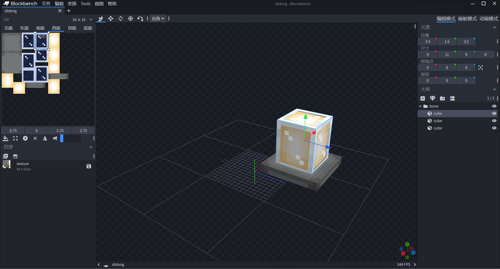
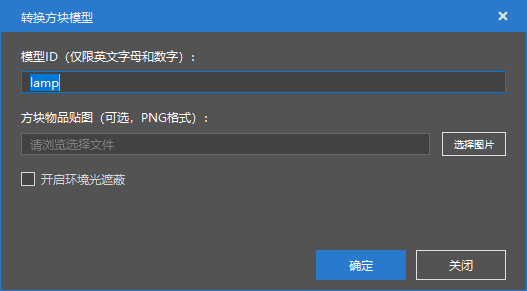
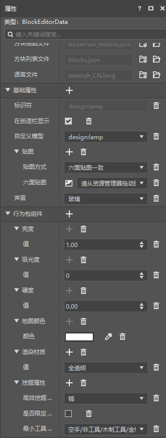

--- 
front: https://nie.res.netease.com/r/pic/20211104/69055361-2e7a-452f-8b1a-f23e1262a03a.jpg 
hard: Advanced 
time: 15 minutes 
--- 
# Challenge: Make a glowing floor lamp 

In this section, we complete a challenge and make a glowing floor lamp. You can click the [block model resource](https://g79.gdl.netease.com/addonguide-10.zip) link to download the model resource to your local computer. The floor lamp block model is in the bbmodel folder in the compressed package. 

## Prepare the model 

We draw a glowing floor lamp model in Blockbench. 

 

We use the import block model function in the editor to import the model. 

 

## Create and modify configuration 

 

We create a block configuration, and then add the model of the ground lamp and the sound of the glass by adding `model` and `sound` in "**Basic Properties**". In "**Behavior Pack Component**", focus on setting "Brightness" to a value greater than 0, "Absorbance" to 0, and "Rendering Material" to "Fully Transparent". If non-zero absorbance is set, the ground lamp will not be able to fully emit light equivalent to brightness, and if the rendering material is not set to transparent, a black shadow will appear. 

We also show the corresponding JSON file. Behavior package definition file:

```json
{
  "format_version": "1.10.0",
  "minecraft:block": {
    "description": {
      "identifier": "design:lamp",
      "register_to_creative_menu": true
    },
    "components": {
      "minecraft:block_light_absorption": {
        "value": 0
      },
      "minecraft:block_light_emission": {
        "emission": 1.0
      },
      "minecraft:destroy_time": {
        "value": 0.0
      },
      "minecraft:map_color": {
        "color": "#ffffff"
      },
      "netease:render_layer": {

"value": "alpha" 
}, 
"netease:tier": { 
"destroy_special": false, 
"digger": "pickaxe", 
"level": 0 
} 
} 
} 
} 
``` 

Resource pack definition file: 

```json 
{ 
"format_version": [1, 1, 0], 
"design:lamp": { 
"netease_model": "design:lamp", 
"sound": "glass" 
} 
} 
``` 

Texture atlas file: 

```json 
{ 
"resource_pack_name": "vanilla", 
"texture_name": "atlas.terrain", 
"texture_data": { 
"design:lamp": { 
"textures": "textures/blocks/design/lamp" 
} 
} 
} 
``` 

Block model geometry: 

```json 
{ 
"format_version": "1.13.0", 
"netease:block_geometry": { 
"description": { 
"identifier": "design:lamp", 
"textures": ["design:lamp"], 
"use_ao": false 
}, 
"bones": [{

      "name": "bone",
      "pivot": [0, 0, 0],
      "rotation": [0, 0, 0],
      "cubes": [{
        "origin": [-12.5, 1.5, 3.5],
        "pivot": [0, 0, 0],
        "rotation": [0, 0, 0],
        "size": [9, 11, 9],
        "uv": {
          "down": {
            "texture": 0,
            "uv": [5.75, 6.25],
            "uv_size": [-2.25, 2.25]
          },
          "east": {
            "texture": 0,
            "uv": [3.5, 0],
            "uv_size": [2.25, 2.75]
          },
          "north": {
            "texture": 0,
            "uv": [3.5, 3.5],
            "uv_size": [2.25, 2.75]
          },
          "south": {
            "texture": 0,
            "uv": [5.75, 5.75],
            "uv_size": [2.25, 2.75]
          },
          "up": {
            "texture": 0,
            "uv": [5.75, 2.75],
            "uv_size": [2.25, 2.25]
          },
          "west": {
            "texture": 0,
            "uv": [5.75, 0],
            "uv_size": [2.25, 2.75]
          }
        }
      }, {
        "origin": [-12, 2, 4],
        "pivot": [0, 0, 0],
        "rotation": [0, 0, 0],
        "size": [8, 10, 8],
        "uv": {
          "down": {
            "texture": 0,
            "uv": [4, 8.5],
            "uv_size": [-2, 2]

          },
          "east": {
            "texture": 0,
            "uv": [8, 8],
            "uv_size": [2, 2.5]
          },
          "north": {
            "texture": 0,
            "uv": [0, 7],
            "uv_size": [2, 2.5]
          },
          "south": {
            "texture": 0,
            "uv": [8, 0],
            "uv_size": [2, 2.5]
          },
          "up": {
            "texture": 0,
            "uv": [8, 5],
            "uv_size": [2, 2]
          },
          "west": {
            "texture": 0,
            "uv": [8, 2.5],
            "uv_size": [2, 2.5]
          }
        }      }, {
        "origin": [-15, 0, 1],
        "pivot": [0, 0, 0],
        "rotation": [0, 0, 0],
        "size": [14, 2, 14],
        "uv": {
          "down": {
            "texture": 0,
            "uv": [3.5, 3.5],
            "uv_size": [-3.5, 3.5]
          },
          "east": {
            "texture": 0,
            "uv": [8, 7.5],
            "uv_size": [3.5, 0.5]
          },
          "north": {
            "texture": 0,
            "uv": [8, 7],
            "uv_size": [3.5, 0.5]
          },
          "south": { "texture": 0,

"uv": [4, 8.5], 
"uv_size": [3.5, 0.5] 
}, 
"up": { 
"texture": 0, 
"uv": [0, 0], 
"uv_size": [3.5, 3.5] 
}, 
"west": { 
"texture": 0, 
"uv": [4, 9], 
"uv_size": [3.5, 0.5] 
} 
} 
}] 
}] 
} 
} 
``` 

Language localization file `zh_CN.lang`: 

```lang 
tile.design:lamp.name=Ground lamp 
``` 

Let's enter the game to see the effect. 

 

As you can see, the model of the ground lamp is consistent with the expectation, and it emits the highest brightness light as expected.