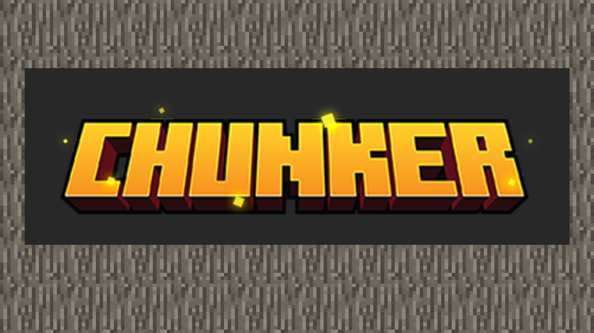
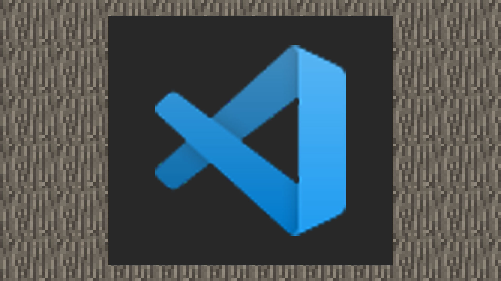

--- 
front: https://nie.res.netease.com/r/pic/20210730/ee109f39-8987-46e0-9fe7-40ebb23060fa.png 
hard: Getting Started 
time: 10 minutes 
--- 
# Useful tools are the starting point of everything 

In the past, many Bedrock Edition map makers took advantage of the cross-platform advantage to create their own gameplay maps on mobile phones. Here we will recommend using tools on the PC platform to help you speed up the development of maps. Whether you are a JAVA version building author, Bedrock Edition component author, or command block map author, use the following tools to convert your current resource format faster, quickly create supporting resources, or optimize the experience of writing behavior packs. 

## Chunker [Map Tool] 

Chunker is an online map conversion solution launched by the international version of Minecraft team HiveMC. It supports the latest world formats of Bedrock Edition 1.17.x and JAVA Edition 1.17.x. Choose to directly upload the map folder or map compressed file, you can quickly modify the map settings, preview the 2D floor plan of the loaded area of the map, and convert it to the corresponding version format with one click. [Click the link](https://chunker.app/) to quickly jump to the Chunker website. 

 

## Visual Studio Code [Coding Tool] 

Visual Studio Code (VS Code for short) is a free cross-platform source code editor developed by Microsoft. For developers with low computer performance configuration, using this lightweight editor can minimize the pressure on your computer when creating MC content. Whether it is quickly editing the JSON content of data-driven add-on packages or importing Modsdk completion libraries for mod development, it is capable of these tasks. 

 

## Blockbench/Photoshop/Aesprite[Art Tools] 

Blockbench is a free and open-source Minecraft art asset creation tool developed by Jennis. It supports the model formats of the JAVA version and the Bedrock version, and provides real-time animation editing preview and particle sound effect preview functions for the Bedrock version, as well as texture drawing functions. Based on the cross-platform feature, it provides online and local versions. In order to avoid the loss of assets when editing on the web, it is strongly recommended to download the local version and set an automatic backup time. 

Photoshop is an image design software developed and released by Adobe. It can also perform texture drawing and pixel material production. But most of the time, the texture design of Minecraft models can be completed in Blockbench. Only when the texture needs to be advanced modified, such as supporting the luminous material of the Bedrock version, will it be more advantageous to use Photoshop. 

Aseprite is a dynamic pixel sprite and pixel texture production tool. Compared to Photoshop, it is smaller and provides better image algorithms for pixel drawing, so that you can get clearer results when rotating and scaling maps. Dynamic pixel sprites are sequence frames with multiple pixel maps. When making particle effects that play sequence frames, using Aseprite can get the results you want faster. 

## Bridge. [Add-on package editing tool] 

Bridge. is a text editor and tool chain that generates add-ons with one click and provides JSON syntax highlighting for add-ons. Bridge. does not provide a running environment for simulating the running of add-ons, but it can help your add-ons operate normally in the game with legal content formats. 

## Pycharm [Modsdk IDE] 

Pycharm is an integrated development environment (IDE) for Python language development, developed by Czech company JetBrains. The current Chinese version will continue to maintain the Modsdk framework based on Python language to help developers create more flexible and playable gameplay. Using IDE can help you manage project versions, provide code completion, and syntax checking. However, Modsdk does not currently support IDE breakpoint debugging, so the code can only be debugged by logging in different places.