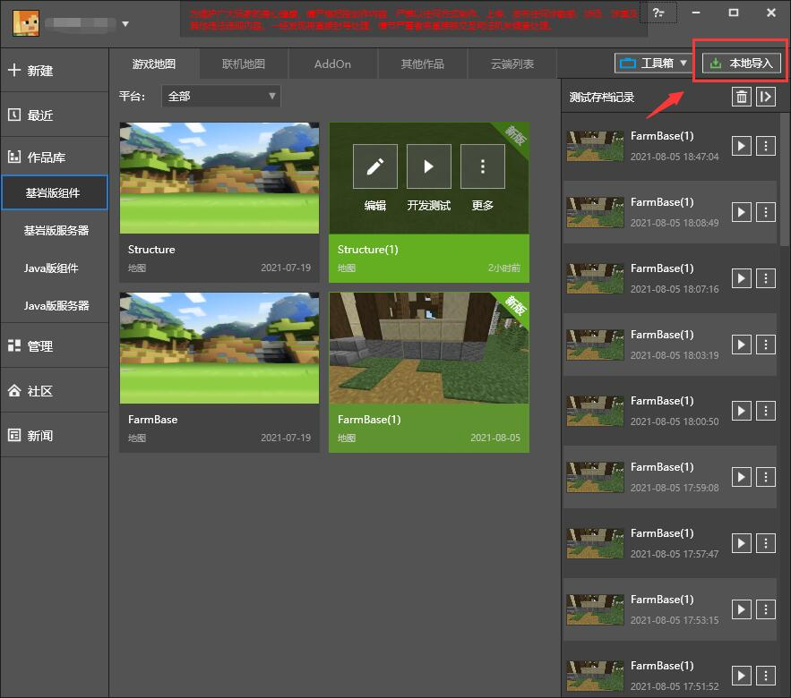

--- 
front: https://nie.res.netease.com/r/pic/20210730/ee109f39-8987-46e0-9fe7-40ebb23060fa.png 
hard: Getting Started 
time: 15 minutes 
--- 
# Create a map project in MCSTUDIO 
The gameplay map tutorial has prepared map archive resources for you in advance, including **Structure archive** and **FarmWorld archive**. Among them, **Structure archive** is a super flat map, and all the individual buildings are listed around the birth point of the map. This is done because when building a single building in a super flat world, it will not be troubled by **terrain affecting building construction**, and at the same time, it can more intuitively see **the style and scale of all buildings**, which is convenient for architects to make unified planning and adjustments. **FarmWorld archive** is the terrain archive of the theme gameplay map. We will use these two maps to synthesize the final complete map overview. 

## Locally import map resources 

Enter the MCSTUDIO library and select the Bedrock Edition component. Click Local Import in the upper right corner, select Map as the resource type, and select **Structure archive** and **FarmWorld archive** in the window through the selection function, and finally click the Import button to complete the import operation. 

 

In the future, the new version of the editor will cover the daily development process of developers in many aspects. We recommend that you upgrade your map works to the new format and experience the charm of the new version of the editor in advance. 

 

## Use chunker to change the properties of the map 

In order to reduce the difficulty of developing "My Seaside Farm", in this map, we only consider the situation where players play in a **single-player environment**. Therefore, we choose not to expose the player's room to the local LAN or network environment.

We have already turned off these settings when pre-processing the map resources, but you can repeat this operation for other maps in the future. 

You must use the relevant map processing tools to process the map. It is recommended to use [chunker](https://chunker.app/) to modify the map NBT. NBT also exists in Bedrock Edition and manages some basic settings of the map in the map file. After uploading the map successfully, select Advance Settings in the lower right corner, then select WORLD SETTINGS, and manually turn off **Multiplayer Game Enabled**, **Visible to Multiplayer**, **LAN Broadcast Enabled**, **Visible to LAN Players** and other switches. 

 

We also need to turn off **Do Insomnia**, **Do Mob Spawning** and **TNT Explodes** to prevent players from encountering TNT explosions, natural creature spawns and phantom interference in the map. 

 

Then click CONVERT to convert the source document again, and DOWNLOAD to download it locally. 

## Add a constant loading area 

Usually, the area in the world that is being loaded is around the player. As the player moves, new chunks that enter the range will be added to the list of chunk updates, and old chunks that leave the range will stop updating. In order to use ModSDK to obtain block and entity information in the loading area in subsequent tutorials, we need to put all the chunks spanned by the main island into the constant loading area. Using the **/tickingarea** command can help us achieve this effect: 

``` 
/tickingarea add 64 0 64 200 0 180 
``` 

Press the / key in the level or map editor to call out the input box, and then insert this command. 

