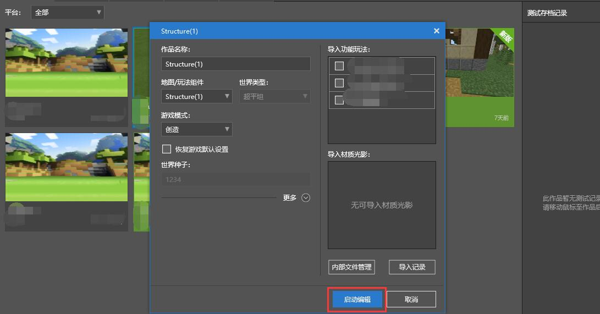
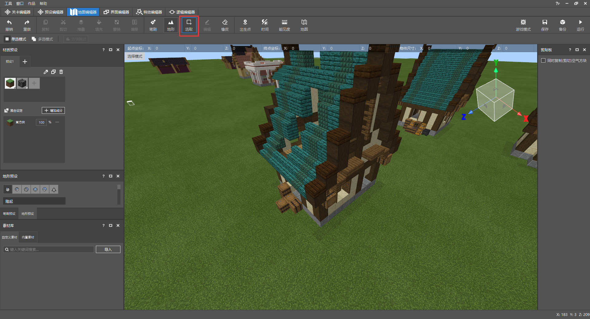
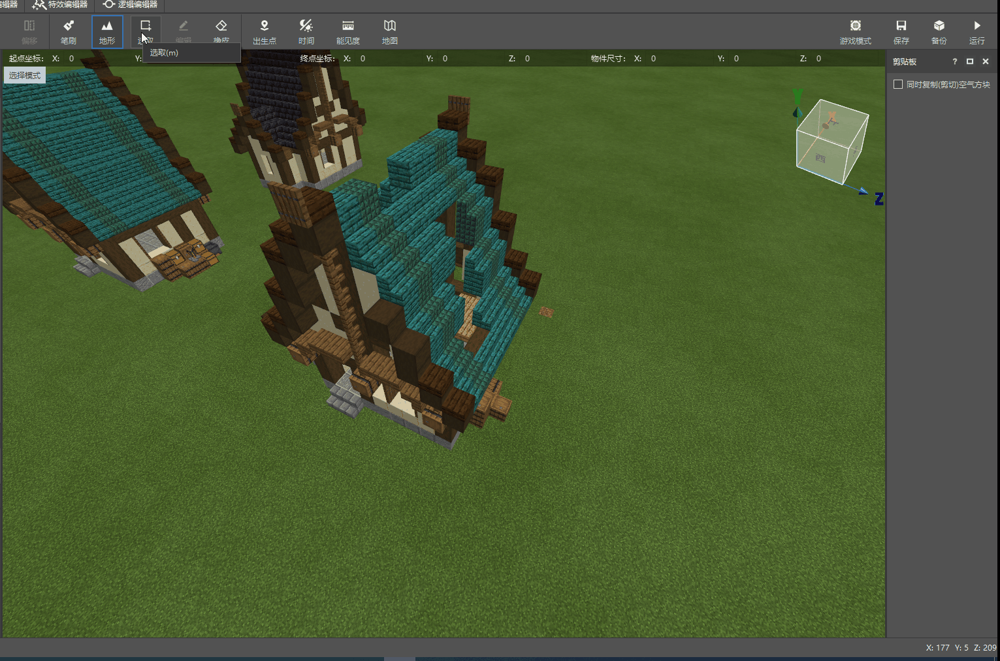
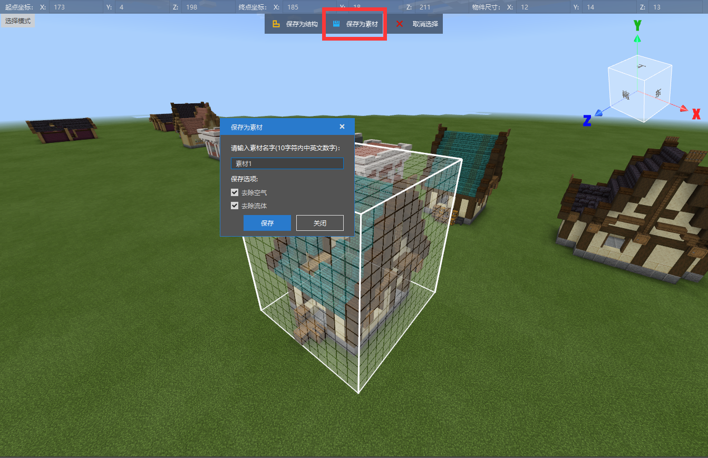

--- 
front: https://nie.res.netease.com/r/pic/20210730/ee109f39-8987-46e0-9fe7-40ebb23060fa.png 
hard: Getting Started 
time: 15 minutes 
--- 
# Save resource materials in the map project 

Since the independent buildings and the terrain overview are separated in two map archives, we need to export the buildings in the super flat terrain into custom materials through the map editor first. Let's see how to do it! 

## Export custom building materials 

Click Edit on the new format **Structure map work** to enter the editor world. 

 

Use the selection tool to select the bottom of the building on the super flat terrain. 

 

By clicking on the upper surface of the selection grid and dragging with the mouse, you can raise the height of the selection grid and select the entire **Player House** and the grass block one grid below the ground. 

 

Use the coordinate axis to raise the entire selection grid by one grid, and click the upper grid surface to lower the height by one grid to remove the space gap of the grass block one grid below the ground. 

 

Click **Save Material**. The material supports Chinese, English and numbers within 10 characters, and the exported mdl format only supports circulation in the editor, or placement in the game using the preset API. Under the default selection, Remove Air and **Remove Fluid** will be checked. If there is fluid in the building, you can uncheck **Remove Fluid**. 

 

The saved custom materials will be placed under **Custom Materials** in **Material Library**. **Custom Materials** are stored in the common editor folder, and map editors of different maps can retrieve the previously prepared **Custom Materials**.