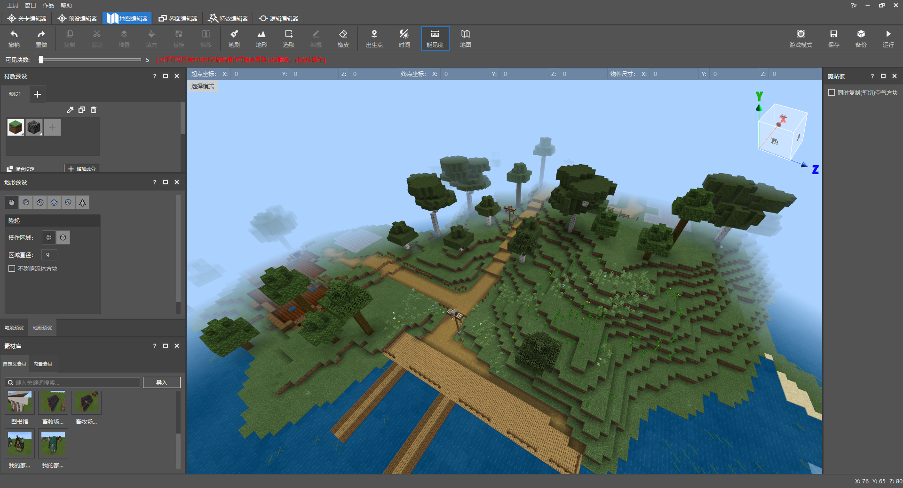
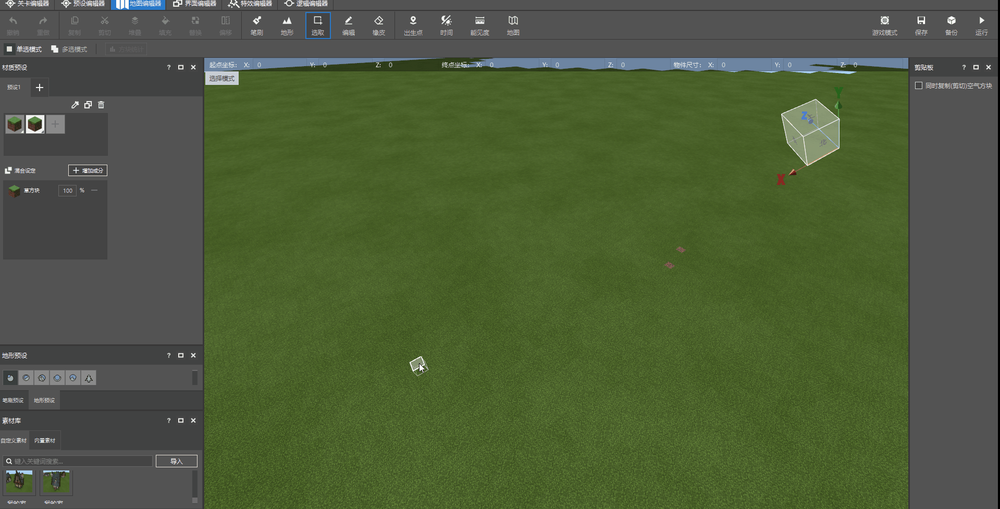

--- 
front: https://nie.res.netease.com/r/pic/20210730/ee109f39-8987-46e0-9fe7-40ebb23060fa.png 
hard: Getting Started 
time: 30 minutes 
--- 

# Try to get familiar with the basic map editor functions 

When entering the **FarmWorld archive** work, the pre-placed foundation in the terrain provides us with the placement coordinates of the material. Through a few basic map editing steps, we can also easily decorate the building into the world. 

## Adjust visibility 

The original map editor provides very low visibility. When looking down at the terrain from a God's perspective, only a small part of the terrain will enter the field of vision. We use the **visibility function** to quickly increase the number of visible blocks. 

Click **visibility** to drag the number of visible blocks. The longer the progress, the larger the range that can be seen. 

**Note: Please do not increase the number of visible blocks excessively, as this will put a great load on your computer equipment! ** 

 

## Adjusting the time 

The world in the map editor will also change from day to night as time passes. You can click the **time function** to switch the game time so that the world always stays in daytime. 

 

## Placing custom materials 

We can drag the material in the game area by clicking the material option. Then click any coordinate in the game and click Confirm Generation again to add the material building back to the world. If you want to withdraw after making changes, you can use the CRTL+Z shortcut key to withdraw to the previous operation step. 

 

