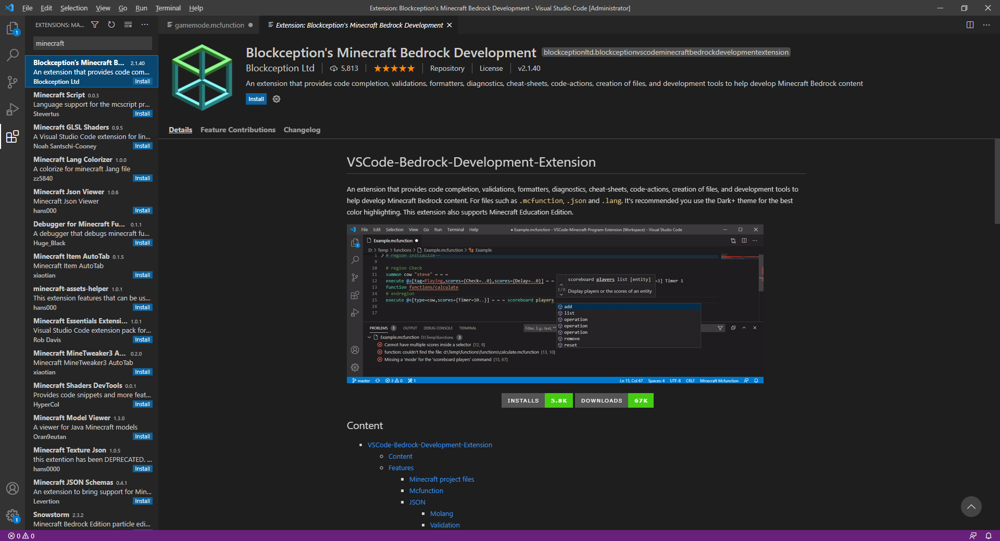
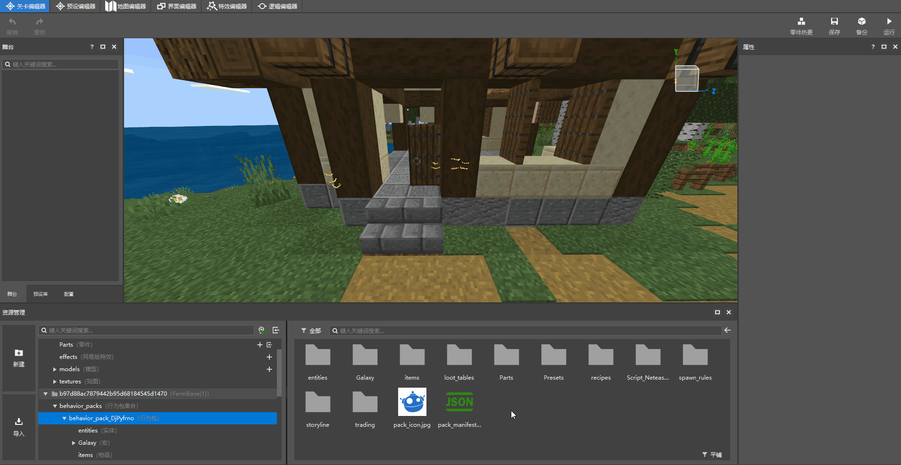
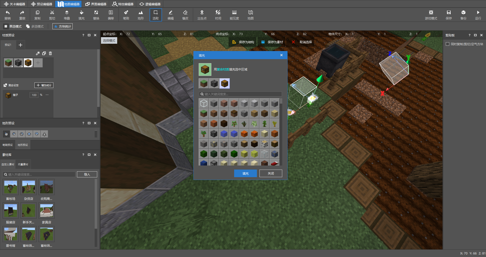

--- 
front: https://nie.res.netease.com/r/pic/20210730/ee109f39-8987-46e0-9fe7-40ebb23060fa.png 
hard: Advanced 
time: 40 minutes 
--- 
# Plan the immutable area 

The immutable area refers to the area in the map that cannot be destroyed and blocks cannot be placed. Since all biomes in the world have been set to ocean biomes during the early processing of the **material map**, the world lacks materials for players to repair resource points and buildings. If the scene is accidentally destroyed by the player, this behavior can easily lead to a significant reduction in the overall gameplay process and aesthetics. In order to prevent the bad effects of such behavior, we need to make the main buildings, terrain, or resource points indestructible and unable to add blocks on them. 

At the same time, during the game, players need basic tools and food to survive. In addition to planting crops, players can also obtain gold coins by mining **wood and stone** from resource points in the scene. Therefore, we need to provide players with a basic **tool food box** so that players can successfully pass the early game with a higher tolerance rate. 

## Use Function files to fix the player's game mode to adventure mode 

> In the past, when making gameplay maps, command block authors often used a looping command block to set the game mode of surrounding players. Now, the function file in the behavior pack can achieve the same effect, and the working mode is placed in the behavior pack to achieve a more hidden effect. 

In the MC STUDIO editor, a gameplay map project will automatically generate a project folder for the behavior pack and resource pack by the editor. The function file will take effect in the functions folder under the root directory of the behavior pack. If a new tick.json file is created in the folder directory, it can command the instructions in the function file to run in a loop after the world is loaded. 

First, create a function file ending with **.mcfunction** anywhere on the computer. It is recommended to use any third-party editor with mcfunction smart completion. In this example, we will use **Visual Studio Code** (abbreviated as: vs code). Before starting work, we need to download Blockception's Minecraft Bedrock Development plugin in the extension area. 

 

You can directly drag and drop the file icon to the editor page, and the editor will automatically swallow and open it. Simply enter one of the commands, and the subsequent parameters will be intelligently prompted and automatically completed by pressing the enter or tab key. 

 

Unlike the need to add slashes when typing commands in the input box and command block in the game, there is no need to add **/** symbols in the function file. At the same time, the execution order of the commands will be **executed in order from top to bottom**. If the commands in the function file are executed in a loop, **when the command is executed to the end, it will start again from the beginning of the file**. 

Setting the player to adventure mode can prevent the player from destroying and adding blocks, so we first need to write the following command in the function file to determine whether the player is in non-adventure mode, and if so, change their game mode to adventure mode. 

``` 
execute @a[m=!adventure] ~~~ gamemode adventure @s 
``` 

Then create a new functions folder and put the function file in it, and create a new tick.json file in the same directory. 

 

In the tick.json file, enter the following JSON content, with "values" as the key, it accepts an array based on the function file name. The commands in the function file will be executed once in each game logic frame, just like the loop command block. 

```json 
{ 
"values": [ 
"gamemode" //gamemode is the file name of gamemode.mcfunction 
] 
} 
``` 

Finally, use the editor to open the map project, click the collapsed behavior pack folder under the resource management bar, and import the functions folder in the window preview area on the right. 


 

## Use minecraft:can_destroy to customize farm tools with the ability to destroy specific blocks 

After opening the adventure mode, although the player cannot place blocks or destroy blocks at will, the gameplay map still needs to provide the player with necessary farm tools to collect materials from resource points, and when the player accidentally steps on the farmland, he can also have a hoe to restore the farmland. Adding the minecraft:can_destroy tag in the give command allows the user to still have the ability to mine specific blocks in adventure mode: 

``` 
/give @s stone_pickaxe 1 0 {"minecraft:can_destroy": {"blocks":["log", "log2"]}} 
# Give the player a stone axe with full durability. The array corresponding to blocks supports multiple custom blocks and original blocks, but the custom blocks need to write the full namespace:identifier format of the block name domain. 
``` 

**The original hoe allows the user to ignore the level permission and turn all grass blocks into farmland**. In order to prevent players from cultivating the terrain without restraint, in the next chapter, we will start to learn how to use Mod to prevent players from doing this. 

## Add tool food box 

In the map editor, we select the selection mode and keep the single selection mode. 

 

Then click the ground and drag the Y axis to move the selection up one grid. 

 

Select the fill function to fill the area in the grid with box blocks. 

 

We need to remember the starting coordinates in advance, here we take [72,66,81] as an example. By using the scoreboard instruction to add a chest scoring item, we can design an instruction set to add farm tools to the box every 1200 frames. That is, the chest count will be incremented by 1 every frame, and the scores parameter of the target selector will be used to determine whether the player's chest score has reached 1200, so as to perform an action of filling the box with tools and food. Finally, the player's score will be reset to 0, and the repeated work will be performed after the next cycle. Detailed instructions are as follows:

```
scoreboard objectives add chest dummy "chest"
scoreboard players set @a[m=!2] chest 0
execute @a[m=!2] ~~~ gamemode 2 @s
scoreboard players add @a[m=2] chest 1
execute @a[m=2,scores={chest=1200..}] ~~~ replaceitem block 72 66 81 slot.container 0 stone_axe 1 0 {"minecraft:can_destroy": {"blocks": ["log"]}}
execute @a[m=2,scores={chest=1200..}] ~~~ replaceitem block 72 66 81 slot.container 1 stone_pickaxe 1 0 {"minecraft:can_destroy": {"blocks": ["stone"]}} 
execute @a[m=2,scores={chest=1200..}] ~~~ replaceitem block 72 66 81 slot.container 2 stone_hoe 1 0 {"minecraft:can_destroy": {"blocks": ["Custom plant block name"]}} 
execute @a[m=2,scores={chest=1200..}] ~~~ replaceitem block 72 66 81 slot.container 3 bread 10 
scoreboard players set @a[m=2,scores={chest=1200}] chest 0 
``` 

## Add interiors to buildings 

The building templates used in the gameplay map do not have built-in interiors. Now let's take the clothing store as an example to add some interiors: 

First, we switch to the map editor, we switch the function to selection, and turn on multi-select mode.


Click the gap between the beam and the roof, and drag them up one by one. 

 

Finally, use the light as the material preset, and select the fill function to uniformly fill the selected area. 

 

Because some blocks in Bedrock Edition need to be placed with items. The current map editor does not support the type of blocks that are separated from items. We can exit the free camera state by clicking **Game Mode** in the upper right corner of the map editor, and then we can open the backpack and place blocks directly in the world. Here is an example of placing a bed: 

