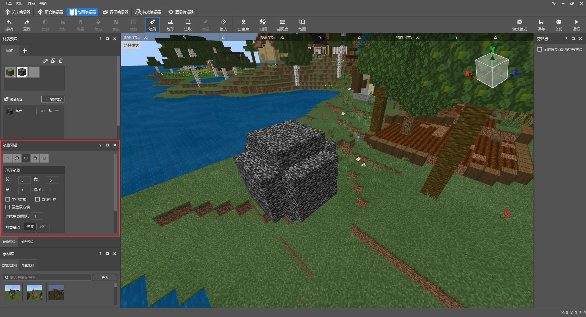

--- 
front: https://nie.res.netease.com/r/pic/20210730/ee109f39-8987-46e0-9fe7-40ebb23060fa.png 
hard: Advanced 
time: 70 minutes 
--- 
# Plan slightly changeable areas 
The farm house on the island will provide players with a well-developed farmland for players to grow crops. At the same time, the map will also involve multiple resource points for players to collect wood, stone, etc. They can help players have enough materials to repair farm facilities. In the previous chapter, we provided players with a fixed refresh tool food box. With the help of the gameplay system of the original game, we have initially created a sustainable production environment for players. But there are also some problems here: 

- The hoe can cultivate all the soil regardless of the level authority. 
- The wood and stone resource points cannot be regenerated after being hollowed out by the player. 
- Players need to unlock the farm house and livestock farm by recycling resources. 

In order to solve the above problems, using the ModSDK framework can help us solve the above problems very quickly. Let's see how to do it! 

<iframe src="https://cc.163.com/act/m/daily/iframeplayer/?id=6152b923b8a81f8fa07dc899" height="600" width="800" allow="fullscreen" /> 

## Access the Mod environment 

The editor will create a new Mod script folder in the map project. The folder will be composed of **Script_NeteaseMod** plus a string of random characters. 

 

> - The modMain.py file is the main entry of the Mod script. There can only be one entry file in the main directory of a script folder. We can only register custom server and client systems here. 
> - A custom system is a class. Before learning object-oriented programming in Python, you can simply understand it as creating a system entry. This entry will be hooked into the function decorated by @Mod.InitServer() or Mod.InitClient() depending on whether it runs on the server or client. Use the clientApi.RegisterSystem interface when running on the client, and use the serverApi.RegisterSystem interface when running on the server. 
> - RegisterSystem accepts 3 parameters. The first parameter is the unique communication identifier of the mod. The second is the custom system name. The third is the path of the custom system class. It is recommended to use readable, memorable and unique names for the unique communication identifier and custom system name, which will help the game engine better distinguish various system entries from different mods. Using highly repetitive names may cause the script engine to be unable to identify the source when registering the custom system, resulting in a failure to load the mod. The path parameter will merge the file path with the name of the system class. Take the following code as an example: If the system class is named **Main** in the py file, the system file is named **blockListener**r as the py file name, and it is also wrapped in the server folder of the Mod main directory. Then the path will be sorted as **Script_Netease{random string}.server.blockListener.Main**. 

```python 
# -*- coding: UTF-8 -*- 
from mod.common.mod import Mod 
import mod.server.extraServerApi as serverApi 
import mod.client.extraClientApi as clientApi 

@Mod.Binding(name="NeteaseModw7ijjGNn", version="0.1") 
class NeteaseModw7ijjGNn(object): 

def __init__(self): 
pass 

@Mod.InitClient() 
def NeteaseModw7ijjGNnClientInit(self): 
# type: () -> None 
"""When Mod is mounted, register the custom MOD client system here""" 
pass 

@Mod.InitServer() 
def NeteaseModw7ijjGNnServerInit(self): 
# type: () -> None

"""When Mod is mounted, register the custom MOD server system here""" 
serverApi.RegisterSystem("FarmMod", "ServerBlockListenerServer", 
"Script_NeteaseModw7ijjGNn.server.blockListener.Main") 
pass 

@Mod.DestroyClient() 
def NeteaseModw7ijjGNnClientDestroy(self): 
# type: () -> None 
"""When Mod is removed, destroy the custom MOD client system""" 
pass 

@Mod.DestroyServer() 
def NeteaseModw7ijjGNnServerDestroy(self): 
# type: () -> None 
"""When Mod is removed, destroy the custom MOD client system""" 
pass 
``` 

> - You can listen to original events and custom Mod events in the custom system. 
> - According to the difference between the server and the client, we use the corresponding original event to define a callback function in the <a href="../../../mcdocs/1-ModAPI/事件/世界.html" rel="noopenner"> module SDK document </a>. The callback function will return the data information passed by this event. By extracting the data, judging the type, and creating an interface, we can implement rich gameplay logic. 
> - In the custom system class, we can also encapsulate commonly used code blocks with functions to achieve higher development efficiency. 

## Prevent players from plowing other areas 

In the terrain overview, there are three types of blocks that will be plowed by hoes, namely **grass**, **soil**, and **soil path**. Among them, **soil** is the block type that allows players to plow. 

We use the **ServerBlockUseEvent** event to monitor the behavior of players interacting with blocks and prevent them from further operations when they hold a stone hoe. 

 

In order to prevent players from arbitrarily turning over grass and dirt paths, we need to add them to the whitelist of blocks that listen to interactions, and cancel the interaction between stone hoes and blocks in the event. The complete code is as follows: 

```python 
# -*- coding: UTF-8 -*- 
from mod.server.system.serverSystem import ServerSystem 
from mod.common.minecraftEnum import ItemPosType 
import mod.server.extraServerApi as serverApi 

# Custom Mod server system class 
class Main(ServerSystem): 

def __init__(self, namespace, system_name): 
# Inherit parent class 
ServerSystem.__init__(self, namespace, system_name) 
namespace = serverApi.GetEngineNamespace() 
system_name = serverApi.GetEngineSystemName() 
# Listen for interactive block events 
self.ListenForEvent(namespace, system_name, 
'ServerBlockUseEvent', self, self.using_item) 
# According to the document description, the original block needs to be added to the whitelist of interactive blocks in order to trigger ServerBlockUseEvent.

block_comp = serverApi.GetEngineCompFactory().CreateBlockUseEventWhiteList(serverApi.GetLevelId()) 
# In the block structure of the map, there are two types of terrain blocks affected by the hoe. 
self.blocked_list = ["minecraft:grass", "minecraft:grass_path"] 
for block_name in self.blocked_list: 
# Add to whitelist 
block_comp.AddBlockItemListenForUseEvent(block_name) 

# Interactive block event 
def using_item(self, event): 
# Get player ID 
player_id = event['playerId'] 
# Create player's item interface 
item_comp = serverApi.GetEngineCompFactory().CreateItem(player_id) 
# Get player's handheld item information 
carried_item = item_comp.GetPlayerItem(ItemPosType.CARRIED, 0) 
# Get the block type of the interaction in the event 
block_name = event['blockName'] 
# Determine whether the block type is dirt or grass, and whether the player's handheld item is a stone hoe 
if carried_item and carried_item['newItemName'] == 'minecraft:stone_hoe' and block_name in self.blocked_list: 
# Cancel the interaction 
event['cancel'] = True 
``` 

Finally, we switch the editor interface to the map editor and enter the embedded game environment through the game mode function. Now you can't use a hoe to cultivate dirt and dirt, but players can still restore dirt to farmland! 

 

## Recyclable resource points 

Obtaining gold coins is an important way for players to unlock more furniture, clothes, and expand the scale of agriculture. The direct source of income comes from the income from players' agricultural production activities. However, there is an objective growth cycle for the maturity of agricultural products. Crops will advance in growth stages as the game progresses randomly, which may make players feel that time is passing very boring. Therefore, adding resource point settings for wood and stone is a way to change the rhythm of the game for players. While we provide players with additional channels for obtaining gold coins, we also allow them to use their time more fulfillingly. 

First, use the map editor to pre-make resource areas. Click the brush function. 

 

If the **brush preset panel** is folded, you can click the connection area with other panels to stretch it. Here we use the **circle preset**, which uses a default size of 5 height, 5 length, and 5 width. 

 

In the **mixing settings**, set the composition of the three-dimensional area blocks of the **brush**. Click the **add component** button and adjust the setting so that the brush shape will mix 50% stone and 50% wood. 

 

In the tutorial, we only set up 5 resource points and recorded the coordinates of the lower left corner of the resource point using the selection tool. Finally, we save the resource points to the local behavior pack by saving the structure, and use ModSDK to reset them periodically. 

> The difference between **structure** and **material** is that the former is the common format of the Bedrock Edition of Minecraft, while the latter is the template format saved by MCSTUDIO. Developers and players can generate them in the game or using ModSDK by sharing the structure. In most cases, materials are used around MCSTUDIO. But both functions use map buildings as templates, so that we can call them directly when changing scene blocks. 

```python 
# -*- coding: UTF-8 -*- 
from mod.server.system.serverSystem import ServerSystem

from mod.common.minecraftEnum import ItemPosType 
import mod.server.extraServerApi as serverApi 

class Main(ServerSystem): 

def __init__(self, namespace, system_name): 
# Inherit parent class 
ServerSystem.__init__(self, namespace, system_name) 
namespace = serverApi.GetEngineNamespace() 
system_name = serverApi.GetEngineSystemName() 
# Listen for interactive block events 
# ........... 
self.resources_pos = [ 
# Starting coordinates of resource point 1 
(73, 64, 57), 
# Starting coordinates of resource point 2 
(51, 63, 101), 
# Starting coordinates of resource point 3 
(82, 68, 136), 
# Starting coordinates of resource point 4 
(198, 65, 102), 
# Starting coordinates of resource point 5 
(82, 68, 136) 
] 
# Structure name, in the format of [folder name: structure name] in the behavior pack root directory/structures 
self.resource_identifier = 'design:resource' 
# Add a timed task to reset resource points in 60 seconds 
game_comp = serverApi.GetEngineCompFactory().CreateGame(serverApi.GetLevelId()) 
game_comp.AddRepeatedTimer(60.0, self.resource_placed) 

# Interactive block event 
def using_item(self, event): 
# ..... 
pass 

def resource_placed(self): 
# Create an interface for placing structures 
game_comp = serverApi.GetEngineCompFactory().CreateGame(serverApi.GetLevelId()) 
for pos in self.resources_pos: 
# Place resource point structure 
game_comp.PlaceStructure(None, pos, self.resource_identifier) 

``` 

 

## Add a repair plan for farm houses and livestock farms 

First, drag out the complete farm house and livestock farm building templates on the sea surface, save them as structures and remove air blocks. Then use the Delete shortcut key to delete them directly. Doing so can minimize the impact of temporary buildings on the terrain (such as eating up some blocks and returning grass to soil).


 

 

Next, we use the map editor to place wooden signs next to the two independent buildings to be repaired using the game mode, and write separate text prompts on the wooden signs. 

 

Next, we can use ModSDK to listen to the player clicking on the wooden sign, and decide whether to repair the corresponding building based on the player's resource reserves and the content of the wooden sign! The following is the detailed code and comments: 

```python 
# -*- coding: UTF-8 -*- 
from mod.server.system.serverSystem import ServerSystem 
from mod.common.minecraftEnum import ItemPosType 
import mod.server.extraServerApi as serverApi 

class Main(ServerSystem): 

def __init__(self, namespace, system_name): 
# Inherit parent class 
ServerSystem.__init__(self, namespace, system_name) 
namespace = serverApi.GetEngineNamespace() 
system_name = serverApi.GetEngineSystemName() 
# Listen for interactive block events 
self.ListenForEvent(namespace, system_name, 
'ServerBlockUseEvent', self, self.using_item) 
# According to the document description, the original block needs to be added to the whitelist of interactive blocks to trigger ServerBlockUseEvent 
block_comp = serverApi.GetEngineCompFactory().CreateBlockUseEventWhiteList(serverApi.GetLevelId()) 
# In the map's block structure, there are two types of terrain blocks affected by the hoe: 
self.blocked_list = ["minecraft:grass", "minecraft:grass_path"] 
for block_name in self.blocked_list: 
# Add to whitelist 
block_comp.AddBlockItemListenForUseEvent(block_name) 
# Very important! The block entity ID of the sign is minecraft:standing_sign instead of minecraft:sign 
block_comp.AddBlockItemListenForUseEvent("minecraft:standing_sign:*") 
# Store resource point coordinates 
self.resources_pos = [ 
(73, 64, 57), 
(51, 63, 101), 
(82, 68, 136), 
(198, 65, 102), 
(82, 68, 136) 
] 
# Structure name 
self.resource_identifier = 'design:resource' 
# Add a timed task to reset resource points in 60 seconds 
game_comp = serverApi.GetEngineCompFactory().CreateGame(serverApi.GetLevelId()) 
game_comp.AddRepeatedTimer(60.0, self.resource_placed)


# Interaction block event 
def using_item(self, event): 
# Get player ID 
player_id = event['playerId'] 
# Create player's item interface 
item_comp = serverApi.GetEngineCompFactory().CreateItem(player_id) 
# Get player's handheld item information 
# ..... 
# Get the block type of the interaction in the event 
block_name = event['blockName'] 
x = event['x'] 
y = event['y'] 
z = event['z'] 
# Determine whether the block type is dirt path or grass, and whether the player's handheld item is a stone hoe 
# ...... 
# Determine whether it is a wooden sign 
if block_name == 'minecraft:standing_sign': 
# Create block information interface 
block_comp = serverApi.GetEngineCompFactory().CreateBlockInfo(player_id) 
# Get the text of the sign 
text = block_comp.GetSignBlockText((x, y, z)) 
if 'Upgrade the cabin' not in text: 
return 
# Number of wood 
log_count = 10 
# Number of stones 
stone_count = 5 
# Get all items in the player's backpack 
item_dict_list = item_comp.GetPlayerAllItems(ItemPosType.INVENTORY) 
# Traverse the list index and item information by enumerating the information in the list 
for index, item_dict in enumerate(item_dict_list): 
# If the item is wood and the remaining amount is greater than 0 
if item_dict and item_dict['itemName'] == 'minecraft:log' and log_count > 0: 
# Assign the number of wood to a temporary variable 
temp = item_dict['count'] 
# The number of wood in this slot minus the remaining amount 
temp -= log_count 
# If the amount of wood in the slot is not enough to consume all the remaining wood 
if temp < 0: 
# Set the amount of wood in the slot to 0, which means the slot is empty 
item_dict['count'] = 0 
# Subtract the amount of wood temporarily stored 
log_count -= temp 
# Skip the following code and enter the next loop 
continue 
# Otherwise, subtract the amount of wood in the corresponding slot 
item_dict['count'] = temp 
# Clear the remaining amount of wood required 
log_count = 0

# If the item is stone and the remaining amount is greater than 0 
if item_dict and item_dict['itemName'] == 'minecraft:stone' and stone_count > 0: 
# Assign the number of wood to a temporary variable 
temp = item_dict['count'] 
# The number of stones in this slot minus the remaining amount 
temp -= log_count 
# If the number of stones in this slot is not enough to eat all the remaining wood 
if temp < 0: 
# Subtract the number of temporarily stored wood 
item_dict['count'] = 0 
# Subtract the number of temporarily stored stones 
stone_count -= temp 
# Skip the following code and enter the next loop 
continue 
# Otherwise, subtract the number of stones in the corresponding slot 
item_dict['count'] = temp 
# Clear the remaining amount required for stone 
stone_count = 0 
# If log_count is not 0 and stone_count is not 0, place the repaired farm house and clear the wooden sign 
if not log_count and not stone_count: 
""" 
Using dictionary derivation, the following is equivalent to 
item_dict_map = {} 
for index in range(len(item_dict_list)): 
item_dict_map[(ItemPosType.INVENTORY, index)] = item_dict_list[index] 
""" 
item_dict_map = {(ItemPosType.INVENTORY, index): item_dict_list[index] for index in range(len(item_dict_list))} 
# Set all items in the player's slots 
item_comp.SetPlayerAllItems(item_dict_map) 
game_comp = serverApi.GetEngineCompFactory().CreateGame(serverApi.GetLevelId()) 
# Place home 
game_comp.PlaceStructure(None, (76, 66, 80), 'design:home') 
# Clear the wooden sign 
block_comp.SetBlockNew((x, y, z), { 
'name': 'minecraft:air' 
}, 0) 

def resource_placed(self): 
# Create an interface for placing structures 
# ... 
pass 

``` 

As you can see, the next time you determine whether the player clicks the upgrade block to meet the upgrade requirement, if you encapsulate the judgment code block with a function, the code can be made more concise and duplicate code can be reduced. Here we use a function to encapsulate part of the code. 

```python 
# -*- coding: UTF-8 -*- 
from mod.server.system.serverSystem import ServerSystem 
from mod.common.minecraftEnum import ItemPosType

import mod.server.extraServerApi as serverApi 

class Main(ServerSystem): 

def __init__(self, namespace, system_name): 
# .... 
pass 

# Interactive block event 
def using_item(self, event): 
# ..... 
pass 

def resource_placed(self): 
# ... 
pass 

def can_upgrade_structure(self, player_id, requirement): 
# type: (str, dict) -> (bool, list) 
""" 
:param player_id: player ID 
:param requirement: item requirement, example->{"minecraft:log": 10, "minecraft:stone": 5} 
:return (bool, list): whether the building can be upgraded, player backpack information 
""" 
# Create player's item interface 
item_comp = serverApi.GetEngineCompFactory().CreateItem(player_id) 
# Get all items in the player's backpack 
item_dict_list = item_comp.GetPlayerAllItems(ItemPosType.INVENTORY) 
# By enumerating the information in the list, traverse the list index and item information 
for index, item_dict in enumerate(item_dict_list): 
# If there is an item in the slot and the item is in the required item dictionary, and the number of required items is greater than 0 
if item_dict and item_dict['itemName'] in requirement and requirement[item_dict['itemName']] > 0: 
temp = item_dict['count'] 
# The number of items in the slot minus the remaining number of required items 
temp -= requirement[item_dict['itemName']] 
# If the number of items in the slot is not enough to eat the remaining number of required items 
if temp < 0: 
# Set the number of items in the slot to 0, which means that the slot is empty 
item_dict['count'] = 0 
# Subtract the number of items temporarily stored 
requirement[item_dict['itemName']] -= temp 
# Skip the following code and enter the next loop 
continue 
# Otherwise, subtract the number of items in the corresponding slot 
item_dict['count'] = temp 
# Clear the required items 
requirement[item_dict['itemName']] = 0 
# Return whether the upgrade conditions are met, and the backpack status after clearing the required items 
return not all(requirement.values()), item_dict_list


``` 

Finally, the complete code is attached: 

```python 
# -*- coding: UTF-8 -*- 
from mod.server.system.serverSystem import ServerSystem 
from mod.common.minecraftEnum import ItemPosType 
import mod.server.extraServerApi as serverApi 

class Main(ServerSystem): 

def __init__(self, namespace, system_name): 
# Inherit parent class 
ServerSystem.__init__(self, namespace, system_name) 
namespace = serverApi.GetEngineNamespace() 
system_name = serverApi.GetEngineSystemName() 
# Listen for interactive block events 
self.ListenForEvent(namespace, system_name, 
'ServerBlockUseEvent', self, self.using_item) 
# According to the document description, the original block needs to be added to the whitelist of interactive blocks to trigger ServerBlockUseEvent 
block_comp = serverApi.GetEngineCompFactory().CreateBlockUseEventWhiteList(serverApi.GetLevelId()) 
# In the map's block structure, there are two types of terrain blocks affected by the hoe: 
self.blocked_list = ["minecraft:grass", "minecraft:grass_path"] 
for block_name in self.blocked_list: 
# Add to whitelist 
block_comp.AddBlockItemListenForUseEvent(block_name) 
# Very important! The block entity ID of the sign is minecraft:standing_sign instead of minecraft:sign 
block_comp.AddBlockItemListenForUseEvent('minecraft:standing_sign:*') 
# Store resource point coordinates 
self.resources_pos = [ 
(73, 64, 57), 
(51, 63, 101), 
(82, 68, 136), 
(198, 65, 102), 
(82, 68, 136) 
] 
# Structure name 
self.resource_identifier = 'design:resource' 
# Add a timed task to reset resource points in 60 seconds 
game_comp = serverApi.GetEngineCompFactory().CreateGame(serverApi.GetLevelId()) 
game_comp.AddRepeatedTimer(60.0, self.resource_placed) 

# Interaction block event 
def using_item(self, event): 
# Get player ID 
player_id = event['playerId'] 
# Create player's item interface

item_comp = serverApi.GetEngineCompFactory().CreateItem(player_id) 
# Get the player's handheld item information 
carried_item = item_comp.GetPlayerItem(ItemPosType.CARRIED, 0, True) 
# Get the block type of the interaction in the event 
block_name = event['blockName'] 
x = event['x'] 
y = event['y'] 
z = event['z'] 
# Determine whether the block type is dirt or grass, and whether the player's handheld item is a stone hoe 
if carried_item and carried_item['newItemName'] == 'minecraft:stone_hoe' and block_name in self.blocked_list: 
# Cancel the interaction 
event['cancel'] = True 
# Determine whether it is a sign 
if block_name == 'minecraft:standing_sign': 
block_comp = serverApi.GetEngineCompFactory().CreateBlockInfo(player_id) 
text = block_comp.GetSignBlockText((x, y, z)) 
# Requirements list 
requirement = {} 
# Structure name 
structure_name = '' 
# Structure placement 
structure_pos = () 
# Hut upgrade block coordinates 
if 'Upgrade hut' in text: 
requirement = {'minecraft:log': 10, 'minecraft:stone': 5} 
structure_name = 'design:home' 
structure_pos = (76, 66, 80) 
# Farm upgrade block coordinates 
elif 'Upgrade livestock farm' in text: 
requirement = {'minecraft:log': 20, 'minecraft:stone': 10} 
structure_name = 'design:farm' 
structure_pos = (169, 66, 83) 
result, items = self.can_upgrade_structure(player_id, requirement) 
# Does it meet the requirements 
if result and structure_pos and structure_name and requirement: 
""" 
Using dictionary derivation, the following is equivalent to 
item_dict_map = {} 
for index in range(len(item_dict_list)): 
item_dict_map[(ItemPosType.INVENTORY, index)] = item_dict_list[index] 
""" 
item_dict_map = {(ItemPosType.INVENTORY, index): items[index] for index in range(len(items))} 
item_comp = serverApi.GetEngineCompFactory().CreateItem(player_id) 
# Set all the items in the player's slots 
item_comp.SetPlayerAllItems(item_dict_map) 
game_comp = serverApi.GetEngineCompFactory().CreateGame(serverApi.GetLevelId()) 
# Place the house 
game_comp.PlaceStructure(None, structure_pos, structure_name) 
# Clear the sign 
block_comp.SetBlockNew((x, y, z), {

'name': 'minecraft:air' 
}, 0, 0) 

def resource_placed(self): 
# Create an interface for placing structures 
game_comp = serverApi.GetEngineCompFactory().CreateGame(serverApi.GetLevelId()) 
for pos in self.resources_pos: 
# Place resource point structure 
game_comp.PlaceStructure(None, pos, self.resource_identifier) 

def can_upgrade_structure(self, player_id, requirement): 
# type: (str, dict) -> (bool, list) 
""" 
:param player_id: player ID 
:param requirement: item requirements, example->{"minecraft:log": 10, "minecraft:stone": 5} 
:return (bool, list): whether the building can be upgraded, player backpack information 
""" 
# Create a player's item interface 
item_comp = serverApi.GetEngineCompFactory().CreateItem(player_id) 
# Get all items in the player's backpack 
item_dict_list = item_comp.GetPlayerAllItems(ItemPosType.INVENTORY) 
# Traverse the list index and item information by enumerating the information in the list 
for index, item_dict in enumerate(item_dict_list): 
# If there is an item in the slot and the item is in the required item dictionary, and the number of required items is greater than 0 
if item_dict and item_dict['itemName'] in requirement and requirement[item_dict['itemName']] > 0: 
temp = item_dict['count'] 
# The number of items in this slot minus the remaining number of required items 
temp -= requirement[item_dict['itemName']] 
# If the number of items in this slot is not enough to eat the remaining number of required items 
if temp < 0: 
# Set the number of items in the slot to 0, which means that the slot is empty 
item_dict['count'] = 0 
# Subtract the number of items temporarily stored 
requirement[item_dict['itemName']] -= temp 
# Skip the following code and enter the next loop 
continue 
# Otherwise, subtract the number of items in the corresponding slot 
item_dict['count'] = temp 
# Clear the required items 
requirement[item_dict['itemName']] = 0 
# Return whether the upgrade conditions are met, and the backpack status after clearing the required items 
return not all(requirement.values()), item_dict_list 

``` 

