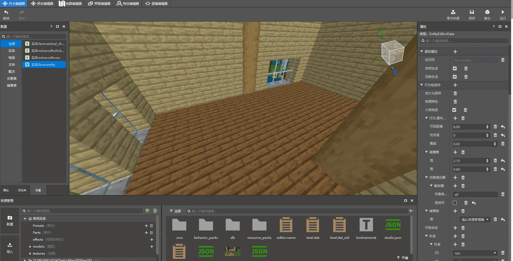
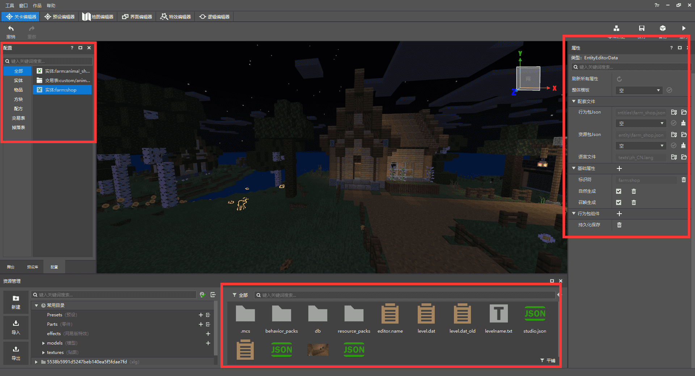
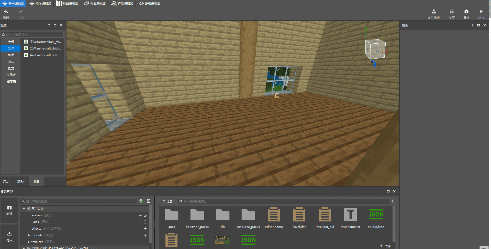
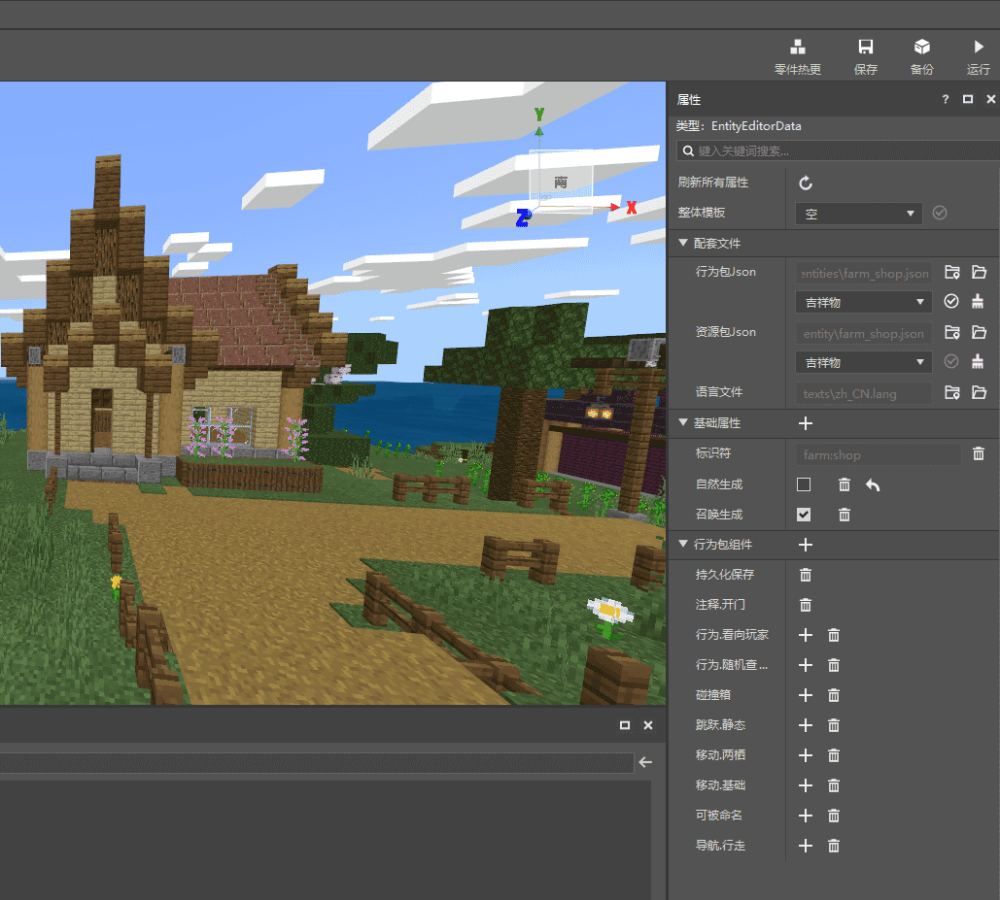
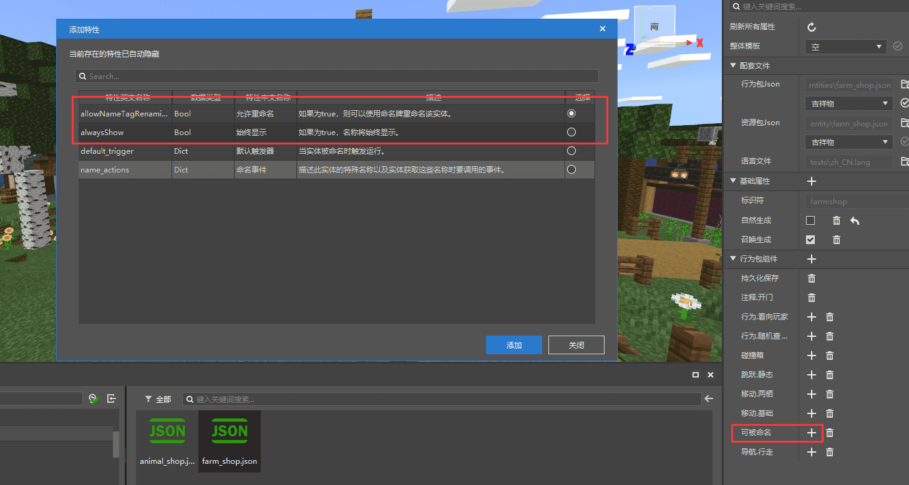
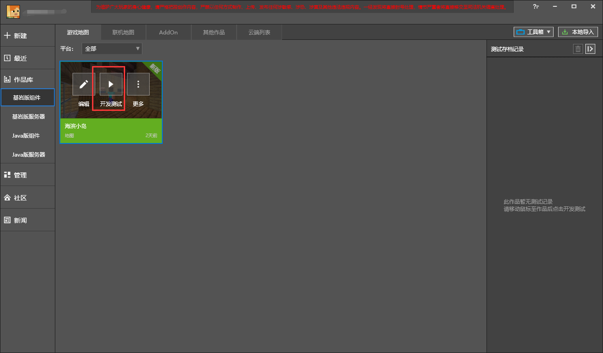
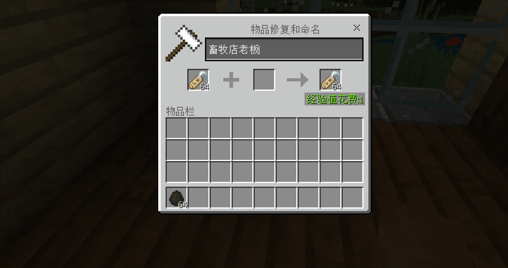

--- 
front: https://nie.res.netease.com/r/pic/20210730/ee109f39-8987-46e0-9fe7-40ebb23060fa.png 
hard: Getting Started 
time: 20 minutes 
selection: true 
--- 
# Customize NPC's basic behavior 

Now, the basic content of the seaside island is already available, but it still lacks vitality. The island cannot be run by the players alone, so let's add various NPCs to the island. Before adding NPCs, you need to understand what [custom creatures] (../../10-addon tutorial/Chapter 07: Custom Creatures/Course 01. Understanding Custom Creatures.md) is. After we create a basic custom creature, we should change its "form" to make it a seaside islander who can wander around, trade, and be full of vitality. 

 

## Create a custom creature 

We open the behavior file of this entity and add some basic behaviors so that they can appear on the map. In addition to the basic jumping, opening doors, walking, collision volume, movement speed, and wandering, we also added some slightly special behaviors: 

- Inherit the characteristics of the original villagers to make them more "real". 
- Give the NPC a name and display it above his head permanently. 
- Make the NPC never disappear. 

> If you don't know anything about custom creatures, it is recommended to click the "Custom Creatures" hyperlink at the beginning of the article to learn more. 

```json 
{ 
"format_version": "1.13.0", 
"minecraft:entity": { 
"description": { 
"identifier": "farm:animal_shop", 
"is_spawnable": true, 
"is_summonable": true, 
"is_experimental": false, 
"runtime_identifier": "minecraft:villager" //It can be understood as inheriting the characteristics of a certain creature. Here it refers to the original villager (attacking the creature will cause angry particles to float). If you want to completely customize a creature, it is not recommended to add it. Just delete this line. 
}, 
"components": { 
"minecraft:nameable": { 
"allow_name_tag_renaming":true, //Can name tags be used to change names? 
"always_show":true //Is it permanently displayed? 
}, 
"minecraft:annotation.open_door": { 
}, 
"minecraft:jump.static": { 
}, 
"minecraft:can_climb": { 
}, 
"minecraft:persistent":{}, //Make the creature never disappear

			"minecraft:collision_box": {
			  "width": 0.8,
			  "height": 2
			},
			"minecraft:movement": {
				"value": 0.25
			  },
			  "minecraft:navigation.walk": {
				"can_path_over_water": true,
				"can_pass_doors": true,
				"can_open_doors": true,
				"avoid_water": true
			  },
			"minecraft:movement.basic": {
			},
			"minecraft:health": {
			  "value": 5,
			  "max": 5
			},
			"minecraft:behavior.random_stroll": {
			  "priority": 7,
			  "speed_multiplier": 1
			},
			"minecraft:behavior.look_at_player": {
			  "priority": 8, "look_distance": 6, 
"probability": 0.02 
}, 
"minecraft:behavior.random_look_around": { 
"priority": 9 
}, 
"minecraft:physics": { 
} 
}, 
"component_groups": { 
}, 
"events": { 
} 
} 
} 
``` 

In addition to opening the behavior file to modify, you can also add it directly from the **new version of the level editor**. Compared with modifying the file, the latter is more convenient and intuitive. All behaviors have detailed descriptions. For better and convenient use, the following is a brief introduction to the basic functions 

 

The parts outlined in red in the figure are from left to right: **Resource Configuration**, **Resource Management** and **Property Window**. All custom content created can be found in the configuration. Click the configuration to modify it freely in the properties on the right, or find the corresponding file in the resource management window below.

 


Click on New-Configure-Entity in the resource management in the lower left corner. You can choose to overwrite a template of the original creature or create an empty creature. All behaviors are added by ourselves. Here we choose "empty". 

 

After creating a new entity, you can see it in the configuration window on the left. Click to open and modify its properties. Here is the focus. 

- Overall template: select an original creature and inherit all its behaviors and resources 
- Supporting files - Behavior pack json: only inherit the behavior part of a certain original creature (behavior, AI, etc.) 
- Supporting files - Resource pack json: only inherit the resource part of a certain original creature (model, animation, etc.) 
- Supporting files - Language file: modify the text description of creatures, items, etc. 
- Basic properties - Identifier: use this to define the creature, cannot be repeated with other creatures (prefix: name) 
- Basic properties - Natural generation: whether the creature can be naturally generated in the world 
- Basic properties - Summon generation: the spawn egg of the creature appears in the creation inventory 
- Behavior pack component: create the behavior of the creature, you can add multiple components (mainly used) 

Because we created it empty, the overall template ruins supporting files are empty, skip these, and directly add the behavior pack component 

 

After adding the basic behavior components, click the plus sign of a component, and you can continue to add or modify more detailed behaviors. Take "Can be named" as an example. Click the plus sign behind it to add "Can be named" and display it permanently. 

 

After adding the basic behaviors, click **Development and Testing** in the editor to enter the game. Please note that if you click Development and Testing to enter the game to modify the content, the map will not change. Click **Edit** to enter the map editor. If you have special needs, you can also export the modified test archive and re-import it into the editor. 

 

Generate an NPC into the map and try to change the name with a name tag. There is a small detail here. After changing the name, you can go back to the behavior pack and change **Can be modified by name tag** to **False**. In this way, the NPC's name will be locked to the current modified name. 

 
