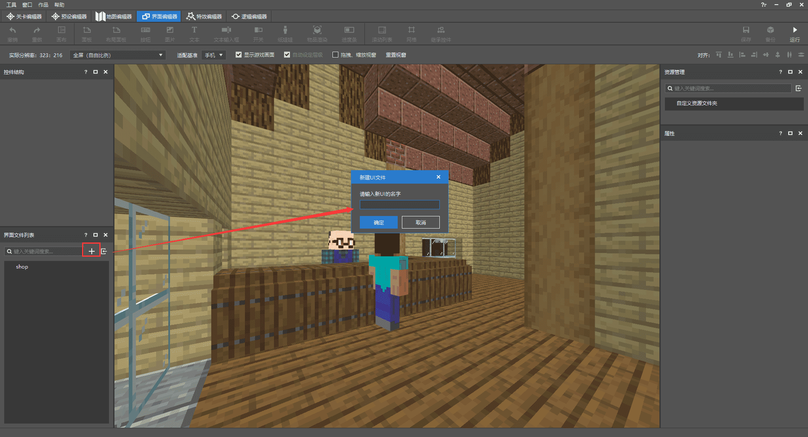
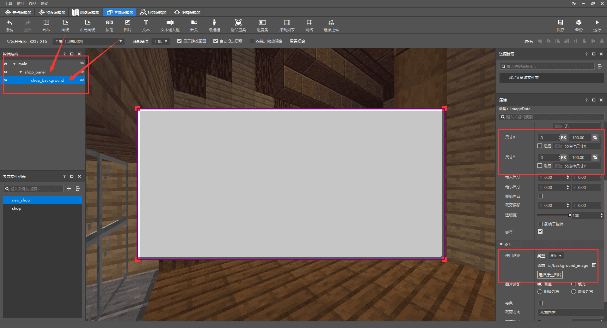
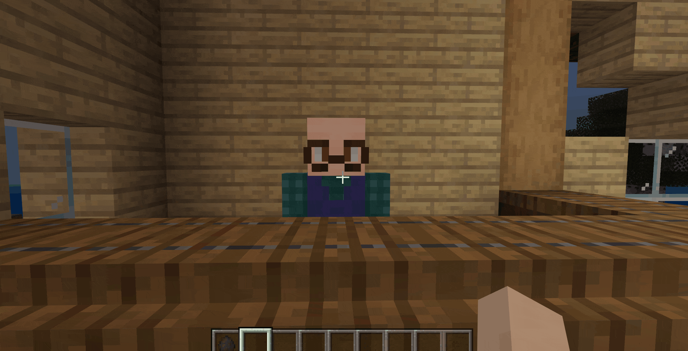

--- 
front: https://nie.res.netease.com/r/pic/20210730/ee109f39-8987-46e0-9fe7-40ebb23060fa.png 
hard: Advanced 
time: 60 minutes 
--- 
# Add the corresponding transaction table to the NPC 

Now, our NPC has basic behaviors and will wait for players in its own area. Next, we need to give the NPC a "soul" to make it a real merchant who can exchange a variety of items. There are many ways to achieve this. In this article, we will introduce two methods of implementation. You can choose the one that is more suitable for you or the map. 

<iframe src="https://cc.163.com/act/m/daily/iframeplayer/?id=6152b9cfb8a81f8fa07dc89f" height="600" width="800" allow="fullscreen" /> 

## Use Add-on to add the trading table component 

The first method is relatively simple. Just add the following components to the behavior file of the creature 

```json 
"minecraft:economy_trade_table": { //Let NPC have a trading table 
"display_name": "entity.villager.anmial_shop", //Content displayed on the trading table 
"table": "trading/custom/animal_shop.json", //Path location of the trading table 
"new_screen": true //Whether to use the new version of the trading interface 
} 
``` 

Then create a new trading table according to the path location "trading/custom/animal_shop.json". The path and name of the trading table must be consistent, otherwise it will be invalid. Since we have not added any trading items, such as crop seeds, furniture, etc., we will add a random transaction for demonstration. 

```json 
{ 
"tiers": [ 
{ 
"groups": [ //Group 
{ 
"num_to_select": 1, //Select 1 item from the list below to appear in the transaction table 
"trades": [ 
{ 
"wants": [ //Trade requirements 
{ 
"item": "minecraft:gold_ingot", //Item name (gold ingot) 
"quantity": 1 //Quantity 
} 
], 
"gives": [ //Trade gains 
{ 
"item": "minecraft:spawn_egg:10", //Item name (spawn egg: chicken) 
"quantity": 1 //Quantity 
} 
] 
} 
]

} 
] 
} 
] 
} 

``` 

After completing the above content, enter the game and right-click the NPC: 

 

You can see that after opening the trading table, there is a string of names on it. This corresponds to the **"display_name"** in the behavior component. We can modify it directly: 

```json 
"minecraft:economy_trade_table": { 
"display_name": "Trading Table", //Modify it directly 
"table": "trading/custom/animal_shop.json", 
"new_screen": true 
} 
``` 

 

## Use the interface editor to create the UI of the trading table 

The trading currency of our map is not stored in the backpack, but in data storage, without entities, so the first Add-on method cannot be used; so in order to realize the NPC trading function, it is necessary to use the UI to create an interactive interface, so we will use the interface editor to create a simple synthesis table interface; 

 

Create a new UI and try to enter a relatively unique and meaningful name, so that it is easier to debug and less likely to conflict in subsequent use; 

 

After creating a new UI, you can see the control structure in the upper left. All the UI controls we added will be here. Click a control to modify and adjust it in the properties on the right; Every time you create a new UI interface, there will be a main canvas named **main**, which is usually the default (it is recommended to change all UI spaces except the main canvas main to meaningful and easily recognizable names) 

Next, add a **panel control** under the main canvas, set the size to the appropriate size of the synthesis table, and then add an **image control**, the size of which follows the previous panel control and add a texture background; 

 

Then add multiple **image controls** in sequence, which are used as the background of the scroll list, close button, purchase button, and product information, and adjust them to the appropriate size and texture to make the UI more beautiful; if this hierarchical order error occurs when adding UI controls, you can turn off the **automatically set the hierarchy** option above, and then adjust the hierarchy of the controls one by one. 

 

After laying out all the backgrounds, add the required controls in sequence, and place each control on the corresponding background. 

 

Click on the scroll list control, and you can see the **content** in the properties. This refers to what should be placed in the scroll list. The synthesis table needs to have many commodities, so we need to add a row of buttons here to select commodities. We add a new canvas to store button templates. 


 

In order to arrange the buttons one by one, we also need to create a grid separately, put the buttons into the grid and set the required number. 

 

Finally, add the grid to the scroll list, and you will get a complete synthesis table UI! 

 

## Use MODSDK to implement trading functions 

1. Create a new py file, import the ScreenNode class, add a Main class and inherit ScreenNode 

2. Initialize the UI in the **UiInitFinished** event of ClietnSystem (client) 

3. Use the **PlayerAttackEntityEvent** event in ServerSystem (server) to obtain the id of a specific NPC and player 

4. Set the player to convey the event of creating the synthesis table UI to the client when clicking this NPC. 

```python
class FarmClientSystem(ClientSystem):

    def __init__(self, namespace, systemName):
        super(FarmClientSystem, self).__init__(namespace, systemName)
        namespace = clientApi.GetEngineNamespace()
        system_name = clientApi.GetEngineSystemName()
        self.ListenForEvent(namespace, system_name,
                            'UiInitFinished', self, self.ui_init)
        self.ListenForEvent("FarmMod", "ServerSystem", "create_shop_ui",
                            self, self.Create_Shop_UI)


    def Create_Shop_UI(self,event):
        self.ui = clientApi.PushScreen("Farm","new_shop")


    def ui_init(self,args):        clientApi.RegisterUI("Farm","new_shop","Script_NeteaseModw7ijjGNn.uiscreen.FarmUIScreen","new_shop.main")
```

```python
class FarmServerSystem(ServerSystem):
	def __init__(self, namespace, systemName):
		ServerSystem.__init__(self, namespace, systemName)
		self.ListenForEvent("FarmMod", "ClientSystem", "buy_item",
							self,self.PlayerBuyItem)
		self.ListenForEvent(serverApi.GetEngineNamespace(), serverApi.GetEngineSystemName(), "PlayerAttackEntityEvent",
							self,self.PlayerAttack)


	def PlayerAttack(self,args):
		print "Attacked"

entityid = args["victimId"] 
self.playername = args["playerId"] 
if entityid == "-120259084268": 
self.NotifyToClient(self.playername,"create_shop_ui", args) 

``` 

```python 
class FarmUIScreen(ScreenNode): 
def __init__(self, namespace, name, param): 
ScreenNode.__init__(self, namespace, name, param) 
``` 

Next, we click **Development and Testing** in the editor to enter the game, and click the NPC with the corresponding id to open the synthesis table UI. However, we cannot interact with the UI at this time. Next, we simply modify the ui file and bind the py function to implement a series of functions. 

Modify **"$pressed_button_name"** under the close button control of the ui file, so that adding a bound decorator to the function in py can directly respond to the button interaction and add an interface to close the UI in the function. 

> Need to delete "button_mappings" in the ui file button: []

```json
"close_button@common.button" : {
    "$control_alpha" : 1.0,
    "$default_texture" : "textures/ui/close_button_default",
    "$hover_texture" : "textures/ui/close_button_default_light",
    "$is_new_nine_slice" : false,
    "$label_color" : [ 1, 1, 1 ],
    "$label_font_scale_factor" : 1.0,
    "$label_font_size" : "large",
    "$label_layer" : 3,
    "$label_offset" : [ 0, 0 ],
    "$label_text" : "",
    "$nine_slice_buttom" : 0,
    "$nine_slice_left" : 0,
    "$nine_slice_right" : 0,
    "$nine_slice_top" : 0,
    "$nineslice_size" : [ 0, 0, 0, 0 ],
    "$pressed_button_name" : "%uiscreen.clicked_close_button", //Modify the name of the pressed button
    "$pressed_texture" : "textures/ui/close_button_default_light",
    "$texture_layer" : 2,
    "alpha" : 1.0,
    "anchor_from" : "center",
    "anchor_to" : "center",
    "bindings" : [
        {
            "binding_collection_name" : "",
            "binding_condition" : "always_when_visible",
            "binding_type" : "collection_details"
        }
    ],
    "clip_offset" : [ 0, 0 ],

    "clips_children" : false,
    "controls" : [
        {
            "default@new_shop.default" : {}
        },
        {
            "hover@new_shop.hover" : {}
        },
        {
            "pressed@new_shop.pressed" : {}
        }
    ],
    "draggable" : "not_draggable",
    "enabled" : true,
    "is_handle_button_move_event" : true,
    "layer" : 1,
    "max_size" : [ 0, 0 ],
    "min_size" : [ 0, 0 ],
    "offset" : [ 0, 0 ],
    "propagate_alpha" : false,
    "size" : [ "100.0%+0.0px", "100.0%+0.0px" ], 
"visible" : true 
}, 
``` 

```python 
#Close button binding function, triggered after the button is pressed and released 
@ViewBinder.binding(ViewBinder.BF_ButtonClickUp) 
def clicked_close_button(self,args): 
print "Closed!" 
clientApi.PopScreen() 
``` 

 

Then we need to bind the **button_label** of the scroll list button, that is, modify the text on the button, and click the button to display the corresponding information in the product information: 

1. Create a list variable and add text and description to it 
2. Add a collection binding array to the button_label of the ui file, and use the decorator binding function to modify the button text 
3. Use the imported module to intercept the specific index of the pressed button 
4. Return the corresponding description for the button clicked by the player 

First, create a list variable and add the text and descriptions that need to be displayed on multiple buttons. Since crops and seeds have not been added yet, just write something for testing: 

```python 
# coding=utf-8 
self.item_button_text = [ 
{ 
"itemtext": "Click to select: Wheat", # Name of the product, displayed on the button 
"information": "Variety: Wheat\nGrowth period: 3\nPrice: 5", # Detailed information of the product, displayed on the right side of the UI

}, 
{ 
"itemtext": "Click to select: Chrysanthemum", 
"information": "Variety: Chrysanthemum\nGrowth cycle: 3\nPrice: 10" 
}, 
{ 
"itemtext": "Click to select: Corn", 
"information": "Variety: Corn\nGrowth cycle: 3\nPrice: 15" 
}, 
{ 
"itemtext": "Click to select: Wheat", 
"information": "Variety: Wheat\nGrowth cycle: 3\nPrice: 5" 
}, 
{ 
"itemtext": "Click to select: Wheat", 
"information": "Variety: Wheat\nGrowth cycle: 3\nPrice: 5" 
}, 
{ 
"itemtext": "Click to select: Wheat", 
"information": "Variety: Wheat\nGrowth cycle: 3\nPrice: 5" 
}, 
{ 
"itemtext": "Click to select: Wheat", 
"information": "Variety: Wheat\nGrowth cycle: 3\nPrice: 5" 
}, 
{ 
"itemtext": "Click to select: wheat", 
"information": "Variety: wheat\nGrowth cycle: 3\nPrice: 5" 
}, 
{ 
"itemtext": "Click to select: apple", 
"information": "Variety: apple\nGrowth cycle: 3\nPrice: 25" 
} 
] 
``` 

Add a binding to the button_label control, which is the text on the button, and assign the value returned by the binding function to "text". In this way, you can get the index value of the button in the collection and return the text. At the same time, add the variable name of the collection under the button control: 

```json 
"button_label" : { 
"alpha" : "$control_alpha", 
"color" : "$label_color", 
"font_scale_factor" : "$label_font_scale_factor", 
"font_size" : "$label_font_size", 
"font_type" : "smooth", 
"layer" : "$label_layer",
    "max_size" : [ "100%", "100%" ],
    "offset" : "$label_offset",
    "shadow" : false,
    "text" : "#text",
    "text_alignment" : "center",
    "type" : "label",
    "bindings" : [
        {

"binding_collection_name" : "$shop_grid_collection_name", //Bound collection variable name 
"binding_name":"#item_button_text", //Binding name, used in decorator 
"binding_name_override":"#text", //Corresponding to the above #text 
"binding_condition" : "visible", //Binding condition: display 
"binding_type" : "collection" //Binding type: collection 
} 
] 
}, 
``` 

```json 
"button@common.button" : { 
"$control_alpha" : 1.0, 
"$default_texture" : "textures/ui/pocket_button_default", 
"$hover_texture" : "textures/ui/pocket_button_hover", 
"$is_new_nine_slice" : false, 
    "$label_color" : [ 1, 1, 1 ],
    "$label_font_scale_factor" : 1.0,
    "$label_font_size" : "large",
    "$label_layer" : 3,
    "$label_offset" : [ 0, 0 ],
    "$label_text" : "",
    "$nine_slice_buttom" : 0,
    "$nine_slice_left" : 0,
    "$nine_slice_right" : 0,
    "$nine_slice_top" : 0,
    "$nineslice_size" : [ 0, 0, 0, 0 ],
    "$shop_grid_collection_name" : "shop_grid", //The name of the collection variable
    "$pressed_button_name" : "%uiscreen.clicked_item_button",
    "$pressed_texture" : "textures/ui/pocket_button_pressed",
    "$texture_layer" : 2,
    "alpha" : 1.0,
    "anchor_from" : "center",
    "anchor_to" : "center",
    "bindings" : [
        {
            "binding_collection_name" : "",
            "binding_condition" : "always_when_visible",
            "binding_type" : "collection_details"
        }
    ],
    "clip_offset" : [ 0, 0 ],
    "clips_children" : false,
    "controls" : [
        {
            "default@new_shop.default" : {}
        },
        { "hover@new_shop.hover" : {} 
},

        {
            "pressed@new_shop.pressed" : {}
        },
        {
            "button_label@new_shop.button_label" : {}
        }
    ],
    "draggable" : "not_draggable",
    "enabled" : true,
    "is_handle_button_move_event" : true,
    "layer" : 1,
    "max_size" : [ 0, 0 ],
    "min_size" : [ 0, 0 ],
    "offset" : [ 0, 0 ],
    "propagate_alpha" : false,
    "size" : [ "100.0%+0.0px", "100.0%+0.0px" ],
    "visible" : true 
}, 
``` 

```python 
#Collection binding string, add corresponding text to the button in the grid 
@ViewBinder.binding_collection(ViewBinder.BF_BindString,"shop_grid","#item_button_text") 
def binding_item_button_text(self,index): 
print index 
return self.item_button_text[index]["itemtext"] #Return the text of the variable index corresponding to this function 
``` 

Import the re module and use the **compile** function and the **findall** function to intercept the index value of the player's actual button click, and modify the **"$pressed_button_name"** of this button control in the ui file to bind the decorator to this button: 

```json 
"button@common.button" : { 
"$control_alpha" : 1.0, 
"$default_texture" : "textures/ui/pocket_button_default",
    "$hover_texture" : "textures/ui/pocket_button_hover",
    "$is_new_nine_slice" : false,
    "$label_color" : [ 1, 1, 1 ],
    "$label_font_scale_factor" : 1.0,
    "$label_font_size" : "large",
    "$label_layer" : 3,
    "$label_offset" : [ 0, 0 ],
    "$label_text" : "",
    "$nine_slice_buttom" : 0,
    "$nine_slice_left" : 0,
    "$nine_slice_right" : 0,
    "$nine_slice_top" : 0, "$nineslice_size" : [ 0, 0, 0, 0 ], 
"$shop_grid_collection_name" : "shop_grid", 
"$pressed_button_name" : "%uiscreen.clicked_item_button", //Modify the name of the pressed button 
"$pressed_texture" : "textures/ui/pocket_button_pressed",

    "$texture_layer" : 2,
    "alpha" : 1.0,
    "anchor_from" : "center",
    "anchor_to" : "center",
    "bindings" : [
        {
            "binding_collection_name" : "",
            "binding_condition" : "always_when_visible",
            "binding_type" : "collection_details"
        }
    ],
    "clip_offset" : [ 0, 0 ],
    "clips_children" : false,
    "controls" : [
        {
            "default@new_shop.default" : {}
        },
        {
            "hover@new_shop.hover" : {}
        },
        {
            "pressed@new_shop.pressed" : {}
        },
        {            "button_label@new_shop.button_label" : {}
        }
    ],
    "draggable" : "not_draggable",
    "enabled" : true,
    "is_handle_button_move_event" : true,
    "layer" : 1,
    "max_size" : [ 0, 0 ],
    "min_size" : [ 0, 0 ],
    "offset" : [ 0, 0 ],
    "propagate_alpha" : false,
    "size" : [ "100.0%+0.0px", "100.0%+0.0px" ],
    "visible" : true 
}, 
``` 

```python 
#Button binding function, when pressed, calculate the button number in the scroll list through the re function 
@ViewBinder.binding(ViewBinder.BF_ButtonClickUp) 
def clicked_item_button(self,args): 
print "Pressed" 
buttonpath = args["ButtonPath"].split('/')[-2] #Use the imported re module to intercept the button index number 
reg = re.compile(r'\d+') 
button_index = reg.findall(buttonpath) 
if button_index: 
self.clicked_button_index = int(button_index[0])-1 #The index number obtained is saved in this variable

``` 

When the player clicks a button, the specific index value will be obtained, and a description can be added to the button; of course, the UI control corresponding to information also needs to be bound: 

```python 
#Bind string to add corresponding description to product information 
@ViewBinder.binding(ViewBinder.BF_BindString,"#shop_information") 
def binding_shop_information(self): 
if self.clicked_button_index == -1: #If the index of the clicked button is -1, an empty string is returned 
return "" 
return self.item_button_text[self.clicked_button_index]["information"] #Return the description information of the corresponding index 
``` 

```json 
"item_information" : { 
"alpha" : 1.0, 
"anchor_from" : "top_left", 
"anchor_to" : "top_left", 
"clip_offset" : [ 0, 0 ],
    "clips_children" : false,
    "color" : [ 1, 1, 1 ],
    "enabled" : true,
    "font_scale_factor" : 1.0,
    "font_size" : "normal",
    "font_type" : "smooth",
    "layer" : 1,
    "line_padding" : 0.0,
    "max_size" : [ 0, 0 ],
    "min_size" : [ 0, 0 ],
    "offset" : [ 5, 5 ],
    "propagate_alpha" : false,
    "shadow" : false,
    "size" : [ "75.0%+0.0px", "75.0%+0.0px" ],
    "text" : "#text", "text_alignment" : "left", 
"type" : "label", 
"visible" : true, 
"bindings" : [ 
{ 
"binding_name":"#shop_information", //Used for binding on decorator 
"binding_name_override":"#text", //Corresponding to the above #text 
"binding_condition" : "always_when_visible" //Binding condition: always displayed 
} 
] 
}, 
``` 

After completing the above steps, the synthesis table UI already has the general content: 




Now, let's add the last and most important content, which is to make purchases through the transaction table UI; first, bind the purchase button through the decorator and modify the UI file; write the relevant logic under the bound function: 

1. Return if the player does not select an item on the left 
2. Get the current amount of money the player has and compare the price of the item 
3. Continue if the player's money can be used for purchase, otherwise return 
4. After the purchase is successful, communicate with the server and give the player the purchased item 

The code is as follows: 

```python 
# -*- coding: utf-8 -*- 
self.item_button_text = [ 
{ 
"itemtext":"Click to select: wheat", #The name of the item, displayed on the button 
"information":"Variety: wheat\nGrowth cycle: 3\nPrice: 5", #Detailed information of the item, displayed on the right side of the UI 
"coin": 5, #The price of the purchased item 
"itemname":"minecraft:grass" #Used to read the actual item to give to the player 
}, 
{ 
"itemtext": "Click to select: Chrysanthemum", 
"information": "Variety: Chrysanthemum\nGrowth period: 3\nPrice: 10", 
"coin": 5, 
"itemname": "minecraft:grass" 
}, 
{ 
"itemtext": "Click to select: Corn", 
"information": "Variety: Corn\nGrowth period: 3\nPrice: 15", 
"coin": 5, 
"itemname": "minecraft:grass" 
}, 
{ 
"itemtext": "Click to select: Wheat", 
"information": "Variety: Wheat\nGrowth period: 3\nPrice: 5", 
"coin": 5, 
"itemname": "minecraft:grass" 
}, 
{ 
"itemtext": "Click to select: Wheat", 
"information": "Variety: Wheat\nGrowth period: 3\nPrice: 5", 
"coin": 5, 
"itemname": "minecraft:grass" 
}, 
{ 
"itemtext": "Click to select: Wheat", 
"information": "Variety: Wheat\nGrowth period: 3\nPrice: 5", 
"coin": 5, 
"itemname": "minecraft:grass" 
}, 
{

"itemtext": "Click to select: wheat", 
"information": "Variety: wheat\nGrowth period: 3\nPrice: 5", 
"coin": 5, 
"itemname": "minecraft:grass" 
}, 
{ 
"itemtext": "Click to select: apple", 
"information": "Variety: apple\nGrowth period: 3\nPrice: 25", 
"coin": 5, 
"itemname": "minecraft:grass" 
} 
] 
``` 

First add the price and the actual product name to the product list variable for subsequent logical judgment and item distribution; 

```json 
"buy_button@common.button" : { 
"$control_alpha" : 1.0, 
"$default_texture" : "textures/ui/pocket_button_default", 
"$hover_texture" : "textures/ui/pocket_button_hover",
    "$is_new_nine_slice" : false,
    "$label_color" : [ 1, 1, 1 ],
    "$label_font_scale_factor" : 1.0,
    "$label_font_size" : "large",
    "$label_layer" : 3,
    "$label_offset" : [ 0, 0 ],
    "$label_text" : "Click to buy",
    "$nine_slice_buttom" : 0,
    "$nine_slice_left" : 0,
    "$nine_slice_right" : 0,
    "$nine_slice_top" : 0,
    "$nineslice_size" : [ 0, 0, 0, 0 ], "$pressed_button_name" : "%uiscreen.buy_button_clicked", //Same as the previous button, change the name of the pressed button 
"$pressed_texture" : "textures/ui/pocket_button_pressed", 
"$texture_layer" : 2, 
"alpha" : 1.0, 
"anchor_from" : "center", 
"anchor_to" : "center", 
"bindings" : [ 
{ 
"binding_collection_name" : "", 
"binding_condition" : "always_when_visible", 
"binding_type" : "collection_details" 
} 
], 
"clip_offset" : [ 0, 0 ], 
"clips_children" : false, 
"controls" : [ 
{

            "default@new_shop.default" : {}
        },
        {
            "hover@new_shop.hover" : {}
        },
        {
            "pressed@new_shop.pressed" : {}
        },
        {
            "buy_button_label@new_shop.buy_button_label" : {}
        }
    ],
    "draggable" : "not_draggable",
    "enabled" : true,
    "is_handle_button_move_event" : true,
    "layer" : 1,
    "max_size" : [ 0, 0 ],
    "min_size" : [ 0, 0 ],
    "offset" : [ 0, 0 ],
    "propagate_alpha" : false,
    "size" : [ "100.0%+0.0px", "100.0%+0.0px" ], 
"visible" : true 
}, 
``` 

Modify the purchase button ui file's **$pressed_button_name** for binding in the py file; 

```python 
class FarmUIScreen(ScreenNode): 
def __init__(self, namespace, name, param): 
ScreenNode.__init__(self, namespace, name, param) 

self.clientsystem = clientApi.GetSystem("FarmMod", "ClientSystem") #Get client instance 
self.clicked_button_index = -1 #Button index value 
self.coin = 0 #Define the player's money 
self.item_button_text = [ 
{ 
"itemtext":"Click to select: wheat", #The name of the product, displayed on the button 
"information":"Variety: Wheat\nGrowth cycle: 3\nPrice: 5", #Detailed information of the product, displayed on the right side of the UI 
"coin": 5, #Price of purchasing the product 
"itemname":"minecraft:grass" #Used to read the actual product to give to the player 
}, 
{ 
"itemtext": "Click to select: Chrysanthemum", 
"information": "Variety: Chrysanthemum\nGrowth cycle: 3\nPrice: 10", 
"coin": 5, 
"itemname": "minecraft:grass" 
}, 
{ 
"itemtext": "Click to select: Corn",

"information": "Variety: Corn\nGrowth period: 3\nPrice: 15", 
"coin": 5, 
"itemname": "minecraft:grass" 
}, 
{ 
"itemtext": "Click to select: Wheat", 
"information": "Variety: Wheat\nGrowth period: 3\nPrice: 5", 
"coin": 5, 
"itemname": "minecraft:grass" 
}, 
{ 
"itemtext": "Click to select: Wheat", 
"information": "Variety: Wheat\nGrowth period: 3\nPrice: 5", 
"coin": 5, 
"itemname": "minecraft:grass" 
}, 
{ 
"itemtext": "Click to select: Wheat", 
"information": "Variety: Wheat\nGrowth period: 3\nPrice: 5", 
"coin": 5, 
"itemname": "minecraft:grass" 
}, 
{ 
"itemtext": "Click to select: wheat", 
"information": "Variety: wheat\nGrowth period: 3\nPrice: 5", 
"coin": 5, 
"itemname": "minecraft:grass" 
}, 
{ 
"itemtext": "Click to select: apple", 
"information": "Variety: apple\nGrowth period: 3\nPrice: 25", 
"coin": 5, 
"itemname": "minecraft:grass" 
}, 
] 

@ViewBinder.binding(ViewBinder.BF_ButtonClickUp) 
def buy_button_clicked(self,args): 
print "Click to buy" 
if self.clicked_button_index == -1: 
print "Player has not selected the item yet" 
return 
price = self.item_button_text[self.clicked_button_index]['coin'] 
print "The value of what he wants to buy:",price 
print "The amount of money you have:",self.coin 
if self.coin >= price: 
self.coin -= price 
print "After the purchase, you will have left:",self.coin 
#Communicate to the server, passing the player id, remaining money, and actual items purchased as parameters

self.clientsystem.NotifyToServer("buy_item",{"playerid":clientApi.GetLocalPlayerId(),"coin":self.coin,"buy_item":self.item_button_text[self.clicked_button_index]["itemname"]}) 
else: 
print "You can't afford it" 
``` 

Use the decorator to bind the function. Note that the function name at this time must be consistent with the **$pressed_button_name** in the UI file above; Get the client instance and notify the server to issue items after the player completes the purchase; 

```python 
class FarmServerSystem(ServerSystem): 
def __init__(self, namespace, systemName): 
ServerSystem.__init__(self, namespace, systemName) 
self.ListenForEvent("FarmMod", "ClientSystem", "buy_item", 
self,self.PlayerBuyItem) 
self.ListenForEvent(serverApi.GetEngineNamespace(), serverApi.GetEngineSystemName(), "PlayerAttackEntityEvent", 
self,self.PlayerAttack) 

def PlayerBuyItem(self, args): 
print "Player bought" 
player_id = args['playerid'] #The player id passed in 
item_name = args['buy_item'] #The actual product name passed in 
serverApi.GetEngineCompFactory().CreateItem(player_id).SpawnItemToPlayerInv( #Distribute items 
{ 
'newItemName': item_name, 
'count': 1 
}, 
player_id 
) 
``` 

```python 
def Create_Shop_UI(self,event): 
self.ui = clientApi.PushScreen("Farm","new_shop") 
self.ui.coin = 100 #Modify the number of coins in this UI instance 
``` 

When creating a synthesis table, first set the player's money to 100, then enter the game to test it: 

 

