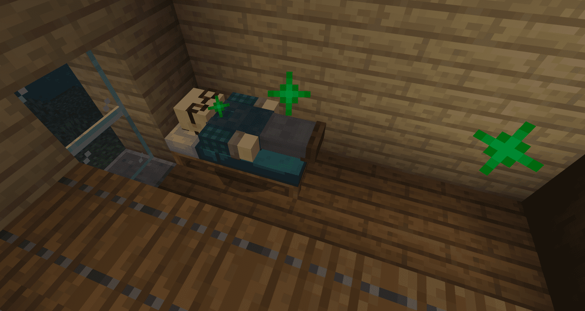

--- 
front: https://nie.res.netease.com/r/pic/20210730/ee109f39-8987-46e0-9fe7-40ebb23060fa.png 
hard: Getting Started 
time: 20 minutes 
--- 
# Set a bed for the NPC to sleep in 
Now, we already have a merchant who works hard and can trade with us, but! It's too miserable for merchants to only work and not rest, right? So we need to let NPCs have a natural schedule like players, instead of a cold NPC, which can also increase the sense of immersion in the game to a certain extent and let players enjoy the fun better. 

 

## Let NPC bind his own bed 
Each NPC must have his own bed, otherwise they will start to fight for each other's bed, causing chaos, which is troublesome. We just need to add a behavior component to the NPC behavior. 

```json 
"minecraft:dweller": { 
"dwelling_type": "village", //Type 
"dweller_role": "inhabitant", //Role (Because the NPCs in this map are all non-professional, if you want to add a profession to the NPC, you can refer to the original Villager_v2 behavior component) 
"update_interval_base": 20, //Base update interval 
"update_interval_variant": 10, //Variant update interval 
"can_find_poi": true //Can I find poi 
} 
``` 

Enter the game and try it. Put the NPC near the bed. When he and the bed emit green particles at the same time, it is successful! Now the bed belongs to this NPC. Of course, our players can still grab his bed. 

 

## Let the NPC sleep in the bed 

Now the NPC has its own bed, but they won't go to sleep yet. Next, add a behavior component 

```json 
"minecraft:behavior.sleep": { 
"speed_multiplier": 1.5, //Movement speed multiplier when going to sleep 
"sleep_collider_height": 0.3, //Height of the creature collision box when sleeping 
"sleep_collider_width": 1.0, //Width of the creature collision box when sleeping 
"sleep_y_offset": 0.6, //Offset of the creature's Y axis when sleeping 
"timeout_cooldown": 10.0 //After getting up unexpectedly, how long it will take before you can sleep again 
} 
``` 

After adding this behavior component, the creature will go to sleep. Of course, don't forget to leave the movable behavior component. 

There is a small problem here. If we add basic sleeping behavior to the creature, then when the creature finds a bed, it will sleep all the time regardless of whether it is day or night, so we need to use **events** and **component groups** to make the NPC sleep only at night. 

For the relationship between components, events and component_groups, please refer to the previous tutorial: [Three structures for defining biological behavior](https://g.126.fm/04a9tkE). 


First, we add a component that can detect time and trigger different events during the day and night: 

```json 
"minecraft:scheduler": { 
"min_delay_secs": 0, //Minimum delay number 
"max_delay_secs": 10, //Maximum delay number 
"scheduled_events" : [ //Scheduled events 
{ 
"filters": { //Filter (first) 
"all_of": [ //Meet all conditions 
{ "test": "hourly_clock_time", "operator": ">=", "value": 0 }, //When the event is greater than or equal to 0 (indicates that the day has begun) 
{ "test": "hourly_clock_time", "operator": "<", "value": 12000 } //Less than 12000 (indicates that the day has not ended) 
] 
}, 
"event": "minecraft:work" //Trigger event "minecraft:work" 
}, 
{ 
"filters": { //Filter (second one) 
"all_of": [ //Meet all conditions 
{ "test": "hourly_clock_time", "operator": ">=", "value": 12000 }, //Greater than or equal to 12000 (indicates that the night has begun) 
{ "test": "hourly_clock_time", "operator": "<", "value": 24000 } //Less than 24000 (indicates that the night has not ended) 
] 
}, 
"event": "minecraft:sleep" //Trigger event "minecraft:sleep" 
} 
] 
}, 
``` 

After adding this behavior component, the **work** event will be triggered during the day, and the **sleep** event will be triggered at night. Next, add these two events to make the villagers get up when the work event is triggered, and let the villagers go to sleep when the sleep event is triggered. 

```json 
"events": { //Events, all events are placed here, in the same row as components (behavior components) 

"minecraft:sleep": { //Events triggered when the filter (second one) is met 
"remove": { "component_groups": [ "villager_work" ] }, //Remove the "villager_work" component group 
"add": { "component_groups": [ "villager_sleep" ] } 
}, //Add the "villager_sleep" component group 

"minecraft:work": { //Events triggered when the filter (first one) is met 
"remove": { "component_groups": [ "villager_sleep" ] }, //Remove the "villager_sleep" component group 
"add": { "component_groups": [ "villager_work" ] } //Add "villager_work" component group 
} 
} 
``` 

```json 
"component_groups": { //Component group, you can remove and add one or more groups at will after triggering the event 

"villager_sleep": { //Looking at it together with the event, this component group will be added when the filter (the second one) is met, and there is only one component under this component group, which is to go to sleep

"minecraft:behavior.sleep": { 
"priority": 3, 
"goal_radius": 1.5, 
"speed_multiplier": 1.5, 
"sleep_collider_height": 0.3, 
"sleep_collider_width": 1.0, 
"sleep_y_offset": 0.6, 
"timeout_cooldown": 10.0 
} 
}, 

"villager_work": { //When the filter (the first one) is met, this component group will be added and the sleeping component group will be removed. At this time, the creature will get up. Now there is nothing in this component group, so there is no change after the NPC gets up. 

} 
}, 
``` 

After adding the above content to the NPC behavior file, our merchant will get up during the day and go to bed at night. Enter the game to see the actual effect! 

