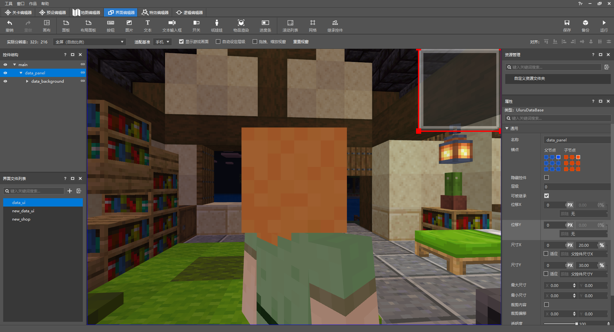
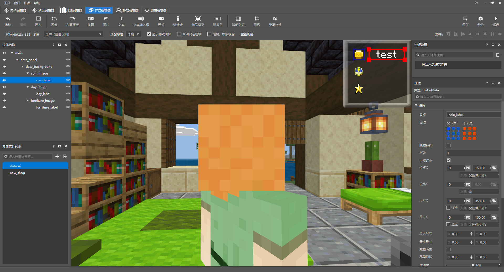
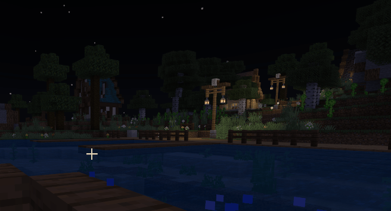
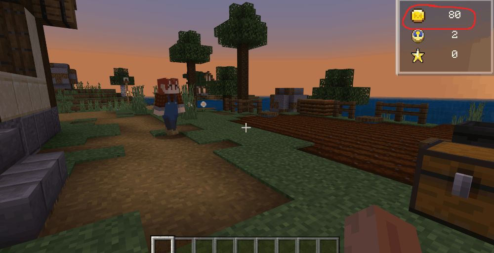
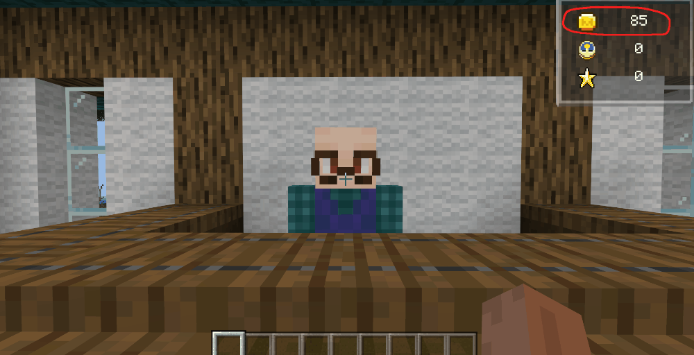

--- 
front: https://nie.res.netease.com/r/pic/20210730/ee109f39-8987-46e0-9fe7-40ebb23060fa.png 
hard: Advanced 
time: 60 minutes 
--- 
# Use the editor to create a scoreboard interface 

Open the interface editor, create a scoreboard UI, create a panel of the appropriate size under the main canvas and add a background: 

 

Next, create images and texts showing the amount of money, days and furniture in the background and modify them to the appropriate position: 

 

<iframe src="https://cc.163.com/act/m/daily/iframeplayer/?id=6152ba3eb647e504b523d398" height="600" width="800" allow="fullscreen" /> 

After making the UI interface, open the UI file and bind these three labels to ScreenNode through the decorator: 

```json 
{ 
"coin_label" : { 
"text" : "#text", 
"bindings" : [ 
{ 
"binding_name":"#coin_text", //binding name 
"binding_name_override":"#text", //binding callback, the returned parameter will be given to the above #text 
"binding_condition" : "always_when_visible" //binding condition: always visible 
} 
] 
}, 
"day_label" : { 
"text" : "#text", 
"bindings" : [ 
{ 
"binding_name":"#day_text", 
"binding_name_override":"#text", 
"binding_condition" : "always_when_visible"
         }
      ]
   },
   "furniture_label" : {
      "text" : "#text",
      "bindings" : [
         {
            "binding_name":"#furniture_text",
            "binding_name_override":"#text",
            "binding_condition" : "always_when_visible"
         }

] 
} 
} 
``` 

```python 
class FarmUIScreen(ScreenNode): 
def __init__(self, namespace, name, param): 
ScreenNode.__init__(self, namespace, name, param) 

# Bind string, return self.coin (modify parameters by creating UI instance when coin changes) 
@ViewBinder.binding(ViewBinder.BF_BindString, "#coin_text") 
def player_coin_text(self): 
return str(self.coin) 

# Bind string, use Molang to directly return the number of days 
@ViewBinder.binding(ViewBinder.BF_BindString, "#day_text") 
def player_day_text(self): 
return str(int( 
clientApi.GetEngineCompFactory().CreateQueryVariable(clientApi.GetLocalPlayerId()).GetMolangValue( 
'query.day'))) 

# Bind string, return self.furniture (modify parameters by creating UI instance when furniture changes) 
@ViewBinder.binding(ViewBinder.BF_BindString, "#furniture_text") 
def player_furniture_text(self): 
return str(self.furniture) 
``` 

We create this UI in the function at the end of the novice guide and give the data to the UI: 

```python 
leveldatacomp = serverApi.GetEngineCompFactory().CreateExtraData(serverApi.GetLevelId()) 
class FarmServerSystem(ServerSystem): 
def __init__(self, namespace, systemName): 
ServerSystem.__init__(self, namespace, systemName) 
# Set the function that will be triggered when the novice guide ends 
def start_game_data(self, playerid): 
# Use ExtraData to store data 
        leveldatacomp.SetExtraData("player_coin", 100)
        leveldatacomp.SetExtraData("player_furniture", 0)
        leveldatacomp.SetExtraData("player_day", 0)
        # Pass the initial data as a parameter to ClientSystem
        event = {"playerid": playerid, "player_data_coin": leveldatacomp.GetExtraData("player_coin"),
                 "player_data_furniture": leveldatacomp.GetExtraData("player_furniture")}
        self.NotifyToClient(self.playername, "create_data_ui", event)
```

```python
class FarmClientSystem(ClientSystem):

def __init__(self, namespace, systemName): 
super(FarmClientSystem, self).__init__(namespace, systemName) 
# Listen for events sent by ServerSystem 
self.ListenForEvent("FarmMod", "ServerSystem", "create_data_ui", 
self, self.CreateDataUI) 

def CreateDataUI(self,event): 
# Create UI 
clientApi.CreateUI("Farm","data_ui",{"isHud":1}) 
# Execute the function to update UI data 
self.Re_DataUI(event) 

def Re_DataUI(self,event): 
# Get UI instance 
self.data_ui = clientApi.GetUI("Farm","data_ui") 
# If the parameter passed in has player_data_coin, update the coin in the UI 
if "player_data_coin" in event: 
self.data_ui.coin = event["player_data_coin"] 
# If the parameter passed in has player_data_furniture, update the furniture in the UI 
if "player_data_furniture" in event: 
self.data_ui.furniture = event["player_data_furniture"] 
``` 

In this way, when the novice guide is completed, the scoreboard UI of the data can be created normally. Let's try it with the editor's **development test** function: 

 

## Update the data of the tracking player on the UI 

In the first section of this chapter, we have completed the function of accessing player data, but this data only exists in the map and will not be directly displayed on the UI, so we need to send events to the client while accessing the data and modify the variables of the UI instance to visualize the data. 

First, the player's money. We only need to send an event to the client when there is a change in money (buying goods and being taken away by the recycling merchant): 

```python 
leveldatacomp = serverApi.GetEngineCompFactory().CreateExtraData(serverApi.GetLevelId()) 
class FarmServerSystem(ServerSystem): 
def __init__(self, namespace, systemName): 
ServerSystem.__init__(self, namespace, systemName) 

# Function for shipping goods after players purchase goods through the transaction table (appeared in Chapter 5 and the first section of this chapter) 
def PlayerBuyItem(self, args): 
# Store the money after buying goods into the data player_coin 
leveldatacomp.SetExtraData("player_coin", args["coin"]) 
# The player id passed in 
player_id = args['playerid'] 
# The actual name of the item passed in 
item_name = args['buy_item'] 
# Pass the player id and the remaining money after buying the item as parameters to the client's re_dataui (update ui data) 
event = {"playerid": player_id, "player_data_coin": args['coin'], } 
self.NotifyToClient(player_id, "re_dataui", event)

# Issue items 
serverApi.GetEngineCompFactory().CreateItem(player_id).SpawnItemToPlayerInv( 
{ 
'newItemName': item_name, 
'count': 1 
}, 
player_id 
) 

# The callback function for the merchant's arrival location, which is also the function for recovering items in the box (appeared in the first section of this chapter) 
def acquirer_callback(self, entityid, result): 
print result 
if result == 0: 
# Loop through each item in the box and calculate the sum of their prices 
chestitemcomp = serverApi.GetEngineCompFactory().CreateItem(serverApi.GetLevelId()) 
chestslotcomp = serverApi.GetEngineCompFactory().CreateChestBlock(serverApi.GetLevelId()) 
count = 0 
add_price = 0 
for item in range(0, 27): 
itemdict = chestitemcomp.GetContainerItem((72, 66, 81), count, 0) 
if itemdict: 
if itemdict["newItemName"] in self.goods_list: 
add_price += itemdict["count"] * self.goods_list.get(itemdict["newItemName"]) 
chestslotcomp.SetChestBoxItemNum(None, (72, 66, 81), count, 0, 0) 
count += 1 
# Get the current amount of money of the player 
now_coin = leveldatacomp.GetExtraData("player_coin") 
# Add the current amount of money to the amount of money in the box and store the data 
leveldatacomp.SetExtraData("player_coin", now_coin + add_price) 
# Send the player's new amount of money as a parameter to the client's re_dataui (update ui data) 
event = {"player_data_coin": now_coin + add_price} 
self.NotifyToClient(leveldatacomp.GetExtraData("player_id"), "re_dataui", event) 
# Use the pathfinding component to get the recycler home 
movecomp = serverApi.GetEngineCompFactory().CreateMoveTo(self.acquirer_id) 
movecomp.SetMoveSetting((132, 71, 96), 1.5, 2000, self.acquirer_callback_home) 
``` 

The data that needs to be updated in real time also includes the placement of furniture. We have already done this part of the function in the first section. We just need to add it on this basis: 

```python 
leveldatacomp = serverApi.GetEngineCompFactory().CreateExtraData(serverApi.GetLevelId()) 
class FarmServerSystem(ServerSystem): 
def __init__(self, namespace, systemName): 
        ServerSystem.__init__(self, namespace, systemName)
        # Monitor players placing blocks and destroying blocks
        self.ListenForEvent(serverApi.GetEngineNamespace(), serverApi.GetEngineSystemName(),
                            'EntityPlaceBlockAfterServerEvent',
                            self, self.Place_Furniture)
        self.ListenForEvent(serverApi.GetEngineNamespace(), serverApi.GetEngineSystemName(),
                            'ServerPlayerTryDestroyBlockEvent',

self, self.Destroy_Furniture) 


def Place_Furniture(self, args): 
# Get the coordinates and name of the block through the event 
x = args['x'] 
y = args['y'] 
z = args['z'] 
blockname = args['fullName'] 
blockstatecomp = serverApi.GetEngineCompFactory().CreateBlockState(serverApi.GetLevelId()) 
blockstate = blockstatecomp.GetBlockStates((x, y, z), 0) 
# Return if it is not furniture 
if "farm:rotation" not in blockstate and blockname not in self.netease_block_list: 
return 
# Get the current number of furniture and += 1 
leveldatacomp.SetExtraData("player_furniture", leveldatacomp.GetExtraData("player_furniture") + 1) 
# Send the new furniture quantity as a parameter to the client's re_dataui (update ui data) 
event = {"player_data_furniture": leveldatacomp.GetExtraData("player_furniture")} 
self.NotifyToClient(leveldatacomp.GetExtraData("player_id"), "re_dataui", event) 

def Destroy_Furniture(self, args): 
# Get the coordinates and name of the block through the event 
x = args['x'] 
y = args['y'] 
z = args['z'] 
blockname = args['fullName'] 
player_id = args['playerId'] 
blockstatecomp = serverApi.GetEngineCompFactory().CreateBlockState(serverApi.GetLevelId()) 
blockstate = blockstatecomp.GetBlockStates((x, y, z), 0) 
# Return if it is not furniture 
if "farm:rotation" not in blockstate and blockname not in self.netease_block_list: 
return 
# Get the current number of furniture and -=1 
leveldatacomp.SetExtraData("player_furniture", leveldatacomp.GetExtraData("player_furniture") - 1) 
# Send the new number of furniture as a parameter to the client's re_dataui (update ui data) 
event = {"player_data_furniture": leveldatacomp.GetExtraData("player_furniture")} 
self.NotifyToClient(leveldatacomp.GetExtraData("player_id"), "re_dataui", event) 
``` 

Changes in both the amount of money and the number of furniture will be transmitted to the client's re_dataui through events: 

```python 
class FarmClientSystem(ClientSystem): 

def __init__(self, namespace, systemName): 
super(FarmClientSystem, self).__init__(namespace, systemName) 
# Listen for events sent by ServerSystem re_dataui 
self.ListenForEvent("FarmMod", "ServerSystem", "re_dataui", 
self, self.Re_DataUI) 


def Re_DataUI(self,event): 
# Get UI instance 
self.data_ui = clientApi.GetUI("Farm","data_ui") 
# If the transmitted parameters contain player_data_coin, update the UI parameters 
if "player_data_coin" in event: 
self.data_ui.coin = event["player_data_coin"] 
# If the transmitted parameters contain player_data_furniture, update the UI parameters 
if "player_data_furniture" in event: 
self.data_ui.furniture = event["player_data_furniture"] 


``` 

Next, use the editor's **development and testing** function to enter the game and test them one by one. 

Recycling items in boxes: 

 

Purchasing items through the trade table: 

 

Placing and destroying furniture: 

 

