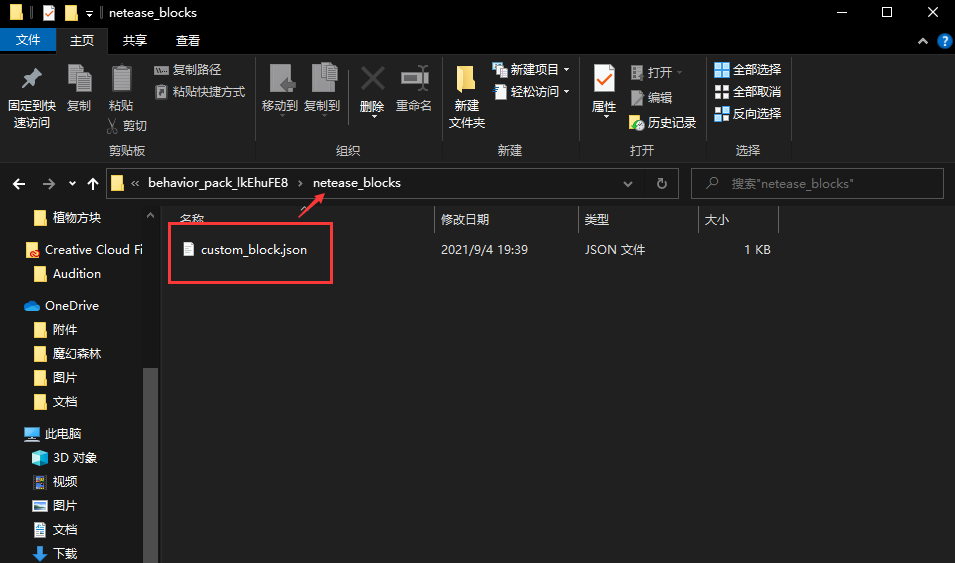

--- 
front: https://nie.res.netease.com/r/pic/20210730/ee109f39-8987-46e0-9fe7-40ebb23060fa.png 
hard: Advanced 
time: 30 minutes 
--- 
# Get started with new custom blocks 
Open MCStudio and use the level editor to directly create a custom block, which is very convenient; however, when we open the file, we can see that the block behavior is placed in the **netease_blocks** folder, which mainly stores custom blocks with Chinese characteristics. With the update of the version, the custom blocks of the original Add-on can also realize many interesting functions, so this chapter will comprehensively introduce the concept and usage of the new custom blocks and make crops and furniture for the map. 

[Understanding Custom Blocks](../../10-addon Tutorial/Chapter 09: Custom Blocks/Course 01. Understanding Custom Blocks.md) 

 

The Chinese version of the custom blocks is stored in the netease_blocks folder, while the new custom block writing method of 1.16+ needs to be placed in the Microsoft blocks folder. 

 

## What are block properties 

Block properties are one of the "features" of the new writing method after version 1.16: **properties**, which can store many properties. In fact, properties are arrays used for engine judgment. Many interesting functions can be done using block properties, such as making blocks into crops and judging their growth age; **farm:age** and **farm:growth** in the figure are used to judge crops. 

```json 
{ 
"format_version": "1.16.100", 
"minecraft:block": { 
"description": { 
"identifier": "farm:whiteradish", 
"register_to_creative_menu": true, 
"properties": { //Block properties 
"farm:age": [0, 1, 2], 
"farm:growth": [0, 1, 2, 3, 4, 5] 
} 
}, 
"permutations": [···], 
"events": {···}, 
"components": {···} 
} 
} 
``` 

Use **query.block_property** to get the property value of the block 

```json 
"query.block_property('farm:age') == 0" 
``` 

## What is a block event 

If you want to flexibly modify the behavior of a block, you need the cooperation of events: **events**. For example, when the player stands on a block, to modify the dropped items of the block, we need to add a **trigger** to the block component and add the corresponding event in events.


```json 
{ 
"format_version": "1.16.100", 
"minecraft:block": { 
"description": { 
"identifier": "farm:my_block" 
}, 
"components": { //Block component 
"minecraft:on_step_on": { //Trigger, when standing on the block 
"event": "farm:drop_loot", //Trigger this event 
"target": "self" 
} 
}, 
"events": { //Block event 
"farm:drop_loot": { //Event triggered by the trigger above 
"spawn_loot": { //Add the dropped items of the block 
"table": "loot_tables/blocks/my_loot_table.json" 
} 
} 
} 
} 
} 
``` 

## What is a block combination? 

Block combinations can be applied to methods with MoLang expressions according to different conditions. Various components of blocks can be adjusted very freely to achieve many functions. The combinations in the figure add different MoLang expression conditions. That is, when the **farm:age** of the block attribute is a specific value, the components in the **components** below are added to this block. 

```json
{
    "format_version": "1.16.100",
	"minecraft:block": {
		"description": {
			"identifier": "farm:whiteradish",
            "register_to_creative_menu": true,
			"properties": {···}
		},
        "permutations": [ //block combination
	  		{
				"condition": "query.block_property('farm:age') == 0",
				"components": {···}
	  		},
            {
				"condition": "query.block_property('farm:age') == 1",
				"components": {···}
	  		},
            {
				"condition": "query.block_property('farm:age') == 2",
				"components": {···}

} 
], 
"events":{···}, 
"components":{···} 
} 
} 
``` 

## What is a block tag 

Block tags can group and classify different blocks and use them through tags; I add the tag **"tag:farm_plant"** to different blocks, and when I want to use or query in other files, I can apply this tag. 

```json 
{ 
"format_version": "1.16.100", 
"minecraft:block": { 
"description": { 
"identifier": "farm:whiteradish", 
"register_to_creative_menu": true, 
"properties": { 
"farm:age": [0, 1, 2], 
"farm:growth": [0, 1, 2, 3, 4, 5] 
} 
}, 
"permutations": [···], 
"components": { 
"tag:farm_plant":{} //Block tag 
}, 
"events": {···} 
} 
} 
``` 

Expressions that can be used to obtain block tags: 

- query.all_tags 
- query.any_tag 
- query.block_has_all_tags 
- query.block_has_any_tag 
- query.relative_block_has_all_tags 
- query.relative_block_has_any_tag 
## What block components have been added 

### minecraft:unit_cube 

Set the block to a normal cube 


```json 
{ 
"minecraft:unit_cube": {} 
} 
``` 

### minecraft:crafting_table 

Set a block as a crafting table 

```json 
{ 
"minecraft:crafting_table": { 
"custom_description": "Example Crafting Table", // Name shown in GUI 
"grid_size": 3, // Currently only supports 3 
"crafting_tags": ["crafting_table", "custom_crafting_tag"] 
} 
} 
``` 

### minecraft:material_instances 

Block textures and rendering methods 

```json 
{ 
"minecraft:material_instances": { 
"*": { 
"texture": "texture_name", 
"render_method": "blend", 
"face_dimming": true, 
"ambient_occlusion": true 
} 
} 
} 
``` 

### minecraft:geometry 

Block model 

```json 
{ 
"minecraft:geometry": "geometry.wiki" 
} 
``` 

### minecraft:on_step_on 

Trigger, used with events: when standing on a block


```json 
{ 
"minecraft:on_step_on": { 
"event": "block_event", 
"target": "self", 
"condition": "query.block_property('wiki:block_property') == true" 
} 
} 
``` 

### minecraft:on_step_off 

Trigger, used with events: when leaving a block 

```json 
{ 
"minecraft:on_step_off": { 
"event": "block_event", 
"target": "self", 
"condition": "query.block_property('wiki:block_property') == true" 
} 
} 
``` 

### minecraft:on_fall_on 

Trigger, used with events: when a block falls 

```json 
{ 
"minecraft:on_fall_on": { 
"event": "block_event", 
"target": "self", 
"condition": "query.block_property('wiki:block_property') == true", 
"min_fall_distance": 5 
} 
} 
``` 

### minecraft:on_placed 

Trigger, used with events: when a block is placed 

```json 
{ 
"minecraft:on_placed": { 
"event": "block_event", 
"target": "self", 
"condition": "query.block_property('wiki:block_property') == true"

} 
} 
``` 

### minecraft:on_player_placing 

Trigger, used with events: when the player places a block 

```json 
{ 
"minecraft:on_player_placing": { 
"event": "block_event", 
"target": "self", 
"condition": "query.block_property('wiki:block_property') == true" 
} 
} 
``` 

### minecraft:on_player_destroyed 

Trigger, used with events: when the player destroys a block 

```json 
{ 
"minecraft:on_player_destroyed": { 
"event": "block_event", 
"target": "self", 
"condition": "query.block_property('wiki:block_property') == true" 
} 
} 
``` 

### minecraft:on_interact 

Trigger, used with events: when the player interacts with the block 

```json 
{ 
"minecraft:on_interact": { 
"event": "block_event", 
"target": "self", 
"condition": "query.block_property('wiki:block_property') == true" 
} 
} 
``` 

### minecraft:ticking 

Trigger, used with events: set the tick of a specific value 


```json 
{ 
"minecraft:ticking": { 
"looping": true, 
"range": [4, 4], 
"on_tick": { 
"event": "block_event", 
"target": "self", 
"condition": "query.block_property('wiki:block_property') == true" 
} 
} 
} 
``` 

### minecraft:random_ticking 

Trigger, used with events: set random ticks 

```json 
{ 
"minecraft:random_ticking": { 
"on_tick": { 
"event": "block_event", 
"target": "self", 
"condition": "query.block_property('wiki:block_property') == true" 
} 
} 
} 
``` 

### minecraft:entity_collision 

Collision box of block entities 

```json 
{ 
"minecraft:entity_collision": { 
"origin": [-8, 0, -8], 
"size": [16, 16, 16] 
} 
} 
``` 

```json 
{ 
"minecraft:entity_collision": false 
} 
``` 

### minecraft:pick_collision


Collision box when selecting a block 

```json 
{ 
"minecraft:pick_collision": { 
"origin": [-8, 0, -8], 
"size": [16, 16, 16] 
} 
} 
``` 

```json 
{ 
"minecraft:pick_collision": false 
} 
``` 

### minecraft:breakonpush 

Sets the block to break when pushed by a piston 

```json 
{ 
"minecraft:breakonpush": true 
} 
``` 

### minecraft:display_name 

Sets the name of the block 

```json 
{ 
"minecraft:display_name": "Name" 
} 
``` 

### minecraft:breathability 

Sets the breathability of the block, as solid or air 

```json 
{ 
"minecraft:breathability": "solid" // Also accepts 'air' 
} 
``` 

### minecraft:immovable 


Set whether it can be pushed by pistons 

```json 
{ 
"minecraft:immovable": true 
} 
``` 

### minecraft:onlypistonpush 

Set whether the block will follow the sticky piston 

```json 
{ 
"minecraft:onlypistonpush": true 
} 
``` 

### minecraft:placement_filter 

Set under what conditions the block can be placed 

```json 
{ 
"minecraft:placement_filter": { 
"conditions": [ 
{ 
"block_filter": ["minecraft:dirt"], 
"allowed_faces": ["up"] 
} 
] 
} 
} 
``` 

### minecraft:preventsjumping 

Set whether jumping is allowed when stepping on a block 

```json 
{ 
"minecraft:preventsjumping": true 
} 
``` 

### minecraft:rotation 

Set the rotation angle of the block 

```json

{ 
"minecraft:rotation": [90, 180, 0] 
} 
``` 

### minecraft:unwalkable 

Sets whether you can walk when stepping on a block 

```json 
{ 
"minecraft:unwalkable": true 
} 
``` 
