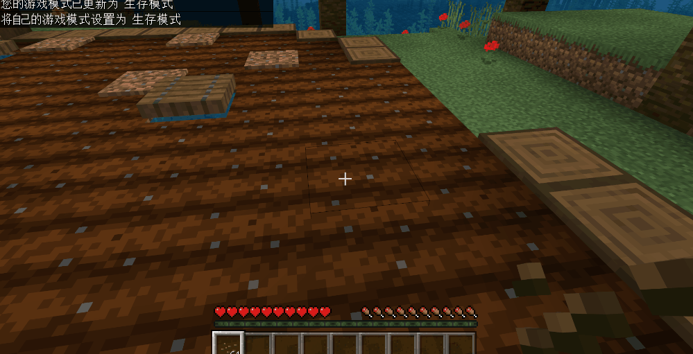

--- 
front: https://nie.res.netease.com/r/pic/20210730/ee109f39-8987-46e0-9fe7-40ebb23060fa.png 
hard: Advanced 
time: 40 minutes 
--- 
# Start adding crop blocks 

After basically understanding the new custom block writing method, we start making the crops needed in the map: 

- Crops have multiple growth states, and the models and textures will change as they grow 
- Some crops can be harvested multiple times 
- Special crops need to be planted on fences 

 

<iframe src="https://cc.163.com/act/m/daily/iframeplayer/?id=6152ba9148e27490891f035c" height="600" width="800" allow="fullscreen" /> 

## Set the growth status of crops at different stages 

First, we add basic behavior components to the custom block so that it can be displayed normally in the game; 

```json 
{ 
"format_version": "1.16.100", 
"minecraft:block": { 
"description": { 
"identifier": "farm:whiteradish", 
"register_to_creative_menu": true 
}, 
"permutations": [ 
], 
"events": { 
}, 
"components": { 
"minecraft:placement_filter": { //Can be placed on farmland 
"conditions": [ 
{ 
"allowed_faces": ["up"], 
"block_filter": ["farmland"] 
} 
] 
}, 
"minecraft:entity_collision": false, //Turn off the collision box of creatures 
"minecraft:pick_collision": { //Set the collision box when selecting 
"origin": [-8, 0, -8], 
"size": [16, 5, 16] 
}, 
"minecraft:geometry": "geometry.whiteradish_stage_0", //Block model

"minecraft:material_instances": { //Block texture and rendering method 
"*": { 
"texture": "farm:whiteradish_stage_0", 
"render_method": "alpha_test", 
"ambient_occlusion": false 
} 
} 
} 
} 
``` 

 

Next, we add block properties to it, and use triggers, events and combinations to set different properties, and the block will also have obvious changes; 

```json 
{ 
"format_version": "1.16.100", 
"minecraft:block": { 
"description": { 
"identifier": "farm:whiteradish", 
"register_to_creative_menu": true, 
"properties": { 
"farm:age": [0, 1, 2] //Set crops to have three growth stages 
} 
}, 
"permutations": [ 
{ 
"condition": "query.block_property('farm:age') == 0", //Combined conditional expression, when the block property farm:age is equal to 0 
"components": { //Satisfy the above conditions and add the following components to the block 
"minecraft:loot": "loot_tables/empty.json", 
"minecraft:pick_collision": { 
"origin": [-8, 0, -8], 
"size": [16, 5, 16] 
}, 
"minecraft:geometry": "geometry.whiteradish_stage_0", 
"minecraft:block_light_absorption": 0, 
"minecraft:material_instances": { 
"*": { 
"texture": "farm:whiteradish_stage_0", 
    		                "render_method": "alpha_test",
                            "ambient_occlusion": false
                         }
                    }
				}
	  		}
        ],
        "components": {
            "minecraft:placement_filter": {

"conditions": [ 
{ 
"allowed_faces": ["up"], 
"block_filter": ["farmland"] 
} 
] 
}, 
"minecraft:entity_collision": false, 
"minecraft:on_player_placing": { //Trigger, trigger event when player places block 
"event": "farm:on_player_placing", 
"target": "self" 
} 
}, 
"events": { 
"farm:on_player_placing": { //When the player places a block, this event is triggered, setting the growth stage of the block to 0 
"set_block_property": { 
"farm:age": 0 
} 
} 
} 
} 
} 
``` 

As can be seen from the above picture, it is mainly divided into four parts: properties, combinations, basic components, and events; these four parts are coordinated with each other and are very flexible; 

Add another property to control the growth ticks of crops, add a random tick trigger to the combination, so that the block can trigger events according to random ticks to achieve the purpose of crop growth; 

```json 
{ 
"format_version": "1.16.100", 
"minecraft:block": { 
"description": { 
"identifier": "farm:whiteradish", 
"register_to_creative_menu": true, 
"properties": { 
"farm:age": [0, 1, 2], 
"farm:growth": [0, 1, 2, 3, 4, 5] // Growth ticks, each random tick will be +1 
} 
}, 
"permutations": [ 
{ 
"condition": "query.block_property('farm:age') == 0", 
"components": { 
"minecraft:loot": "loot_tables/empty.json", 
"minecraft:pick_collision": { 
"origin": [-8, 0, -8], 
"size": [16, 5, 16] 
}, 
"minecraft:random_ticking": { //Add a random tick trigger to trigger the following event

"on_tick": { 
"target": "self", 
"event": "farm:on_age_count_0" //Triggered event 
} 
}, 
"minecraft:geometry": "geometry.whiteradish_stage_0", 
"minecraft:block_light_absorption": 0, 
"minecraft:material_instances": { 
"*": { 
"texture": "farm:whiteradish_stage_0", 
"render_method": "alpha_test", 
"ambient_occlusion": false 
} 
} 
} 
} 
], 
"components": {···}, 
"events": { 
"farm:on_age_count_0": { //When the random tick trigger added above is triggered, respond to this event 
"sequence": [ 
{ 
"condition": "query.block_property('farm:growth') < 2", //Condition, when farm:growth property is less than 2 
"set_block_property": { 
"farm:growth": "query.block_property('farm:growth') + 1" //Set the block's property farm:growth plus 1 
} 
}, 
{ 
"condition": "query.block_property('farm:growth') == 2", //Condition, when farm:growth property is equal to 2 
"trigger": { 
"event": "farm:on_whiteradish_grow_to_1", //Trigger a new event 
"target": "self" 
} 
} 
] 
}, 
"farm:on_whiteradish_grow_to_1": { //The event is triggered when the farm:growth property is equal to 2 (indicating that the random tick has been triggered 3 times at this time) 
"set_block_property": { 
"farm:age": 1, //Set the block's property farm:age to 1 (grow to a new stage) 
"farm:growth": 0 //Set the block's property farm:growth to 0 (reset random tick) 
} 
}, 
"farm:on_player_placing": { 
"set_block_property": { 
"farm:age": 0 
} 
} 
} 
}

} 
``` 

When the growth stage of crops reaches 1, the combination with the condition that farm:age is equal to 0 will become invalid, so we need to add a new combination to represent the new stage of crops, and modify the model and texture in the combination to make the crops change when they reach the new stage; 

```json 
{ 
"condition": "query.block_property('farm:age') == 1", //Newly added combination, the condition is that the growth stage of crops is equal to 1 
"components": { 
"minecraft:loot": "loot_tables/empty.json", 
"minecraft:geometry": "geometry.whiteradish_stage_0", //If there are different models that need to be modified 
"minecraft:block_light_absorption": 0, 
"minecraft:pick_collision": { 
"origin": [-8, 0, -8], 
"size": [16, 8, 16] 
}, 
"minecraft:random_ticking": { //Because the crops are not fully mature yet, a random tick trigger is still needed 
"on_tick": { 
"target": "self", 
"event": "farm:on_age_count_1" 
} 
}, 
"minecraft:material_instances": { 
"*": { 
"texture": "farm:whiteradish_stage_1", //If there are different textures that need to be modified 
"render_method": "alpha_test", 
"ambient_occlusion": false 
} 
} 
} 
} 
``` 

Now that the crop blocks can grow, we click **Development Test** in the editor to enter the game and test it. 

 

The growth stage is like 0 to 1. Continue to add combinations and events from 1-2, so that a more complete crop block is completed: 

```json 
{ 
"format_version": "1.16.100", 
"minecraft:block": { 
"description": { 
"identifier": "farm:whiteradish", 
"register_to_creative_menu": true, 
"properties": { 
"farm:age": [0, 1, 2], 
"farm:growth": [0, 1, 2, 3, 4, 5] 
}

		},
        "permutations": [
	  		{
				"condition": "query.block_property('farm:age') == 0",
				"components": {
                    "minecraft:pick_collision": {
                        "origin": [-8, 0, -8],
                        "size": [16, 5, 16]
	                },
                    "minecraft:random_ticking": {
                        "on_tick": {
                            "target": "self",
                            "event": "farm:on_age_count_0"
                        }
                    },
		  			"minecraft:geometry": "geometry.whiteradish_stage_0",
					"minecraft:block_light_absorption": 0,
                    "minecraft:material_instances": {
                         "*": {
                            "texture": "farm:whiteradish_stage_0",
    		                "render_method": "alpha_test",
                            "ambient_occlusion": false
                         }
                    }
				}
	  		},
            {
				"condition": "query.block_property('farm:age') == 1",
				"components": {
		  			"minecraft:geometry": "geometry.whiteradish_stage_0",
					"minecraft:block_light_absorption": 0,
                    "minecraft:pick_collision": {
                        "origin": [-8, 0, -8],
                        "size": [16, 8, 16]
	                },
                    "minecraft:random_ticking": {
                        "on_tick": {
                            "target": "self",
                            "event": "farm:on_age_count_1"
                        }
                    },
                    "minecraft:material_instances": {
                         "*": {                            "texture": "farm:whiteradish_stage_1",
    		                "render_method": "alpha_test",
                            "ambient_occlusion": false
                         }
                    }
				}
	  		},

            {
				"condition": "query.block_property('farm:age') == 2",
				"components": {
		  			"minecraft:geometry": "geometry.whiteradish_stage_2",
					"minecraft:block_light_absorption": 0,
                    "minecraft:pick_collision": {
                        "origin": [-8, 0, -8],
                        "size": [16, 12, 16]
	                },
					"minecraft:on_player_destroyed": {
						"event": "farm:on_destroy_stage_2"
					},
                    "minecraft:material_instances": {
                         "*": {
                            "texture": "farm:whiteradish_stage_2",
    		                "render_method": "alpha_test",
                            "ambient_occlusion": false
                         }
                    }
				}	  		}
        ],
        "events": {
            "farm:on_age_count_0": {
                "sequence": [
					{
						"condition": "query.block_property('farm:growth') < 2",
                        "set_block_property": {
                            "farm:growth": "query.block_property('farm:growth') + 1"
                        }
                    },
                    {
                        "condition": "query.block_property('farm:growth') == 2",
                        "trigger": {
                            "event": "farm:on_whiteradish_grow_to_1",
                            "target": "self"
                        }
                    }
                ]
            },
            "farm:on_age_count_1": {
                "sequence": [
                    {
						"condition": "query.block_property('farm:growth') < 5",
                        "set_block_property": {
                            "farm:growth": "query.block_property('farm:growth') + 1"
                        }
                    },
                    {
                        "condition": "query.block_property('farm:growth') == 5",

                        "trigger": {
                            "event": "farm:on_whiteradish_grow_to_2",
                            "target": "self"
                        }
                    }
                ]
            },
            "farm:on_player_placing": {
                "set_block_property": {
                    "farm:age": 0,
                    "farm:growth": 0
                }
            },
            "farm:on_whiteradish_grow_to_1": {
                "set_block_property": {
                    "farm:age": 1,
                    "farm:growth": 0
                }
            },
            "farm:on_whiteradish_grow_to_2": {
                "set_block_property": {
                    "farm:age": 2,
                    "farm:growth": 0
                }
            } }, 
"components": { 

"minecraft:placement_filter": { 
"conditions": [ 
{ 
"allowed_faces": ["up"], 
"block_filter": ["farmland"] 
} 
] 
}, 
"minecraft:entity_collision": false, 
"minecraft:on_player_placing": { 
"event": "farm:on_player_placing", 
"target": "self" 
} 
} 
} 
} 
``` 

 

## Continue to improve the crop block 


Now, we already have crop blocks, but it is not complete yet. There are no corresponding fruits for crops and seeds needed to plant crops. Let's add these; 

First, the seeds. Create a custom item and add a component to place the block. 

```json 
{ 
"format_version": "1.16.100", 
"minecraft:item": { 
"description": { 
"identifier": "farm:whiteradish_seed", 
"category": "items" 
}, 
"components": { 
"minecraft:icon": { 
"texture": "farm:whiteradish_seed" 
}, 
"minecraft:ignores_permission": true, 
"minecraft:block_placer": { //Set this item to place blocks 
"block": "farm:whiteradish", 
"use_block_description": true 
} 
} 
} 
} 
``` 

The drops of crops are also very simple. Just add a drop table to the combination of mature crops! 

```json
{
    "condition": "query.block_property('farm:age') == 2",
    "components": {
        "minecraft:loot": "loot_tables/whiteradish.json", //Path to the drop table
        "minecraft:geometry": "geometry.whiteradish_stage_2",
        "minecraft:block_light_absorption": 0,
        "minecraft:pick_collision": {
            "origin": [-8, 0, -8],
            "size": [16, 12, 16]
        },
        "minecraft:on_player_destroyed": {
            "event": "farm:on_destroy_stage_2"
        },
        "minecraft:material_instances": {
            "*": {
                "texture": "farm:whiteradish_stage_2",                "render_method": "alpha_test",
                "ambient_occlusion": false
            }
        }
    }

}
```

