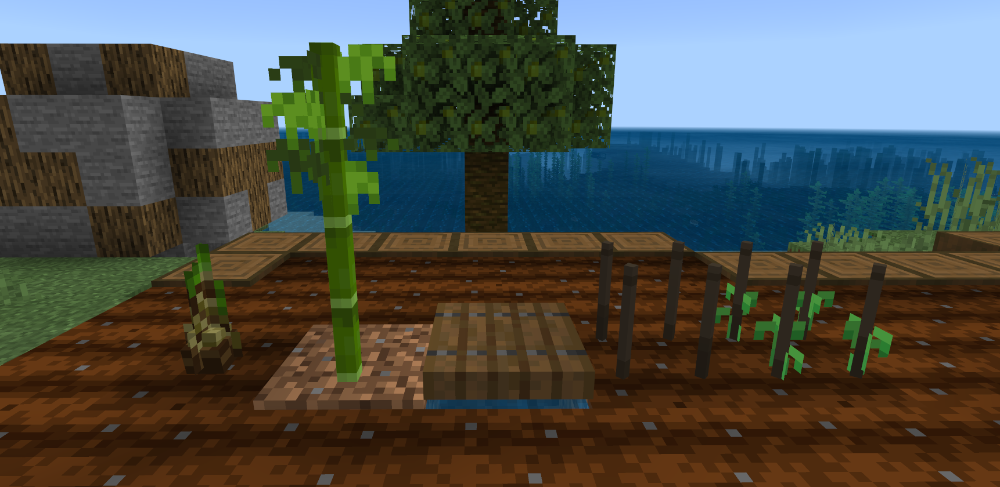
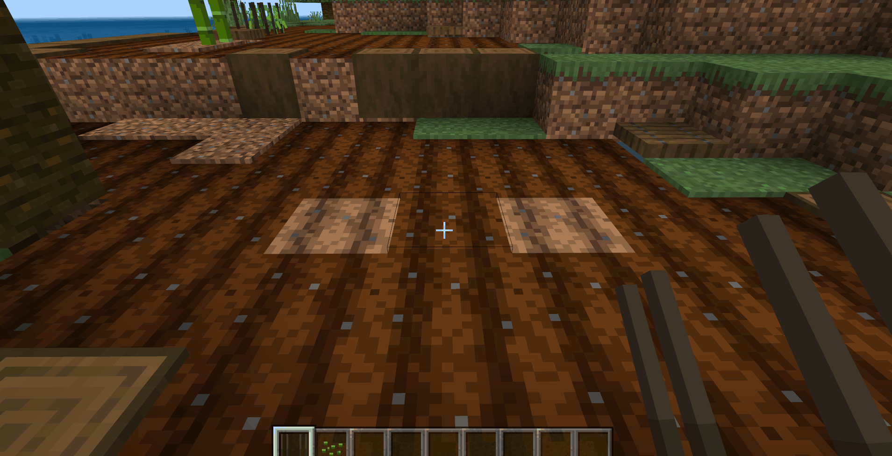
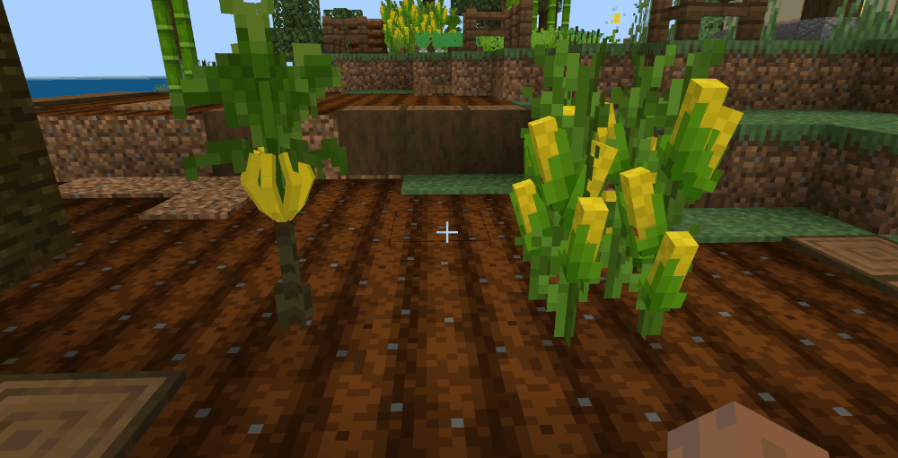

--- 
front: https://nie.res.netease.com/r/pic/20210730/ee109f39-8987-46e0-9fe7-40ebb23060fa.png 
hard: Advanced 
time: 60 minutes 
--- 
# Continue to add other crop blocks 
In the previous section, we have completely made the white radish crop. Next, we will add the remaining crops. Of course, different crops have different growth times and environments, and different degrees of modification need to be made during the production process. First, for the following crops similar to white radish, we only need to modify the number of ticks required for growth in the block properties to achieve different growth times for crops. 

```json 
{ 
"format_version": "1.16.100", 
"minecraft:block": { 
"description": { 
"identifier": "farm:eggplant", //Eggplant 
"register_to_creative_menu": true, 
"properties": { 
"farm:age": [0, 1, 2], 
"farm:growth": [0, 1, 2, 3, 4, 5, 6, 7, 8, 9] //Add more ticks to the growth property 
} 
}, 
"permutations": [···], 
"components": {···}, 
"events": { 
"farm:on_age_count_0": { 
"sequence": [ 
{ 
"condition": "query.block_property('farm:growth') < 7", //The event condition also needs to be modified, when farm:growth is less than 7 
"set_block_property": { 
"farm:growth": "query.block_property('farm:growth') + 1" //Add 1 to farm:growth 
} 
}, 
{ 
"condition": "query.block_property('farm:growth') == 7", //When farm:growth is equal to 7 
"trigger": { 
"event": "farm:on_whiteradish_grow_to_1", //Trigger a new event to make it grow 
"target": "self" 
} 
} 
] 
}, 
"farm:on_age_count_1": { 
"sequence": [ 
{ 
"condition": "query.block_property('farm:growth') < 9", 
                        "set_block_property": {
                            "farm:growth": "query.block_property('farm:growth') + 1"
                        }
                    },

                    {
                        "condition": "query.block_property('farm:growth') == 9",
                        "trigger": {
                            "event": "farm:on_whiteradish_grow_to_2",
                            "target": "self"
                        }
                    }
                ]
            },
            "farm:on_player_placing": {
                "set_block_property": {
                    "farm:age": 0,
                    "farm:growth": 0
                }
            },
            "farm:on_whiteradish_grow_to_1": {
                "set_block_property": {
                    "farm:age": 1,
                    "farm:growth": 0
                }
            },
            "farm:on_whiteradish_grow_to_2": {
                "set_block_property": { "farm:age": 2, 
"farm:growth": 0 
} 
} 
} 
} 
} 
``` 

Using this method, we modify other crops one by one: 

| Crop name | Growth time | 
| ---------- | -------------------------------------------------- | 
| White radish | Randomly carve 3 times, enter the germination stage; Randomly carve 6 times, enter the maturity stage | 
| Chrysanthemum | Randomly carve 3 times, enter the germination stage; Randomly carve 6 times, enter the maturity stage | 
| Spinach | Randomly carve 4 times, enter the germination stage; Randomly carve 6 times, enter the maturity stage | 
| Eggplant | Randomly carve 8 times, enter the germination stage; Randomly carve 10 times, enter the maturity stage | 
| Lemon | Randomly carve 8 times, enter the germination stage; Randomly carve 10 times, enter the maturity stage | 

After modification, click on the editor's development test to enter the game and plant these crops at the same time to observe whether they are successful; eggplant and lemon have the most random ticks set, so they should grow the slowest; 

 

## More special crop blocks 

Now we have made five complete crops, they all have three growth stages, and they will grow with the triggering of random ticks until they are finally mature; however, these crops cannot be the same, and there are other conditions that need to be followed, such as the following two crops: 


- Bamboo shoots: After growing into mature bamboo shoots, if they are not collected in time, they will eventually grow into bamboo (not only can they be planted on farmland, but also on dirt and ash soil) 
- Peas: Need to be planted on fence blocks (fences are placed on farmland) 

 

The planting conditions for bamboo shoots only need to add ash soil and dirt to the component: 

```json 
"minecraft:placement_filter": { 
"conditions": [ 
{ 
"allowed_faces": ["up"], 
"block_filter": ["farmland","dirt","podzol"] //farmland, dirt, ash soil 
} 
] 
} 
``` 

And to eventually grow into bamboo, you only need to add an event to convert the bamboo shoots into bamboo: 

```json 
{ 
"format_version": "1.16.100", 
"minecraft:block": { 
"description": { 
"identifier": "farm:bambooshoot", 
"register_to_creative_menu": true, 
"properties": { 
"farm:age": [0, 1, 2], 
"farm:growth": [0, 1, 2, 3, 4, 5, 6, 7] 
} 
}, 
"permutations": [ 
{ 
"condition": "query.block_property('farm:age') == 2", //When farm:age is equal to 2 (indicating that the bamboo shoots are mature) 
"components": { 
"minecraft:loot": "loot_tables/bambooshoot.json", 
"minecraft:geometry": "geometry.bambooshoot_stage_2", 
"minecraft:block_light_absorption": 0, 
"minecraft:pick_collision": { 
"origin": [-8, 0, -8], 
"size": [16, 12, 16] 
}, 
"minecraft:random_ticking": { //Still add random tick trigger 
"on_tick": { 
"target": "self", 
"event": "farm:on_age_count_2" //Triggered event name 
} 
}, 
"minecraft:on_player_destroyed": {

"event": "farm:on_destroy_stage_2" 
}, 
"minecraft:material_instances": { 
"*": { 
"texture": "farm:bambooshoot_stage_2", 
"render_method": "alpha_test", 
"ambient_occlusion": false 
} 
} 
} 
} 
], 
"components": { 
}, 
"events": { 
"farm:setblock_bamboo": { //Change bamboo shoots to bamboo events 
"set_block": { //Place a new block at the current block position 
"block_type": "minecraft:bamboo" //Place bamboo (replace bamboo shoots with bamboo) 
}, 
"set_block_at_pos": { //Place blocks at offset positions 
"block_type": "minecraft:dirt", //Place dirt 
"block_offset": [0,-1,0] //Y axis offset -1 (that is, placing soil under the bamboo shoots) 
} 
}, 
"farm:on_age_count_2": { //Event name triggered by the random tick above 
"sequence": [ 
{ 
"condition": "query.block_property('farm:growth') < 4", 。 
"set_block_property": { 
"farm:growth": "query.block_property('farm:growth') + 1" 
} 
}, 
{ 
"condition": "query.block_property('farm:growth') == 4", 
"trigger": { 
"event": "farm:setblock_bamboo", //Trigger event when condition is met 
"target": "self" 
} 
} 
] 
} 
} 
} 
} 
``` 

 

The implementation of the pea fence is also relatively simple. Add a combination to the pea, the condition is that the farm:age attribute is 0. This combination sets the model and texture as a fence. There is no need to add a random tick trigger. When the player uses the seed, change farm:age to 1, which corresponds to the combination of the first growth stage of the pea: 


```json 
{ 
"format_version": "1.16.100", 
"minecraft:block": { 
"description": { 
"identifier": "farm:peas", 
"register_to_creative_menu": true, 
"properties": { 
"farm:age": [0, 1, 2, 3], //Add a number, 0 is the fence, so 1, 2, 3 correspond to the three growth stages of crops 
"farm:growth": [0, 1, 2, 3, 4, 5] 
} 
}, 
"permutations": [ 
{ 
"condition": "query.block_property('farm:age') == 1", 
"components": {···} 
}, 
{ 
"condition": "query.block_property('farm:age') == 2", 
				"components": {···}
	  		},
            {
				"condition": "query.block_property('farm:age') == 3",
				"components": {···}
	  		},
              {
				"condition": "query.block_property('farm:age') == 0", //When farm:age is 0
				"components": {
                    "minecraft:loot": "loot_tables/empty.json",
                    "minecraft:pick_collision": {
                        "origin": [-8, 0, -8],
                        "size": [16, 16, 16]
	                },
		  			"minecraft:geometry": "geometry.bamboo_fence",//The model uses a fence
					"minecraft:block_light_absorption": 0,
                    "minecraft:material_instances": { "*": { 
"texture": "farm:peas_stage_0", //Texture uses fence 
"render_method": "alpha_test", 
"ambient_occlusion": false 
} 
} 
} 
} 
], 
"components": { 
"minecraft:placement_filter": { 
"conditions": [ 
{ 
"allowed_faces": ["up"],

                        "block_filter": ["farmland"]
                    }
                ]
            },
			"minecraft:entity_collision": false,
	  		"minecraft:on_player_placing": {
				"event": "farm:on_player_placing",
				"target": "self"
	  		}
		},
        "events": {
            "farm:on_age_count_1": {
                "sequence": [
					{
						"condition": "query.block_property('farm:growth') < 3",
                        "set_block_property": {
                            "farm:growth": "query.block_property('farm:growth') + 1"
                        }
                    },
                    {
                        "condition": "query.block_property('farm:growth') == 3",
                        "trigger": {
                            "event": "farm:on_whiteradish_grow_to_2",
                            "target": "self"
                        }
                    }
                ]
            },
            "farm:on_age_count_2": {
                "sequence": [
                    {
						"condition": "query.block_property('farm:growth') < 5",
                        "set_block_property": {
                            "farm:growth": "query.block_property('farm:growth') + 1"
                        }
                    },
                    {
                        "condition": "query.block_property('farm:growth') == 5",
                        "trigger": {
                            "event": "farm:on_whiteradish_grow_to_3",
                            "target": "self"
                        }
                    }
                ]
            },            "farm:on_player_placing": {
                "set_block_property": {
                    "farm:age": 0,
                    "farm:growth": 0
                }

}, 
"farm:on_whiteradish_grow_to_2": { 
"set_block_property": { 
"farm:age": 2, 
"farm:growth": 0 
} 
}, 
"farm:on_whiteradish_grow_to_3": { 
"set_block_property": { 
"farm:age": 3, 
"farm:growth": 0 
} 
} 
} 
} 
} 
``` 

Now, when the pea block is just put down, it is a fence. We need to continue to set the farm:age of the pea block to 1 when clicking the fence with a seed. Here we need to use MODSDK, open **blocklistener.py**, listen to the **ItemUseOnAfterServerEvent** event, and trigger it when the player clicks the block with an item in hand: 

```python 
class Main(ServerSystem): 
def __init__(self, namespace, system_name): 
ServerSystem.__init__(self, namespace, system_name) 
self.ListenForEvent(namespace, system_name, 
'ItemUseOnAfterServerEvent', self, self.using_block) #Listen for events 

def using_block(self, event): 
#Get the required parameters from the event: player id, block name, block value, information dictionary of handheld items, coordinates of blocks 
playerid = event['entityId'] 
blockname = event['blockName'] 
blockaux = event['blockAuxValue'] 
itemname = event['itemDict'] 
x = event['x'] 
y = event['y'] 
z = event['z'] 
#Interfaces needed in logic 
item_comp = serverApi.GetEngineCompFactory().CreateItem(playerid) 
blockstatecomp = serverApi.GetEngineCompFactory().CreateBlockState(serverApi.GetLevelId()) 
#Judge whether the item held is a pea seed, whether the clicked block is a pea block, and the block's additional value is 0 (the value corresponding to farm:age represents blockaux) 
if blockname == 'farm:peas' and itemname['newItemName'] == 'farm:peas_seed' and blockaux == 0: 
#Get the information of the held item 
carried_item = item_comp.GetPlayerItem(ItemPosType.CARRIED, 0, True) 
#Set the number of held items -1 
carried_item['count'] -= 1 
#Set the item information after the changed number to the player 
item_comp.SetPlayerAllItems({(ItemPosType.CARRIED,0):carried_item}) 
#Get the block of the corresponding coordinates 
state = blockstatecomp.GetBlockStates((x,y,z), 0) 
#Change the farm:age of the block to 1

state['farm:age'] = 1 
#Replace the changed block to the obtained coordinates 
blockstatecomp.SetBlockStates((x,y,z), state, 0) 

``` 

 

## Increase the number of times crops can be harvested 

| Crop name | Growth time | Harvest period | 
| ---------- | --------------------------------------------------- | -------- | 
| Corn | Randomly carve 8 times, enter the germination stage; Randomly carve 12 times, enter the maturity stage | 2 times | 
| Banana | Randomly carve 10 times, enter the germination stage; Randomly carve 12 times, enter the maturity stage | 2 times | 

For crops such as bananas and corn that can be harvested multiple times, we need to continue to add new functions so that they can return to the germination stage and continue to grow after harvesting: 

```json 
{ 
"format_version": "1.16.100",
	"minecraft:block": {
		"description": {
			"identifier": "farm:corn",
            "register_to_creative_menu": true,
			"properties": {
				"farm:age": [0, 1, 2, 3, 4], //Add two stages
                "farm:growth": [0, 1, 2, 3, 4, 5, 6, 7, 8, 9, 10, 11]
			}
		},
        "permutations": [
	  		{
				"condition": "query.block_property('farm:age') == 0",
				"components": {···}
	  		},
            {
				"condition": "query.block_property('farm:age') == 1",
				"components": {···} }, 
{ 
"condition": "query.block_property('farm:age') == 2", //Crops mature at this stage 
"components": {···} 
}, 
{ 
"condition": "query.block_property('farm:age') == 3", //After harvesting once, enter a new stage. The models and textures of this stage are all in the germination stage and continue to add random triggers to allow it to continue to grow. 
"components": { 
"minecraft:geometry": "geometry.corn_stage_0", 
"minecraft:block_light_absorption": 0, 
"minecraft:pick_collision": { 
"origin": [-8, 0, -8], 
"size": [16, 12, 16]

}, 
"minecraft:random_ticking": { 
"on_tick": { 
"target": "self", 
"event": "farm:on_age_count_3" 
} 
}, 
"minecraft:material_instances": { 
"*": { 
"texture": "farm:corn_stage_1", 
"render_method": "alpha_test", 
"ambient_occlusion": false 
} 
} 
} 
}, 
{ 
"condition": "query.block_property('farm:age') == 4", //Second maturity stage, add drop table, players can destroy crops for second harvest 
"components": { 
"minecraft:loot": "loot_tables/corn.json", //Add drop table 
"minecraft:geometry": "geometry.corn_stage_2", 
					"minecraft:block_light_absorption": 0,
                    "minecraft:pick_collision": {
                        "origin": [-8, 0, -8],
                        "size": [16, 12, 16]
	                },
                    "minecraft:material_instances": {
                         "*": {
                            "texture": "farm:corn_stage_2",
    		                "render_method": "alpha_test",
                            "ambient_occlusion": false
                         }
                    }
				}
	  		}
        ],
        "components": {
            "minecraft:placement_filter": {
                "conditions": [
                    {
                        "allowed_faces": ["up"],
                        "block_filter": ["farmland"]
                    }
                ]
            },
			"minecraft:entity_collision": false,	  		"minecraft:on_player_placing": {
				"event": "farm:on_player_placing",
				"target": "self"
	  		}

		},
        "events": {
            "farm:on_whiteradish_grow_to_3":{
                "set_block_property": {
                    "farm:age": 3,
                    "farm:growth": 0
                }
            },
            "farm:on_age_count_0": {
                "sequence": [
					{
						"condition": "query.block_property('farm:growth') < 7",
                        "set_block_property": {
                            "farm:growth": "query.block_property('farm:growth') + 1"
                        }
                    },
                    {
                        "condition": "query.block_property('farm:growth') == 7",
                        "trigger": {
                            "event": "farm:on_whiteradish_grow_to_1",
                            "target": "self"
                        }
                    }
                ]
            },
            "farm:on_age_count_1": {
                "sequence": [
                    {
						"condition": "query.block_property('farm:growth') < 11",
                        "set_block_property": {
                            "farm:growth": "query.block_property('farm:growth') + 1"
                        }
                    },
                    {
                        "condition": "query.block_property('farm:growth') == 11",
                        "trigger": {
                            "event": "farm:on_whiteradish_grow_to_2",
                            "target": "self"
                        }
                    }
                ]
            }, "farm:on_age_count_3": { //Random tick event in the second germination stage 
"sequence": [ 
{ 
"condition": "query.block_property('farm:growth') < 11", 
"set_block_property": { 
"farm:growth": "query.block_property('farm:growth') + 1" 
} 
},

                    {
                        "condition": "query.block_property('farm:growth') == 11",
                        "trigger": {
                            "event": "farm:on_whiteradish_grow_to_4", //Events that meet the conditions triggered
                            "target": "self"
                        }
                    }
                ]
            },
            "farm:on_player_placing": {
                "set_block_property": {
                    "farm:age": 0,
                    "farm:growth": 0
                }
            },
            "farm:on_whiteradish_grow_to_1": {
                "set_block_property": {
                    "farm:age": 1,
                    "farm:growth": 0
                }
            },
            "farm:on_whiteradish_grow_to_2": {
                "set_block_property": { 
"farm:age": 2, 
"farm:growth": 0 
} 
}, 
"farm:on_whiteradish_grow_to_4": { 
"set_block_property": { 
"farm:age": 4, 
"farm:growth": 0 
} 
} 
} 
} 
} 
``` 

Now there are two stages of maturity. Crops cannot be directly destroyed during the first maturity, so players need to click on the crops for the first harvest. MODSDK still needs to listen to the **ServerBlockUseEvent** event. When the player clicks on the first mature crop, the drop will be generated and the crop will be replaced to the next growth stage: 

```python 
class Main(ServerSystem): 
def __init__(self, namespace, system_name): 
ServerSystem.__init__(self, namespace, system_name) 
self.ListenForEvent(namespace, system_name, 
'ServerBlockUseEvent', self, self.using_item) 
def using_item(self, event): 
# Get player ID 
player_id = event['playerId'] 
# Create player's item interface

item_comp = serverApi.GetEngineCompFactory().CreateItem(player_id) 
# Get the player's handheld item information 
carried_item = item_comp.GetPlayerItem(ItemPosType.CARRIED, 0, True) 
# Get the block type of the interaction in the event 
block_name = event['blockName'] 
# Get the coordinates of the interactive block 
x = event['x'] 
y = event['y'] 
z = event['z'] 
# Get the additional value of the interactive block 
block_aux = event['aux'] 
# Information dictionary of corn item drops 
corn_item = { 
'newItemName': 'farm:corn_item', 
'count': 1, 
'newAuxValue': 0, 
} 
# Information dictionary of banana item drops 
banana_item = { 
'newItemName': 'farm:banana_item', 
'count': 1, 
'newAuxValue': 0, 
} 
#If the name of the crop block is farm:corn and the additional value of the block is 2 (corresponding to the first maturity stage of farm:age of 2) 
if block_name == "farm:corn" and block_aux == 2: 
#Get and modify the farm:age of the corresponding coordinate block 
blockstatecomp = serverApi.GetEngineCompFactory().CreateBlockState(serverApi.GetLevelId()) 
state = blockstatecomp.GetBlockStates((x,y,z), 0) 
state['farm:age'] = 3 
blockstatecomp.SetBlockStates((x,y,z), state, 0) 
#Generate drops at the coordinate position of the interactive block 
drop_comp = serverApi.GetEngineCompFactory().CreateItem(serverApi.GetLevelId()) 
drop_comp.SpawnItemToLevel(corn_item, 0, (x, y, z)) 

#If the name of the crop block is farm:banana and the block's additional value is 2 (corresponding to the first maturity stage of farm:age of 2) 
elif block_name == "farm:banana" and block_aux == 2: 
#The logic below is the same as the corn above 
blockstatecomp = serverApi.GetEngineCompFactory().CreateBlockState(serverApi.GetLevelId()) 
state = blockstatecomp.GetBlockStates((x,y,z), 0) 
state['farm:age'] = 3 
blockstatecomp.SetBlockStates((x,y,z), state, 0) 
drop_comp = serverApi.GetEngineCompFactory().CreateItem(serverApi.GetLevelId()) 
drop_comp.SpawnItemToLevel(banana_item, 0, (x, y, z)) 

``` 

 

## Crops can be ripened by bone meal


The function of using bone meal to ripen crops is similar to planting peas on the fence above. The code is as follows: 

```python 
class Main(ServerSystem): 

def __init__(self, namespace, system_name): 
ServerSystem.__init__(self, namespace, system_name) 
#Timestamp parameter 
self.interact_cooldown = {} 
#Listen for players to interact with items and blocks 
self.ListenForEvent(namespace, system_name,'ItemUseOnAfterServerEvent', self, self.using_block) 

def using_block(self, event): 
#Normal crop list 
normal_plant_list = ['farm:bambooshoot', 'farm:crown_dasiy', 'farm:eggplant', 'farm:lemon', 'farm:spinach', 
'farm:whiteradish'] 
#List of crops that need to be harvested twice 
double_plant_list = ['farm:banana','farm:corn'] 
#Block name obtained by the event 
blockname = event['blockName'] 
#Block additional value obtained by the event 
blockaux = event['blockAuxValue'] 
#Handheld item information dictionary obtained by the event 
itemname = event['itemDict'] 

#If the name of the interactive block is in the normal crop list and the player's handheld item is bone meal, and the block's additional value is less than 2 (less than 2 is to avoid mature crops) 
if blockname in normal_plant_list and itemname['newItemName'] == 'minecraft:bone_meal' and blockaux < 2: 
#Execute function 
self.use_bone_meal(event) 

#If the name of the interacted block is in the list of crops that need to be harvested twice and the item held by the player is bone meal, and the block's added value is less than 4 (crops harvested twice have more farm:age than ordinary crops) 
elif blockname in double_plant_list and itemname['newItemName'] == 'minecraft:bone_meal' and blockaux < 4: 
#Execute function 
self.use_bone_meal(event) 

#If the interacted block is peas and the item held by the player is bone meal, and the block's added value is equal to 1 or 2 
elif blockname == "farm:peas" and itemname['newItemName'] == 'minecraft:bone_meal' and (blockaux == 1 or blockaux == 2): 
#Execute function 
self.use_bone_meal(event) 
else: 
pass 

def use_bone_meal(self, event): 
playerid = event['entityId']
        x = event['x']
        y = event['y']
        z = event['z']
        item_comp = serverApi.GetEngineCompFactory().CreateItem(playerid)
        blockstatecomp = serverApi.GetEngineCompFactory().CreateBlockState(serverApi.GetLevelId())


#Use timestamp to avoid using bone meal multiple times in an instant 
#If the player id is not in this variable (it means that the bone meal is used for the first time) 
if playerid not in self.interact_cooldown: 
#Add a parameter to this variable, the key is the player id, and the value is the current timestamp 
self.interact_cooldown[playerid] = time.time() 
#Get the dictionary information of the handheld item 
carried_item = item_comp.GetPlayerItem(ItemPosType.CARRIED, 0, True) 
#Subtract 1 from the number of items obtained 
carried_item['count'] -= 1 
#Set the item information after the modified number to the player's hand 
item_comp.SetPlayerAllItems({(ItemPosType.CARRIED, 0): carried_item}) 
#Get the interactive block information 
state = blockstatecomp.GetBlockStates((x, y, z), 0) 
#Add 1 to the farm:age of the obtained block (increase the growth stage) 
state['farm:age'] += 1 
#Set the block after the growth stage is increased at the coordinates 
blockstatecomp.SetBlockStates((x, y, z), state, 0) 
else: 
#If this variable has content, and the current timestamp minus the timestamp in the variable is greater than 0.5, execute the following logic (indicating that it is not the first time to use bone meal) 
if time.time() - self.interact_cooldown[playerid] > 0.5: 
#Execute the following logic, which is the same as the logic of using bone meal for the first time above 
carried_item = item_comp.GetPlayerItem(ItemPosType.CARRIED, 0, True) 
carried_item['count'] -= 1 
item_comp.SetPlayerAllItems({(ItemPosType.CARRIED, 0): carried_item}) 
state = blockstatecomp.GetBlockStates((x, y, z), 0)
                state['farm:age'] += 1
                blockstatecomp.SetBlockStates((x, y, z), state, 0)
                self.interact_cooldown[playerid] = time.time()
                pass
        
        
        
```

